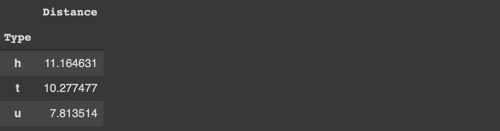
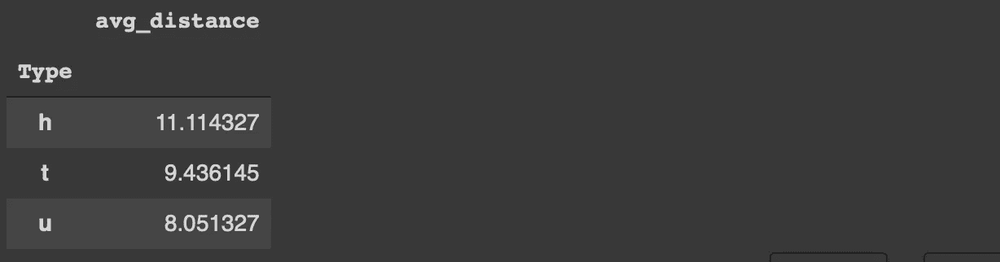
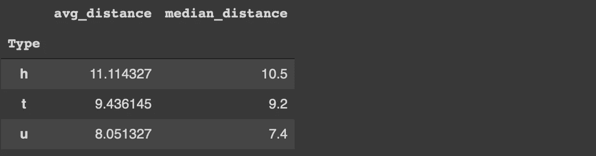
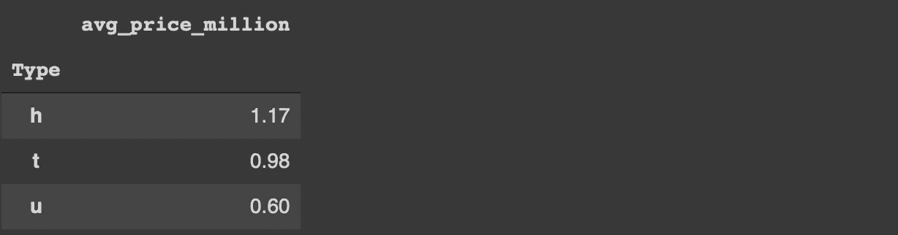
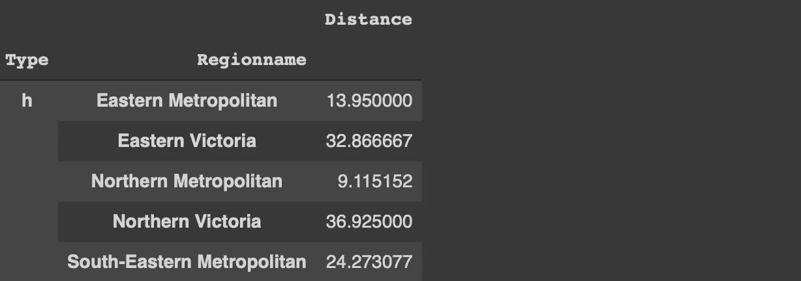
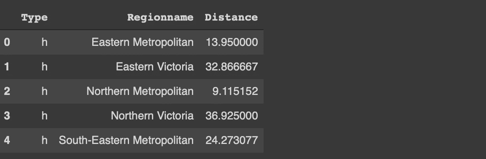
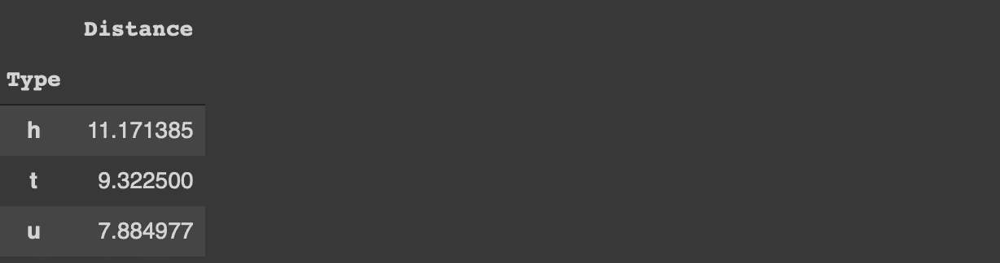
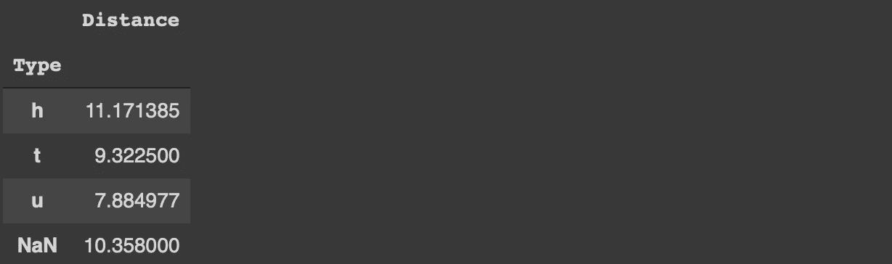

# 根据功能充分利用熊猫群的 4 个技巧

> 原文：<https://towardsdatascience.com/4-tips-to-make-the-most-of-pandas-groupby-function-8f0ebeece2e6?source=collection_archive---------14----------------------->

## 促进您的探索性数据分析过程


马库斯·斯皮斯克在 [Unsplash](https://unsplash.com/s/photos/different-colors?utm_source=unsplash&utm_medium=referral&utm_content=creditCopyText) 上的照片

Pandas 是一个非常流行的数据分析和操作库。它提供了许多功能来执行高效的数据分析。此外，它的语法简单易懂。

在这篇文章中，我们关注熊猫的一个特殊功能——群居。它用于根据列中的类别或不同值对数据点(即行)进行分组。然后，我们可以计算一个统计量，或者对与分组类别相关的数字列应用一个函数。

当我们浏览这些例子时，这个过程将会很清楚。让我们从导入库开始。

```
import numpy as np
import pandas as pd
```

我们还需要一个数据集的例子。我们将使用 Kaggle 上的墨尔本房屋[数据集](https://www.kaggle.com/dansbecker/melbourne-housing-snapshot)中的一个小样本。

```
df = pd.read_csv("/content/melb_data.csv", usecols = ['Price','Landsize','Distance','Type', 'Regionname'])df = df[(df.Price < 3_000_000) & (df.Landsize < 1200)].sample(n=1000).reset_index(drop=True)df.head()
```


(图片由作者提供)

我只看过原始[数据集](https://www.kaggle.com/dansbecker/melbourne-housing-snapshot)的一小部分。read_csv 函数的 usecols 参数允许只读取 csv 文件的给定列。我还过滤了价格和土地面积方面的异常值。最后，使用 sample 函数选择 1000 个观察值(即行)的随机样本。

在开始介绍技巧之前，让我们实现一个简单的 groupby 函数，为 type 列中的每个类别执行平均距离。

```
df[['Type','Distance']].groupby('Type').mean()
```



(图片由作者提供)

平均而言，住宅(h)比其他两种类型更远离中央商务区。

我们现在可以从更有效地使用 groupby 函数的技巧开始。

## 1.自定义列名

groupby 函数不更改或自定义列名，所以我们并不真正知道聚合值代表什么。例如，在前面的示例中，将列名从“distance”更改为“avg_distance”会更有意义。

实现这一点的一种方法是使用 agg 函数而不是 mean 函数。

```
df[['Type','Distance']].groupby('Type').agg(
   avg_distance = ('Distance', 'mean')
)
```



(图片由作者提供)

我们总是可以在以后更改列名，但是这种方法更实用。

如果我们聚合多个列或者对一个列应用不同的函数，那么定制列名就变得更加重要。agg 函数接受多个聚合。我们只需要指定列名和函数。

例如，我们可以计算类型列中每个类别的平均值和中值距离值，如下所示。

```
df[['Type','Distance']].groupby('Type').agg(
  avg_distance = ('Distance', 'mean'),
  median_distance = ('Distance', 'median')
)
```



(图片由作者提供)

## 2.λ表达式

Lambda 表达式是 Python 中函数的一种特殊形式。一般来说，lambda 表达式没有名字，所以我们不像普通函数那样用 def 关键字定义它们。

lambda 表达式背后的主要动机是简单和实用。它们是一行程序，通常只使用一次。

agg 函数接受 lambda 表达式。因此，我们可以使用 groupby 函数执行更复杂的计算和转换。

例如，我们可以计算每种类型的平均价格，并用一个 lambda 表达式将其转换为百万。

```
df[['Type','Price']].groupby('Type').agg(
   avg_price_million = ('Price', lambda x: x.mean() / 1_000_000)
).round(2)
```



(图片由作者提供)

## 3.As_index 参数

groupby 函数将组分配给返回的数据帧的索引。在嵌套组的情况下，这看起来不太好。

```
df[['Type','Regionname', 'Distance']]\
.groupby(['Type','Regionname']).mean().head()
```



(图片由作者提供)

如果我们想稍后在这个数据帧上执行分析，将类型和区域名称列作为索引是不实际的。我们总是可以使用 reset_index 函数，但是有一个更好的方法。

如果 groupby 函数的 as_index 参数设置为 false，则分组后的列表示为列而不是索引。

```
df[['Type','Regionname', 'Distance']]\
.groupby(['Type','Regionname'], as_index=False).mean().head()
```



(图片由作者提供)

## 4.缺少值

默认情况下，groupby 函数忽略缺少的值。让我们首先将 type 列中的一些值更新为 missing。

```
df.iloc[100:150, 0] = np.nan
```

iloc 函数通过使用索引来选择行列组合。上面的代码将第一列(0 索引)的 100 和 150 之间的行更新为缺失值(np.nan)。

如果我们试图计算 type 列中每个类别的平均距离，我们将得不到任何关于缺失值的信息。

```
df[['Type','Distance']].groupby('Type').mean()
```



(图片由作者提供)

在某些情况下，我们还需要了解缺失值的概况。这可能会影响我们处理它们的方式。groupby 函数的 dropna 参数还用于计算缺失值的聚合。

```
df[['Type','Distance']].groupby('Type', dropna=False).mean()
```



(图片由作者提供)

## 结论

groupby 函数是探索性数据分析过程中最常用的函数之一。它为变量之间的关系提供了有价值的见解。

有效地使用 groupby 函数来提高 Pandas 的数据分析过程是很重要的。我们在本文中介绍的 4 个技巧将帮助您充分利用 groupby 函数。

感谢您的阅读。如果您有任何反馈，请告诉我。