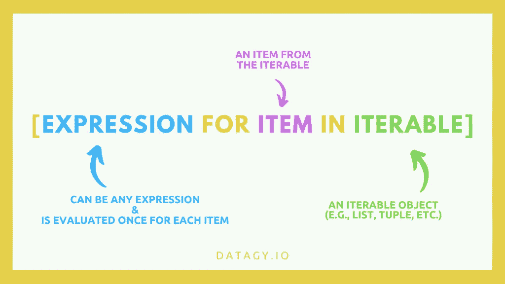

# 掌握 Python 列表理解的 4 个技巧

> 原文：<https://towardsdatascience.com/4-tips-to-master-python-list-comprehensions-616defe70738?source=collection_archive---------44----------------------->

## 真正理解那些列表理解！

[天一马](https://unsplash.com/@tma?utm_source=medium&utm_medium=referral)在 [Unsplash](https://unsplash.com?utm_source=medium&utm_medium=referral) 上拍照

列表理解提供了优雅、简洁的方式来创建、修改和过滤 Python 中的列表。

它们的工作方式类似于 for 循环，但更像 Pythonic。

# 如何写一份清单理解

让我们通过将它们与 for 循环进行比较来看看如何编写 list comprehensions。我们将使用 range()函数创建一个包含从 0 到 9 的值的列表:

我们可以看到，与依赖 for 循环相比，编写列表理解要简单得多。我们不仅不需要初始化一个空列表，我们还可以将所有的事情简化为一行代码！

看看我下面的图片，看看它们是如何以可视化的方式工作的:

如何写清单理解？资料来源:Nik Piepenbreier

# 技巧 1:用列表理解来修改列表

列表理解遍历列表中的每一项，并对其表达式求值。

因此，我们可以很容易地使用列表理解来修改列表。

让我们看看另一个例子，我们将数字 1-5 平方:

如果你想深入理解列表，可以看看我在 YouTube 上的视频:

Python 列表理解视频。尼克·皮彭布勒尔

# 技巧 2:用列表理解过滤列表

您也可以使用列表理解轻松过滤列表！

例如，让我们从 0–9 的列表中过滤出任何奇数:

 [## 你应该知道的 8 种高级 Python 列表技术！

### 让全能榜单更加强大！

towardsdatascience.com](/advanced-python-list-techniques-c6195fa699a3) 

# 技巧 3:用列表理解有条件地修改列表

假设您有一个员工名单，如果他们的销售额超过 100 美元，他们将获得 13%的佣金。有人给了你一份销售清单，你需要修改它，看看是否要支付佣金:

 [## 你应该知道的 7 种高级 Python 字典技术

### 根据以下提示掌握 Python 字典

towardsdatascience.com](/7-advanced-python-dictionary-techniques-you-should-know-416194d82d2c) 

# 技巧 4:在列表理解中使用多个条件句

您也可以在列表理解中应用多个条件。如果您希望基于多个条件为真进行过滤，这可能会很有帮助。

为此，只需在第一个语句之后添加后续的 if 语句。

让我们看一个例子，如果数字 0-15 都是 2 和 3 的倍数，那么它们将被过滤:

# 结论

感谢阅读这篇文章！希望你觉得有用！

如果你想更深入地理解列表，请点击这里查看我的完整的[教程](https://datagy.io/list-comprehensions-in-python/)。

如果你有任何问题，请在评论中留下，我会尽力回答。

点击此处订阅(图片由 stickpng.com 提供)

如果你想订阅[我的 YouTube 频道](https://www.youtube.com/channel/UCm7fT9_IdCDbeBXjAwL9IIg)，可以看看这里，我经常在这里发布 Python 和熊猫教程。