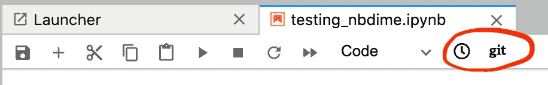
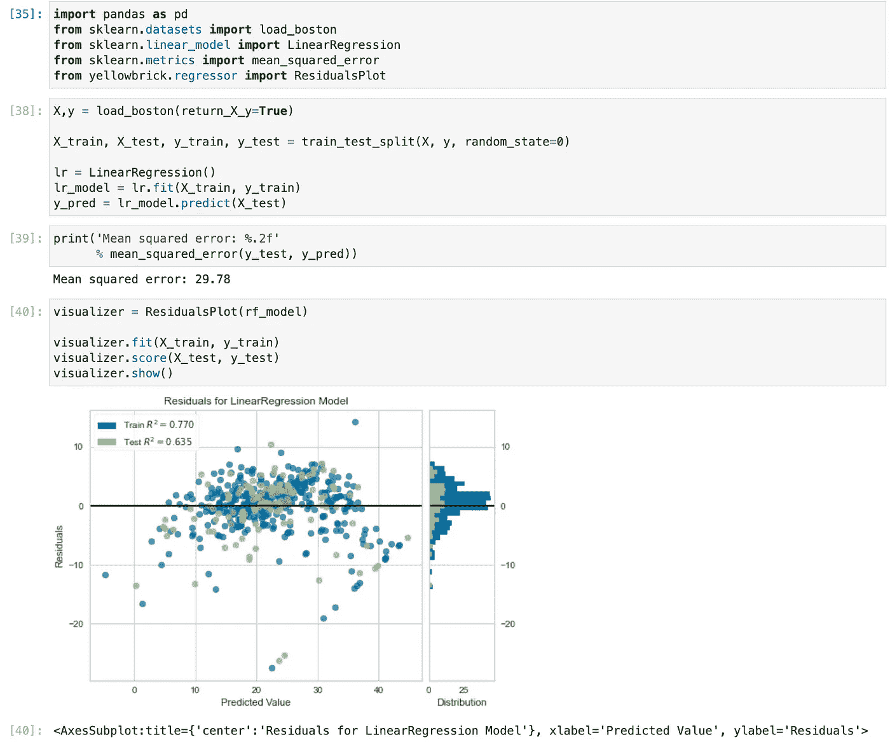
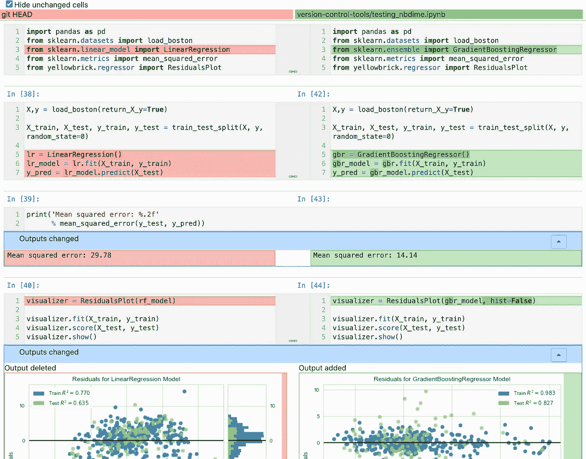
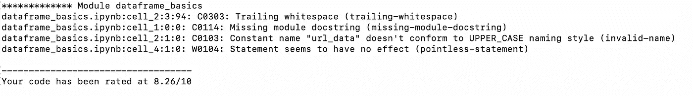
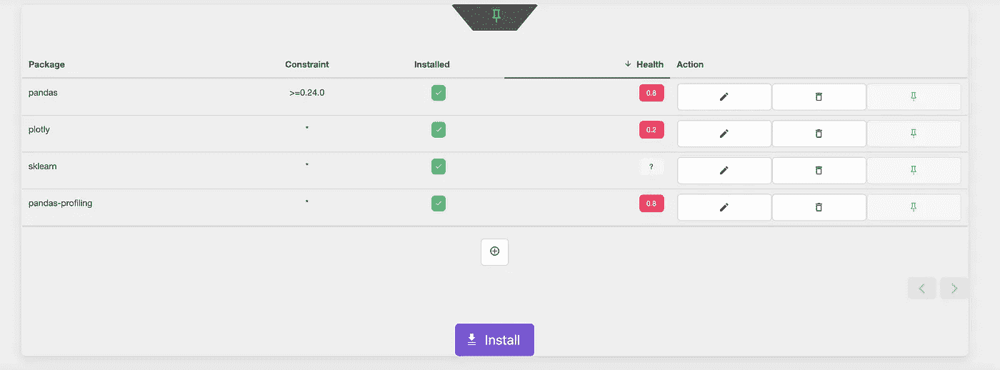
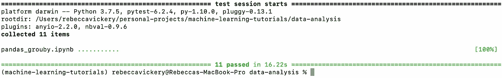
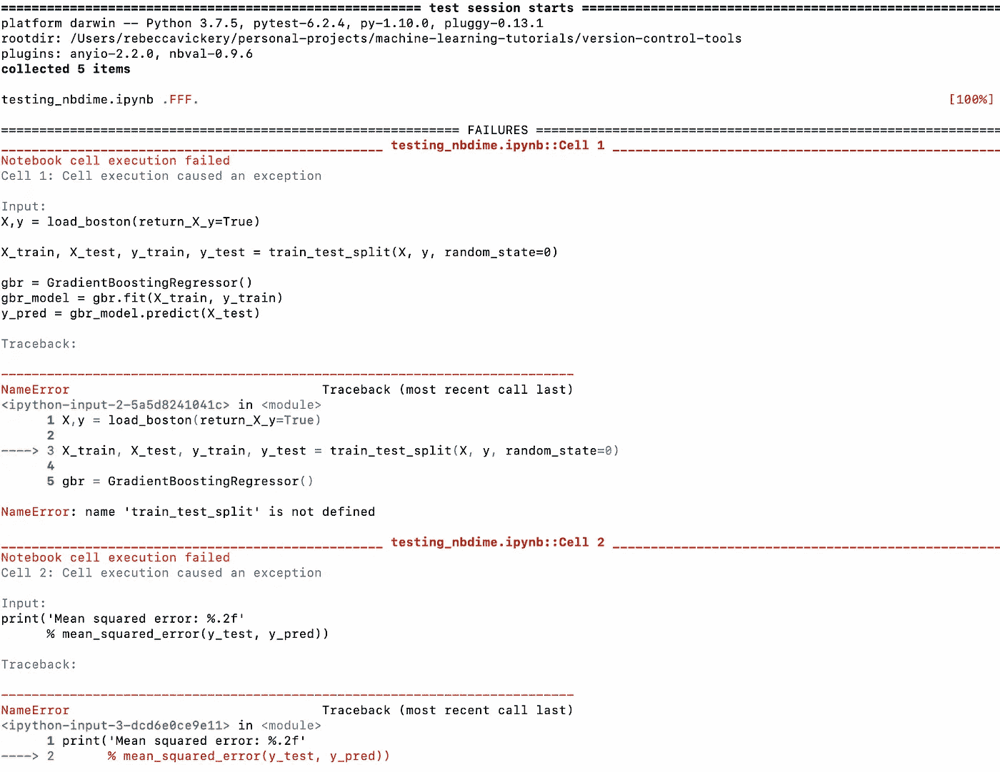

# 用于可复制 Jupyter 笔记本的 4 种工具

> 原文：<https://towardsdatascience.com/4-tools-for-reproducible-jupyter-notebooks-d7423721bd04?source=collection_archive---------10----------------------->

## [实践教程](https://towardsdatascience.com/tagged/hands-on-tutorials)

## 如何增加笔记本代码的健壮性


由[凯文·Ku](https://unsplash.com/@ikukevk?utm_source=unsplash&utm_medium=referral&utm_content=creditCopyText)在 [Unsplash](https://unsplash.com/s/photos/coding?utm_source=unsplash&utm_medium=referral&utm_content=creditCopyText) 上拍摄的照片

Jupyter 笔记本在更广泛的编程社区中名声不佳。Joel Grus 在 2018 年 JupyterCon 上勇敢地发表的著名的 [*“我不喜欢笔记本”*演讲](https://youtu.be/7jiPeIFXb6U)，涵盖了许多原因。一般来说，笔记本被认为促进了糟糕的编码实践，因为它们可能难以进行版本控制，通常依赖于以特定顺序运行的单元来返回正确的结果，并且可能难以测试和调试。

“我不喜欢笔记本”，乔尔·格鲁什著

然而，在执行探索性数据分析和初始机器学习模型开发等任务时，Jupyter 笔记本仍然是大多数数据科学家的首选。将图形和表格等输出可视化并与您的代码保持一致的能力，以及为分析添加丰富注释的能力，是任何其他工具都无法复制的。

虽然笔记本电脑仍然是如此受欢迎的选择，但值得看看一些可用的选项，以克服一些可能使笔记本电脑代码不那么健壮的问题。在本文中，我将通过代码示例简要介绍四个工具，它们为一些问题提供了解决方案。其中包括:

1.  为了更好的版本控制。
2.  使用 **nbQA 在笔记本代码上运行 linters。**
3.  **Jupyter-nb 管理笔记本内依赖关系的要求**。
4.  使用 **nbval** 进行笔记本验证。

# 1.Nbdime 用于更好的版本控制

使用 Github 等工具对笔记本进行版本控制可能会很困难。版本控制工具不能很好地呈现差异，因为它们不理解典型笔记本的逻辑结构。这使得跟踪变更和合并代码变得很有挑战性，

[**Nbdime**](https://nbdime.readthedocs.io/en/latest/index.html) 是一款旨在解决这一问题的工具，它提供了更丰富的视觉差异，可以非常容易地看到同一笔记本不同版本之间的变化。

Nbdime 可以通过 pip 安装。

```
pip install nbdime
```

这将自动安装并启用 Jupyter 笔记本的扩展。如果它没有正确安装，您可以使用以下命令手动安装，添加一个标志来确定它是为哪些用户安装的`--system`(系统范围)、`--user`(当前用户)、`--sys-prefix`(当前虚拟环境)。

```
nbdime extensions --enable [--sys-prefix/--user/--system]
```

一旦所有的东西都安装好了，如果你打开一个 Jupyter 笔记本，你应该会在你的工具栏上看到下面的新图标。



笔记本中的 Nbdime 图标。图片作者。

我创建了一个笔记本来展示 nbdime 的功能，它在波士顿房价玩具数据集上训练了一个简单的线性模型。这是我存储在 Github 的一个仓库中的一个项目的一部分。笔记本如下所示，代码可以在这个[链接](https://github.com/rebecca-vickery/machine-learning-tutorials/blob/master/version-control-tools/testing_nbdime.ipynb)找到。



示例笔记本。图片作者。

笔记本工具栏上的新图标构成了 nbdime 的 web 视图功能。该视图提供了对笔记本所做更改的丰富可视化表示。

*点击* ***git*** *按钮将显示上次提交和当前保存的笔记本版本之间的差异。*

*单击看起来像钟面的图标将显示最新检查点和当前保存版本之间的差异。*

我将对笔记本进行一些更改，并使用 web 视图查看与上次提交的差异。

在笔记本中，我改变了我正在使用的模型，并对残差图做了一个小的改动。让我们看看 nbdime 提供的结果差异。

正如您在下图中看到的，nbdime 逐行逐单元格地显示了自上次提交以来究竟发生了什么变化。它甚至显示了每个单元的输出是如何变化的，包括图表。



Nbdime web 视图中的笔记本差异。图片作者。

# 2.林挺与 nbQA

林挺是检查代码质量的过程。林挺工具扫描您的代码并检查常见的样式错误。例如，Python linters 通常会检查不符合广泛使用的风格指南(如 Pep8)的代码。

NbQa 是一个允许你在 Jupyter 笔记本上运行任何标准 python linter 的工具。目前可从该工具中访问以下棉条:pylint、black、auto flake、check-ast、doctest、flake8、mypy 和 yapf。

要安装，只需运行以下。

```
pip install nbqa
```

让我们在我最近创建的笔记本上运行一下 [pylint](https://www.pylint.org/) ，这是一个常用的 python linter。为此，您需要在命令行上运行以下命令。

```
$ nbqa pylint dataframe_basics.ipynb
```

这给了我标准的 pylint 输出，它突出了我的代码中的错误。



jupyter 笔记本的 pylint 报告示例。图片作者。

# 3.使用 jupyter-nb 需求管理依赖关系

使用笔记本进行的每个项目都可能需要一组不同的依赖项。传统上，这些是在 Jupyter 笔记本电脑之外使用虚拟环境进行管理的。

[Jupyter nbrequirements](https://pypi.org/project/jupyter-nbrequirements/) 是一款工具，让您能够管理依赖关系，并创建一个独立的优化环境，所有这些都在笔记本电脑中进行管理。

要开始 pip，请安装库并使用下面显示的命令启用笔记本扩展。

```
$ pip install jupyter-nbrequirements$ jupyter nbextension install --user --py jupyter_nbrequirements
```

您可以通过使用 cell magic 命令或使用将显示在笔记本顶部的 UI 在笔记本中安装库。



用 nbrequirements 在笔记本上安装需求。图片作者。

要使用 cell magic 安装像 pandas 这样的库，只需在笔记本单元格中键入以下内容。

```
%dep add pandas --version ">=0.24.0"
```

# 4.使用 nbval 验证笔记本电脑

如本文前面所述，笔记本最常用于探索性分析和模型的初始开发。通常，存储这种类型的分析和初始项目开发是有用的，既可以用于文档化，也可以在以后的工作中潜在地构建这些发现。

py.test 插件，[**【nbval**](https://nbval.readthedocs.io/en/latest/)，是一个验证存储笔记本的有用工具。Nbval 将自动运行笔记本中的每个单元格，并检查当前输出是否与上次保存的版本中存储的输出相匹配。ipynb 文件。这是对底层源代码没有任何变化的检查，因此验证了原始分析或实验的结果仍然是可靠的。

要使用此工具，首先通过以下命令进行 pip 安装。

```
pip install nbval
```

通过运行以下命令，可以对目录中包含的所有文件执行测试。

```
py.test --nbval
```

或者在特定的笔记本上运行这行代码。

```
py.test ---notebook-name.ipynb
```

我在现有的两台笔记本上运行了 py.test。第一次运行没有错误，并给出以下输出。



在笔记本上运行 nbval。图片作者。

下面给出了一个笔记本测试失败的例子。



nbval 测试失败的例子。图片作者。

尽管笔记本通常用于探索性分析和初始模型开发，而不是生产代码，但它仍应被视为重要的工作存储。最初的实验和分析是对过去结果的有用记录，应该可以在以后回到笔记本上继续你的工作。因此，有必要开发一些工具来帮助使笔记本中编写的代码更加健壮和可重复。

本文介绍了四种工具，它们有助于使笔记本中的代码更好，更具可重用性。关于可再生数据科学代码的更多技巧，请参见我之前的文章。

</5-tools-for-reproducible-data-science-c099c6b881e5>  </a-recipe-for-organising-data-science-projects-50a1cc539c69>  

感谢阅读！

我每月都会发一份简讯，如果你想加入，请点击此链接注册。期待成为您学习旅程的一部分