# 面向数据科学家的 4 大 Python IDE

> 原文：<https://towardsdatascience.com/4-top-python-ide-for-data-scientist-ccb92d143ca3?source=collection_archive---------3----------------------->

## 您想使用的 Jupyter 笔记本 IDE 替代方案

照片由 [Shamsudeen Adedokun](https://unsplash.com/@shams_ad?utm_source=medium&utm_medium=referral) 在 [Unsplash](https://unsplash.com?utm_source=medium&utm_medium=referral) 上拍摄

> 如果你喜欢我的内容，并想获得更多关于数据或作为数据科学家的日常生活的深入知识，请考虑在这里订阅我的[时事通讯。](https://cornellius.substack.com/welcome)

IDE 或**集成开发环境**是一个代码编程工具，用于编写、测试、调试和直观地编译代码。任何使用编程语言的人都需要一个 IDE 来简化他们的工作。你可以在记事本上写代码，但是很明显，你为什么要这么做呢？—开发了很多支持我们工作的 IDE。

对于那些已经熟悉 Jupyter 笔记本的人来说，它也是一个交互式的、初学者友好的 IDE，可以用于演示。对于任何级别的数据科学家来说，这都是一个很好的工具。然而，你会意识到 Jupyter Notebook 缺乏任何开发和调试目的。这是因为 Jupyter Notebook 主要是为了测试和文档共享而不是代码开发而开发的。因此，您可能希望研究另一种 IDE，它仍然适合数据科学家的需求，但可以用于开发。

在本文中，我想分享我在不同情况下为数据科学家使用的四大 IDE。让我们开始吧。

# 1.Spyder

科学 Python 开发环境或 Spyder 是一个免费的开源 Python IDE。如果您正在安装 Anaconda，可以为您安装的软件之一是 Spyder。那么，Spyder 有什么特别之处呢？Spyder 是专门为数据科学构建的 IDE。GUI 很简单，但是学习曲线并不陡峭，如果你是初学者，你可能很容易掌握它。让我们试着看一下整个 GUI。

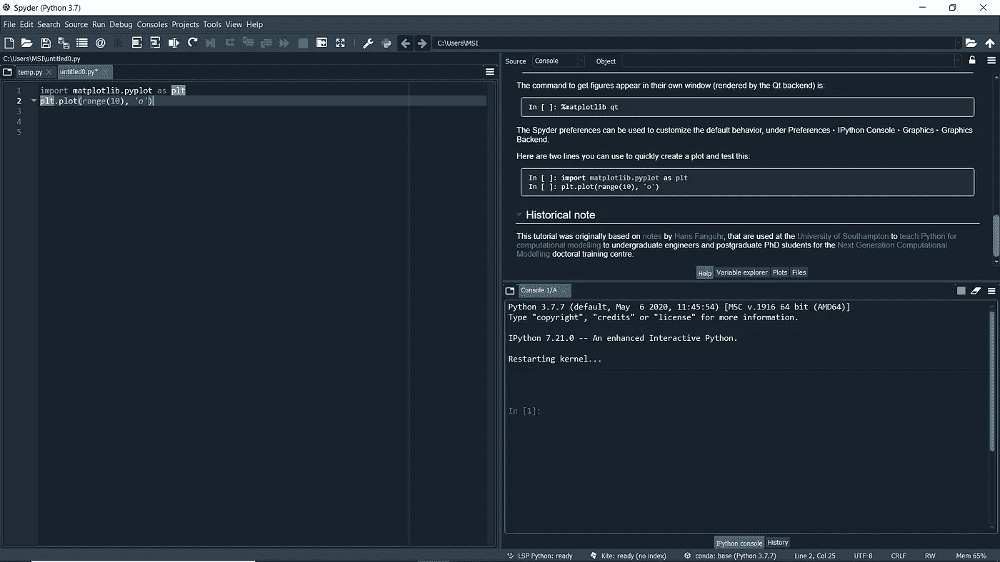

Spyder GUI(图片来自作者)

请注意这个界面与 RStudio 非常相似；这就是为什么，如果你在 Matlab 或 R 到 Python 之间切换，你会发现更容易。让我们试着一目了然地分解 GUI。

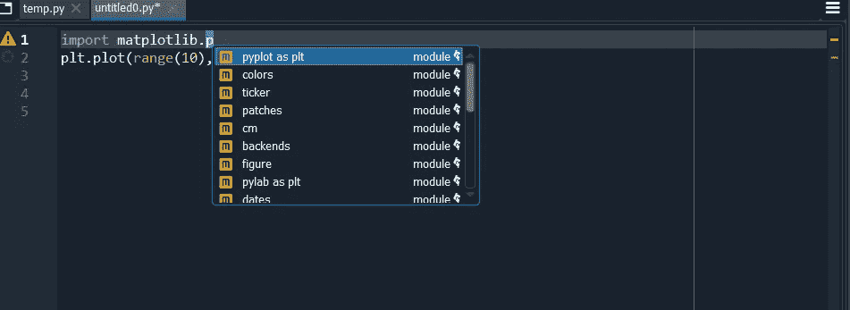

Spyder 代码单元格(图片来自作者)

上面是你写代码的环境。请注意，对于您在数据分析过程中使用的所有常见代码，都有一个自动完成特性。此外，还有一个语法高亮特性，可以帮助您快速找到任何变量或类似代码。让我们看看 Spyder 的另一项功能。

Spyder 功能工具栏(图片来自作者)

上面是四个默认选项卡，可以帮助您导航您的数据科学项目。请注意，一旦您更频繁地使用它们，就会有更多的选项卡可用。对于初学者来说,“帮助”标签是你最好的朋友，因为它向你展示了 Spyder 教程。

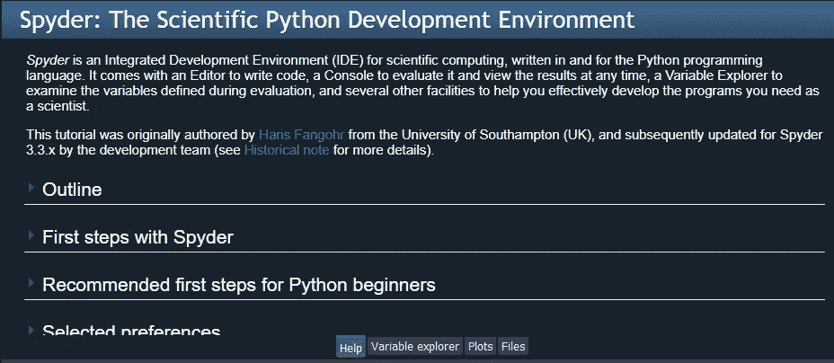

帮助选项卡(图片来自作者)

“帮助”功能还扩展到在线帮助，允许您搜索有关库的特定信息。在下一个选项卡中，还会有变量浏览器。

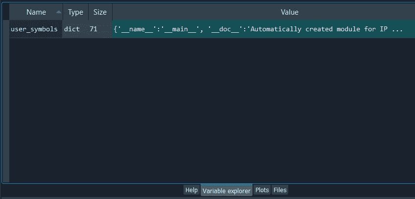

变量选项卡(图片来自作者)

如果您生成任何图，它将在图选项卡中提供。您可以在这里探索您生成的所有地块并保存该地块。

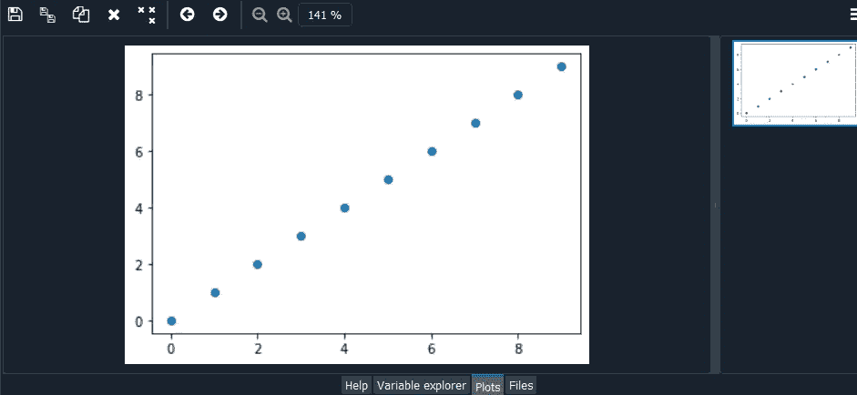

“绘图”选项卡(图片来自作者)

在您更深入地探索 IDE 之后，仍然会产生许多选项卡。你需要的一切都在教程里，很容易上手。

在我看来，如果你以前来自 RStudio IDE 并试图在 Python 中找到类似的东西，你会喜欢使用 Spyder IDE。

# **2。托尼**

Thonny 是一个为学习和教授编程而开发的 IDE。它是由塔尔图大学开发的，你可以在[的 Bitbucket 存储库](https://bitbucket.org/plas/thonny/downloads/)上免费下载。

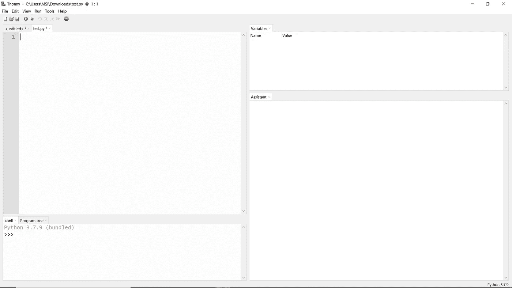

Thonny IDE(作者图片)

Thonny 对初学者来说非常好，因为它可以在助手页面的帮助下向您显示分步语句和表达式。Thonny 还提供了一个很好的编辑功能，可以打开一个新窗口，显示局部变量和与主代码分开的代码。

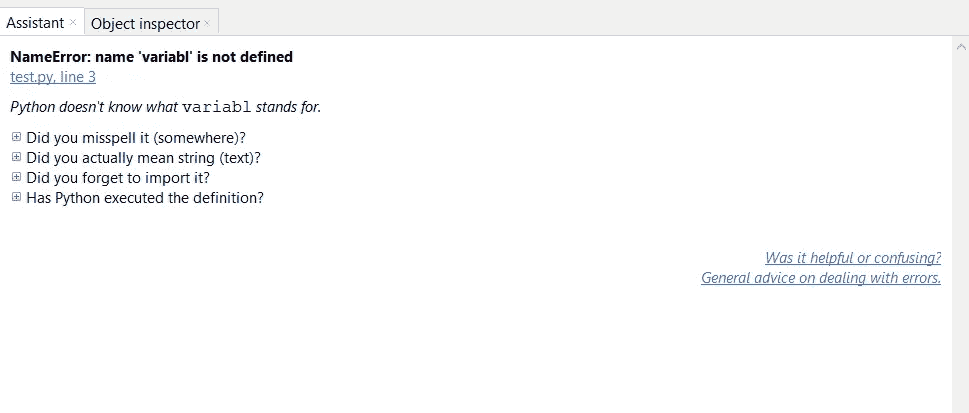

Thonny 上的助手标签(图片由作者提供)

您可以探索的所有工具都可以在 view 选项卡中找到，如下所示。

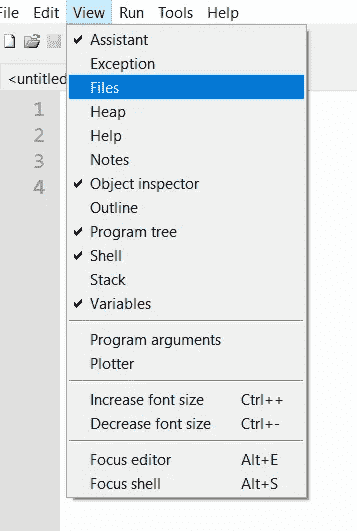

Thonny 视图选项卡(图片由作者提供)

此外，Thonny 为您提供了 Python 脚本调试过程，运行起来非常灵活。总的来说，Thonny 的目的是让您很好地理解 Python 是如何工作的，并帮助您简化编码过程。在我看来，Thonny 适合一个想要学习更多 Python 语言的初学者。

# **3。原子**

[Atom](https://atom.io/) 是 GitHub 开发的开源 IDE。开发人员称之为“21 世纪的可破解文本编辑器”，因为 Atom 允许用户安装第三方包和主题。您可以根据自己的喜好定制编辑器的特性和外观，因此它是一个高度通用的 IDE。此外，Atom 对于初学者来说是友好的，对于有经验的开发人员来说是高度可定制的。

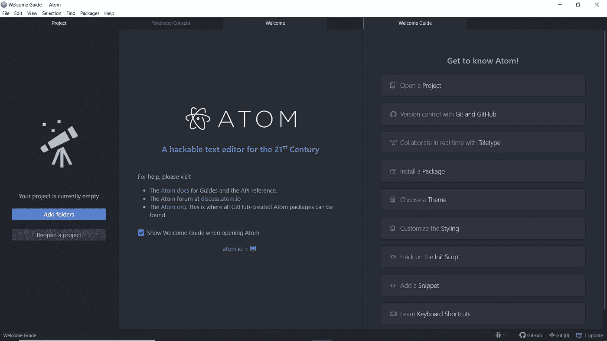

Atom IDE(图片由作者提供)

上面是第一次打开 IDE 时显示的屏幕。在这个屏幕上，您可以使用所有的教程和 Atom 特性。以下是我认为 Atom 对 Data Scientist 的主要卖点:

*   **带有 Git 和 GitHub 跟踪面板的版本控制**嵌入在 IDE 上。

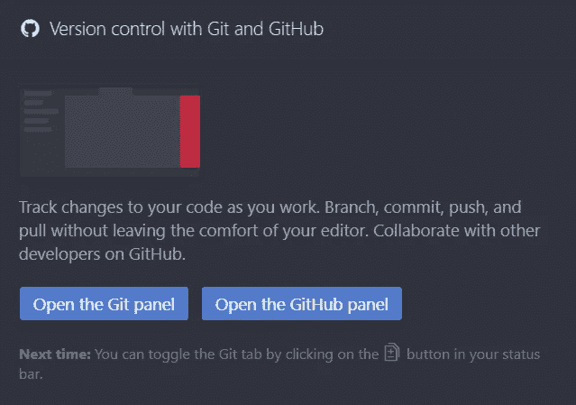

Git 面板(图片由作者提供)

*   Atom IDE 上的第三方软件包安装程序

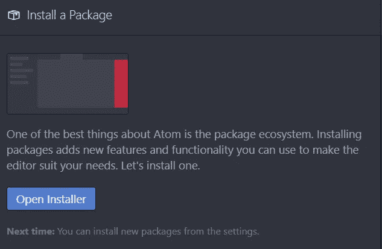

第三方安装程序(图片由作者提供)

你能为数据科学家安装的最好的软件包是氢。它允许你在 Atom IDE 上拥有 Jupyter 内核能力。

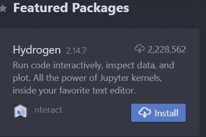

氢气包(图片由作者创建)

*   **电码协作**用电传打字机

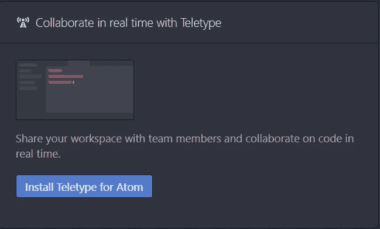

电传面板(图片由作者创建)

# 4.皮查姆

PyCharm 是 JetBrain 开发的 IDE，他也开发了著名的 Java IDE IntelliJ IDEA。

PyCharm 非常适合那些已经有使用另一个 IDE 进行开发或编程语言的经验的人。Pycharm 和 Anaconda 发行版一样，也集成了其工具和库，如 NumPy 和 Matplotlib，允许您使用一系列查看器和交互式绘图。此外，就像我们之前讨论的 Atom IDE 一样，PyCharm 提供了版本控制集成和调试功能。

此外，PyCharm 支持许多其他开发编程语言，如 Node.js、HTML/CSS 等等。这使得 PyCharm 足够灵活，可以与 web 和应用程序开发语言集成使用。

你可以在这里下载 py charm h。有两个版本可用，但你可能想要社区版，因为它是免费的(功能仍然是一流的，所以不用担心)。

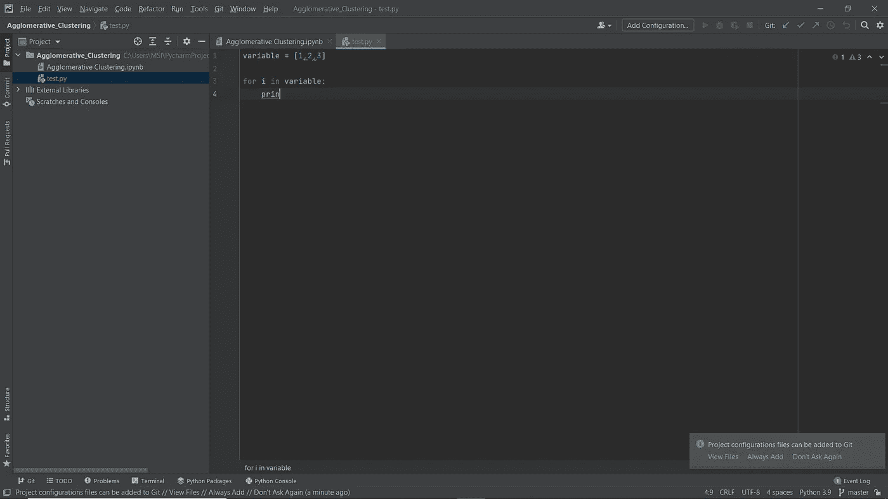

。PyCharm IDE(图片由作者创建)

此外，PyCharm 允许您安装各种插件，从而增强了他们的 IDE。

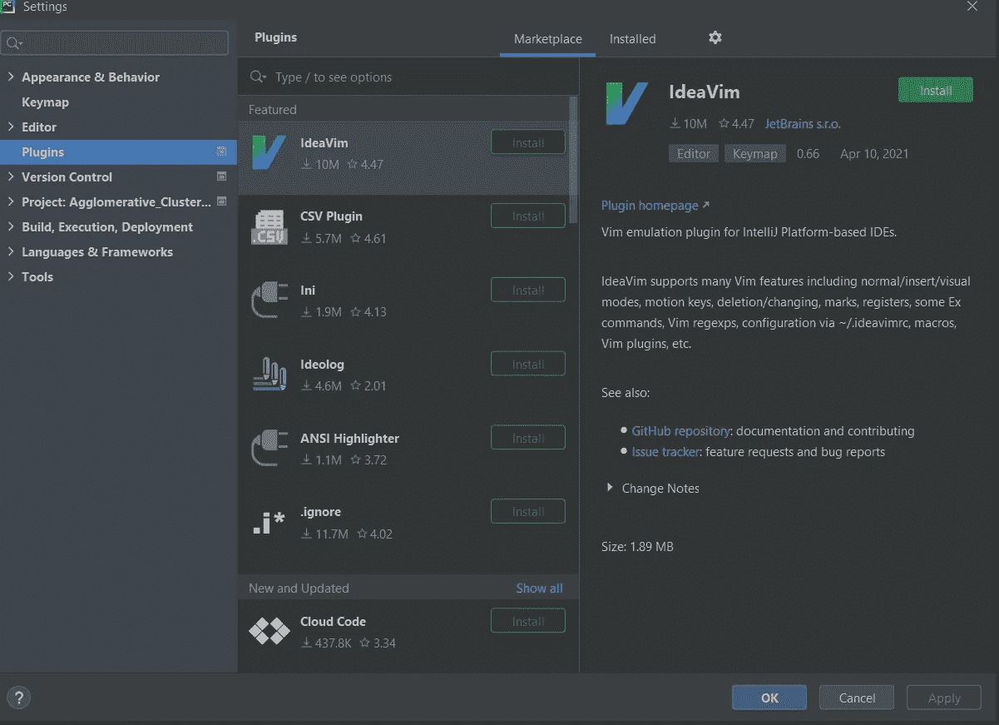

PyCharm 上的插件

如果您是一位经验丰富的数据科学家，并且希望更多地停留在开发领域，那么您可能希望使用 PyCharm 进行更多的探索。否则，您可以使用我之前提到的另一个 IDE。

# **结论**

作为一名数据科学家，您可能有使用 Jupyter 笔记本开发数据科学项目的经验。即使它是一个很好的 IDE，你也会意识到 Jupyter Notebook 缺少一些特性，比如开发和调试目的。

作为一名数据科学家，有许多可供选择 IDE 可供您使用，但我最喜欢的四个是:

1.  Spyder
2.  托尼
3.  原子
4.  皮查姆

希望有帮助！

> 如果你没有订阅成为媒介会员，请考虑通过[我的推荐](https://cornelliusyudhawijaya.medium.com/membership)订阅来支持我的写作。

访问我的[**LinkedIn**](https://www.linkedin.com/in/cornellius-yudha-wijaya/)**或 [**Twitter**](https://twitter.com/CornelliusYW)**