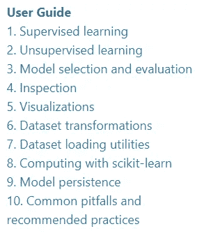
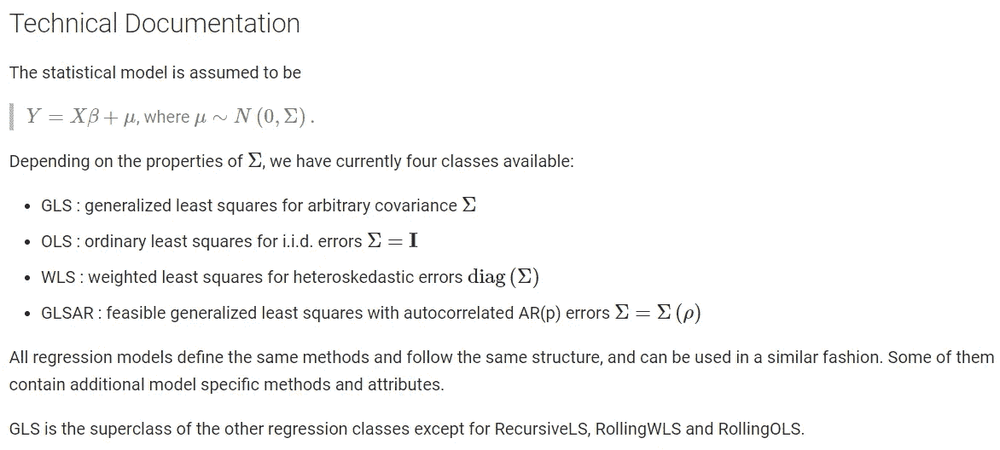

# 学习机器学习的 4 个顶级 Python 包

> 原文：<https://towardsdatascience.com/4-top-python-packages-to-learn-machine-learning-738db030c717?source=collection_archive---------9----------------------->

## 使用这些 Python 包提升您的机器学习知识


马库斯·温克勒在 [Unsplash](https://unsplash.com?utm_source=medium&utm_medium=referral) 上的照片

> 如果你喜欢我的内容，并想获得更多关于数据或作为数据科学家的日常生活的深入知识，请考虑在这里订阅我的[时事通讯。](https://cornellius.substack.com/welcome)

作为数据科学家，我们被雇用的原因之一是因为我们的机器学习技能。在论文中，学习人工智能和机器学习听起来很令人兴奋。尽管如此，随着我们对这个问题的深入研究，我们意识到机器学习并不像看起来那么容易。

你可能会用一行代码生成一个机器学习监督模型——就像业内所有专家所做的那样。许多专家已经将模型背后复杂的数学和统计发展成一行代码，帮助我们的日常工作。然而，理解代码背后的模型是什么是另一回事。

如果这些代码运行良好，为什么我们需要理解机器学习的概念呢？我可以陈述许多原因，但最重要的原因是为你试图解决的当前问题选择完美的模型。没有机器学习的理解，你很难找到最优解。

这就是为什么在这篇文章中，我想向您展示我学习机器学习的前 4 个 python 包**。让我们开始吧。**

# **1。Scikit-Learn**

Python 中的机器学习建模之王。我不可能在我的列表中省略[**Scikit-Learn**](https://scikit-learn.org/stable/index.html)**作为你的学习参考。如果出于某种原因，您从未听说过 Scikit-Learn，这个模块是基于 SciPy 构建的用于机器学习的开源 Python 库。**

**Scikit-Learn 包含我们在日常数据科学工作中使用的所有常见机器学习模型。根据主页，Scikit-learn 支持监督和非监督学习建模。它还提供了用于模型拟合、数据预处理、模型选择和评估的各种工具，以及许多其他实用工具。**

**Scikit-Learn 中有许多 API 可用于您的机器学习目的。我们可以将它们分为 6 个部分:**

*   **[分类](https://scikit-learn.org/stable/supervised_learning.html#supervised-learning)**
*   **[回归](https://scikit-learn.org/stable/supervised_learning.html#supervised-learning)**
*   **[集群](https://scikit-learn.org/stable/modules/clustering.html#clustering)**
*   **[降维](https://scikit-learn.org/stable/modules/decomposition.html#decompositions)**
*   **[型号选择](https://scikit-learn.org/stable/model_selection.html#model-selection)**
*   **[预处理](https://scikit-learn.org/stable/modules/preprocessing.html#preprocessing)**

**为了更好地理解机器学习概念和 API 工作，Scikit-Learn 提供了一个全面的 [**用户指南**](https://scikit-learn.org/stable/user_guide.html) 供您遵循。即使有一点统计知识，该指南对初学者来说也很容易理解(你仍然需要学习一些[统计](/3-top-python-packages-to-learn-statistic-for-data-scientist-d753b76e6099))。**

**如果您使用的是 Anaconda 发行版中的 Python，那么 Scikit-Learn 包已经内置在环境中了。如果选择独立安装包，则需要安装依赖包。您可以通过 pip 执行下面这一行来实现。**

```
pip install -U scikit-learn
```

**我们来试着学习一下最简单的模型——[线性模型](https://scikit-learn.org/stable/modules/linear_model.html)。正如我上面提到的，Scikit-Learn 包含了一个全面的用户指南供人们遵循。如果你从来没有开发过任何机器学习模型，让我们回顾一下线性模型的 Scikit-Learn 用户指南。**

```
#Develop the linear regression model
from sklearn import linear_model
reg = linear_model.LinearRegression()
reg.fit([[0, 0], [1, 1], [2, 2]], [0, 1, 2])reg.coef_
```

****

**作者图片**

**通过一行代码，您现在已经成功地开发了线性回归模型。您可以查看[线性模型](https://scikit-learn.org/stable/modules/linear_model.html)用户指南进行进一步探索，因为他们有完整的研究指南。如果你对另一个机器学习模型感兴趣，你可以查看用户指南以获得更多的学习材料。下面是 scikit-learn 主页上的图片，供您参考。**

****

**作者图片**

# **2.统计模型**

**Statsmodels 是一个统计模型 python 包，它提供了许多开发统计模型的类。Statsmodel 包是 Scipy 模块的一部分，但是 statsmodel 包目前是单独开发的。**

****Statsmodel 软件包侧重于** **基于数据的统计估计**。换句话说，它通过创建一个统计模型或我们所说的机器学习模型来概括数据。**

**Statsmodel 提供了统计建模中经常使用的 API。Statsmodel 包将 API 分成 3 个主要模型:**

*   **其中提供了许多横截面模型和方法，包括回归和 GLM。**
*   **`[statsmodels.tsa.api](https://www.statsmodels.org/stable/api.html#statsmodels-tsa-api)`提供时间序列模型和方法。**
*   **`[statsmodels.formula.api](https://www.statsmodels.org/stable/api.html#statsmodels-formula-api)` 它提供了一个使用公式字符串和数据框架指定模型的接口——简单地说，您可以创建自己的模型。**

**Statsmodel 对于任何想要**更深入地理解统计建模**的人来说都是一个很好的入门包。[用户指南](https://www.statsmodels.org/stable/user-guide.html)为您深入解释了理解统计估计所需的概念，以及机器学习模型背后的统计解释。**

**让我们尝试使用 statsmodel 包学习一个线性回归机器学习模型。[指南](https://www.statsmodels.org/stable/regression.html)已经解释了我在下图中向您展示的模型。**

****

**线性回归技术文件(来源:[https://www.statsmodels.org/stable/regression.html](https://www.statsmodels.org/stable/regression.html)**

**如您所见，该文档包含大量信息，绝对是值得学习的材料。**

**让我们尝试使用 Statsmodel 软件包学习 OLS(普通最小二乘法)建模。如果您没有使用 Anaconda 发行版中的 Python 或者没有安装 Statsmodel 包，您可以使用下面一行代码来完成。**

```
pip install statsmodels
```

**继续这些步骤，让我们通过导入包和数据集来开发模型。**

```
#Importing the necessary package
from sklearn.datasets import load_boston
import statsmodels.api as smfrom statsmodels.api import OLS#import the data
boston = load_boston()
data = pd.DataFrame(data = boston['data'], columns = boston['feature_names'])
target = pd.Series(boston['target'])
#Develop the model
sm_lm = OLS(target, sm.add_constant(data))
result = sm_lm.fit()
result.summary()
```

****

**图片来自作者**

**您使用 Statsmodel 软件包开发的 OLS 模型将具有您从机器学习模型估计中预期的所有必要结果。为了进一步解释这个结果，你可以在主页上访问 OLS 的例子。**

# **3.Eli5**

**没有模型背后的可解释性，机器学习是不完整的。根据我作为数据科学家的工作经验，大多数时候，你需要解释为什么你的模型有效，以及你的模型给出了什么样的洞察力。就洞察力而言，我指的不是模型准确性或任何指标，而是机器学习模型本身。这就是我们所说的**机器学习的可解释性**。**

**现在有很多高级的 ML 解释 Python 包，但是它们中的大多数都太具体了，没有任何学习的机会。在这种情况下，我推荐 [Eli5](https://eli5.readthedocs.io/en/latest/overview.html) 作为你的机器学习可解释性学习包，因为它提供了所有的基本概念，没有很多复杂的概念。**

**取自 Eli5 包，该包的基本用途是:**

1.  **检查模型参数，并尝试弄清楚模型如何全局工作；**
2.  **检查模型的单个预测，并找出模型做出决策的原因。**

**你可以从上面的解释中学习如何解释你的机器学习——特别是黑盒模型。我最喜欢的学习材料是[排列重要性](https://eli5.readthedocs.io/en/latest/blackbox/permutation_importance.html)，因为这是解释你的机器学习的最基本的方式。**

**让我们通过使用 Eli5 包来学习排列的重要性。首先，我们需要使用下面的代码来安装这个包。**

```
#installing eli5
pip install eli5
#or
conda install -c conda-forge eli5
```

**让我们试着为示例练习准备一个示例数据集。**

```
#Preparing the model and the datasetfrom xgboost import XGBClassifier
from sklearn.model_selection import train_test_split
mpg = sns.load_dataset('mpg')
mpg.drop('name', axis =1 , inplace = True)#Data splitting for xgboost
X_train, X_test, y_train, y_test = train_test_split(mpg.drop('origin', axis = 1), mpg['origin'], test_size = 0.2, random_state = 121)#Model Training
xgb_clf = XGBClassifier()
xgb_clf.fit(X_train, y_train)
```

**在安装并准备好样本数据之后，我们将使用 Eli5 包来使用排列重要性进行机器学习解释。**

```
#Importing the module
from eli5 import show_weights
from eli5.sklearn import PermutationImportance#Permutation Importance
perm = PermutationImportance(xgb_clf, scoring = 'accuracy' ,random_state=101).fit(X_test, y_test)
show_weights(perm, feature_names = list(X_test.columns))
```

****

**作者图片**

**对于结果的进一步解释，您可以访问[用户指南](https://eli5.readthedocs.io/en/latest/blackbox/permutation_importance.html)，其中有充分的解释。**

# **4.MLflow**

**机器学习教育的现状并不局限于机器学习模型，而是扩展到模型的自动化过程中。这就是我们所说的 **MLOps** 或机器学习操作。**

**许多开源 Python 包都支持 MLOps 生命周期，但在我看来， [MLflow](https://www.mlflow.org/docs/latest/index.html#) 为任何初学者提供了完整的 MLOps 学习资料。**

**根据 MLFlow 主页，MLflow 是一个管理端到端机器学习生命周期的开源平台。该软件包处理 4 个功能，它们是:**

*   ****实验跟踪**([ml 流量跟踪](https://www.mlflow.org/docs/latest/tracking.html#tracking))，**
*   ****ML 代码可复制**([ML 流项目](https://www.mlflow.org/docs/latest/projects.html#projects))，**
*   ****管理和部署模型** ( [MLflow 模型](https://www.mlflow.org/docs/latest/models.html#models))，**
*   ****模型中央生命周期** ( [MLflow 模型注册](https://www.mlflow.org/docs/latest/model-registry.html#registry))。**

**我喜欢这个包，因为它们以一种有组织的方式解释了 MLOps 概念，所有初学者都可以理解。你可以查看[概念](https://www.mlflow.org/docs/latest/concepts.html)包了解更多细节。**

**我不会给出 MLflow 的例子，因为我想为这个包专门写一篇文章，但是我认为你应该从这个包中学习，以更详细地理解机器学习和 MLOps 概念。**

# **结论**

**作为数据科学家，我们被雇用的原因之一是因为我们的机器学习技能。许多人在不知道机器学习背后的概念以及我们可以用模型做什么的情况下学习代码。**

**为了帮助学习，我想介绍我学习机器学习的前 4 个 Python 包。它们是:**

1.  **sci kit-学习**
2.  **统计模型**
3.  **Eli5**
4.  **MLflow**

**希望有帮助！**

**访问我的[**LinkedIn**](https://www.linkedin.com/in/cornellius-yudha-wijaya/)**或 [**Twitter**](https://twitter.com/CornelliusYW) **。******

> ****如果您没有订阅为中等会员，请考虑通过[我的推荐](https://cornelliusyudhawijaya.medium.com/membership)订阅。****