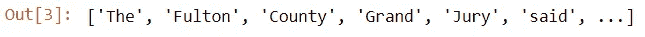
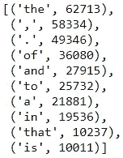
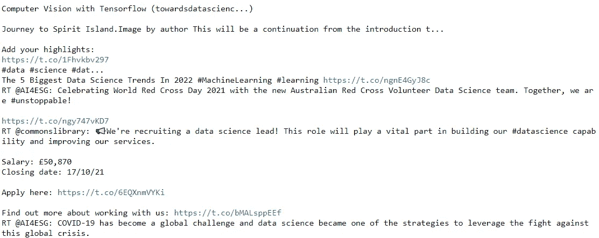
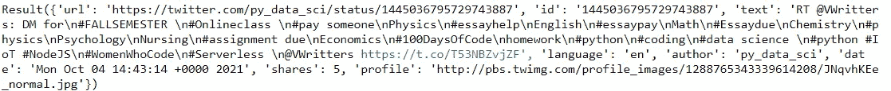
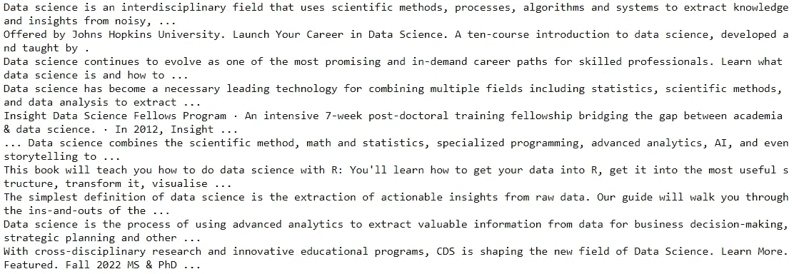
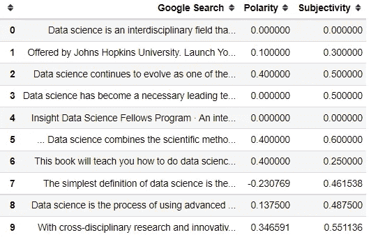
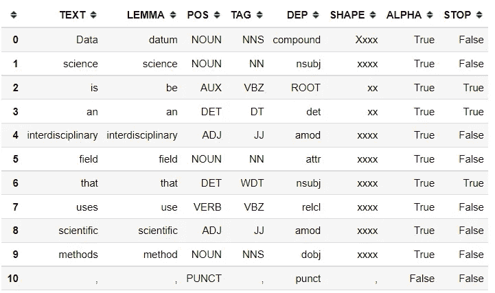

# 学习 NLP 的 4 个顶级 Python 包

> 原文：<https://towardsdatascience.com/4-top-python-packages-to-learn-nlp-cf7216730426?source=collection_archive---------12----------------------->

## 利用这些软件包有效地学习 NLP


安妮·斯普拉特在 [Unsplash](https://unsplash.com?utm_source=medium&utm_medium=referral) 上的照片

自然语言处理或 NLP 是一个涉及计算机和人类语言之间交互的领域。这是一个热门领域，工业界和学术界仍有许多需求，我认为这一领域不会很快消亡。

为什么有需求？NLP 之所以受欢迎，是因为行业应用程序将自动完成我们过去无法完成的事情。比如情感分析、聊天机器人、文本识别等等。最主要的一点是，NLP 应用程序对数据科学家来说是有用和重要的。

因为学习 NLP 对数据科学家来说很重要，所以我想概述一下我学习 NLP 的顶级 Python 包。让我们开始吧。

# 1.NLTK

自然语言工具包(Natural Language Toolkit)或 [NLTK](https://www.nltk.org/) 是一个开源的 Python 包，专门为处理人类语言而开发。它可以说是 NLP 领域初学者和专业人员最常用的软件包，因为 NLTK 在 NLP 研究中提供了许多有用的 API。根据主页，NLTK 适合任何职业——语言学家、数据科学家、研究人员、学生等等。

NLTK 包含了我们在日常 NLP 活动中使用的所有通用 API。如果我们浏览主页，我们会发现 NLTK 提供了各种工具来解析、词干化、标记化等等。它们还包括从 Twitter 等来源读取数据的 API。你可以点击查看完整的 API 列表[。](https://www.nltk.org/api/nltk.html)

为了更好地理解 NLP 分析以及如何用 Python 来做，NLTK 创建者为程序员编写了一本介绍性的实用编程书籍，名为 [**用 Python 进行自然语言处理**](http://nltk.org/book) 。该材料对 NLP 初学者来说是免费的，但也是完整的。如果你从来没有探索过 NLP 领域，我建议你花点时间阅读这本书。

对于 NLTK 安装，您可以通过执行以下代码在 Python 中使用 pip 发行版。

```
pip install --user -U nltk
```

NLTK 提供了一个完整的语料库列表供你练习和探索，你可以在这里访问。我们可以使用 NLTK 包中的内置下载器来访问数据。让我们试着下载一个语料库。

```
#Download the Brown Corpus
import nltk
nltk.download('brown')#Preview the brown words
from nltk.corpus import brown
brown.words()
```



作者图片

我们可以在上面的图片中看到，我们有一个来自棕色语料库的单词列表。我们试着用 NLTK 来计算词频。

```
#Import the class
from nltk import FreqDist#Showing the top 10 words
word_count = FreqDist(data)
word_count.most_common(10)
```



作者图片

布朗语料库中最常见的单词是“The”和其后的“and”。在真实的 NLP 用例中，我们可能会删除上面的所有单词，因为它们没有给模型提供太多信息(这些单词被称为停用词)，并且我们会在计算频率之前预处理文本。

# **2。图案**

Pattern package 是为文本处理和 web 挖掘数据开发的开源 Python 包。API 提供了许多功能，例如:

*   各种来源的数据挖掘 API(Google、Twitter 和 Wikipedia)
*   自然语言处理
*   机器学习建模
*   网络分析

如果我们将模式包与 NLTK 包进行比较，那么模式中的文本处理功能要比 NLTK 不完整。然而，Pattern 包含 web 挖掘数据，而 NLTK 没有这些数据。这是因为模式包的开发关注于数据挖掘。

对于已经理解 NLP 主题并希望探索更多真实数据的人来说，该模式是一个很好的包。对于学习者来说，我喜欢这个包中的文档，你可以在这里查看[](https://github.com/clips/pattern/wiki)**。该文档包含数据挖掘和网络分析的所有基本教程，以及案例研究。**

**让我们试试数据挖掘的模式包功能，因为这个包主要用于 web 数据挖掘。对于这个例子，我将尝试从 Twitter 中挖掘最近的数据。**

**对于初学者来说，如果没有安装 Pattern，可以使用下面的代码。**

```
pip install pattern
```

**然后，我们将尝试运行以下代码来挖掘最近提到“数据科学”的推文**

```
from pattern.web import Twitter, plaintexttwitter = Twitter(language='en') 
for tweet in twitter.search('"data science"', cached=False):
    print(plaintext(tweet.text))
```

****

**使用模式样本挖掘的最近推文(图片由作者提供)**

**从上面的图片中我们可以看到，我们成功地从 Twitter 中挖掘出了这条推文，我们可以完整地分析它。如果我们看一下输入的单个 tweet，这是数据样本。**

****

**作者图片**

**tweet 数据是 JSON 格式的，包含了你需要分析的所有信息(文本、个人资料、时间等。).模式包可以挖掘其他 web 源中的数据，例如搜索引擎 Google。**

```
from pattern.web import Google, plaintext
for result in Google().search('"Data Science"', cached  = False):
    print(plaintext(result.text))
```

****

**通过模式挖掘的谷歌搜索(图片由作者提供)**

**使用模式包可以挖掘更多的数据。如果你感兴趣，你应该参考他们的[文档](https://github.com/clips/pattern/wik)以获得更多信息。**

# **3.文本 Blob**

**TextBlob 是一个 Python 文本处理包，它提供了许多 API 来简化 NLP 项目任务。TextBlob 构建在 NLTK 和 Pattern 包之上，这意味着您会发现许多熟悉的 API。**

**TextBlob 突出显示了这个包对初学者的友好程度，可以用它们简单的 API 进行 NLP 活动。TextBlob package 是专门为 NLP 任务开发的，如标记、翻译、情感分析等，并且方式简单。**

**该文档是学习 TextBlob 包和 NLP 字段的良好开端。他们以一种简单的方式编写教程，任何初学者都可以跟随并试验代码。创建文本分类器的教程位于[这里](https://textblob.readthedocs.io/en/dev/classifiers.html)，如果你想尝试一下。例如，让我们自己尝试一下 TextBlob 包功能。**

**首先，我们需要使用文档中提供的以下代码来安装 TextBlob 包。**

```
pip install -U textblob
python -m textblob.download_corpora
```

**让我们试着分析一下我之前做过的谷歌搜索的情绪。在这一部分中，我将使用模式挖掘数据，预测 google 搜索情感，并将其存储到 Pandas DataFrame 对象中。**

```
from pattern.web import Google, plaintext
from textblob import TextBlob
import pandas as pdres = []
for result in Google().search('"Data Science"', cached  = False):
    search = plaintext(result.text)
    res.append([search, TextBlob(search).polarity, TextBlob(search).subjectivity])

data = pd.DataFrame(res, columns = ['Google Search', 'Polarity', 'Subjectivity'])
data
```

****

**使用 TextBlob 进行情感分析(图片由作者提供)**

**TextBlob 情感分析输出有两种测量方式——极性和主观性。极性衡量情绪是中性、积极还是消极。值越接近零(0)意味着情绪接近中性，反之亦然-如果值接近 1/-1，则意味着情绪接近积极/消极。**

**主观性值在 0 到 1 的范围内，其中 0 表示文本完全不主观(写得客观)，1 表示完全主观(写得像观点)。**

**如果你想了解更多关于使用 TextBlob 的情感分析，你可以在这里访问文档[。](https://textblob.readthedocs.io/en/dev/quickstart.html#sentiment-analysis)**

# **4.空间**

**SpaCy 是一个开源的 Python 包，它的口号是工业级的自然语言处理。这意味着 SpaCy 是为生产环境和工业活动开发的，而不是为了学术目的。**

**虽然它是为工业目的开发的，但是他们的教程和文档已经很完整了。这些网页为您提供了指南、课程和在线视频，帮助您从头开始学习 NLP 并使用 SpaCy。例如， [SpaCy 101 Guide](https://spacy.io/usage/spacy-101) 会让你了解很多主题，比如[语言注释](https://spacy.io/usage/spacy-101#annotations)、[标记化](https://spacy.io/usage/spacy-101#annotations-token)、 [POS 标签和依赖](https://spacy.io/usage/spacy-101#annotations-pos-deps)、 [Vocab、hashes 和 lexemes](https://spacy.io/usage/spacy-101#vocab) 等等。**

**如果您想深入了解这些包，您可以查看以下材料:**

*   **[101 导轨](https://spacy.io/usage/spacy-101)**
*   **[互动在线课程](https://course.spacy.io/en/)**
*   **[视频课程](https://www.youtube.com/c/ExplosionAI)**

**所有这些来自 SpaCy 的材料将帮助你更好地理解 NLP 概念，因为它是为初学者开发的。让我们试着用 SpaCy 分析一篇课文。我们将使用以前挖掘的数据作为样本。**

**首先，我们需要安装 SpaCy 包。您可以使用下面的代码来做到这一点。**

```
pip install -U pip setuptools wheel
pip install -U spacy
python -m spacy download en_core_web_sm
```

**安装完成后，我们就可以使用 SpaCy 处理文本数据了。对于这个例子，我将尝试使用 SpaCy 来分析文本的词性及其特征。**

```
import spacynlp = spacy.load("en_core_web_sm")#I would use the first text data from the Google Search
doc = nlp(data['Google Search'].loc[0])
pos = []
for token in doc:

    pos.append([token.text, token.lemma_, token.pos_, token.tag_, token.dep_, token.shape_, token.is_alpha, token.is_stop])pd.DataFrame(pos, columns = ['TEXT','LEMMA','POS','TAG','DEP','SHAPE','ALPHA','STOP'])
```

****

**文本特征结果(图片由作者提供)**

**使用 SpaCy，我们可以轻松地标记和识别我们传递的文本数据。有了 SpaCy 对象，我们可以知道引理、词性、标签等等。如果你想知道更多关于这些术语指的是什么，你可以查看空间[语言特征指南](https://spacy.io/usage/linguistic-features)。**

# ****结论****

**自然语言处理(NLP)是一个行业中仍在发展的领域，许多人正在尝试将 NLP 功能应用到他们的业务中。然而，学习 NLP 并不是一个容易的过程，因为有太多的概念不同于通常的机器学习建模。**

**在本文中，有 4 个我认为很好的顶级 Python 包作为 NLP 学习材料；它们是:**

1.  **NLTK**
2.  **模式**
3.  **文本 Blob**
4.  **空间**

**希望有帮助！**

> ***如果您喜欢我的内容，并希望获得更多关于数据或数据科学家日常生活的深入知识，请考虑在此订阅我的* [*简讯。*](https://cornellius.substack.com/welcome)**

> **如果您没有订阅为中等会员，请考虑通过[我的推荐](https://cornelliusyudhawijaya.medium.com/membership)订阅。**

**在我的[**LinkedIn**](https://www.linkedin.com/in/cornellius-yudha-wijaya/)**或 [**Twitter**](https://twitter.com/CornelliusYW) 上访问我。****