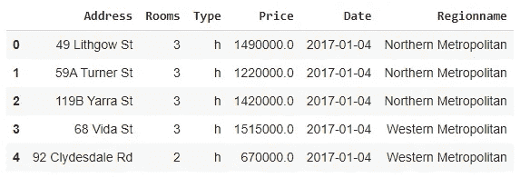
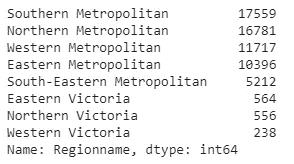
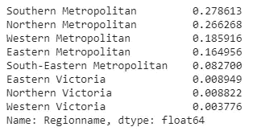
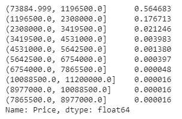
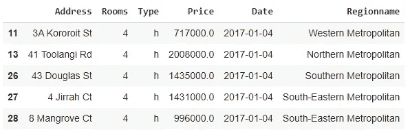

# 让 Python 熊猫更有效率的 4 个诀窍

> 原文：<https://towardsdatascience.com/4-tricks-for-making-python-pandas-more-efficient-20237a045f09?source=collection_archive---------19----------------------->

## 充分利用熊猫


Pawel Czerwinski 在 [Unsplash](https://unsplash.com/?utm_source=unsplash&utm_medium=referral&utm_content=creditCopyText) 上拍摄的照片

Pandas 可以说是数据科学生态系统中最受欢迎的数据分析和操作库。用户友好和直观的 Python 语法是 Pandas 受欢迎的一个重要因素。然而，这并不是熊猫被绝大多数数据科学家改编的唯一原因。

Pandas 提供了许多功能和方法来加速数据分析和操作。在这篇文章中，我们将学习 4 个技巧来更有效地使用这些函数。

让我们从创建数据框开始。我们将使用 Kaggle 上提供的墨尔本住房数据集[。](https://www.kaggle.com/anthonypino/melbourne-housing-market)

```
import pandas as pddf = pd.read_csv("/content/melb_housing.csv")df.columns
Index(['Suburb', 'Address', 'Rooms', 'Type', 'Price', 'Method', 'SellerG', 'Date', 'Postcode', 'Regionname', 'Propertycount', 'Distance', 'CouncilArea'], dtype='object')
```

数据集包含关于墨尔本房屋的 13 个特征(即柱子)。

## 第一招

第一个窍门是关于`read_csv`函数。这可能是最常用的函数，但我们几乎总是不带任何参数地使用它。`read_csv`函数有许多参数，使它更加方便。

Pandas 在 dt 访问器下提供了几个方法来操作日期。为了使用它们，日期必须具有 datetime 数据类型。我们总是可以转换数据类型，但是有一个更实际的方法。`parse_dates`参数可以处理这项任务。

另一个有用的参数是`usecols`。如果只需要处理数据集中的一些列，可以将列名传递给`usecols`参数。它节省了内存和计算能力，尤其是在处理大型数据集时。

让我们用这些参数重新读取数据集。

```
df = pd.read_csv(
  "/content/melb_housing.csv", 
  parse_dates=["Date"],
  usecols=["Address", "Rooms", "Date","Type", "Price",   
           "Regionname"]
)df.head()
```



(图片由作者提供)

## 第二招

熊猫的另一个常用功能是`value_counts`。它计算一列中不同值的出现次数。因此，我们得到了一个特征(即列)分布的概况。

```
df.Regionname.value_counts()
```



(图片由作者提供)

我们可以看到每个地区的房屋数量。在某些情况下，对这些值进行规范化会提供更多的信息，以便我们对类别的分布有更好的了解。

一种方法是将出现的次数除以值的总数。`value_counts`功能的`normalize`参数很容易完成这项任务。

```
df.Regionname.value_counts(normalize=True)
```



(图片由作者提供)

近 28%的房屋位于南部大都市地区。

## 第三招

第三招也是关于`value_counts`函数的。它通常与分类变量一起使用。然而，我们也可以在价格等连续变量上使用它。

查看每个价格出现的次数不是一种首选的方法。但是，我们可以创建容器并检查每个容器中值的数量。`value_counts`功能的`bin`参数将整个范围划分为指定数量的箱。然后，我们可以看到这些箱中的值的分布。

```
df.Price.value_counts(normalize=True, bins=10)
```



(图片由作者提供)

56%的房屋位于第一个区间，该区间的跨度在 73k 和 120 万之间。

## 第四招

第四个是关于过滤数据帧。在典型的探索性数据分析过程中，我们会进行大量过滤。或者，我们可能只是对符合一组条件的观察结果(即行)感兴趣。

考虑这样一种情况，我们需要过滤超过 3 个房间并且花费超过 50 万的房子。我们可以根据这些条件过滤数据帧，如下所示:

```
df_filtered = df[(df.Price > 500000) & (df.Rooms > 3)]df_filtered.head()
```



(图片由作者提供)

我们需要写下数据框和列的名称。在多个过滤器的情况下，我们需要将每个过滤器放在括号中，并用“&”号分开。

`query`函数提供了更简单的语法。如果您熟悉 SQL，它肯定会对您更有吸引力。我们可以将条件作为字符串传递，如下所示:

```
df_filtered = df.query("Price > 500000 and Rooms > 3")df_filtered.head()
```


(图片由作者提供)

我们仍然需要编写条件，但是语法更容易键入。

## 结论

我们已经介绍了 4 个简单的技巧。它们不是什么神奇的把戏，但会帮助你更多地利用熊猫。一般来说，我们往往会忽略函数的参数。我绝对建议尽量多使用。他们在那里是有原因的。

感谢您的阅读。如果您有任何反馈，请告诉我。