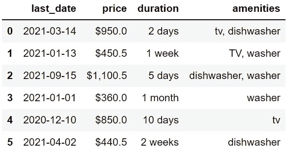
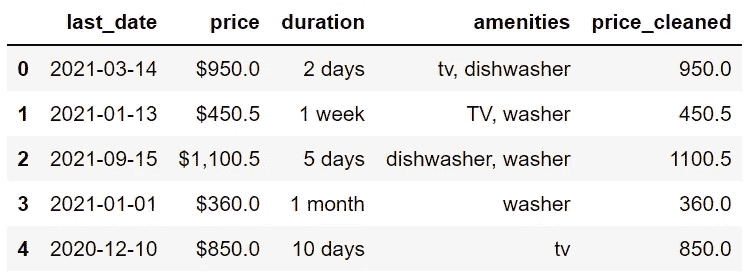
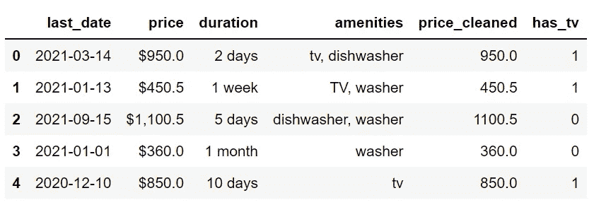
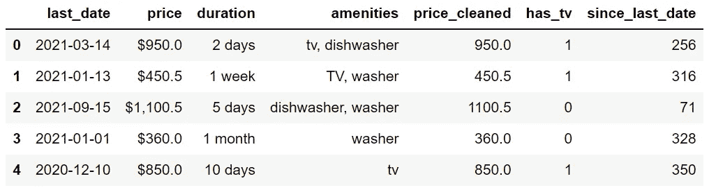
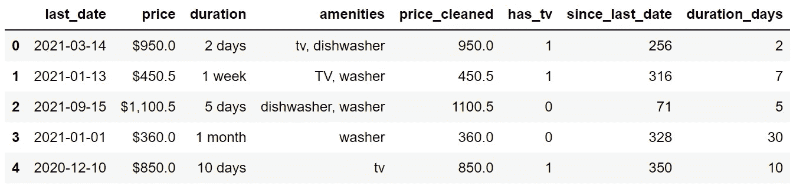

# Python Pandas 的 4 个棘手的数据操作

> 原文：<https://towardsdatascience.com/4-tricky-data-manipulation-operations-with-python-pandas-7fd5e8bba624?source=collection_archive---------13----------------------->

## 挑战极限


Joppe Spaa 在 [Unsplash](https://unsplash.com/s/photos/trick?utm_source=unsplash&utm_medium=referral&utm_content=creditCopyText) 上拍摄的照片

Pandas 是数据科学生态系统中最受欢迎的数据分析和操作库之一。这有几个原因。

原因之一是熊猫让复杂的操作变得简单直观。在一行熊猫代码中，你可以实现比你预期的更多的东西。

在本文中，我们将讨论 4 个数据操作，这些操作初看起来有点复杂。当我们完成后，你会惊奇地发现用熊猫来完成它们是多么简单。

由于现实生活中的数据集可能相当混乱，数据操作或清理是数据科学工作流程的主要部分。

我准备了一个样本数据集，展示了我们在现实生活中可能会遇到的一些问题。

> 注:这个故事最初发表在 datasciencehowto.com 的[上。](https://datasciencehowto.com/2022/10/29/4-tricky-data-manipulation-operations-with-python-pandas/)

我还将分享创建数据框的代码，以防您想自己练习。

```
df = pd.DataFrame({ "last_date": ["2021-03-14", "2021-01-13", 
                  "2021-09-15", "2021-01-01", 
                  "2020-12-10","2021-04-02"], "price": ["$950.0", "$450.5", "$1,100.5", 
              "$360.0", "$850.0", "$440.5"], "duration": ["2 days", "1 week", "5 days", 
                 "1 month", "10 days", "2 weeks"], "amenities": ["tv, dishwasher", "TV, washer", 
                  "dishwasher, washer", "washer", 
                  "tv", "dishwasher"]
})df
```



df(作者图片)

这些值有不同的类型，如日期、数字、文本和列表。但是，它们与对象数据类型一起存储。

```
df.dtypeslast_date    object
price        object
duration     object
amenities    object
dtype: object
```

我们应该总是用正确的数据类型存储数据。否则，我们将无法使用一些特定于数据类型的操作。

# 招数 1:让价格合适

价格栏对我们来说似乎是，但对软件来说不是。“$360.0”是一个字符序列，并不意味着数量或数值。

让我们把它更新成一种计算机实际上能理解的格式它是 360。

```
df["price_cleaned"] = df["price"].str[1:].str.replace(",","").astype("float")
```

第一步是从第二个字符开始取值，因为第一个字符是“$”。

然后，我们通过使用 str 访问器下的 replace 函数来删除用作千位分隔符的逗号。

最后一步是将数据类型改为 float。

以下是更新后的数据框:



df(作者图片)

# 招数二:有电视？

便利设施列在便利设施栏中。假设我对电视特别感兴趣，想要创建一个列来指示是否有电视。

执行这项任务有多种方式。一种有效的方法是使用列表理解，尤其是在处理大型数据框时。

我们需要考虑到“电视”和“电视”是一样的。

```
df["has_tv"] = pd.Series(['tv' in row.lower() for row in df.amenities]).replace({False:0, True:1})
```

我们先来阐述一下列表理解:

```
['tv' in row.lower() for row in df.amenities]
```

*   它占用了便利设施列中的所有行。
*   将其转换为小写，这样我们就可以同时捕捉到“tv”和“TV”。
*   检查行中是否存在“tv”。

这个列表理解返回真或假，但是我想把它们分别转换成 1 或 0。

Pandas 的替换功能可以很容易地完成这项任务，所以我将列表转换为 Pandas 系列，然后应用替换功能。

数据框现在看起来像这样:



df(作者图片)

# 招数三:词条多大？

数据框中有一个名为“最后日期”的列。我更感兴趣的是这个条目或广告有多老。因此，我需要计算从今天到最后一天的天数。

下面的代码创建了一个名为“自上次日期”的列，其中包含我需要的信息。

```
df["since_last_date"] = (pd.to_datetime("2021-11-25") - df["last_date"].astype("datetime64")).dt.days
```

只要数据类型正确，我们就可以计算出两个日期之间的差异。因此，我使用“astype”函数更新最后一个日期列的数据类型。

“to_datetime”函数获取一个字符串并将其转换为日期。

该减法运算的输出如下:

```
0   256 days
1   316 days
2    71 days
3   328 days
4   350 days
5   237 days
Name: last_date, dtype: timedelta64[ns]
```

我们可以使用“dt”访问器下的“days”方法从该输出中提取数量。



df(作者图片)

# 招数四:标准时长？

持续时间列表示时间长度，但单位不同。我想你会同意，这种格式不是很有用。

让我们创建一个新的 duration 列，它将持续时间显示为天数。

我们需要做的是:

*   取第二个字，换算成天数。
*   将该值乘以第一个单词中显示的数量。

```
df["duration_days"] = df["duration"].str.split(" ", expand=True)[1].replace(
    {"week": 7, "weeks": 7, "days": 1, "day": 1, "month": 30}
).astype("int") * df["duration"].str.split(" ", expand=True)[0].astype("int")
```

代码看起来很复杂，但是当我们一步一步看的时候就变得很清楚了。

以下部分采用持续时间列中的第二个单词(例如，周、周、月)

```
df["duration"].str.split(" ", expand=True)[1]
```

replace 函数用适当的天数替换单词。

```
replace(
    {"week": 7, "weeks": 7, "days": 1, "day": 1, "month": 30}
)
```

然后“astype”函数将数据类型转换为整数。

乘法的第二部分采用 duration 列中的第一个字，并将数据类型转换为 integer。

```
df["duration"].str.split(" ", expand=True)[0].astype("int")
```

将这两个值相乘得到一个标准的持续时间，即天数。



df(作者图片)

您不必一次完成所有这些操作。另一种选择是创建一个具有月、周、日等单位的列。然后，您可以相应地更新该值。

Pandas 提供了许多功能和方法来简化和加快数据分析和处理过程。

考虑到清理原始数据所花费的时间，Pandas 对于数据科学家和数据分析师来说都是一个非常重要的工具。

你可以成为[媒介会员](https://sonery.medium.com/membership)来解锁我的作品的全部访问权限，以及媒介的其余部分。如果您使用以下链接，我将收取您的一部分会员费，无需您支付额外费用。

<https://sonery.medium.com/membership>  

感谢您的阅读。如果您有任何反馈，请告诉我。