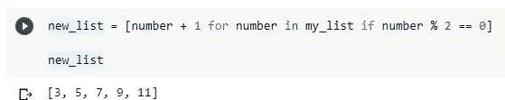
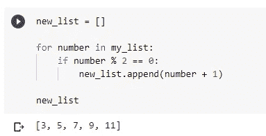
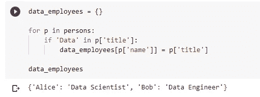
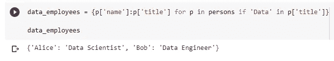
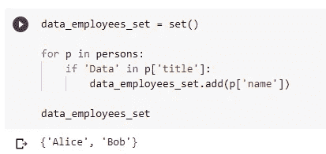
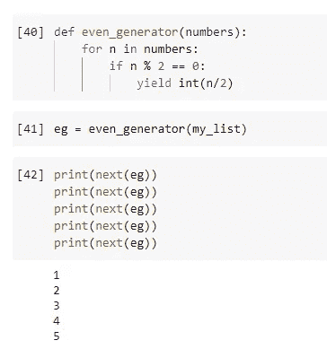
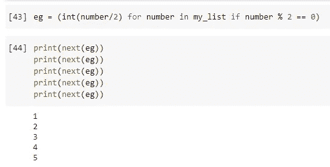
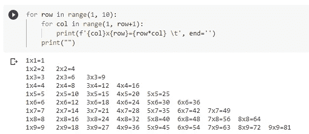
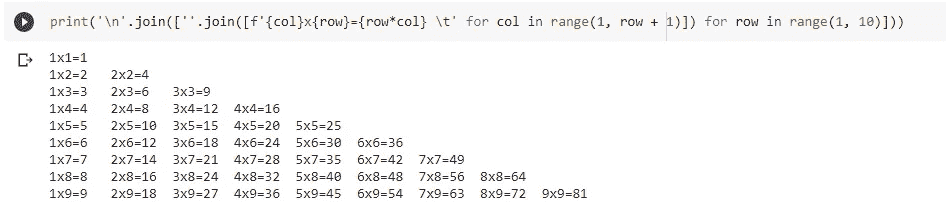

# Python 中的 4 种理解类型

> 原文：<https://towardsdatascience.com/4-types-of-comprehensions-in-python-2fbeafdf2fda?source=collection_archive---------13----------------------->


由 [rahu](https://pixabay.com/users/rahu-4725201/) 在 [Pixabay](https://pixabay.com/illustrations/guitars-strings-musical-instruments-2912447/) 上拍摄的照片

## 只为了简洁和易读而使用它们

作为 Python 中使用最广泛的“Python”语法之一，你一定听说过 List Comprehension 或者已经经常使用它。几乎是各种 Python 初级教程的必备章节。然而，你知道在 Python 中实际上有 4 种类型的“理解”而不仅仅是列表吗？你也可能听说过或曾经使用过字典理解，但可能没有为集和发生器。

在这篇文章中，我将用例子来介绍 Python 中所有的 4 种类型的理解。在最后一节中，我还想举一个例子告诉你什么时候不使用理解来获得更好的可读性。请小心使用！

# 1.列表理解


照片由 [Pexels](https://pixabay.com/users/pexels-2286921/) 在 [Pixabay](https://pixabay.com/photos/hot-air-balloons-adventure-balloons-1867279/) 上拍摄

这绝对是 Python 中最常用的一个。你会在任何地方看到他们。基本语法如下:

```
my_list = [<expression> for <item> in <iterable> if <condition>]
```

在这里，`expression`可能与`item`完全相同，这意味着我们不想对项目做任何事情，只是保持原样。

`condition`是可选的。只有当你想做一个过滤器时才使用它。

所以，基本上:

*   `expression = item`当你想离开`item`不变的时候。
*   `expression != item`当你想应用一些逻辑去修改`item`的时候。
*   `condition`将有助于过滤可能返回较少`items`的`iterable`。
*   `condition`是可选的，因此如果它被抑制，`iterable`的长度必须等于`my_list`。

我们举个例子来演示一下。假设我们有一个只有 1-10 个整数的列表。

```
my_list = [1,2,3,4,5,6,7,8,9,10]
```

我们想要做的是用`my_list`中的数字创建一个新列表

*   过滤数字，使其只有偶数(使用`condition`)
*   过滤后的数字，在被推入新列表之前加 1(使用`expression`)

```
new_list = [number + 1 for number in my_list if number % 2 == 0]
```



非常简洁易读！如果我们不用列表理解呢？这里有一个例子。

```
new_list = []for number in my_list:
    if number % 2 == 0:
        new_list.append(number + 1)
```



它也有很好的可读性，但是不够简洁。此外，我们必须先初始化 new_list。

那么，你喜欢哪一个？我想答案对我们大多数人来说是显而易见的:)

# 2.词典理解


由 [Deedee86](https://pixabay.com/users/deedee86-4642964/) 在 [Pixabay](https://pixabay.com/photos/shelf-bookcase-library-bookstore-3195135/) 上拍摄的照片

名称“某物”理解，实际上取决于输出对象类型，而不是理解中使用的 iterable。因此，词典理解会生成词典。

基本语法如下:

```
my_dict = [<key>:<value> for <item> in <iterable> if <condition>]
```

请注意，这里的`key`和`value`可以是带或者不带`item`的表达式。

假设我们有一个包含雇员姓名、年龄和职务的字典对象列表。

```
persons = [
    {
        'name': 'Alice',
        'age': 30,
        'title': 'Data Scientist'
    },
    {
        'name': 'Bob',
        'age': 35,
        'title': 'Data Engineer'
    },
    {
        'name': 'Chris',
        'age': 33,
        'title': 'Machine Learning Engineer'
    }
]
```

要求是让所有职位包含字符串“数据”的雇员。所以，我们可以称他们为“数据员工”。

此外，我们对雇员的年龄不感兴趣，所以我们希望有这样一个字典，以雇员姓名作为键，以他们的职位作为值。

这次，我们先写没有字典理解的代码。

```
data_employees = {}for p in persons:
    if 'Data' in p['title']:
        data_employees[p['name']] = p['title']
```



同样，我们必须在开始时初始化一个空字典。在 for 循环中，我们将使用 if 条件来过滤雇员的职位。最后，我们需要确保新字典的结构符合要求。

有了字典的理解，我们可以把所有这些放在一行，甚至在证明它的可读性。

```
data_employees = {p['name']:p['title'] for p in persons if 'Data' in p['title']}
```



除了简洁，我要说的是字典式的理解更具可读性。

# 3.集合理解


由[设计师](https://pixabay.com/users/congerdesign-509903/)在[像素点](https://pixabay.com/photos/cherries-fruits-basket-1503974/)拍摄的照片

是的，Python 中有一套理解语法，很多人不知道。事实上，集合理解和列表理解的唯一区别在于前者使用了花括号`{}`而不是方括号`[]`。

语法如下:

```
my_set = {<expression> for <item> in <iterable> if <condition>}
```

你把它和字典理解混淆了吗？这两者的区别在于，集合理解没有`key:value`对，只有一个`expression`。

现在，让我们重用上一节中使用的雇员列表。

假设我们没有使用集合理解。

```
data_employees_set = set()for p in persons:
    if 'Data' in p['title']:
        data_employees_set.add(p['name'])
```



那么，让我们使用它。

```
data_employees_set = {p['name'] for p in persons if 'Data' in p['title']}
```


请记住，集合和列表的区别在于，集合中的项目不能重复，也不能按顺序排列:)

# 4.生成器理解


由 [Pixabay](https://pixabay.com/photos/duck-goose-march-series-queue-3217049/) 上的 [DaKub](https://pixabay.com/users/dakub-8222964/) 拍摄的照片

最后但不是列表，发电机的理解也不为大多数人所知。生成器是 Python 中一个相当独特的语法，它通常是从一个带有`yield`关键字的函数而不是 Python 中生成的。

例如，让我们使用相同的数字列表和列表理解部分的要求。我们可以定义一个函数来生成一个生成器。

```
def even_generator(numbers):
    for n in numbers:
        if n % 2 == 0:
            yield int(n/2)eg = even_generator(my_list)
```

生成器可以通过其内置函数`next()`进行迭代。所以，我们可以通过调用`print(next(eg))`继续获取生成器的下一个值。



事实上，所有这些都可以使用生成器理解来完成。生成器理解和列表理解的唯一区别是前者使用了括号。

```
my_gen = (<expression> for <item> in <iterable> if <condition>)
```

是的，我们甚至不需要`yield`关键字！让我们试一试。

```
eg = (int(number/2) for number in my_list if number % 2 == 0)
```



就这样，都搞定了。

# 5.嵌套理解


由 [JerzyGorecki](https://pixabay.com/users/jerzygorecki-2233926/) 在 [Pixabay](https://pixabay.com/photos/egg-nest-tree-branches-leaves-1600890/) 上拍摄的照片

我们已经探索了 Python 中所有的 4 种理解类型。它们在 Python 中是非常好的语法。然而，据我所知，许多学习者一旦知道如何使用理解词，就会倾向于过于频繁地使用它们。这可能不是一件好事。

我们通常喜欢使用理解来编写更简洁易读的代码。然而，有时逻辑是相对复杂的，如果我们使用理解会伤害可读性。

典型的例子之一是嵌套理解。

例如，我们想打印一个从 1 到 10 的乘法表。下面是实现这一点的一个普通方法。当然，没有任何列表理解。

```
for row in range(1, 10):
    for col in range(1, row+1):
        print(f'{col}x{row}={row*col} \t', end='')
    print("")
```



需要注意的是，我们很容易控制输出格式，因为在 for 循环中可以有多个表达式。例如，我们可以在`print()`函数中使用`end=''`参数来阻止它输出新的一行。

如果我们使用列表理解来实现这一点，我们当然可以，但是很多东西会被挤在一行代码中，这真的会损害可读性。

```
print('\n'.join([''.join([f'{col}x{row}={row*col} \t' for col in range(1, row + 1)]) for row in range(1, 10)]))
```



我打赌没有人能非常容易地理解上面的代码。

基本上，我不是建议放弃嵌套理解。有时候，如果逻辑真的很简单也是可以的。然而，如果我们遇到这种需要嵌套理解的情况，我们是否真的需要使用理解就值得三思了。

# 摘要


照片由 [Pixabay](https://pixabay.com/photos/sunset-waves-sea-ocean-water-5801050/) 上的[NWimagesbySabrinaEickhoff](https://pixabay.com/users/nwimagesbysabrinaeickhoff-13202465/)拍摄

在本文中，我介绍了 Python 中的所有 4 种理解类型——列表、字典、集合和生成器理解。大多数时候，它们非常优雅、简洁，甚至可以提高代码的可读性。那就是所谓的“蟒”。

但是，也需要注意不要滥用。当逻辑不简单时，理解会伤害可读性。在许多需要嵌套理解的情况下，我们需要问自己:我应该用嵌套理解写逻辑吗？

希望你喜欢阅读。编码快乐！

[](https://colab.research.google.com/drive/1PygMIKhTAW_Pl5VVk6UkIfC1VoltqJNj?usp=sharing) [## 4TypesComprehensions.ipynb

### 编辑描述

colab.research.google.com](https://colab.research.google.com/drive/1PygMIKhTAW_Pl5VVk6UkIfC1VoltqJNj?usp=sharing) [](https://medium.com/@qiuyujx/membership) [## 通过我的推荐链接加入 Medium 克里斯托弗·陶

### 作为一个媒体会员，你的会员费的一部分会给你阅读的作家，你可以完全接触到每一个故事…

medium.com](https://medium.com/@qiuyujx/membership) 

**如果你觉得我的文章有帮助，请考虑加入灵媒会员来支持我和成千上万的其他作家！(点击上面的链接)**