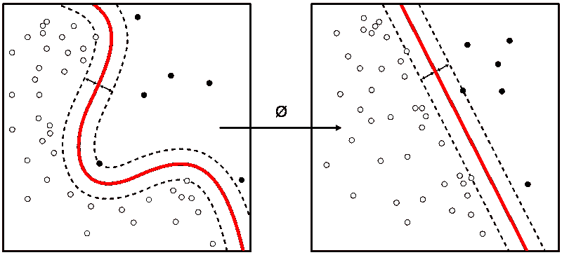

# 征服数据科学面试—第 1 部分

> 原文：<https://towardsdatascience.com/4-types-of-data-science-interview-questions-part1-d17db4253c69?source=collection_archive---------25----------------------->

## **ML 重点强的真题**

在上一篇文章中，我们谈到了[征服编码回合是 DS 面试](/conquer-the-python-coding-round-in-data-science-interviews-5e27c4513be3)。在本帖中，我分享了 DS 面试中被问到的实际问题，以及这些问题所评估的内容。

接受采访可能会让人不知所措，但当一个人有所准备时就不会了[图片由[萨姆·麦克格](https://unsplash.com/@sammcghee?utm_source=unsplash&utm_medium=referral&utm_content=creditCopyText)在 [Unsplash](https://unsplash.com/s/photos/data-science-interview?utm_source=unsplash&utm_medium=referral&utm_content=creditCopyText) 上拍摄]

DS 面试可以是一连串的多轮面试。对于大多数公司来说，进行 2-3 轮技术谈判是很常见的。接下来通常是高级主管/招聘经理的面试。在一些公司，每一轮都是淘汰赛；但在其他情况下，每一轮都意味着从多个面试官那里获得对候选人的公正评估。在这种情况下，任何一次面试都不是你获得那份梦寐以求的工作的成败关键。通过询问招聘人员来检查面试过程和背后的基本原理是有好处的。

无论是哪种情况，多轮意味着你可以确保在 ds 项目管道的所有方面进行测试。大体上有以下类型的问题:

**1。简历/基于项目**

**2。ML 熟练检查—算法细节**

**3。基于案例研究的问题**

**4。指标**

我们将在这篇文章中讨论类型 1 和类型 2，其余的将在下一篇文章中讨论。

对你的简历了如指掌[ [来源](https://unsplash.com/photos/7iSEHWsxPLw)

# **简历/基于项目**

任何面试的基本要求都是你精通简历上写的一切——因为嘿！你说你一直在努力。这可能是面试中最重要的部分。

你会被要求解释简历中的任何项目。当你解释这个项目时，面试官会更深入地研究这个项目的某些方面，或者他们会增加一些转折，检查你对复杂性的适应程度。

**例 1:深究的问题**

***项目——利用 GBM*** 进行客户流失预测

***考生(C):*** 讲到了数据来源，因变量的创建

***面试官(一):*** 这两个类在因变量中的分布是怎样的？

***C:***4%—1，剩余 0

***我:*** 你是如何处理阶层失衡的？

***C:*** 数据干预(采样策略)、算法干预(使用类别权重)，以及选择正确的报告指标(精度/召回超过准确度)

***I:*** 欠采样的多数比过采样的少数有什么优势？有没有尝试过 Smote/Adasyn 之类的其他技术？

***C:*** 解释原因并转移到分类器——GBM 分类器

***一:****GBM 用的是哪个成本函数？它是如何工作的？除了 GBM 你还尝试了什么？*

****I:*** 如何选择最佳的精度/召回截止值？*

*等等..*

***例 2:探索项目的所有分支***

****项目—使用 SVD 的主题建模****

****C:*** 介绍用例及文本预处理。*

****I:*** 词干化和词汇化有什么区别——什么时候用？*

****C :*** 解释道*

****我:*** 数据有多大。用于分解的矩阵的维数。使用 SVD 会遇到什么问题吗？*

****C:*** SVD 需要很长时间来分解，因此使用了它的另一个变体——[FastSVD(由脸书开发)](https://research.fb.com/blog/2014/09/fast-randomized-svd/)*

****I:*** 能解释一下 FastSVD 是怎么工作的吗？什么有助于加快这一进程？*

****C :*** 通过走进线性代数来解释。*

****我:*** 好了，现在有了题目，你是怎么验证题目的？*

****C:*** 手动+题目连贯，题目困惑*

****我:*** 你是怎么决定题目数量的？*

****C:*** 使用奇异值重要性相对于主题数量的 Scree 图*

****一:*** 说明本项目使用的系统架构。处理是实时的还是成批的？后端系统是如何处理的？*

*等等..*

***例 3:增加现有问题的复杂性***

****项目——利用测井数据进行异常检测****

****C :*** 解释了关于用例的需要，以及可用的数据。*

****I:*** 异常值和离群值有什么区别？*

****C:*** 异常值是仍在生成数据的机制内的极值。然而，异常是如此极端，以至于你怀疑它可能是由另一种机制产生的。*

****我:*** 你还探索了哪些异常检测技术？您能使用隔离林重新制定您的解决方案吗？*

**你得到了趋势……**

**

*[【来源】](https://upload.wikimedia.org/wikipedia/commons/f/fe/Kernel_Machine.svg)*

# ***机器学习能力检查—算法细节***

*在这种类型的问题中，你可以期望深入算法的工作原理。你可以用数学、统计学、几何学和其他任何对你有用的东西来解释算法的内部运作。*

****举例:****

****1。RF 和 GBM 的区别是什么(这是一个很常见的问题，也有很好的理由。许多业务用例仍然作为分类问题被解决。尤其是对于表格数据，基于树的模式仍然表现得相当好。然而，这是一个进入基于树的算法工作的入门问题，正如你将在下面看到的)****

****2。*** 为什么 RF 比决策树好？*

****3。***RF/GBM 如何给新数据分配一个概率分值？*

****4。***GBM 中使用的损失函数是什么？*

****5。*** 解释交叉熵损失函数。为什么要用 log？*

***6*。***RF 如何计算变量重要性？*

****7。逻辑回归的变量重要性比 RF 更有优势。你能告诉我这是什么吗？(提示—这与 p 值有关)****

***8。** 你用什么方法检测和溢出？*

***9*。*** 部署后，在 1 个发行版上训练的模型遇到了另一个发行版。你会怎么做？*

****10。什么时候你会使用 LSTM 而不是简单的 RNN？****

***11*。你能解释一下反向传播是如何工作的吗？****

# *结论*

*在这组问题中，您看到了强烈的技术焦点，在下一篇文章中，您将注意到业务焦点，即案例研究和基于指标的问题。继续阅读-*

* [## 数据科学面试问题的 4 种类型—第 2 部分

### 具有强烈商业焦点的真实问题

learnwithdivya.medium.com](https://learnwithdivya.medium.com/4-types-of-data-science-interview-questions-part2-106f5bf7218d)*