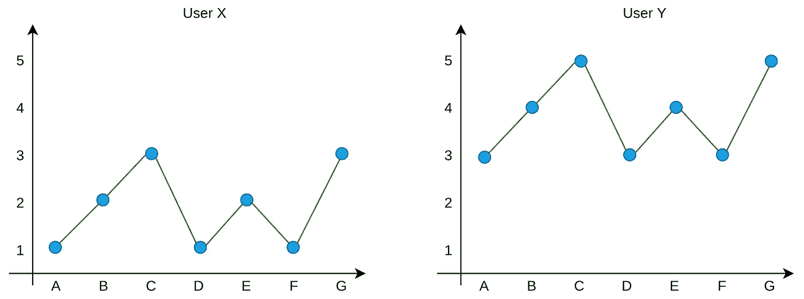
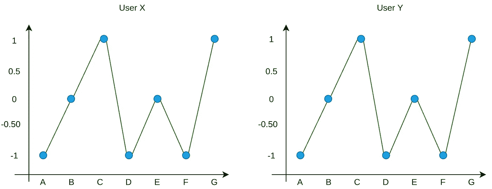
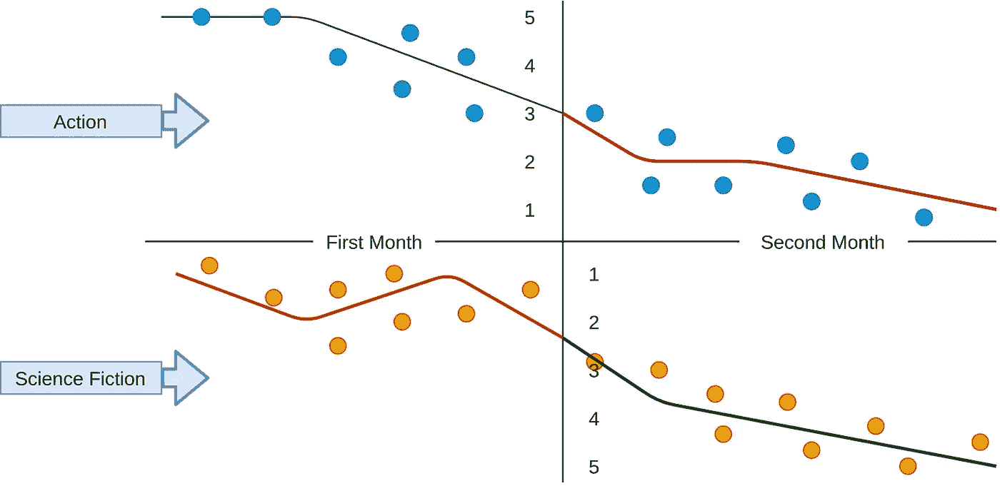

# 在推荐系统中可能导致异常的 4 类用户

> 原文：<https://towardsdatascience.com/4-types-of-users-that-can-cause-anomaly-in-recommendation-systems-3422a85220cc?source=collection_archive---------23----------------------->

## 推荐系统

## 推荐系统中如何处理不同类型的用户

在发布大量内容的社交媒体和电子商务平台上，向用户展示合适的内容至关重要。用户进入平台后可以查看的内容是有限的。因此，这些内容必须由能够自适应地预测用户倾向的系统或引擎来选择。互联网上的大多数服务使用这样的系统来增加用户体验。这就是为什么网飞给你看的电视剧和给你朋友看的不一样。

由 [Charles Deluvio](https://unsplash.com/@charlesdeluvio?utm_source=unsplash&utm_medium=referral&utm_content=creditCopyText) 在 [Unsplash](https://unsplash.com/s/photos/unhappy?utm_source=unsplash&utm_medium=referral&utm_content=creditCopyText) 上拍摄的照片

根据用户的活动为用户单独预测相关内容的系统称为[推荐器或推荐系统](https://en.wikipedia.org/wiki/Recommender_system#:~:text=A%20recommender%20system%2C%20or%20a,would%20give%20to%20an%20item.)。它们大多基于包括平台上用户活动的数据，而不是人口统计数据。内容的类别、发布者、显示时间可以是这些活动的例子。然而，推荐模型中使用了两种类型的数据，即显式数据和隐式数据。显式数据包括直接从用户处获取的信息，例如，评级、喜欢或鼓掌(就像在媒体中一样)。隐式数据表示从用户动作收集的信息，如显示时间、显示次数等。因为平台上有不同的用户/使用类型，所以必须对它们进行预处理，以发现它们可能导致的异常。在本文中，我将解释几个必须考虑的重点，以提供更有效的建议。我将关注评级数据(明确的)并讨论强硬、慷慨和资深用户的评级。

## 等级

评级是用于基于用户的评估向用户建议相关项目的主要信息之一。这是来自用户的直接反馈。因此，在没有[用户统计数据的情况下，可以仅使用比率来创建推荐模型。](https://www.investopedia.com/terms/d/demographics.asp)背后的思路是根据用户的评分找到相似的用户，并根据其相似性推荐内容。简而言之，系统基于这样的想法推荐商品:那些喜欢我的人也可能喜欢我的其他爱好。

评分数据有助于改进您的[推荐算法](https://itnext.io/what-are-the-top-recommendation-engine-algorithms-used-nowadays-646f588ce639)。但是，如果用户反馈不一致，可能会导致无效结果。因此，知道如何避免数据中的异常是至关重要的。可能导致这些异常的用户可以分为四个不同的类别，即强硬、慷慨、老练和冷启动。假设有一个平台可以让用户给内容打分，从 1 分到 5 分。强硬的评分者代表了很少给五星的人群。慷慨的评分者通常会给他们在每个类别或任何领域看到的内容打高分。冷启动评分者是平台的新用户。所以，他们没有留下足够的关于他们喜欢什么的信息。资深评分员是使用平台多年的用户。通过考虑这四种用户类型，评级数据应该被预处理以避免异常。首先，我们必须定义什么类型的数据会导致[异常](https://en.wikipedia.org/wiki/Anomaly_detection)。我们将一步一步地检查所有内容。

## 与严厉和慷慨的评分者打交道

可能导致异常的第一个评级数据是严厉和慷慨的评级者的评级。推荐模型的目的是预测用户对给定内容的评价。比如有 A、B、c 三部电影，我们想知道应该给用户 x 看哪部电影，模型应该给我们给定用户-项目组合的评分预测。在这种情况下，预测变量是显示评级值的变量。严厉的评定者或慷慨的评定者会导致这一变量的异常，因为他们会使低或高的比率偏离正常值。所以，包含苛刻用户评级的数据会误导推荐。请试着从图 1 来理解。

图 1—两个不同的用户给相同的内容留下了星号(图片由作者提供)

散点图表示给定相同电影的两个用户的评级，从 1 到 5。用户 X 的评价似乎低于用户 Y 的评价。根据评价，用户 X 不像用户 Y 那样喜欢该内容。所以，用户 Y 喜欢的内容不会被一个系统推荐给用户 X。但是，如果您看到这些线条，您会发现它们在不同的评价值中绘制了相同的形状。这让我们得出两个可能的结论。第一，用户 x 在给星的时候比用户 Y 更强硬。第二个，用户 y 在给星的时候比用户 X 大方。因此，两个用户都喜欢电影 C、G，不喜欢电影 A、D 和 f。我们可以通过查看来自不同用户的评级值来理解这种情况。然而，问题是要做一个推荐算法来像我们一样理解这种情况。解决方案是使用平均值和标准差来标准化评级值。图 2 显示了标准化后的用户评级分布。

图 2 —用户 X 和用户 Y 的标准化评级值

从图 2 中可以看出，标准化用户评级后获得了相同的评级值。因此，系统可以将“用户 Y”喜欢的电影推荐给“用户 X”。**这里**强调的是，我们需要标准化基于用户的评分值，而不是标准化从所有用户收集的所有评分数据。

## 与资深用户打交道

每个平台上都有几个月或几年来一直在使用这个平台的用户。随着时间的推移，用户对不同类型内容的看法可能会发生变化。这也会给我们的数据带来另一个不必要的异常。例如，在 to time 期间，用户可能开始更喜欢动作片而不是纪录片。因此，使用老用户的所有评级数据可能会导致对他或他的类似用户的推荐不一致。请参见图 3，以便更清楚地理解它。

图 3 —一段时间内基于类别的评级变化。

用户在第一个月给动作片高评分，给科幻片低评分。然而，用户在第二个月开始将较高的费率留给科幻小说，而将较低的费率留给动作电影。假设我们已经使用第一个月和第二个月的评级数据创建了一个推荐模型。我们希望在第二个月向该用户推荐电影。由于我们使用了两个月的数据，该模型可能会推荐用户不想看的动作电影。因此，应该基于用户的近期活动来选择评级，以避免这些类型的不想要的推荐。但是，也可以根据日期来衡量评级值。

## 冷启动用户

不熟悉这个平台的用户在推荐系统中可能是个问题。这是因为没有足够的关于他们喜欢什么的信息。这些类型的用户称为[冷启动用户。](https://en.wikipedia.org/wiki/Cold_start_%28recommender_systems%29)解决这个问题很重要，因为如果新用户不喜欢系统推荐给他们的东西，他们就有很高的流失风险。

我们可能会认为用户的人口统计数据可以成为解决方案之一。然而现在大部分平台在注册的时候连性别都不问。因此，使用人口统计学不会有足够的帮助。另一个可能是地理定位。可以基于其地理位置的趋势来推荐项目/内容。这可能对电影有帮助，但对媒体等平台没有帮助。因为有太多的主题、类别、作者和文章。因此，这种选择也不能全面解决问题。

解决方案，也是大多数平台所做的，可以是向用户建议他们希望在平台上看到什么样的内容。诸如 [Pinterest](https://labs.pinterest.com/projects/user-modeling/) 、 [Medium](https://help.medium.com/hc/en-us/articles/224488047-Control-your-recommendations) 、[网飞](https://help.netflix.com/tr/node/100639)等平台在你注册后会询问你对什么类型的内容感兴趣。它会暂时带出与您的选择相关的内容。然后，你稍微开始输入数据的推荐算法与你的评级和显示。

## 结论

在这篇文章中，我们讨论了四种可能导致推荐系统异常的用户类型。不同种类的用户的数量可以根据平台的要求而增加或减少。然而，也可以定义其他的倾斜标准，例如内容的显示次数或显示时间。同样的四种用户类型也可能导致这些标准出现异常。例如，一些用户观看整个视频，而另一些用户观看部分视频。因此，我们可以说，即使用户对视频持积极态度，观看时间也可能不同，评级值也是如此。