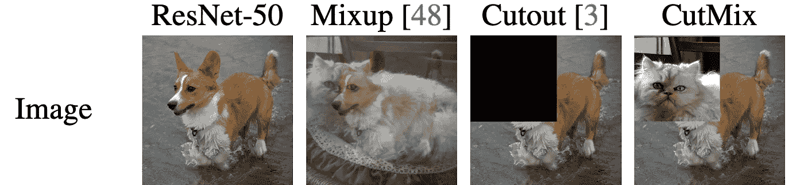
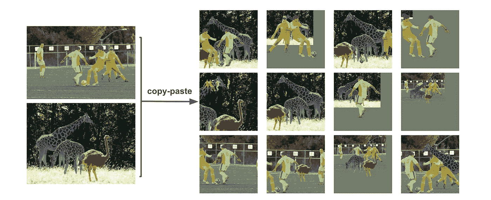

# 4 最新的图像数据增强技术

> 原文：<https://towardsdatascience.com/4-up-to-date-techniques-for-image-data-augmentation-5bdf34ace063?source=collection_archive---------41----------------------->

## 想把你的精确度再提高一点吗？

图一。演示不同的图像增强技术。从[https://arxiv.org/abs/1905.04899](https://arxiv.org/abs/1905.04899)检索的图像。

数据扩充是几乎每个机器学习工程师用来提高结果的技巧。翻转图像等简单技巧可以轻松获得图像分类模型的百分之几的准确度，而无需进行太多的微调。

然而，这些简单的技术，如翻转、旋转和抖动图像，并不是我们今天要讨论的内容。相反，我们将讨论在深度学习时代引入的 4 种非正统技术，这些技术在改善图像相关任务(如分类、检测和分割)方面表现出了巨大的潜力。请做好准备，因为这些增强技术中的一些可能看起来太过奇怪而不真实！

# 1.断流器

[剪切](https://arxiv.org/abs/1708.04552)可能是本文介绍的四种技术中最直观的一种。目标是“切掉”图像的一部分，并将剩余部分用作具有相同标签的新图像数据(见图 1)。由于增强技术，如抖动和添加颜色，使图像更具挑战性，已被证明是有益的，它应该没有什么不同的方法剪切工作。

# 2.混合

图二。图像混合的简单可视化。图片作者。

2017 年推出的这种数据增强策略非常简单，乍一看常常会怀疑它的能力。张等人在他们的[论文](https://arxiv.org/abs/1710.09412)中首先提出了这种技术:我们对两幅图像进行插值，然后我们插值相应的标签作为新的标签。

通过在不同数据集上的大量测试，我们实际上可以看到这种简单的技术提高了各种模型主干的性能。结果被推测是由于在数据集上创建的软标签混合，使得在训练期间可以看到更广泛的数据分布。

*边注:这里* *我还有一篇关于实现 Mixup* [*的文章。*](/enhancing-neural-networks-with-mixup-in-pytorch-5129d261bc4a)

# 3.剪切混合

现在，如果你对 mixup 的工作感到惊讶，你会惊叹于 [CutMix](https://arxiv.org/abs/1905.04899) 工作得更好！Yun 等人决定将一幅图像的一部分剪切并粘贴到另一幅图像上，而不是将每个像素混合在一起，剪切-粘贴比率用作生成图像的新标签(见图 1)。同样，这种技术非常简单，易于实现，但在处理图像分类任务时却非常强大。

另外，最近的论文[attention cut mix](https://arxiv.org/pdf/2003.13048v2.pdf)引入了 attentive feature map 来决定在哪里剪切和粘贴，这显示了更好的效果。

# 4.复制并粘贴

图 3。复制粘贴演示。图片来自 https://arxiv.org/abs/2012.07177 的[。](https://arxiv.org/abs/2012.07177)

[Ghiasi 等人](https://arxiv.org/abs/2012.07177)决定将 CutMix 的成功转移到实例分割中，方法是将一个实例从一个图像随机复制到另一个图像，以允许图像将其正确分割出来。同样，研究结果表明，这种增强技术在提高性能方面非常有效。

# 自己测试

使用 PyTorch 之类的框架测试所有这些数据扩充技术非常简单。人们可以容易地改变数据加载器内的图像和相应的标签，以实现所有上述数据扩充技术。

然而，由于我们必须深入研究数据加载器，所以我们不能直接使用 PyTorch 提供的数据加载器。我发现一个有用的平台是 [Graviti Open Dataset](https://gas.graviti.com/open-datasets) 平台，它连接到许多学术上著名的数据集(例如，CIFAR10、ImageNet)，这样就不需要查看哪些数据集经常用于特定任务。我还会推荐 PyTorch 的[教程，当你添加你的扩充时。](https://pytorch.org/tutorials/beginner/data_loading_tutorial.html)

# 结论

所以你有它！希望这些增加了一些你可以玩的技巧来提升你的图像模型到一个新的水平！

*感谢您坚持到现在*🙏*！* *我会在计算机视觉/深度学习的不同领域发布更多内容，所以* [*加入并订阅*](https://taying-cheng.medium.com/membership) *如果你有兴趣了解更多！*