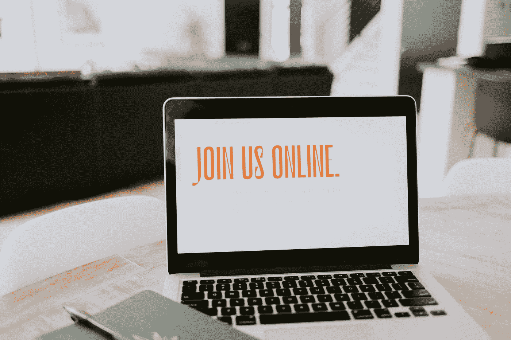

# 您应该考虑参加的 4 个即将到来的数据科学活动

> 原文：<https://towardsdatascience.com/4-upcoming-data-science-events-you-should-consider-attending-93160bdae0ab?source=collection_archive---------21----------------------->

## April 有很多东西要学。

萨曼莎·博尔热斯在 [Unsplash](https://unsplash.com?utm_source=medium&utm_medium=referral) 拍摄的照片

自从一年多前 COVID 袭击以来，我们都被困在家里，不能去工作，上学，娱乐，或参加娱乐或教育活动。尽管被困在室内在很多层面上都是不好的，但一直呆在室内还是有一些好处的。COVID 迫使大学和活动举办者在网上组织和举办他们的活动，允许来自世界各地的人参加——包括否则无法参加这些活动的人。

是的，COVID 之前的一些活动在活动期间提供在线流媒体，但不是全部。现在，几乎所有的活动都在网上进行，而且大多数都是免费或收取少量费用的。

现在有这么多很棒的网络研讨会、会议和虚拟活动，有时候我真希望能全部参加。我是说，你永远学不完东西！但是，我知道我不能参加所有的活动，主要是因为时间限制。

 [## 2021 年要追求的 6 个机器学习证书

### 在你的简历中写下这些会有很大的不同。

towardsdatascience.com](/6-machine-learning-certificates-to-pursue-in-2021-2070e024ae9d) 

因此，我决定浏览本月所有与数据科学相关的活动，并选择我认为非常有利于参加的四个活动，我想与您分享这些活动，以防您正在寻找好的活动来关注和学习新的东西，或者只是与社区进行社交。

# **№1:数据科学高级计算研讨会**

## [4 月 9 日和 10 日](https://www.eventbrite.com/e/seminar-series-on-advanced-computation-for-data-science-ac-ds-tickets-144733264089?aff=ebdssbonlinesearch)

由南康涅狄格州立大学计算机科学系提供的这是一个为期两天的系列讲座，重点是高级计算在数据科学领域的应用。高级计算在数据科学的各个领域都有许多应用，包括机器学习、大数据、计算机版本和数据挖掘。

这些为期两天的研讨会讲座包括深度学习及其在人工智能中的应用、智能数据分析在建筑中的应用、数字数据如何在医疗保健中发挥重要作用以及敏捷数据科学背后的科学。

参加本次活动没有要求或注册费*和*，将有利于任何人在数据科学或感兴趣的数据科学。无论你是学习数学、计算机科学、商业还是教育，在这个为期两天的活动中，你都会有所收获。

# **№2: AI 与 AI 为善**

## [4 月 15 日](https://datascience.harvard.edu/event/industry-seminar-juan-m-lavista-ferres-microsoft)

哈佛大学的数据科学倡议提供了一个伟大的演讲，作者是来自微软人工智能优秀研究实验室的[胡安·m·拉维斯塔·费雷斯](https://www.microsoft.com/en-us/research/people/jlavista/)。人工智能近年来一直是热门话题之一，许多人对它的使用及其伦理方面持怀疑态度。

AI for Good lab 团队专注于应用数据科学概念、机器学习和人工智能来解决人类最具挑战性的问题。文化遗产、健康、司法改革、守法等问题。在这次演讲中，演讲者将带你了解他们所做的研究类型，他们所解决的问题，以及他们希望对社会产生的影响。

本次网络研讨会*免费*参加，通过注册本次网络研讨会，您将能够收到一份录音，以防因时差原因无法现场参加。

 [## 您现在可以开始学习的 5 门在线数据科学课程

### 在家舒适地学习数据科学的所有基础知识。

towardsdatascience.com](/5-online-data-science-courses-you-can-start-now-748e4a2b5403) 

# №3:2021 年数据科学日

## [4 月 22 日](https://www.eventbrite.com/e/data-science-day-2021-tickets-120408285423?aff=ebdssbonlinesearch)

每年，哥伦比亚大学数据科学研究所都会举办一个关于数据科学的活动，即数据科学日。今年，该活动将完全虚拟化，并将以不同的主题演讲、闪电演讲和关于数据科学一切的互动海报会议为特色。

这一天将包括讨论用于设计和自动化的人工智能工具，人类和机器如何共同努力建设更美好的未来，将大数据应用于不同领域的基本挑战，以及构建和实施大规模图形算法。

在我看来，这一天最精彩的部分将是互动海报会议，在这里，你将有机会了解数据科学研究的最新进展，并与来自世界各地的伟大研究人员接触。这项活动的门票不是免费的，但它只收取 20 美元的小额费用。

# **№4:数据科学&未来博览会和会议的 AI 领袖**

## [4 月 24 日-25 日](https://www.eventbrite.com/e/data-science-ai-leaders-of-tomorrow-conference-and-expo-tickets-144245579411?aff=ebdssbonlinesearch)

这份名单上的最后一项活动是由佐治亚理工学院、加州大学伯克利分校、UT 奥斯汀分校和卡内基梅隆大学提供和组织的数据科学和人工智能明日领袖会议。这项活动将由大型科技公司赞助，如脸书、微软、谷歌和英伟达。

本次会议的重点是主办大学的研究人员和学生展示他们在数据科学领域的最新工作。不仅如此，在演讲之间，还会有来自行业的专业人士就今年的会议主题发表演讲，主题是数据科学和人工智能的多样化应用。

这次会议将是一个为期一天半的活动，充满了教育讲座，社交和该领域的最新进展。这个会议是免费的。

# 外卖食品

参加教育活动、讲座和会议是任何领域的任何人拓宽人脉、参与社区活动和结识志同道合者的主要途径。但是最近出去认识新的人，讨论研究或者仅仅是最近的技术进步并不是一个选择——希望这很快会改变。

 [## 每个数据科学家都应该知道的 6 种 NLP 技术

### 迈向更高效的自然语言处理

towardsdatascience.com](/6-nlp-techniques-every-data-scientist-should-know-7cdea012e5c3) 

所以，现在，如果我们想“认识”新朋友，我们必须虚拟地去做，因为科学不会因为任何事情而停止，它将继续前进，我们必须跟上它。幸运的是，一旦 COVID 来袭，许多大学、学院和组织者决定将他们为学生提供的所有活动扩展到任何地方任何想学习新事物的人。

这一令人惊叹的机会让世界各地的每个人，无论他们的教育背景如何，都参加了他们感兴趣的活动，这些活动是他们因为资金和地点原因而无法参加的。否则，无论我们在世界的哪个角落，我们都可以向最优秀的人学习。

在本文中，我提出了 4 个即将举行的数据科学相关活动，我个人将会参加，希望您也能考虑参加。