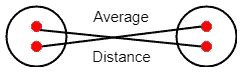

# 2021 年你应该知道的 4 种有用的聚类方法

> 原文：<https://towardsdatascience.com/4-useful-clustering-methods-you-should-know-in-2021-ac61301e968e?source=collection_archive---------17----------------------->

## 根据距离形成相似的观察组


凯利·西克玛在 [Unsplash](https://unsplash.com/?utm_source=unsplash&utm_medium=referral&utm_content=creditCopyText) 上的照片

聚类分析的主要目的是通常基于 ***欧几里德*** 距离形成相似观察值的组(称为**簇** )。在机器学习术语中，聚类是一个 ***无监督的*** 任务。今天，我们讨论 4 种有用的聚类方法，它们属于两个主要类别——**层次聚类**和**非层次聚类**。

在层次聚类下，我们将讨论 3 种*聚集*层次方法——**单连锁**、**完全连锁**和**平均连锁**。在非层次聚类方法下，我们将讨论 **K-Means 聚类**。


(图片由作者提供)

我们在这里讨论的每种方法都是使用 Scikit-learn 机器学习库实现的。我还将为分层方法创建 ***树状图*** ，以显示观察值之间的分层关系。阅读本文后，您将能够区分每种聚类方法，并使用真实数据集实现每种方法。

# **分层和非分层聚类**

***层次聚类*** 由一系列连续的合并组成。这里，我们不需要知道要查找的簇的数量。与 K-Means 聚类相比，这是层次聚类的一大优势。这种聚类方法可以应用于更小的数据集。使用层次聚类，我们不仅可以对观察值进行分组，还可以对变量进行分组。凝聚法如单连锁、完全连锁和平均连锁都是层次聚类的例子。

***非层次聚类*** 不是由一系列连续的合并组成的。这里，应该在聚类之前指定聚类的数量。这种方法适用于大得多的数据集。使用非层次聚类，我们可以只对观察值进行分组。K-means 聚类是非层次聚类的一个例子。在 Scikit-learn 中，可以通过使用 **KMeans()** 类来实现。

# 凝聚方法

开始时，单个观察值被认为是凝聚方法中的主要聚类。然后，我们将最相似的对象组合成簇。通过考虑观察值之间的最小距离或最大相关性来找到最相似的对象。单个连接、完全连接和平均连接是聚集方法的例子。在 Scikit-learn 中，凝聚方法可以通过使用**college veclustering()**类来实现。通过在该类内部定义**联动:*{‘完全’，‘平均’，‘单一’}***超参数，可以建立基于单一联动、完全联动、平均联动的不同集聚模型。

# 分层方法

## 凝聚-单键

在 ***单*** 联动法中，我们结合观测值考虑了两个集合的所有观测值之间距离的最小*。*

**

*单一链接(图片由作者提供)*

## *凝聚—完全连锁*

*在 ***完成*** 联动的方法中，我们结合观测值考虑了 ***最大*** 的两组所有观测值之间的距离。*

**

*完整链接(图片由作者提供)*

## *凝聚平均连锁*

*在 ***平均*** 联动法中，我们结合观测值考虑了 ***平均*** 两组各观测值的距离。*

**

*平均链接(作者图片)*

# *履行*

*以下 Python 代码块解释了如何将*完全链接方法*实现到“鸢尾数据集”中，以找到鸢尾花的不同物种(簇)。为了可视化的目的，我们还应用主成分分析将 4 维虹膜数据减少为可以用 2D 图绘制的 2 维数据，同时保留原始数据中 95.8%的变化！*

## *第一步:绘制**树状图***

*在这里，我们绘制了完全连锁方法的树状图，以显示观察值之间的层次关系，并猜测聚类的数量。*

*等到加载 Python 代码！*

**

*层次聚类树状图(图片由作者提供)*

*通过查看树状图，可以更好地获得“Iris”数据的 3 簇解决方案。*

## *步骤 2:获取分类标签*

*对于“Iris”数据中的每个观察，我们得到 3 个聚类标签(0、1 或 2)。*

*等到加载 Python 代码！*

**

*使用完全链接方法对“Iris”数据进行分类标签(图片由作者提供)*

## *步骤 3:绘制聚类图*

*在主成分分析的帮助下，我们可以绘制“Iris”数据的 3 个聚类。*

*等到加载 Python 代码！*

**

*(图片由作者提供)*

*在散点图中，我们可以清楚地看到 3 个集群。事实上，鸢尾花实际上有 3 个品种，分别叫做 **Setosa** 、 **Versicolour** 和 **Virginica** ，我们发现的 3 个簇代表了它们！*

# *非等级方法*

## ***K 均值聚类***

*在 ***k-means 聚类*** 中，算法试图将观察值分组到 ***k*** 组(簇)中，观察值数量大致相同。组数 ***k*** 应由用户指定为 ***超参数*** 。*

*要了解更多关于 K-means 聚类的工作原理、分步实现、目标和假设以及如何找到最优的聚类数(针对 ***k*** 的超参数调优)，请阅读我的**[**动手 K-means 聚类**](https://medium.com/mlearning-ai/k-means-clustering-with-scikit-learn-e2af706450e4)**帖子。*****

# *****履行*****

*****以下 Python 代码解释了如何对“鸢尾数据集”实施 K-means 聚类，以找到鸢尾花的不同种类(聚类)。为了可视化的目的，我们还应用主成分分析将 4 维虹膜数据减少为可以用 2D 图绘制的 2 维数据，同时保留原始数据中 95.8%的变化！*****

## *****步骤 1:获取分类标签*****

*****使用 K-Means 方法，我们为“Iris”数据中的每个观察值获得 3 个聚类标签(0、1 或 2)。*****

*****等到加载 Python 代码！*****

**********

*****使用 K-Means 方法对“Iris”数据进行聚类标签(图片由作者提供)*****

## *****步骤 2:绘制聚类图*****

*****在主成分分析的帮助下，我们可以绘制“Iris”数据的 3 个聚类。*****

**********

*****(图片由作者提供)*****

## *****第三步:创建**剪影图*******

*****让我们看看我们发现的集群是平衡的(即，每个集群具有大致相同的观察数量)并且分离良好。为此，我们可以创建一个剪影图。想了解更多，请阅读我的**[**动手 K-Means 聚类**](https://medium.com/mlearning-ai/k-means-clustering-with-scikit-learn-e2af706450e4)**帖子。*********

```
*******from yellowbrick.cluster import silhouette_visualizer
silhouette_visualizer(K_Means, X_pca, colors='yellowbrick')*******
```

**************

*******剪影图— K-Means 方法(图片由作者提供)*******

*******该图包含每个簇的一个刀形。刀形的宽度表示集群中实例的数量。条形长度表示每个实例的轮廓系数。虚线表示平均轮廓分数。*******

*******我们可以看到我们发现的星团是*。这是因为刀具形状的宽度大致相同。********

******3 个集群中的大多数点具有大的轮廓值，并且向右延伸超过虚线，指示我们发现的集群是 ***良好分离的*** 。******

# ******摘要******

********聚类**是一种有用的技术，可用于根据距离形成相似观察值的组。在机器学习术语中，聚类是一个 ***无监督的*** 任务。如果数据中的变量不是在相似的比例上测量的，则执行要素缩放是非常重要的。今天，我们讨论了 4 种不同的聚类方法，并用“Iris”数据实现了它们。Scikit-learn 提供了易于使用的函数来实现这些方法。******

******聚类分析有三个目标:******

1.  ********形成相似观察的组********
2.  ********为每个观察值分配聚类标签********
3.  ********找到每个集群的中心********

******第一个目标对于发现数据中的一些重要模式(如果有的话)非常有用。出于可视化的目的，我们可以使用主成分分析来降低数据的维度。******

******如果数据中没有指示标签的目标列，那么第二个目标对于获取每个观察的分类标签非常有用。这就是为什么聚类是一个 ***无监督*** 任务，其中数据中没有目标列。******

******第三个目标对于获得特定集群中观察值的平均度量非常有用。例如，一家服装厂计划设计一个新系列的衬衫。但是他们不知道适合大多数人的衬衫尺寸。他们有关于人体测量的数据。他们可以应用聚类技术，根据对这些人身体部位的具体测量，将他们分组。一旦找到聚类，他们可以使用聚类中心的值作为衬衫的尺寸。******

******聚类的主要挑战之一是找到最佳的聚类数。聚类算法本身并不学习最佳聚类数。我们必须在训练模型之前将其指定为超参数。用机器学习的术语来说，也叫 ***超参数调谐*** 。为此，我们可以尝试不同的可视化技术。有时，问题的领域知识将帮助您推断出正确的聚类数。要了解更多关于聚类中超参数调优的知识，我邀请您阅读我的**[**动手 K-Means 聚类**](https://medium.com/mlearning-ai/k-means-clustering-with-scikit-learn-e2af706450e4)**帖子。它将为你提供一步一步的指导。**********

********感谢阅读！********

********本教程由[*Rukshan Pramoditha*](https://www.linkedin.com/in/rukshan-manorathna-700a3916b/)*，*数据科学 365 博客作者设计创作。********

********在 https://rukshanpramoditha.medium.com 阅读我的其他文章********

********2021–03–30********