# 4 种可以减轻决策树过度拟合的有用技术

> 原文：<https://towardsdatascience.com/4-useful-techniques-that-can-mitigate-overfitting-in-decision-trees-87380098bd3c?source=collection_archive---------12----------------------->

## 预修剪、后修剪和创建系综

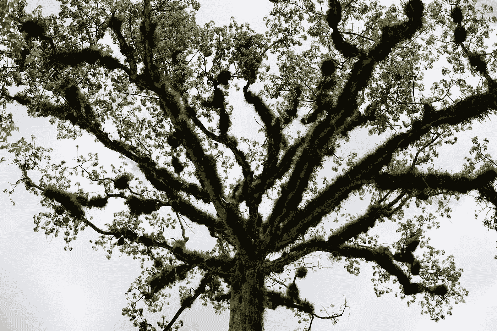

照片由[玛丽莎&埃里克](https://unsplash.com/@emtm17?utm_source=unsplash&utm_medium=referral&utm_content=creditCopyText)在 [Unsplash](https://unsplash.com/?utm_source=unsplash&utm_medium=referral&utm_content=creditCopyText) 上拍摄

***过拟合*** 对于数据科学家来说，这是继缺失值和离群值之后的第二大问题。与其他机器学习模型相比，决策树中的过度拟合很容易发生，因为它们的学习算法可以产生大型复杂的决策树，这些决策树完全适合训练实例。一般来说，过度拟合是当学习算法完美地拟合训练数据但未能对新的看不见的数据(测试/验证数据)进行概括时发生的问题。在过度拟合中，模型正在*记忆*数据集中的噪声，并且未能*学习*数据中的重要模式。过度拟合会影响由不属于训练集的样本做出的预测的准确性(或任何其他模型评估矩阵)。

人们可以在训练数据上以 100%的准确度建立完美的决策树模型，但是在测试数据上的准确度非常低。看看下面的 Python 代码，它在[“heart _ disease”数据集](https://drive.google.com/file/d/1zQ3GzQrhtR4_cwlSbs7pAA34ekGkwz_c/view?usp=sharing)上构建了这样一个决策树模型。

代码片段 1:决策树基础模型(等到加载！)


输出 1(图片由作者提供)

正如您在输出中看到的，训练准确率为 100%，测试准确率为 71%，远低于训练准确率。所以，很明显我们的决策树模型是过拟合的。在本文中，我们将使用这个模型作为基础模型*以便与其他模型进行比较。*

有很多可用的*通用*技术可以减轻或防止机器学习模型中的过拟合问题。然而，在本文中，我们将讨论 4 种特定于决策树的技术。

**注:**如果你想了解更多关于使用决策树进行回归任务的知识，请阅读我写的这篇文章。但是，这并不是今天内容的前提。

# 技术概述

这里是我们将在本帖中讨论的技术的概述。

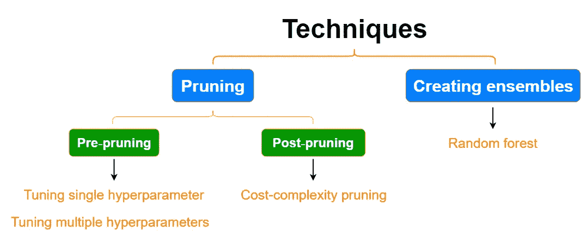

(图片由作者提供)

# 决策树剪枝的一般思想

在一般情况下，*修剪*是指移除树木或植物的特定部分以促进其生长的过程。同样的事情也适用于决策树，它不是真正的树，而是机器学习模型。在决策树中，修剪是用于控制或限制树的深度(大小)的过程。默认情况下，创建决策树模型超参数是为了将树扩展到其最大深度。这些树被称为 ***成年树*** ，它们总是过度生长。然而，我们可以调整这些超参数来生成没有完全生长和没有过度拟合的树！

有两种类型的修剪技术:**预修剪**和**后修剪**

## 预修剪

*预剪枝*是一个早期停止规则，在早期停止决策树的生长。它会生成一棵分枝较少的树。可以通过调整 Scikit-learn**decision tree classifier()**或**decision tree regressor()**类中的以下超参数来应用预修剪。这些超参数指定了停止条件的阈值。

*   **max_depth:** 指定树的最大深度。这控制了分支的复杂性(即进行分割的次数)。如果 *None* (默认)，则节点被扩展，直到所有叶子都是纯的(即以 100%的准确度拟合模型)。减小该值可以防止过度拟合。
*   **min_samples_leaf:** 决定一个叶节点需要的最小样本数。默认值为 1。增加该值可以防止过度拟合。
*   **min_samples_split:** 指定分割内部节点所需的最小样本数。默认值为 2。如果我们将它的值设置为 5，那么不允许对具有 5 个或更少样本的节点进行进一步的分割。

这些超参数中， **max_depth** 是最重要的一个。我们可以通过单独调整 **max_depth** 超参数轻松地对决策树进行预修剪。现在，我们将看到单独使用 **max_depth** 的影响，同时保持其他预修剪超参数的默认值。

## **技术 1:单独调整 max_depth，观察单个超参数的影响**

在不进行网格搜索或随机搜索的情况下，找出单个 **max_depth** 超参数对训练和测试数据的影响有时是有用的。验证曲线是一种非常有用的技术，可用于测量单个超参数的影响。以下代码使用上述决策树基本模型创建验证曲线。请注意，下面的代码是从代码片段 1(见上文)开始的。

代码片段 2:绘制 max_depth 的影响(等到加载！)

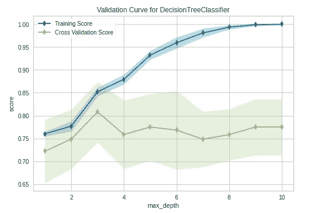

输出 2(图片由作者提供)

注意，在图中，训练集的准确度分数被标记为“训练分数”，测试集的准确度分数被标记为“交叉验证分数”。在 **max_depth** 值为 3 时，模型正好合适(不会过拟合或欠拟合)。该模型非常适合训练数据，并且还可以推广到新的未见过的数据。让我们再次构建决策树，但现在使用 **max_depth=3** ，并将预测与基础模型的预测进行比较。

代码片段 3:创建 max_depth=3 的决策树(等到加载！)

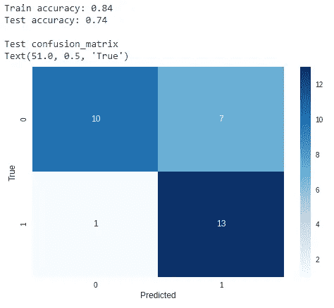

输出 3(图片由作者提供)

与基本模型相比，测试精度从 0.71 提高到 0.74。除此之外，假阴性的数量(将真正的心脏病患者归类为非心脏病患者——这要危险得多！)已显著减少。因此，模型按照我们想要的方式运行。

**注:**如果你想了解更多关于绘制和解释验证曲线的知识，请阅读[我写的这篇文章](/validation-curve-explained-plot-the-influence-of-a-single-hyperparameter-1ac4864deaf8)。

## 技术 2:一次调优多个超参数

有时，单独调整单个超参数可能效率不高。另一种预修剪技术是寻找多个超参数值的新组合，以减轻过拟合。在这种情况下，不能使用验证曲线，因为它被设计用于绘制单个超参数的影响。这里，我们可以使用网格搜索结合交叉验证来一次调优多个超参数。下面的代码使用上面的基本模型执行交叉验证的超参数调整。请注意，下面的代码是从代码片段 1(见上文)开始的。

代码片段 4:一次调优多个超参数(等到加载！)

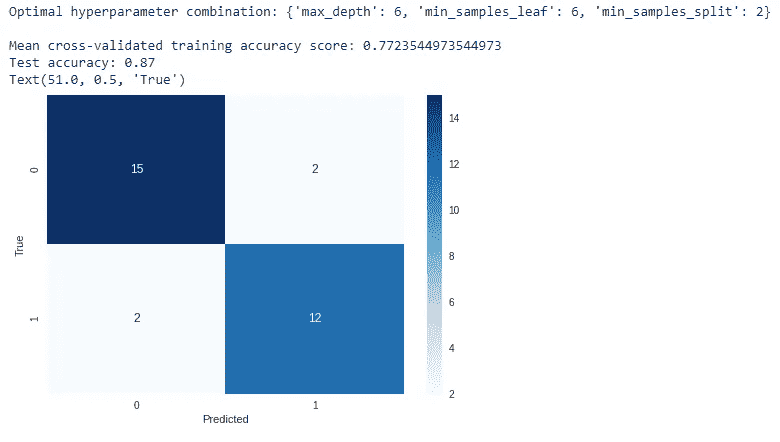

输出 4(图片由作者提供)

与基础模型和之前的 **max_depth=3** 模型相比，测试精度有了显著提高。除此之外，假阳性和假阴性都大大减少了。现在，我们的模型没有过度拟合，测试数据的性能也得到了提高。

**注:**如果你想了解更多关于 k-fold 交叉验证和超参数调优技术的知识，请阅读我写的[这篇帖子](/k-fold-cross-validation-explained-in-plain-english-659e33c0bc0)。

## 修剪后

后剪枝技术允许完整地增长决策树，然后删除它的一部分。

## 技巧 3: **成本复杂度剪枝**

*成本复杂度剪枝(ccp)* 是后剪枝技术的一种。它提供了另一个控制树大小的选项。这可以通过为 **alpha** 找到正确的值来实现，该值在 Scikit-learn 决策树类中通常被称为 **ccp_alpha** 。**CCP _ 阿尔法**的值越大，修剪的节点数量越多。默认情况下，该值为零，表示不执行修剪。

sci kit-learn**decision tree classifier**类提供了一个名为**cost _ complexity _ pruning _ path**的方法，该方法返回一个类似字典的对象，该对象包含 alpha 的有效值(通过**CCP _ 阿尔法**属性访问)以及在修剪过程的每一步子树的相应杂质(通过**杂质**属性访问)。我们可以通过执行以下命令来获得基础决策树模型的 alpha 值:

```
path = dtclf.cost_complexity_pruning_path(X_train, y_train)
ccp_alphas = path.ccp_alphas
ccp_alphas
```

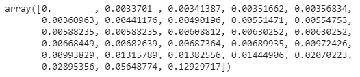

输出 5(图片由作者提供)

现在，我们可以使用这些阿尔法值来修剪我们的决策树。通过循环遍历**CCP _ 阿尔法值**数组，我们将每个阿尔法值传递给**决策树分类器**的**CCP _ 阿尔法值**超参数，然后计算每次迭代的训练和测试准确度分数，并将它们存储在两个列表中。

代码片段 5(等待加载！)

然后，我们绘制训练和测试准确度分数。

代码片段 6:绘制 ccp 阿尔法值与精确度的关系图(等待加载！)

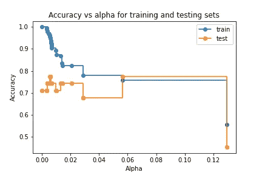

输出 6(图片由作者提供)

通过查看该图，我们可以决定减轻决策树模型中过度拟合的最佳 alpha 值是 **0.06** 。

现在，我们通过设置**CCP _ 阿尔法=0.06** 再次创建决策树。

代码片段 7:创建一个 ccp 阿尔法=0.06 的决策树(等到加载！)

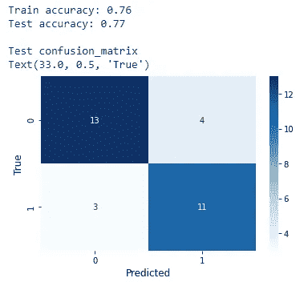

输出 7(图片由作者提供)

与基本模型相比，测试精度从 0.71 提高到 0.77。除此之外，假阳性和假阴性都减少了！现在，我们的模型没有过度拟合，测试数据的性能也有所提高。

我们可以想象修剪后的决策树。

代码片段 8:可视化决策树(等到加载！)

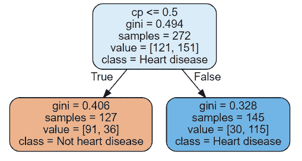

输出 8(图片由作者提供)

现在，我们意识到后期修剪是在幕后进行的，因此如果我们选择第二个大的 alpha 值(或更接近的值)，树会以自下而上的方式进行修剪，直到最大深度为 2。**CCP _ 阿尔法**值越大，**修剪的节点数越多！**

**注:**如果你想了解更多可视化决策树的不同方法，请阅读我写的这篇文章[。](/4-ways-to-visualize-individual-decision-trees-in-a-random-forest-7a9beda1d1b7)

# 创建合奏

另一种减少决策树过度拟合的技术是从训练数据和特征的子集创建多个决策树。这些树的集合称为系综(群)。

## 技术 4:创建随机森林

*随机森林*顾名思义，就是决策树的集合体。一个随机森林中的*不相关*决策树的大集合可以产生比任何单个决策树更准确和稳定的结果。在正常的决策树中，当算法想要分割一个节点时，它从所有特征中搜索最佳特征*。相反，随机森林中的每棵树都从*特征的随机子集*中搜索最佳特征。当在随机森林中种植树木时，这会产生额外的随机性。*

**注:**如果你想了解更多关于随机森林的知识，请看[我写的这个帖子](/random-forests-an-ensemble-of-decision-trees-37a003084c6c)。

下面的代码创建了一个包含 100 棵决策树的随机森林。

代码片段 9:创建一个有 100 棵树的随机森林(等待加载！)

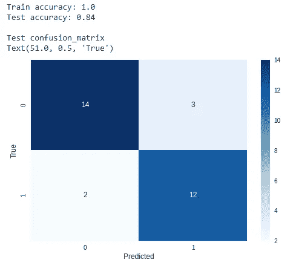

输出 9(图片由作者提供)

即使不调整任何超参数，随机森林模型也比基本模型表现得好！但是，这个模型仍然是过度拟合的。建议应用一些超参数调整技术来进一步减轻过拟合。

# 摘要

我们今天讨论的所有技术只能*减轻*决策树中的过度拟合，但是它们不能完全*防止*过度拟合的问题。决策树是其他基于树的学习器的基础学习器，例如 Random Forest，XGBoost。因此，我们今天讨论的技术几乎也可以应用于那些基于树的学习者。

决策树中的过度拟合很容易发生。正因为如此，决策树很少在建模任务中单独使用。但是，如果您应用适当的超参数调整技术或使用多棵树进行集成，您可以减轻决策树中的过度拟合，甚至在模型构建任务中单独使用它们。

我们在这里使用的模型评估指标是**“准确性”**指标，当目标变量具有 ***类别不平衡*** 时，这不是最佳选择。我们可以检查我们的[“心脏病”数据集](https://drive.google.com/file/d/1zQ3GzQrhtR4_cwlSbs7pAA34ekGkwz_c/view?usp=sharing)的目标变量是否有类别不平衡:

```
import seaborn as sns
sns.catplot("target", data=df, kind="count",
            aspect=1.0, height=4)
```

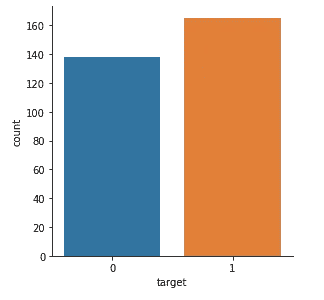

(图片由作者提供)

在我们的目标变量中没有明显的阶级不平衡。

**注:**sci kit-learn 中使用的模型评估指标和评分方法的完整列表可在此处找到[。](https://scikit-learn.org/stable/modules/model_evaluation.html)

感谢阅读！

在 https://rukshanpramoditha.medium.com[阅读我的其他文章](https://rukshanpramoditha.medium.com/)

除封面图片外的所有图片、代码示例、图表及所有内容均归作者版权所有。特别感谢 Unsplash 上的**玛丽莎&埃里克**是封面图片的所有者。非常感谢你，**玛丽莎&埃里克**，为我提供了一张出色的封面图片！

2021–05–16