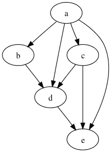

# Apache Beam 中有效调试数据管道的 4 种方法

> 原文：<https://towardsdatascience.com/4-ways-to-effectively-debug-data-pipelines-in-apache-beam-6508a880f0b4?source=collection_archive---------37----------------------->

## 通过在部署到云之前运行单元测试、使用模块化结构以及以编程方式生成唯一标签来节省调试时间

作者图片

Apache Beam 是一个开源框架，对于大规模清理和处理数据非常有用。它对于实时处理流数据也很有用。事实上，你甚至可以在笔记本电脑上用 Apache Beam 进行开发，并部署到 Google Cloud 进行处理(Google Cloud 版本称为 DataFlow)。

除此之外，Beam 还涉足人工智能领域。更正式的说法是，它被用作机器学习管道的一部分，或者用于机器学习模型的自动部署(MLOps)。作为一个具体的例子，Beam 可以用来清除 Twitter 数据中的拼写错误或标点符号，然后将数据发送到机器学习模型，该模型可以确定推文是否代表快乐或悲伤的情绪。

使用 Beam 的一个挑战是如何进行调试，以及如何在笔记本电脑上调试基本功能。在这篇博文中，我将展示 4 种可以帮助你改进调试的方法。

**快速提示:**

这篇博客高度概括了如何调试数据管道。为了更深入的了解，你可能想看一下[这个视频](https://courses.whiteowleducation.com/courses/machine-learning-mastery/lectures/30683503)，它讲述了 Apache Beam 的单元测试；还有[这个视频](https://courses.whiteowleducation.com/courses/machine-learning-mastery/lectures/31386945)，它带你完成了一个基本数据管道的调试过程。

**1)如果安装了依赖库，只运行耗时的单元测试**

如果您使用的是 unittest，那么让测试只在安装了正确的库的情况下运行会很有帮助。在上面的 Python 例子中，我有一个 try 块，它在 Google Cloud 库中寻找一个类。如果找不到该类，将跳过单元测试，并显示一条消息，提示“未安装 GCP 依赖项”

**2)运行本地单元测试时使用测试管道**

Apache Beam 使用一个管道对象来帮助构建一个[有向无环图](https://en.wikipedia.org/wiki/Directed_acyclic_graph) (DAG)的转换。您还可以使用 Apache _ beam . testing . test pipeline，这样在构建基本测试时就可以减少配置工作。

有向无环图的例子(由[https://en.wikipedia.org/wiki/Directed_acyclic_graph](https://en.wikipedia.org/wiki/Directed_acyclic_graph)提供)

**获得关于如何调试数据管道的另外两个技巧。看看**[**https://www . whiteowleduction . com/4-ways-to-effectively-debug-data-pipelines-in-Apache-beam/**](https://www.whiteowleducation.com/4-ways-to-effectively-debug-data-pipelines-in-apache-beam/)