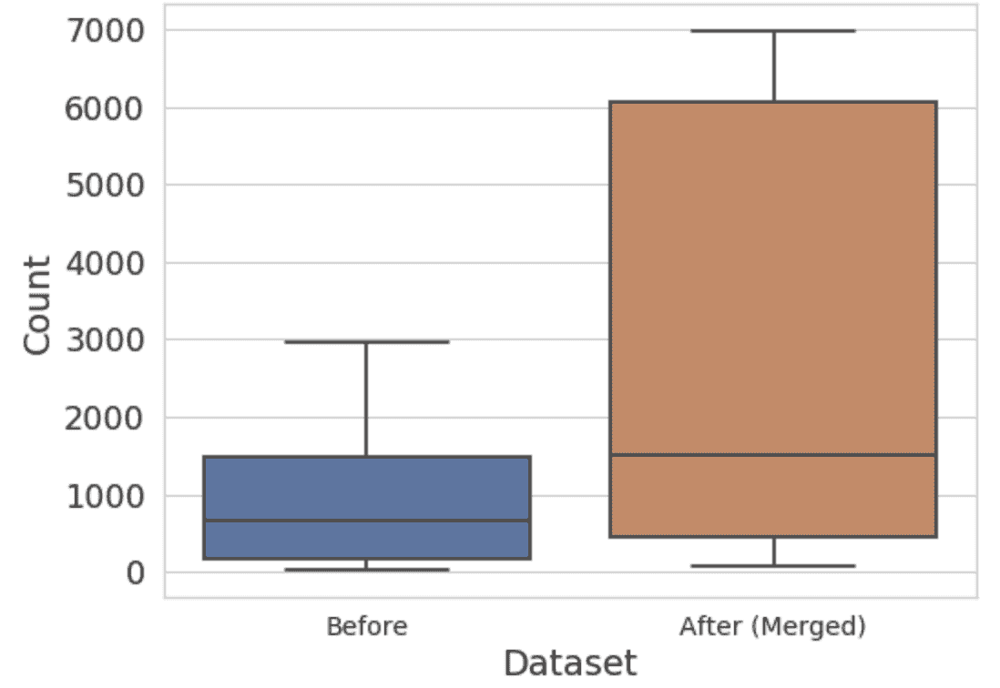

# 改善图像数据类别不平衡的 4 种方法

> 原文：<https://towardsdatascience.com/4-ways-to-improve-class-imbalance-for-image-data-9adec8f390f1?source=collection_archive---------9----------------------->

## [实践教程](https://towardsdatascience.com/tagged/hands-on-tutorials)

## 几种再平衡技术的利弊

对于许多航空影像数据集来说，“建筑物”是一个极其常见的类。(来源:谷歌地球)

一些数据集包含类别不平衡，并且在一些类别中的实例比其他类别中的多得多。如果训练集中的这种不平衡没有反映在实际的数据流中，它会导致机器学习分类期间的平均精度差。

在这篇文章中，我描述了在数据准备和模型准备中结合几种技术的过程，这些技术可以帮助减轻类的不平衡，并在所有类中产生更高的平均精度。

## 之前:不平衡的数据集

在这个例子中，我将完成一个理论项目，为无人机镜头建立一个内容识别模型。作为样本数据，我有 800 张来自谷歌地球的随机图片。50 多个类中有 100 万个对象。

数据集包含不平衡的对象类型。有些课程的频率要高得多，高达 100 倍。

最高和最低代表类别的每个类别的实例。60%的类只有不到 1000 个实例，而最高级别的类有 300，000 个实例。(图片由作者提供)

如果你天真地预测数据集中的一个对象是一个“建筑物”，你有 50%的可能性是正确的。因此，这种阶级不平衡会让你相信你的模型比实际情况要好。

这些设置对于对象检测算法来说是具有挑战性的，因为模型试图减少整个数据集中的分类错误。因此，许多模型更喜欢接近平等的阶级平衡。

这里有几种可能的方法来处理这种不平衡。

## 调整#1:切片而不是缩减像素采样

简而言之，原始图像太大，不适合神经网络的输入层。一张 1200 万像素的无人机图像是 4000 x 3000 像素。输入物体检测器的普通图像尺寸为 512×512 像素或更小。

虽然可以对原始图像进行下采样，但是您会丢失重要的信息，并且对于小对象类，模型的精度会较低。

本示例数据集的少数类都比#1 多数类“建筑物”小得多，因此缩减采样对少数类的影响不成比例。

将原始图像切割成更小的图块是缩减像素采样的替代方法。通过保持全分辨率，我们可以确保较小项目的少数类不会变得更加难以识别。

一个完整图像的示例被切割成 49 个无重叠的图块。(图片来源:谷歌地球)

每个图像被平铺成更小的正方形单元，这些单元可以在保持原始图像分辨率的同时单独输入网络。为了确保跨单幅图块边界分割的对象不会丢失任何信息，您可以在连续单幅图块之间重叠的情况下对图像进行切片(例如 25%重叠)。

> 注意:一些数据集可能包含大小差异较大的对象。您可能希望保留完整的原始分辨率，以便能够识别微小的对象，但也可能有太大的对象，以至于无法容纳在一个单幅图块中。在这种情况下，可能需要使用一些全分辨率切片和一些缩减采样的全图图像来构建训练数据集。

当针对切片数据集进行训练时，我们的模型的[平均精度(mAP)](http://cs230.stanford.edu/section/7/#object-detection-iou-ap-and-map) 比重新调整图像分辨率的数据集版本更高。

缺点:虽然模型可以更好地处理小对象类，但平铺过程会导致更长的训练时间。例如，这种削球方法增加了我们 30%的地图，但也增加了我们 60%的训练时间。

→值得吗？极有可能。

## 调整#2:合并几乎相同的类

有些类别几乎完全相同，例如“固定翼飞机”和“货机”这两个类的平均边界框直径约为 18 像素。低像素项目上的这种级别的类粒度对于模型来说可能很难学习，尤其是在每个类没有很多数据点的情况下。

我们决定将相似的对象合并到一个合并的类中，这减少了类的数量，并稍微减少了类分布的不平衡。

> 注意:最好让具有领域专业知识的人参与进来(我这里没有！)合并标签时。他们不仅可以推荐哪些类应该组合在一起，还可以描述最终用户工作流中原始类必须绝对保留的位置。例如，将“Tank”重新归类为“Truck”可能很诱人，但是用户工作流可能会对“Tank”类采取非常具体的操作。此外，为了帮助简化合并过程，您可以通过识别给模型造成最大混乱的类组来创建一个合并候选列表，以供人工审查。

合并后，我们有了 16 个新的类，而原来有 50 个——但是类的不平衡有多大改善呢？我们来看两个分布。

将少数民族班级合并在一起后，每个班级的平均人数增加意味着难学的班级减少了。(图片由作者提供)

在合并之前，75%的类包含不到 1，500 个实例。在代表性不足的班级合并后，每个班级的平均人数超过了 1，500 人。(图中未显示异常值，包括 426，000 计数的“建筑物”类)。

→值得吗？有可能，但可行性取决于领域和最终用户工作流。

## 调整#3:对特定类进行重采样

克服机器学习中大类不平衡的传统方法是调整训练集中的类表示。

**过采样非频繁类**增加来自少数类的条目，以匹配多数类的数量。这可以通过几种方式来执行，例如通过生成合成数据或通过从少数类中复制条目(例如，通过 [sklearn 的‘重采样’](https://scikit-learn.org/stable/modules/generated/sklearn.utils.resample.html)或 [TensorFlow 的 tf.data 采样器](https://www.tensorflow.org/tutorials/structured_data/imbalanced_data#using_tfdata)或 [PyTorch 的 WeightedRandomSampler](https://pytorch.org/docs/stable/data.html#torch.utils.data.WeightedRandomSampler) )。缺点是它会导致过采样类的过度拟合。

欠采样频繁类是从多数类中移除条目，以便它们与少数类中的数量相匹配。不利的一面是，通过删除数据点，您可能会删除有价值的信息或导致对现实世界数据的泛化能力较差。或者不平衡可能非常严重，以至于欠采样的结果对于数据集来说太小。

过采样与欠采样(图片由作者提供)

> 注意:这两种变化都应该在将数据分成训练集和验证集之后*发生，以确保验证集中的数据不包含在训练集中。*

对于该示例数据集，我们通过在最终训练数据集中选择性地包括切片来实现欠采样。每个图像块中包含的标签被计数并存储在数据帧中。然后，我们创建了一个排序过程来包含或丢弃每个图块。所有包含至少一个少数民族标签实例(除“建筑物”和“小型汽车”之外的任何内容)的图像都包含在训练数据集中。然后，为了完善数据集，我们还包括了 10%的仅包含最频繁类的切片。不包括带有零标签的图块。

按类别划分的对象数量的变化。(图片由作者提供)

**奖励:磁贴治疗也使训练更有效率。**

除了提高少数类的平均精度，我们还减少了训练时间(通过减少数据集大小)，同时只删除了大部分冗余信息。

管理训练中包含哪些图块的另一个好处是，您可以剔除包含零边界框的图块。使用航空摄影，原始全尺寸图像有时可能仅包含 5-10 个注释，这导致大量“空”图块。在太多空瓦片上训练的模型可以学习预测没有边界框作为最优解。

在各种使用案例和内容类型中，许多大规模图像包含可以在训练前移除的死区。例如，查看有多少数字化病理切片是 100%白色的:

来自 [PAIGE.ai](https://paige.ai/) 的数字病理切片示例。

因此，当您拥有保证包含空白的大型原始图像时，通常最好将切片数据集视为新的训练数据。您可以开始探索并通过更精细的控制来清理它。

→值得吗？是的。

## 调整#4:调整损失函数

除了比一些少数阶级多 100 倍的“建筑”阶级，图像的空白背景区域实际上是另一个占主导地位的多数阶级。该模型将看到大量容易分类的负面区域，有时前景与背景的比例为 1:1000。并且当过度表示的类相对容易分类时，它们可以支配整体损失，这操纵梯度下降以优化对那些多数类的检测。

不要平等地对待每个错误，而是把罕见类上的错误看得比普通类上的错误更重要。

作为回应，我们实现了聚焦损失à la FAIR 的[密集物体探测聚焦损失](https://arxiv.org/pdf/1708.02002.pdf)论文。损失函数基于每个对象的预测概率是动态的。[0，5]之间的可调“聚焦参数”`γ'将分类良好的示例的损耗(p > 0.5)推向零。这一变化降低了在总损失项中过度代表的类别的优势。

[来源](https://arxiv.org/pdf/1708.02002.pdf):脸书艾研究(FAIR)

对于合并类数据集，实现焦点损失提高了少数类的平均精度，并保持了多数类相对较好的平均精度。

→值得吗？是的。

## 结论

数据集开始时存在明显的类不平衡并不罕见，对于可能包含大量“空”(或背景)类的图像数据集，这种不平衡会进一步加剧。

如果不考虑代表性不足的类，模型可以达到一个精度上限，在该上限下，多数类很容易预测，但除非采取措施解决类的不平衡并提高少数类的性能，否则整体模型精度可能不会提高。

通常，这意味着数据准备技术(如重新采样)和模型准备技术(如调整损失函数)的组合。这些技术中的一些有缺点，如增加模型训练时间，但通常是值得的，因为它们最终可以产生更高的地图。

数据科学家应该 1)准备好花费时间来缓解类别不平衡，2)期望迭代他们的训练数据集。