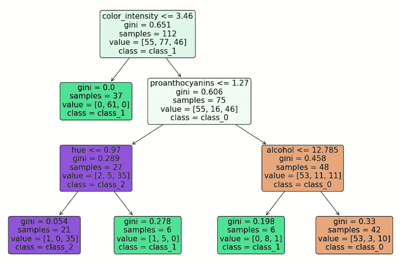
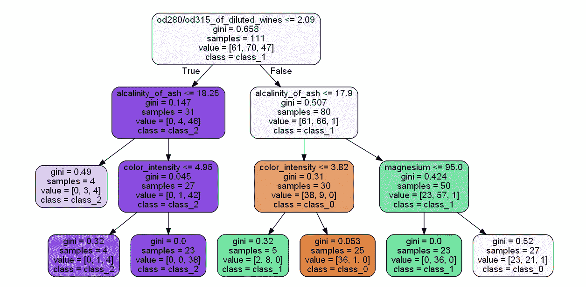
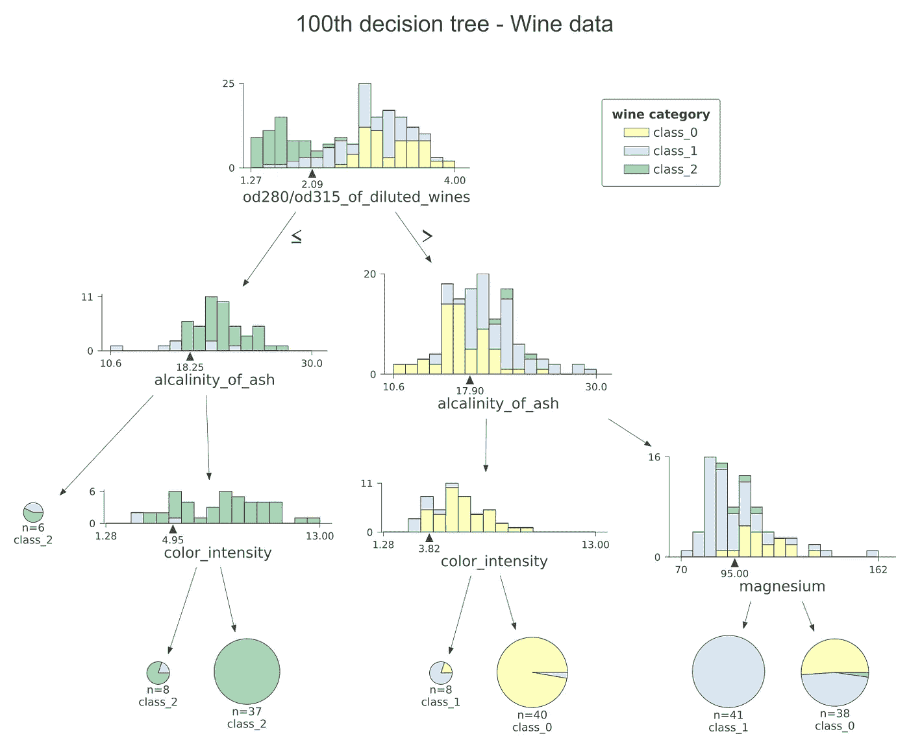
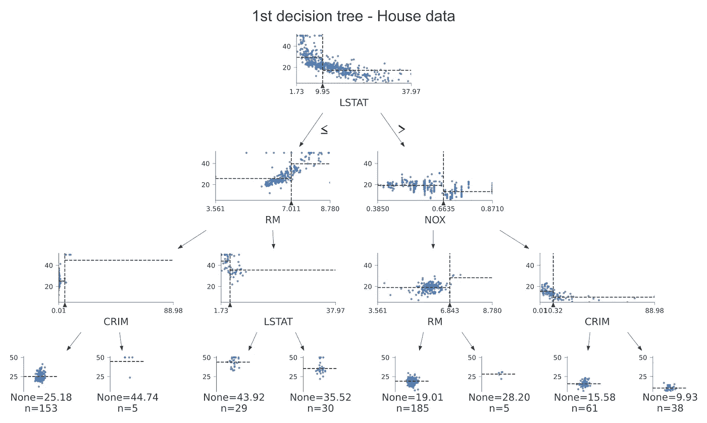
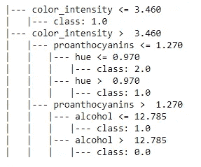

# 在随机森林中可视化单个决策树的 4 种方法

> 原文：<https://towardsdatascience.com/4-ways-to-visualize-individual-decision-trees-in-a-random-forest-7a9beda1d1b7?source=collection_archive---------2----------------------->

## 使用 sklearn、graphviz 和 dtreeviz Python 包实现决策树的可视化


利亚姆·波兹在 [Unsplash](https://unsplash.com/?utm_source=unsplash&utm_medium=referral&utm_content=creditCopyText) 上的照片

数据可视化在数据分析和机器学习领域发挥着关键作用，因为它允许您揭示数据背后的隐藏模式。模型可视化允许您解释模型。如今，可视化过程变得很容易，有了大量可用的 Python 包。

基于树的模型，如决策树、随机森林和 XGBoost，更受监督学习(分类和抑制)任务的欢迎。这是因为这些模型非常适合于现实世界应用中经常使用的非线性数据。

任何基于树的模型的基线模型是 ***决策树*** 。随机森林由多个决策树组成。今天，我们将讨论 4 种不同的方法来可视化随机森林中的单个决策树。请注意，这里讨论的方法通常也适用于任何基于树的模型，而不仅仅是随机森林。我们将使用 **sklearn** 、 **graphviz** 和 **dtreeviz** Python 包，这些包只需几行代码就可以轻松创建可视化效果。

下面是我们今天讨论的 4 种可视化树木的方法。

*   使用**sk learn . tree . plot _ tree()**函数绘制决策树
*   使用**sk learn . tree . export _ graphviz()**函数绘制决策树
*   使用 **dtreeviz** Python 包绘制决策树
*   使用**sk learn . tree . export _ text()**函数打印决策树详细信息

前三种方法以*图*的形式构建决策树。最后一种方法以文本报告的形式构建决策树。

## 先决条件

我推荐你阅读我写的以下内容，因为它们是今天内容的先决条件。

*   [随机森林——决策树的集合](/random-forests-an-ensemble-of-decision-trees-37a003084c6c)
*   [使用决策树训练回归模型](/train-a-regression-model-using-a-decision-tree-70012c22bcc1)
*   [掌握 Scikit 的 9 个指南——中途不放弃的学习](/9-guidelines-to-master-scikit-learn-without-giving-up-in-the-middle-5102863d89d7)

## 基于“葡萄酒数据”构建随机森林模型

在讨论以上 4 种方法之前，首先，我们在“葡萄酒数据”上建立一个随机森林模型。该模型可用作上述 4 种方法的输入。“葡萄酒数据集”在 Scikit-learn 内置数据集中提供。

等到加载 Python 代码！

**X** 是特征矩阵， **y** 是标签列。“葡萄酒数据”有 3 个类别标签，分别命名为**、【class_0】、**、**、【class_1】、**、【class_2】、**。 **X** 和 **y** 都用作随机森林模型的输入。由于这是一个分类任务，我们在“葡萄酒数据”上构建了一个**RandomForestClassifier()**。对于回归任务，可以使用**RandomForestRegressor()**。**

等到加载 Python 代码！

该模型现已安装在“葡萄酒数据”上，可通过 ***rf*** 变量访问。

## 访问随机森林中的单个决策树

随机森林中的树木数量由**RandomForestClassifier()**或**RandomForestRegressor()**类中的 **n_estimators** 参数定义。在上面我们建立的模型中，有 100 棵树。可以从以下位置访问每棵树:

```
rf.estimators_[index]
```

***rf*** 是随机森林模型。这里， ***指标*** 取值范围为 0-99(含)。0 表示第一个决策树。99 代表最后一个。

# 使用**sk learn . tree . plot _ tree()**函数绘制决策树

这是可视化决策树的最简单和最容易的方法。你不需要安装任何特殊的 Python 包。如果您已经安装了 Anaconda，那么一切都准备好了！此功能不会自动调整图形的大小。所以更大的决策树的较量也不会很明确。为了避免这种情况，你必须使用**图形**的**图形尺寸**参数来控制图形尺寸。

让我们使用这种方法绘制随机森林模型中的第一个决策树(通过索引 0 访问)。

等到加载 Python 代码！



第一个决策树的结构(图片由作者提供)

您可以通过运行以下命令将图形保存为 PNG 文件:

```
fig.savefig('figure_name.png')
```

要了解更多关于**sk learn . tree . plot _ tree()**函数的参数，请阅读其[文档](https://scikit-learn.org/stable/modules/generated/sklearn.tree.plot_tree.html)。

# 使用**sk learn . tree . export _ graphviz()**函数绘制决策树

与前一种方法相比，这种方法有优点也有缺点。优点是该功能可以自动调整图形的大小。因此，在绘制更大的树时，您无需担心这个问题。缺点是您应该通过在 Anaconda 命令提示符下运行以下命令来安装 Graphviz Python 包。

```
pip install graphviz
```

如果这对你不起作用，试试下面这个:

```
conda install -c anaconda graphviz
```

让我们使用 ***Graphviz*** 绘制随机森林模型中的最后一棵决策树(由索引 99 访问)。

等到加载 Python 代码！



最后一棵决策树的结构(图片由作者提供)

您可以通过运行以下命令来保存该数字:

```
graph.render('figure_name')
```

现在，图形将被保存为 PNG 文件，因为我们在 **graphviz 中指定了 format="png"。Source()** 函数。如果指定 format="pdf "，图表将保存为 pdf 文件。

# 使用 **dtreeviz** Python 包绘制决策树

***dtre eviz***Python 包可以用来绘制决策树。它创造了一些很好的视觉效果。让我们看看它们在分类和回归数据集上的作用。

在此之前，您需要通过运行以下代码行在您的 Anaconda 环境中安装 ***dtreeviz*** :

```
pip install dtreeviz
```

如果在您的 Anaconda 环境中运行 ***dtreeviz*** 时由于路径问题出现错误，不如在 ***Google Colab*** 笔记本环境中使用 ***dtreeviz*** 。运行下面一行代码在那里安装 ***dtreeviz*** 。

```
!pip install dtreeviz
```

现在，您已经准备好在您自己的 ***Colab*** 环境中运行 ***dtreeviz*** 。

## Dtreeviz 在分类数据集上绘制决策树

现在，我们使用 ***dtreeviz*** 来绘制建立在用于*分类*的“葡萄酒数据集”上的随机森林模型的最后一棵决策树。这是代码。

等到加载 Python 代码！

运行上述代码后，会出现一个弹出窗口，要求将 SVG 文件保存到您的计算机上。你可以使用这个[免费在线转换器](https://cloudconvert.com/svg-to-png)将 SVG 文件转换成 PNG 文件。在**像素密度**框中设置较高的值(如 250)以获得高分辨率图像。



(图片由作者提供)

## Dtreeviz 在回归数据集上绘制决策树

现在，我们使用 ***dtreeviz*** 来绘制建立在用于*回归*的“波士顿房价数据集”上的随机森林模型的第一棵决策树。这是代码。

等到加载 Python 代码！

运行上述代码后，会出现一个弹出窗口，要求将 SVG 文件保存到您的计算机上。你可以使用这个[免费在线转换器](https://cloudconvert.com/svg-to-png)将 SVG 文件转换成 PNG 文件。在**像素密度**框中设置较高的值(如 250)以获得高分辨率图像。



(图片由作者提供)

# 使用**sk learn . tree . export _ text()**函数打印决策树详细信息

与前 3 种方法相比，这种方法以*文本报告*的形式构建决策树。

让我们使用这种方法打印随机森林模型中第一个决策树(通过索引 0 访问)的决策树细节。

等到加载 Python 代码！



第一个决策树的文本报告(图片由作者提供)

细节和我们用**sk learn . tree . plot _ tree()**函数得到的图一模一样。

# 摘要

**sklearn** 、 **graphviz** 和 **dtreeviz** Python 包提供了绘制决策树的高级函数。sklearn 函数更容易使用，并给出详细的可视化效果。 **graphviz** 和 **dtreeviz** Python 包应该在使用前单独安装。在您的 Anaconda 环境中运行 ***dtreeviz*** 时，您可能会由于路径问题而得到一个错误。所以在 ***Google Colab*** 笔记本环境下最好使用 ***dtreeviz*** 。与其他方法相比，dtreeviz 创建了一些不错的可视化效果。我最喜欢的是*。你最喜欢哪一个？写在评论区。也请通过写你的有价值的反馈让我知道我做得如何，以便我可以基于它们开发我未来的内容。*

*感谢阅读！*

*本教程由[*Rukshan Pramoditha*](https://www.linkedin.com/in/rukshan-manorathna-700a3916b/)*，*数据科学 365 博客作者设计创作。*

*在[https://rukshanpramoditha.medium.com](https://rukshanpramoditha.medium.com/)阅读我的其他文章*

*2021–05–07*