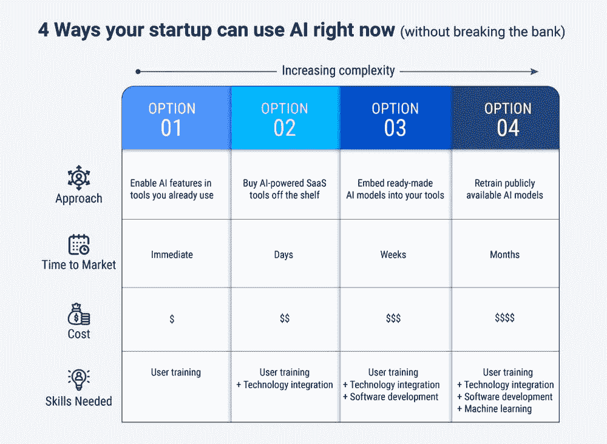

# 你的初创公司现在可以使用人工智能的 4 种方式(不需要倾家荡产)

> 原文：<https://towardsdatascience.com/4-ways-your-startup-can-use-ai-right-now-without-breaking-the-bank-9f1323cbb835?source=collection_archive---------30----------------------->

比尔·杰伦在 [Unsplash](https://unsplash.com/?utm_source=unsplash&utm_medium=referral&utm_content=creditCopyText) 上的照片

## 你不需要大笔预算、数据科学家，甚至不需要几个月的努力——如今，你的初创公司可以通过 4 种方式成为人工智能驱动的公司

*更新:你可以在* [*日文*](https://ainow.ai/2022/02/28/262333/) *阅读这篇文章(感谢 Koki Yoshimoto！)*

计算机科学家吴恩达称人工智能为“新电力”然而，尽管它的能力和吸引力，人工智能并不适合每一种情况。在我之前的文章中，我提出了 5 种避免投资人工智能的场景。要想知道你的初创公司是否需要人工智能，先从优先考虑你的业务问题开始。制定解决这些挑战的最佳方法，并评估技术如何帮助您。大多数时候，基本的分析、统计或简单的机器学习可以有效地完成这项工作。

一些情况确实保证了人工智能的马力。在这些情况下，额外的智能和自动化可以为您的创业带来变革。本文就是针对这些情况的。

当你感觉到需要时，下一个常见的问题是“我真的需要一大笔预算来使用人工智能吗？”不，你的企业不需要几个月的努力、精英数据科学家，甚至是大笔预算就能成为人工智能驱动的。

以下是你的初创公司或 SME(中小型企业)今天可以开始使用人工智能的 4 种方式。这些建议是从最容易到最难排序的，所以从最上面开始，找出最符合你需求的选项。

# 1.在您已经使用的工具中启用人工智能功能

人工智能无处不在。你的智能手机可能至少有十几个使用人工智能的应用程序。这项技术使您的相机能够拍摄更好的照片，帮助组织您的照片，并为您策划的社交订阅源提供动力。

大多数企业工具都在为自己的产品添加人工智能驱动的功能。微软已经在 Excel 中加入了一些人工智能功能。当你插入来自[截图](https://support.microsoft.com/en-us/office/insert-data-from-picture-3c1bb58d-2c59-4bc0-b04a-a671a6868fd7)的数据，或者利用 Excel 中创意面板建议的见解时，你就是在使用人工智能。Salesforce 已经整合了其人工智能引擎 [Einstein](https://www.salesforce.com/products/einstein/overview/) ，作为其流行的 CRM(客户关系管理)平台的智能助手。虽然一些公司将人工智能功能捆绑到他们的核心产品中，但其他公司可能需要升级。

询问供应商你买的软件是否有人工智能功能。你现有的工具集可能已经是人工智能驱动的，或者可以快速升级。

*该选项中的 5 个热门工具:* [MS Office](https://www.microsoft.com/en-us/ai/intelligent-apps) ， [Google for Business](https://workspace.google.com/) ， [Dropbox](https://www.dropbox.com/) ， [Github](https://goodfirstissue.dev/) ， [Mixmax](http://mixmax.com/)

照片由[你好我是尼克](https://unsplash.com/@helloimnik?utm_source=unsplash&utm_medium=referral&utm_content=creditCopyText)在 [Unsplash](https://unsplash.com/?utm_source=unsplash&utm_medium=referral&utm_content=creditCopyText)

# 2.购买现成的人工智能驱动的 SaaS 工具

今天，有太多的 SaaS(软件即服务)工具可以按月支付。你想润色你的营销文案吗？Grammarly 的俏皮编辑功能可以帮你覆盖好的领域。想要转录您的客户评价视频或进行专业级媒体编辑吗？Descript 的人工智能特性可以让这变得轻而易举。

当您有未满足的业务需求时，寻找由智能功能驱动的功能性 SaaS 工具。它们中的大多数都提供了现成的集成，可以轻松地插入到您现有的 IT 生态系统中。即使他们不是完美的组合，重要的是他们是否能解决你的大部分问题。如果是这样，你可以避免为类似的人工智能能力投资昂贵的企业许可证。

根据您的关键需求评估可用的工具。找出匹配的程度和集成的难易程度。如果结果超过可接受的阈值，您可以继续。

*该选项的 5 个流行工具:* [Zoho Zia](https://www.zoho.com/zia/) ， [Trello](https://trello.com/) ， [Grammarly](https://www.grammarly.com/) ， [Descript](https://www.descript.com/) ， [WaveApps](https://www.waveapps.com/rebrand/machine-learning)

照片由 [Yogi Purnama](https://unsplash.com/@yogipurnama?utm_source=unsplash&utm_medium=referral&utm_content=creditCopyText) 在 [Unsplash](https://unsplash.com/photos/8yCmQODY2SY?utm_source=unsplash&utm_medium=referral&utm_content=creditCopyText) 上拍摄

# 3.将现成的人工智能模型嵌入到您的工具中

当你找不到内置智能的工具时，下一个最佳选择是在云中寻找可以连接到你的工具的 AI 模型。例如，如果你试图找出产品中的制造缺陷，你可以使用人工智能来自动化视觉检查。 [Amazon Lookout for Vision](https://aws.amazon.com/lookout-for-vision/) 是一种基于云的机器学习(ML)服务，可以直接插入到你的工作流程中。

与前面的步骤不同，这一步需要 DevOps(软件开发和 IT 运营)能力。虽然你不需要数据科学家，但你的团队必须具备编程专业知识，才能将你的软件应用与在线 AI 模型联系起来。请注意订阅费用，它通常基于使用量。

为了探索这个选项，识别在线 ML 平台，这些平台有预先构建的人工智能模型来解决你的领域问题。这个领域有来自 Clarifai、Dialogflow 和 SightHound 等有前途的初创公司的产品，以及微软、谷歌和亚马逊等较大的参与者。

*该选项的 5 个热门平台:***[AWS 上的 ML](https://aws.amazon.com/machine-learning/)、 [Azure ML](https://azure.microsoft.com/en-us/services/cognitive-services/) 、 [Google Cloud ML](https://cloud.google.com/products/ai) 、 [Clarifai](https://www.clarifai.com/) 、 [Sighthound](https://www.sighthound.com/)**

****

**在 [Unsplash](https://unsplash.com/?utm_source=unsplash&utm_medium=referral&utm_content=creditCopyText) 上由[伊琳娜·麦卡伊洛娃](https://unsplash.com/@irynamykhaylova?utm_source=unsplash&utm_medium=referral&utm_content=creditCopyText)拍摄的照片**

# **4.重新训练公开可用的人工智能模型**

**当你穷尽了上述选项时，是时候使用数据科学家在内部训练人工智能模型了。你可以通过重用公开可用的人工智能算法和易于管理的数据集来节省精力，而不是从头开始。它们可以用来解决你的问题。**

**假设你的初创公司需要通过分析客户调查的文本反馈来了解客户满意度。你需要具有自然语言处理(NLP)能力的算法。与其煞费苦心地训练新的人工智能模型，你的团队可以建立在公共竞赛中获奖模型的工作基础上，如 [Kaggle](https://www.kaggle.com/) 、 [DrivenData](http://drivendata.org/) 或 [AICrowd](https://www.aicrowd.com/) 。**

**互联网上最好的东西往往是免费的，但找到它们需要时间。寻找像 [HuggingFace](https://huggingface.co/) 这样的开放库，它们发布带有预训练权重的模型，或者像 [PapersWithCode](https://paperswithcode.com/) 这样的社区，它们将 ML 模型公之于众。大多数这些网站共享丰富的、经过筛选的数据，为您的模型构建过程提供一个快速启动。让您的团队评估调整公共模型所需的工作，并确定在生产中维护它们的成本。**

***该选项的 5 个热门来源:* [HuggingFace](https://huggingface.co/) ， [AllenAI](https://allenai.org/) ， [RasaHQ](https://github.com/RasaHQ/rasa) ， [Kaggle](https://www.kaggle.com/) ， [DrivenData](http://drivendata.org/)**

****

**由 [Kelly Sikkema](https://unsplash.com/@kellysikkema?utm_source=unsplash&utm_medium=referral&utm_content=creditCopyText) 在 [Unsplash](https://unsplash.com/?utm_source=unsplash&utm_medium=referral&utm_content=creditCopyText) 上拍摄的照片**

# **人工智能驱动是一个旅程，而不是目的地**

**我们已经看了 4 种你可以开始使用人工智能并充分利用你的资源的方法。虽然开始人工智能之旅通常很容易，但获得一致的商业价值将需要持续的关注和投资。**

**你需要培训你的用户，重组你的组织工作流程，并管理与人工智能相关的文化变革。定期重新评估人工智能投资的总拥有成本(TCO)至关重要。今天对你有效的选择可能在一年后变得昂贵。**

**例如，订阅人工智能驱动的 SaaS 工具(选项#2)可能适合服务于初始客户群的小团队。随着您的团队规模的扩大和使用量的增加，订阅成本可能会变得过高。在那个阶段，你可能会发现雇佣一个小型数据科学家团队并重新训练公开可用的人工智能模型更经济(选项#4)。**

**为了简化您的人工智能决策，这里有一个可供您选择的选项摘要:**

****

**总结:你的初创公司现在可以使用人工智能的 4 种方式(图片由 [Gramener](https://gramener.com/) 拍摄)**

***本文最初发表于* [*企业家*](https://www.entrepreneur.com/article/372780) *。增加了插图。***