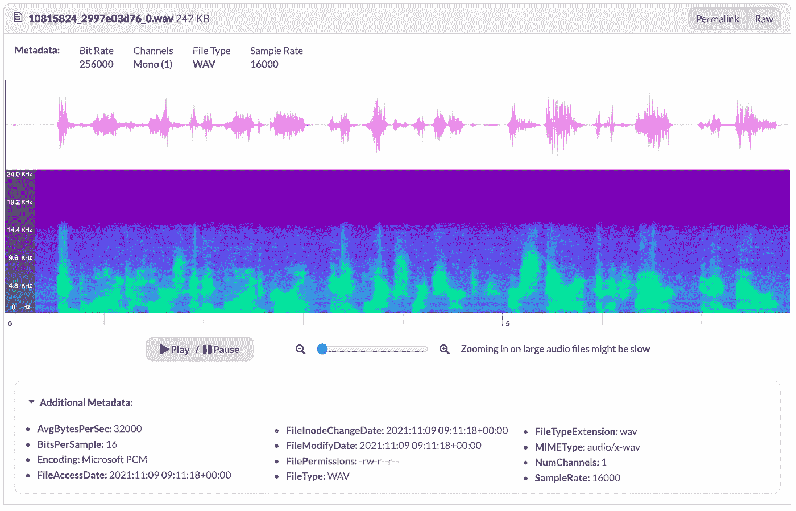

# 40 个用于 ML 的开源音频数据集

> 原文：<https://towardsdatascience.com/40-open-source-audio-datasets-for-ml-59dc39d48f06?source=collection_archive---------1----------------------->

## 超过 2tb 的带标签的音频数据集在 DagsHub 上公开提供并可解析

十月已经过去，DagsHub 的 Hacktoberfest 挑战赛也结束了。当宣布挑战时，我们没有想到我们会带着近 [40 个新的音频数据集](https://github.com/DAGsHub/audio-datasets)到达终点线，这些数据集在 DagsHub 上公开提供并可解析！我们的社区创造了奇迹，在如此短的时间内完成了如此出色的工作，这是巨大的荣誉。同时，感谢[数字海洋](https://www.digitalocean.com/)、 [GitHub](https://github.com/) 和 [GitLab](https://about.gitlab.com/) 组织此次活动。

今年，我们将重点放在音频领域。为此，我们改进了 DagsHub 的音频目录功能。现在，您可以收听 DagsHub 上托管的样本，而无需在本地下载任何内容。对于每个样本，您可以获得额外的信息，如波形、光谱图和文件元数据。最后但并非最不重要的一点是，数据集由 DVC 进行版本化，因此易于改进并随时可用。

作者图片

为了让音频从业者更容易找到他们正在寻找的数据集，我们收集了 Hacktoberfest 对这篇文章的所有贡献。我们有来自七个(！idspnonenote)的数据集。)不同的语言，不同的领域，不同的来源。如果您对这里缺少的数据集感兴趣，请[让我们知道](https://discord.gg/qyFqqnwg)，我们将确保添加它。

尽管为期一个月的虚拟节日已经结束，我们仍然欢迎对开源数据科学的贡献。如果你想丰富 DagsHub 上的音频数据集，我们很乐意在这个过程中支持你！请通过我们的 [Discord](https://discord.gg/qyFqqnwg) 频道了解更多详情。

2022 年黑客啤酒节上见🍻

# [表演情感语音动态数据库](https://dagshub.com/kingabzpro/Acted-Emotional-Speech-Dynamic-Database)

表演情感语音动态数据库(AESDD)是一个公开可用的语音情感识别数据集。它包含了用希腊语表达情感的话语。它被分为两个主要类别，一个包含行为情感言语的话语，另一个控制自发的情感言语。你可以通过[向网站提交情感演讲的录音](https://speechemotionrecognition.xyz/)来为这个数据集做出贡献。它们将被验证并公开提供用于非商业研究目的。

*   供稿:[阿比德·阿里·阿万](https://www.linkedin.com/in/1abidaliawan/)
*   [原始数据集](http://m3c.web.auth.gr/research/aesdd-speech-emotion-recognition/)

# [阿拉伯语语音语料库](https://dagshub.com/mert.bozkirr/Arabic-Speech-Corpus)

阿拉伯语语音语料库是南安普敦大学的 Nawar Halabi 博士工作的一部分。该语料库是使用专业工作室用南黎凡特阿拉伯语(大马士革口音)录制的。使用该语料库作为输出的合成语音产生了高质量的自然声音。

*   供稿人:[梅尔特·博兹克尔](https://www.linkedin.com/in/mertbozkir/)
*   [原始数据集](http://en.arabicspeechcorpus.com/)

# [Att-hack:法语表达演讲](https://dagshub.com/L-theorist/Att-HACK)

这些数据是用法语表达的演讲，100 个短语，在四种社会态度中有多种版本/重复(3 到 5):友好、疏远、支配和诱惑。本研究得到了法国 Ph2D/IDF 关于言语态度建模及其在表达性会话主体中的应用项目的支持，并得到了法兰西岛地区的资助。这个数据库为 2020 年东京语音韵律会议带来了一份出版物。关于更详细的描述，请看的研究文章。

*   供稿人:[菲利普·列维科夫](https://www.linkedin.com/in/flevikov/)
*   [原始数据集](https://gitlab.com/nicolasobin/att-hack/-/blob/master/README.md)

# [音频 MNIST](https://dagshub.com/mert.bozkirr/AudioMNIST)

这个存储库包含用于解释和说明深度神经网络的代码和数据，用于对音频信号进行分类。该数据集由来自 60 个不同说话者的 30，000 个语音数字(0-9)的音频样本组成。此外，它还保存了`audioMNIST_meta.txt`，它提供了元信息，比如每个说话者的性别或年龄。

*   供稿:[梅尔特·博兹克尔](https://www.linkedin.com/in/mertbozkir/)
*   [原始数据集](https://github.com/soerenab/AudioMNIST)

# [BAVED:基本的阿拉伯声乐情感](https://dagshub.com/kinkusuma/basic-arabic-vocal-emotions-dataset)

基础阿拉伯语声乐情感数据集(BAVED)包含以音频/ `wav`格式记录的不同情感水平拼写的 7 个阿拉伯语单词。每个单词都记录了三个层次的情绪，如下:

*   0 级——说话者表达的是低水平的情感。这类似于感到疲倦或情绪低落。
*   级别 1——说话者表达中性情绪的“标准”级别。
*   第二级——说话者表达了高度的积极或消极情绪。
*   供稿人:[金龟子](https://dagshub.com/kinkusuma)
*   [原始数据集](https://www.kaggle.com/a13x10/basic-arabic-vocal-emotions-dataset)

# [鸟音检测](https://dagshub.com/kingabzpro/Bird-Audio-Detection-challenge)

这个数据集是由伦敦玛丽女王大学的机器听力实验室与 T2 的 IEEE 信号处理协会合作主办的一项挑战的一部分。它包含在真实的生物声学监测项目中收集的数据集和一个客观、标准化的评估框架。DagsHub 上举办的 [freefield1010](https://arxiv.org/abs/1309.5275) 收集了来自世界各地的 7000 多段现场录音，由 [FreeSound](http://freesound.org/) 项目收集，然后标准化用于研究。这个集合在地点和环境上非常多样化。

*   供稿人:[阿比德·阿里·阿万](https://www.linkedin.com/in/1abidaliawan/)
*   [原始数据集](http://machine-listening.eecs.qmul.ac.uk/bird-audio-detection-challenge/)

# [报时回家](https://github.com/DAGsHub/audio-datasets/tree/main/CHiME-Home)

CHiME-Home 数据集是带注释的家庭环境音频记录的集合。音频记录最初是为[钟声项目](https://www.semanticscholar.org/paper/The-CHiME-corpus%3A-a-resource-and-a-challenge-for-in-Christensen-Barker/7e6acdbbe3b5512cb3bb220c7083a222c97ef136)制作的。在 CHiME-Home 数据集中，基于与声学环境中的声源相关联的一组 7 个标签，每个 4 秒音频块与多个标签相关联。

*   供稿人:[阿比德·阿里·阿万](https://www.linkedin.com/in/1abidaliawan/)
*   [原始数据集](https://archive.org/details/chime-home)

# [CMU-多模式 SDK](https://dagshub.com/michizhou/CMU-MOSI)

CMU-MOSI 是多模态情感分析的标准基准。它特别适合于训练和测试多模态模型，因为大多数多模态时态数据的最新作品都在他们的论文中使用该数据集。它保存了 65 小时的注释视频，来自 1000 多名发言者，250 个话题，以及 6 种情绪(快乐，悲伤，愤怒，恐惧，厌恶，惊讶)。

*   供稿:[迈克尔·周](https://www.linkedin.com/in/michizhou)
*   [原始数据集](https://www.amir-zadeh.com/datasets)

# [CREMA-D:众包情感多模态演员](https://dagshub.com/mert.bozkirr/CREMA-D)

[CREMA-D](https://www.ncbi.nlm.nih.gov/pmc/articles/PMC4313618/) 是由 91 位演员的 7442 个原创片段组成的数据集。这些片段来自年龄在 20 至 74 岁之间的 48 名男性和 43 名女性演员，他们来自不同的种族和民族(非洲裔美国人、亚洲人、高加索人、西班牙人和未指明的人)。演员们从精选的 12 个句子中发言。这些句子使用了六种不同的情绪(愤怒、厌恶、恐惧、快乐、中性和悲伤)和四种不同的情绪水平(低、中、高和未指明)。参与者根据组合的视听演示、单独的视频和单独的音频对情绪和情绪水平进行评级。由于需要大量的评级，这项工作是众包的，共有 2443 名参与者每人对 90 个独特的剪辑进行评级，30 个音频，30 个视觉和 30 个视听。

*   供稿:[梅尔特·博兹克尔](https://www.linkedin.com/in/mertbozkir/)
*   [原始数据集](https://github.com/CheyneyComputerScience/CREMA-D)

# [儿歌](https://dagshub.com/kinkusuma/children-song-dataset)

儿歌数据集是一个开源的歌唱声音研究数据集。该数据集包含由一名韩国女职业流行歌手演唱的 50 首韩语和 50 首英语歌曲。每首歌都是用两个独立的音调录制的，总共有 200 首录音。每个音频记录都配有一个 MIDI 转录和歌词注释，既有字形层次，也有音素层次。

*   供稿人:[金龟子](https://dagshub.com/kinkusuma)
*   [原始数据集](https://zenodo.org/record/4785016#.YYkpOtZBxqv)

# [装置并产生语音](https://dagshub.com/kinkusuma/daps-dataset)

[DAPS](https://ieeexplore.ieee.org/document/6981922) (设备和制作的语音)数据集是专业制作的录音室语音记录和现实环境中普通消费设备(平板电脑和智能手机)上相同语音记录的对齐版本的集合。它有 15 个音频版本(3 个专业版本和 12 个消费设备/现实环境组合)。每个版本由大约 4 个半小时的数据组成(20 个演讲者中每个人大约 14 分钟)。

*   供稿人:[金龟子](https://dagshub.com/kinkusuma)
*   [原始数据集](https://archive.org/details/daps_dataset)

# [深声刻画人物](https://dagshub.com/L-theorist/Deeply_Nonverbal_Vocalization_Dataset)

后者是一个人类非语言人声声音数据集，由来自 1419 个发言者的 56.7 小时的短片组成，由韩国的普通公众众包。此外，数据集包括元数据，如年龄、性别、噪音水平和话语质量。该报告仅包含 723 个话语(大约。1%)并在 [CC BY-NC-ND 4.0](http://creativecommons.org/licenses/by-nc-nd/4.0/) 下免费使用。要在更严格的许可下访问完整的数据集，请联系 [deeplyinc](http://deeplyinc.com/us) 。

*   供稿人:[菲利普·列维科夫](https://www.linkedin.com/in/flevikov/)
*   [原始数据集](https://dagshub.com/L-theorist/Deeply_Nonverbal_Vocalization_Dataset/src/master/Deeply%20Nonverbal%20Vocalization%20Dataset%20description_Eng.pdf)

# [EMODB](https://dagshub.com/kinkusuma/emo-db)

EMODB 数据库是免费提供的德国情感数据库。这个数据库是由柏林技术大学通信科学研究所创建的。十名专业发言人(五名男性和五名女性)参与了数据记录。该数据库包含总共 535 个话语。EMODB 数据库包含七种情绪:愤怒、厌倦、焦虑、快乐、悲伤、厌恶和中性。数据以 48 kHz 的采样速率记录，然后下采样至 16 kHz。

*   供稿人:[金龟子](https://dagshub.com/kinkusuma)
*   [原始数据集](http://emodb.bilderbar.info/index-1280.html)

# [EMOVO 文集](https://dagshub.com/kingabzpro/EMOVO)

EMOVO 语料库数据库由 6 名演员的声音构建而成，他们播放了 14 句模拟六种情绪状态(厌恶、恐惧、愤怒、喜悦、惊讶、悲伤)和中性状态的句子。这些情绪是众所周知的，在大多数与情绪化语言相关的文献中都可以找到。这些录音是在 Fondazione Ugo Bordoni 实验室用专业设备制作的。

*   供稿:[阿比德·阿里·阿万](https://www.linkedin.com/in/1abidaliawan/)
*   [原始数据集](http://voice.fub.it/activities/corpora/emovo/index.html)

# [ESC-50:环境声音分类](https://dagshub.com/kinkusuma/esc50-dataset)

ESC-50 数据集是 2000 个环境音频记录的标记集合，适用于环境声音分类的基准方法。该数据集由 5 秒长的记录组成，这些记录被组织成 50 个语义类别(每个类别 40 个示例)，大致分为 5 个主要类别:

*   动物。
*   自然声景和水声。
*   人类的，非言语的声音。
*   室内/家庭声音。
*   室外/城市噪音。

该数据集中的剪辑是从[Freesound.org 项目](http://freesound.org/)收集的公共现场记录中手动提取的。数据集已经预先安排到五个文件夹中，以便进行可比较的交叉验证，确保来自同一原始源文件的片段包含在一个文件夹中。

*   供稿人:[金龟子](https://dagshub.com/kinkusuma)
*   [原始数据集](https://github.com/karolpiczak/ESC-50)

# [EmoSynth:情感合成音频](https://dagshub.com/kingabzpro/EmoSynth)

EmoSynth 是一个由 144 个音频文件组成的数据集，大约 5 秒长，430 KB 大小，40 名听众根据他们对效价和唤醒维度的感知情绪对其进行了标记。它有关于音频分类的元数据，基于效价和唤醒的维度。

*   供稿人:[阿比德·阿里·阿万](https://www.linkedin.com/in/1abidaliawan/)
*   [原始数据集](https://zenodo.org/record/3727593#.YYkxINZBxqu)

# [爱沙尼亚情感演讲文集](https://dagshub.com/kingabzpro/Estonian-Emotional-Speech-Corpus)

爱沙尼亚情感演讲团是在“2006-2010 年爱沙尼亚语言技术支持”国家方案框架内，在[爱沙尼亚语言学院](https://www.eki.ee/EN/)创建的一个团体。该语料库包含 1234 个表达愤怒、喜悦和悲伤或中性的爱沙尼亚句子。

*   供稿人:[阿比德·阿里·阿万](https://www.linkedin.com/in/1abidaliawan/)
*   [原始数据集](https://metashare.ut.ee/repository/download/4d42d7a8463411e2a6e4005056b40024a19021a316b54b7fb707757d43d1a889/)

# [Flickr 8k 音频字幕语料库](https://dagshub.com/michizhou/Flickr-Audio-Caption-Corpus)

Flickr 8k 音频字幕语料库包含 40，000 个语音字幕。`wav`音频格式，原始语料库中的训练、开发和测试分割中包含的每个字幕一个。音频采样频率为 16000 Hz，深度为 16 位，并以 Microsoft WAVE 音频格式存储。

*   供稿:[迈克尔·周](https://www.linkedin.com/in/michizhou)
*   [原始数据集](https://groups.csail.mit.edu/sls/downloads/flickraudio/downloads/flickr_audio.tar.gz)

# [Golos:俄语 ASR](https://dagshub.com/L-theorist/Golos)

[Golos](https://dagshub.com/L-theorist/Golos/src/master/2106.10161.pdf) 是一个适合语音研究的俄语语料库。数据集主要由在众包平台上手动标注的录音文件组成。音频的总时长约为 1240 小时。

*   供稿人:[菲利普·列维科夫](https://www.linkedin.com/in/flevikov/)
*   [原始数据集](https://github.com/sberdevices/golos)

# [JL 文集](https://dagshub.com/hazalkl/JL-Corpus)

新西兰英语中的情感话语。这个语料库是通过保持 4 个长元音的平均分布来构建的。语料库除了五种主要情绪外，还有五种次要情绪。次要情绪在人机交互(HRI)中很重要，其目的是模拟人类和机器人之间的自然对话。

*   供稿人: [Hazalkl](https://dagshub.com/hazalkl)
*   [原始数据集](https://www.kaggle.com/tli725/jl-corpus?select=README.md)

# [LJ 演讲](https://dagshub.com/kinkusuma/lj-speech-dataset)

一个公共领域的语音数据集，由 13，100 个单个说话者朗读 7 本非小说书籍中的段落的简短音频剪辑组成。为每个剪辑提供一个转录。剪辑的长度从 1 秒到 10 秒不等，总长度约为 24 小时。这些文本出版于 1884 年至 1964 年之间，属于公共领域。该音频由 [LibriVox 项目](https://librivox.org/)于 2016–17 年录制，也在公共领域。

*   供稿人:[金龟子](https://dagshub.com/kinkusuma)
*   [原始数据集](https://keithito.com/LJ-Speech-Dataset)

# [SNSD 女士](https://dagshub.com/hazalkl/MS-SNSD)

该数据集包含大量的干净语音文件和中的各种环境噪音文件。`wav`以 16 kHz 采样的格式。它提供了在各种信噪比(SNR)条件下混合干净语音和噪声的方法，以生成一个大的、有噪声的语音数据集。SNR 条件和所需的数据小时数可以根据应用要求进行配置。

*   供稿人:[哈扎克尔](https://dagshub.com/hazalkl)
*   [原始数据集](https://github.com/microsoft/MS-SNSD)

# [公共领域声音](https://dagshub.com/kingabzpro/Public_Domain_Sounds)

各种各样的声音可以用于对象检测研究。数据集很小(543MB ),根据其格式分为多个子目录。音频文件从 5 秒到 5 分钟不等。

*   供稿人:[阿比德·阿里·阿万](https://www.linkedin.com/in/1abidaliawan/)
*   [原始数据集](http://pdsounds.tuxfamily.org/)

# RSC:来自江湖经典的声音

从缓存中提取 RuneScape 经典声音到`wav`(反之亦然)。Jagex 使用了 Sun 独创的`.au`声音格式，这是一种无头、8 位、u-law 编码、8000 Hz pcm 样本。这个模块可以从声音档案中解压原始声音作为头文件，并重新压缩(+重新采样)新的 wav 到档案中。

*   供稿人:[哈扎克尔](https://dagshub.com/hazalkl)
*   [原始数据集](https://github.com/2003scape/rsc-sounds)

# [语音口音档案](https://dagshub.com/kinkusuma/speech-accent-archive/)

该数据集包含 2140 个语音样本，每个样本来自不同的朗读者朗读同一篇阅读文章。说话者来自 177 个国家，有 214 种不同的母语。每个谈话者都在用英语说话。

*   供稿:[金龟子](https://dagshub.com/kinkusuma)
*   [原始数据集](https://www.kaggle.com/rtatman/speech-accent-archive/version/1)

# [语音命令数据集](https://dagshub.com/kingabzpro/Speech_Commands_Dataset)

数据集(1.4 GB)有 65，000 个一秒钟长的话语，由成千上万不同的人组成，由公众成员通过 AIY 网站贡献。这是一组一秒钟的`.wav`音频文件，每个文件包含一个英语口语单词。

*   供稿人:[阿比德·阿里·阿万](https://www.linkedin.com/in/1abidaliawan/)
*   [原始数据集](https://ai.googleblog.com/2017/08/launching-speech-commands-dataset.html)

# [苔丝:多伦多情感演讲集](https://dagshub.com/hazalkl/Toronto-emotional-speech-set-TESS)

西北大学听觉测试 6 号用来创造这些刺激。两名女演员(年龄分别为 26 岁和 64 岁)背诵了载体短语“说出单词 _____”中的 200 个目标单词，并制作了描述七种情绪(愤怒、厌恶、恐惧、快乐、惊喜、悲伤和中性)的录音。总共有 2800 个刺激。

*   供稿人:[哈扎克尔](https://dagshub.com/hazalkl)
*   [原始数据集](https://tspace.library.utoronto.ca/handle/1807/24487)

# [乌尔都语](https://dagshub.com/kingabzpro/URDU-Dataset)

乌尔都语数据集包含从乌尔都语脱口秀收集的乌尔都语语音的情感话语。书中有四种基本情绪的 400 种说法:愤怒、快乐、中立和情绪。共有 38 名发言者(27 名男性和 11 名女性)。这些数据来自 YouTube。

*   供稿人:[阿比德·阿里·阿万](https://www.linkedin.com/in/1abidaliawan/)
*   [原始数据集](https://github.com/siddiquelatif/urdu-dataset)

# [VIVAE:情感和情绪变化强烈的发声](https://dagshub.com/mert.bozkirr/VIVAE)

情感和情绪语料库(VIVAE)由一组人类非语音情感发声组成。全套包括 1085 个音频文件，由 11 个扬声器组成，表达三种积极的(成就/胜利、性快感和惊喜)和三种消极的(愤怒、恐惧、身体疼痛)情感状态。每个参数从低到高的情绪强度变化。

*   供稿:[梅尔特·博兹克尔](https://www.linkedin.com/in/mertbozkir/)
*   [原始数据集](https://zenodo.org/record/4066235)

# [FSDD:免费口语数字数据集](https://dagshub.com/kinkusuma/free-spoken-digit-dataset)

一个简单的音频/语音数据集，由 8kHz 的`wav`文件中的口述数字记录组成。录音经过修剪，因此在开始和结束时几乎没有静音。

*   供稿人:[金龟子](https://dagshub.com/kinkusuma)
*   [原始数据集](https://github.com/Jakobovski/free-spoken-digit-dataset)

# [LEGOv2 文集](https://dagshub.com/kinkusuma/lego-spoken-dialogue-corpus)

这个口语对话语料库包含卡耐基梅隆大学在 2006 年和 2007 年从 CMU Let's Go (LG)系统中捕获的交互。它基于 LG 系统的原始日志文件。347 次对话，9，083 次系统用户交流；情绪分为垃圾，不生气，轻微生气，非常生气。

*   供稿人:[金龟子](https://dagshub.com/kinkusuma)
*   [原始数据集](https://www.ultes.eu/ressources/lego-spoken-dialogue-corpus/)

# [MUSDB18](https://dagshub.com/kinkusuma/musdb18-dataset)

用于音乐源分离的多音轨音乐数据集。MUSDB18 有两个版本，压缩版和非压缩版(HQ)。

*   [MUSDB18](https://dagshub.com/kinkusuma/musdb18/src/master/compressed) —由总共 150 首不同风格的全音轨歌曲组成，包括立体声混音和原始源，分为训练子集和测试子集。
*   [musdb 18-HQ](https://dagshub.com/kinkusuma/musdb18/src/master/dataset)—musdb 18 数据集的未压缩版本。它由总共 150 首不同风格的完整音轨歌曲组成，包括立体声混音和原始源，分为训练子集和测试子集。
*   供稿:[金杉马](https://dagshub.com/kinkusuma)
*   [原始数据集](https://sigsep.github.io/datasets/musdb.html)

# [声音性别](https://dagshub.com/kingabzpro/voice_gender_detection)

VoxCeleb 数据集(7000 多个独特的说话者和话语，3683 名男性/ 2312 名女性)。VoxCeleb 是一个视听数据集，由人类讲话的短片组成，摘自上传到 YouTube 的采访视频。VoxCeleb 包含来自不同种族、口音、职业和年龄的演讲者的演讲。

*   供稿人:[阿比德·阿里·阿万](https://www.linkedin.com/in/1abidaliawan/)
*   [原始数据集](https://drive.google.com/file/d/1HRbWocxwClGy9Fj1MQeugpR4vOaL9ebO/view)