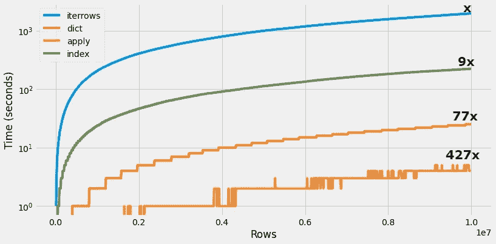

# Pandas 数据帧迭代速度快 400 倍

> 原文：<https://towardsdatascience.com/400x-time-faster-pandas-data-frame-iteration-16fb47871a0a?source=collection_archive---------4----------------------->

## 避免使用 iterrows()函数


图片来自 [Pixabay](https://pixabay.com/?utm_source=link-attribution&amp;utm_medium=referral&amp;utm_campaign=image&amp;utm_content=259375) 的[米哈尔·贾莫鲁克](https://pixabay.com/users/jarmoluk-143740/?utm_source=link-attribution&amp;utm_medium=referral&amp;utm_campaign=image&amp;utm_content=259375)

数据处理是数据科学模型开发流程的重要组成部分。数据科学家花费 80%的时间准备数据集，使其适合建模。有时，对大规模数据集进行数据争论和探索成为一项乏味的任务，人们只能等待相当长的时间直到计算完成，或者转移到一些并行处理。

Pandas 是著名的 Python 库之一，它有大量的 API，但是当谈到可伸缩性时，它失败得很惨。对于大型数据集，仅迭代循环就要花费大量时间，有时甚至数小时，即使对于小型数据集，使用标准循环迭代数据帧也非常耗时，

在本文中，我们将讨论在大型数据集上加速迭代过程的技术或技巧。



(图片由作者提供)，时间约束比较以迭代数据框

# Pandas 内置函数:iterrows()

iterrows()是一个内置的 Pandas 库函数，它返回一系列的每个实例或行。它以一对索引和一系列列要素的形式遍历数据框。

为了比较基准时间约束，我使用了一个包含 1000 万条记录和 5 列的数据集。我们的数据集中有一个字符串类型的特征`‘name’`,需要去除其中的空格。

```
**temp=[]
for i,row in df.iterrows():
name_new = row['name'].strip()
temp.append(name_new)**
```

代码片段花了将近 1967 秒来执行，包括悬停在数据框上并执行“name”值的剥离函数。

不建议使用 iterrows，这不仅是因为时间性能问题，而且`**iterrows()**`函数不能跨行保留数据类型。你可以使用`**itertuples()**`函数来保存类型。

现在，让我们找出迭代数据帧的其他技术，并比较其时间复杂度。

# 按索引迭代:

数据帧是有行和列的熊猫对象。数据框的行和列被索引，并且可以循环遍历索引以遍历行。

```
**temp=[]
for idx in range(0,df.shape[0],1):
name_new = df['name'].iloc[idx].strip()
temp.append(name_new)**
```

迭代数据帧并执行剥离操作花费了将近 223 秒(比 iterrows 函数快 9 倍)。

# 使用 to_dict():

您可以迭代数据框并以闪电般的速度执行操作，只需将您的 Pandas 数据框转换为字典即可。可以使用 Pandas 中的`**.to_dict()**`函数将数据框转换成字典。与`**iterrows()**`函数相比，现在迭代一个字典相对来说非常快。

```
**df_dict = df.to_dict('records')****temp=[]
for row in df_dict:
name_new = row['name'].strip()
temp.append(name_new)**
```

迭代一个字典格式的数据集需要大约 25 条记录，比`**iterrows()**`函数快 77 倍。

# 使用 apply():

apply()是一个内置的 Pandas 函数，它允许传递一个函数并将其应用于 Pandas 系列的每个值。apply()函数本身并不快，但是它对 Pandas 库有很大的改进，因为这个函数有助于根据需要的条件分离数据。

```
**temp = df['name'].apply(lambda x: x.strip())**
```

`**apply()**`该函数执行时间为 4.60 秒，比`**iterrows()**`函数快 427 倍。

> 从上面的图(本文开始)中，您可以比较在具有 8 个内核和 32GB RAM 的系统上计算的基准时间数。

# 结论:

在本文中，我们讨论了几种迭代熊猫数据帧的技术，并比较了它们的时间复杂度。建议在非常特殊的情况下使用`**iterrows()**`功能。人们可以很容易地从使用`**iterrows()**`或索引方法转移到基于字典的迭代技术，这将工作流的速度提高了 77 倍。

Apply 函数的速度快了大约 400 倍，但它的用途有限，并且需要对代码进行大量修改才能转换到这种方法。我亲自将我的数据框转换成字典，然后继续迭代。

# 参考资料:

[1]熊猫文献:[https://pandas.pydata.org/docs/index.html](https://pandas.pydata.org/docs/index.html)

*喜欢这篇文章吗？成为* [*中等会员*](https://satyam-kumar.medium.com/membership) *继续无限制学习。如果你使用下面的链接，我会收到你的一小部分会员费，不需要你额外付费。*

[](https://satyam-kumar.medium.com/membership) [## 加入我的推荐链接-萨蒂扬库马尔媒体

### 作为一个媒体会员，你的会员费的一部分会给你阅读的作家，你可以完全接触到每一个故事…

satyam-kumar.medium.com](https://satyam-kumar.medium.com/membership) 

> 感谢您的阅读