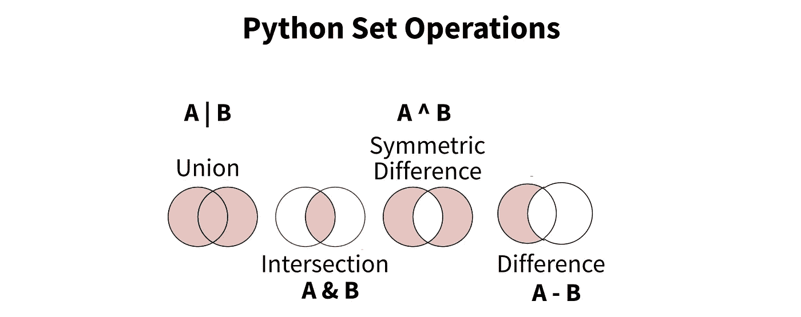
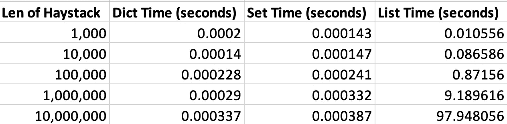
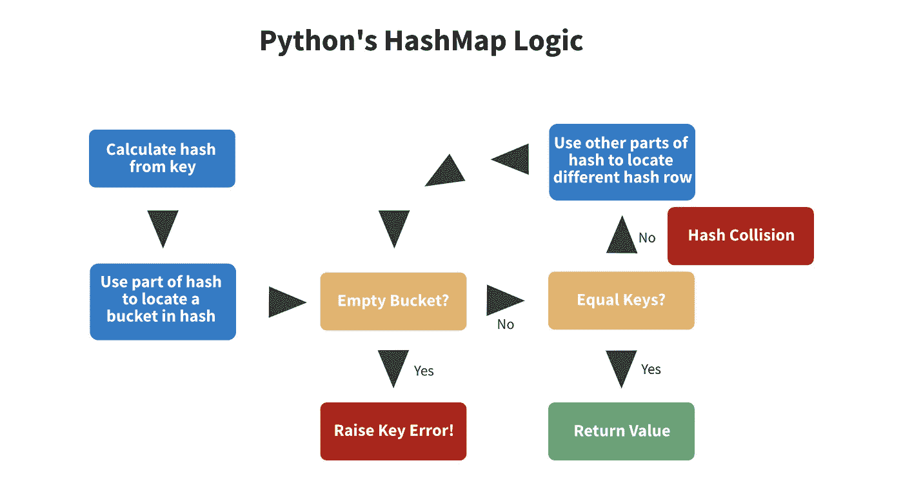

# Python 字典和集合的 5 个高级技巧

> 原文：<https://towardsdatascience.com/5-advanced-tips-on-python-dicts-and-sets-6ac1685c42b8?source=collection_archive---------12----------------------->

## 卢西亚诺·拉马尔霍的《流畅的 Python》笔记(第 3 章)


美国宇航局在 [Unsplash](https://unsplash.com?utm_source=medium&utm_medium=referral) 拍摄的[照片](https://unsplash.com/@nasa?utm_source=medium&utm_medium=referral)

> “任何正在运行的 Python 程序都有许多词典同时处于活动状态，即使用户的程序代码没有明确使用词典。”库奇林

如果你对编写更高效的 python 代码感兴趣，这篇文章很适合你。

我们将讨论卢西亚诺·拉马尔霍的 [Fluent Python 第三章的主要内容，其中包括**散列表**，例如字典和集合。](https://amzn.to/3KTnNfB)

# 1 — Hashmap 与序列类型

**提示:对唯一的无序记录使用字典和集合。**

让我们从“基础”开始，讨论字典和集合在 python 变量生态系统中的位置。下面我们可以看到一个字典、集合、列表和元组的示例声明。

```
my_dict = {'key1': 'value1', 'key2': 'value2'}
my_set = {'a','b','c'}my_list = ['a','b','c']
my_tuple = ('a','b','c')
```

前两个变量( *my_dict* 和 *my_set* )的主要区别在于它们利用了散列表。元组、列表和其他 [python 序列](/5-advanced-tips-on-python-sequences-5b0e09a21a83)没有。

python 中的 Hashmaps 使用`hash(my_key)`方法散列一个键，并覆盖其散列键对应于`hash(my_key)`的值。这个过程也可能涉及到订单的重组。

因此，尽管散列表非常快，但您必须处理唯一的无序数据。

# 2—创建字典和集合的最佳方式

**提示:使用文字声明 *{}* 而不是 *dict()* 或 *set()* 。**

有很多方法可以创建 python 字典和集合，但是并不是所有的方法都是一样的。下面是最具表现力和可读性的方法。

```
# dicts
d = {1: 1, 'x': 'x'}
d_comp = {k: v for k,v in zip(keys, values)}# sets
s = {1, 'x'}
```

这里，我们利用花括号 *{}* 来声明变量，而不是调用像`dict()`这样的构造函数。根据 Fluent Python 的说法，从可读性和性能的角度来看，这都是最佳实践。

有一个例外。如果我们已经有了一个元素列表，如下所示，我们**不能**将列表直接传递到文字声明中，所以我们必须使用构造函数。

```
# elems
dict_elems = [(1,2), ('x','y'), (('my','tuple'), ('my','value'))]
set_vals =   [1, 'x', ('my','tuple')]# dict/set
d = dict(dict_elems)
s = set(set_vals)
```

效率最低的实现使用带有构造函数的显式变量声明。**应该避免。这种声明策略也将键转换成字符串，如果你不想要更复杂的 dict 键，这并不理想。**

```
d = dict(1=1, x='x')
s = set([1,2])
```

上述代码的性能不如文字声明的原因是因为在后端，当使用构造函数时，传递的值会创建一个列表，然后该列表被转换为我们想要的数据类型。对于文字声明，python 使用 BUILD_SET 字节码，这绕过了列表的创建，因此速度更快。

**所以，使用** `**{}**` **而不是** `**dict()**` **或** `**set()**` **创建字典和集合。**

# 3-集合运算

**提示:使用集合获取唯一元素并执行查找。**

集合是 python 中最有效的数据类型之一。如上所述，它们利用 hashmaps 使得查找非常高效。它们对于获取列表的独特元素也很有用。



图 python 中的基本集合操作。图片作者。

然而，set 真正的亮点是它们内置的操作符，如图 1 所示。Fluent Python 引用了一个模拟，我们在不同大小的干草堆中寻找 1000 根针。字典、集合和列表的性能表如下所示。



图 2:大海捞针式查找的性能时间— [src](https://www.amazon.com/Fluent-Python-Concise-Effective-Programming/dp/1491946008) 。干草堆类型对应于最后 3 列。图片作者。

正如你所看到的，这个列表比 dict 慢了 9000 多倍，并且是为 10000000 个条目而设置的。作为参考，大海捞针数量的代码简单来说就是`len(haystack & needle)`。

因此，如果你在做集合逻辑，使用集合。

但是有一种极端的情况——如果你使用 numpy/pandas，使用`.unique()`语法对带有数值的数组/序列更有效。如果你正在处理字符串，也就是 python 对象，使用`list(set(my_array))` — [src](https://stackoverflow.com/questions/46839277/series-unique-vs-list-of-set-performance) 会更有效。

# 4 —对字典操作有用的函数

**提示:使用内置的 dict 函数来处理缺失值和迭代。**

下面是一些最重要的字典函数，但是这个列表并不完整。如果有重要的遗漏方法，lmk。

## 循环

`d.items()`返回一系列键值对。这是在 dict 中迭代键和值的最快方法。

`d.keys()`和`d.values()`分别返回一系列的键和值。它们是迭代 dict 的键**或**值的最快方法。

## **处理潜在的空值**

`d.get(k, default)`返回键`k`的值，如果没有找到则返回默认值。注意`default`默认为`None`。

`d.setdefault(k, default)`的操作方式与 get 相同，但如果没有找到`k`，则首先插入默认值。

## **加入字典**

`d.update(d2)`连接两个字典。重复键的值将被第二个字典`d2`覆盖。

# 5 —后端发生了什么

**提示:没关系。**

但是，因为我们是好奇而聪明的程序员，所以让我们来看看在引擎盖下发生了什么…



图 3: Python 的 hashmap 逻辑— [src](https://www.amazon.com/Fluent-Python-Concise-Effective-Programming/dp/1491946008) 。图片作者。

如你所见，这是一个非常复杂的过程。对于所有意图和目的，您只需要关注基于 hashmap 的数据类型缺乏顺序和唯一性。但是，这里有一些有趣的事实。

*   python 中的每个数据不可变数据类型都有自己用 c 编写的哈希函数。
*   任何可散列类型都可以是字典中的一个键。Hashable 被定义为**不可变的**和**与其他对象可比的**。测试变量是否可散列的一个好方法是将它传递给 python 的`hash()`函数。
*   如果您创建了自己的数据类型，要使用字典或集合，您必须实现`__hash__`和`__eq__` (equality)方法。

*感谢阅读！我会再写 27 篇文章，把学术研究带到 DS 行业。查看我的评论，链接到这篇文章的主要来源和一些有用的资源。*