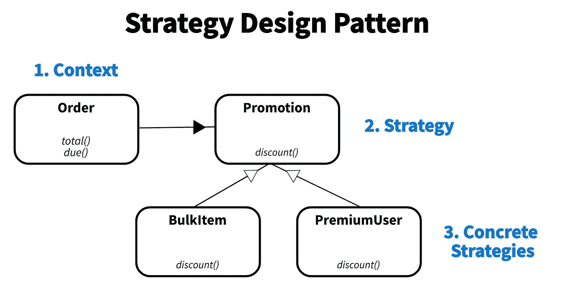

# Python 函数的 5 个高级技巧

> 原文：<https://towardsdatascience.com/5-advanced-tips-on-python-functions-1a0918017965?source=collection_archive---------5----------------------->

## 卢西亚诺·拉马尔霍的《流畅的 Python》笔记(第 5-6 章)

你是学了 Java 编程，然后转到 python 的吗？如果你开始使用 OOP，但现在使用 python，这篇文章是为你准备的。


米歇尔·普林在 [Unsplash](https://unsplash.com?utm_source=medium&utm_medium=referral) 上的照片

在 Fluent Python 的第 5-6 章中，卢西亚诺·拉马尔霍讨论了传统的面向对象范例在 Python 中并不总是最优的。下面我们将讨论如何利用 python 的函数来编写高效、简洁的代码。

事不宜迟，我们开始吧。

# 1 —什么是第一类对象？

为了培养一些直觉，让我们首先了解 python 函数是如何工作的。

用最简单的话来说，函数就是一段代码，只有在被调用时才会运行。但是，在 python 中，函数有很多动态功能，允许您像对待对象一样对待它们。

事实上，python 函数实际上被认为是第一类对象，这意味着它们…

1.  **是在运行时创建的吗**
2.  可以将**赋给数据结构**中的变量或元素
3.  可以将**作为参数传递给函数**
4.  可以通过函数返回

**上面的*动态*功能允许工程师以有趣和创造性的方式利用 python 函数。**

**但这还不是全部。Python 有许多有趣的关键字和语法结构，可以让您快速编写高效的代码。下面，我们将从如何利用关键字/语法开始，然后以一个利用函数作为对象的高级示例结束。**

# **2 —使用 Yield 缩短助手函数**

****提示:利用** `**yield**` **关键字在不破坏局部变量状态的情况下从函数返回。****

**好吧，除非你已经熟悉了`yield`，否则上面这句话可能听起来像法语。但是，这个技巧非常有用，可以为大多数返回值的帮助函数节省几行代码。**

**让我们从返回奇数的基本 python 函数开始。**

```
def odd(my_iterable):
  odd_numbers = []
  for x in my_iterable:
    if x % 2 == 1:
      odd_numbers.append(x)

  return odd_numbers
```

**我们的流程是 1)声明一个列表，2)在列表中添加奇数，3)返回列表。这是一个非常冗长的函数，只能得到一些奇数。让我们看看`yield`关键词是否能有所帮助…**

```
def odd(my_iterable):
  for x in my_iterable:
    if x % 2 == 1:
      yield x
```

**嘭！我们只是删除了 3 行代码，增加了可读性，并且根据用例，减少了程序使用的内存。但是它是如何工作的呢？**

**`yield`关键字迭代返回一个值**而不停止函数**。我们的函数不是返回一个列表，而是变成一个生成器，返回一个生成器对象，它是 iterable 的一个子类型。一旦运行，并保存到一个变量，我们可以迭代它，转换成一个列表，等等。**

```
my_generator = odd([1,2,3,4,5,6])
my_generator # <generator object odd at 0x106c62740>list(my_generator)                              # (1,3,5)
len(list(my_generator))                         # 3
[x for x in my_generator] == list(my_generator) # True
```

**好的，我们可以看到为什么这样可以节省代码行，但是它是如何(潜在地)节省内存的。嗯，生成器和生成器表达式是可迭代的对象，直到程序使用它们时才真正被创建。所以，如果你不需要完整的对象，就不要把它保存到内存中。但是，如果您打算多次使用某个变量，那么将它保存到内存中是最有效的方法。**

# **3-使用列表理解**

****提示:用列表理解代替**`**map**`**`**reduce**`**`**filter**`**。********

****函数式编程语言使得上面列出的函数变得流行起来。虽然它们在某些 python 包中非常有用，比如 numpy 和 pandas，但是在常规 python 中，你应该尽可能地坚持列出 comps。****

****为什么？主要原因是可读性。让我们看一行代码，它对奇数调用一个`factorial`函数。****

```
**good = [factorial(n) for n in range(6) if n % 2 == 1]
bad = list(map(factorial, filter(lambda n: n % 2 == 1, range(6))))**
```

****假设您对 list comprehension 语法很熟悉，那么第一条语句应该比第二条语句更容易阅读。他们有相似的后端效率。****

****在 python 的新版本中，`reduce`函数被从内置的 python 函数移到了`functools`模块中。`map`和`filter`仍然是内置的，但是随着列表构图的改进，它们的使用已经减少。****

******所以，如果你想写 pythonic 代码，使用** [**列表理解式和生成器表达式**](/5-advanced-tips-on-python-sequences-5b0e09a21a83) **。******

# ****4 —利用*解包函数参数****

******提示:使用** `**my_func(*args)**` **表示未知数量的位置参数，使用** `**my_func(**kwargs)**` **表示未知数量的关键字参数。******

****如果您正在创建将被许多其他人使用的代码，比如 API，那么允许传递的参数具有灵活性是一个很好的实践。您可以通过为每个参数指定默认值来做到这一点，或者您可以使用`*`来“分解”参数…****

```
**# BAD
def declare_defaults(p1=None, p2=None, p3=None):
  print([p1, p2, p3])# GOOD
def positional_arguments(*args):
  print(args)# GOOD
def key_word_arguments(**kwargs):
  print(kwargs)declare_defaults(p1=1, p2=2, p3=3)   # [1,2,3]
positional_arguments(1,2,3)          # [1,2,3]
key_word_arguments(p1=1, p2=2, p3=3) # {'p1': 1, 'p2': 2, 'p3': 3}**
```

****`**my_func(*x)**` **将所有参数存储在一个名为** `**x**` **的元组中。** `**my_func(**x)**` **将所有参数存储在一个名为** `**x**` **的字典中。******

****当您有大量参数，并且不希望用户在每个函数调用中都传递每个参数时，利用这些信息会非常有用。或者，当您不知道用户将传入多少参数时，也可以应用它。****

# ****5 —使用函数重构您的类****

****提示:尽可能使用函数而不是类。****

****最后，让我们讨论一个关于程序设计的高级技巧。在许多 OOP 语言中，你被教导使用大量的类。然而，因为 python 函数可以被当作对象来处理，**将它们存储在一个类中会损害可读性、效率和开发时间。******

****让我们看一个例子…****

********

****图 1:策略设计模式的简化 UML 图。图片作者。****

****在图 1 中，我们有一个类结构，它从理论上计算用户在结账时应该得到多少折扣。这是一个经典的 OOP 设计模式，叫做“策略”有三个主要组件:****

1.  ******上下文**:有/无折扣总价信息。这显示在`Order`类中。****
2.  ******策略**:确定应该应用哪个折扣的简单逻辑。这显示在`Promotion`类中。****
3.  ******具体策略**:计算折扣的实际“算法”。这显示在`BulkItem`和`PremiumUser`类中。****

****看起来很直观，对吧？是的，但是因为 python 函数是一等公民，我们可以极大地简化代码…****

```
**# Concrete Strategies
def bulk_item(price):
  return price * 0.5def premium_user(price):
  return price * 0.75# Strategy
def determine_discount(context, price):
  mappings = {'premium_user': premium_user,
              'bulk_item': bulk_item} relevant_mappings = {k:v for k,v in mappings.items() if k in context}
  return min(discount(price) 
               for discount in relevant_mappings.values())# Context + Run
price = 1000
context = ['bulk_order','premium_user','female','USA']
print(f'Best discount: {determine_discount(context, price)}')**
```

****通过在`determine_discount`函数中使用函数作为对象，我们能够极大地减少这个逻辑的冗长性。而且，如果我们有 100 个折扣，那么`mappings`字典可以相应地扩展。****

****因此，尽管这是一个过于简单的例子，但是最好的做法是**尽量利用函数作为对象，并尽量少用类。**此外，实例化类会花费很多时间——使用更轻量级的数据类型可以提高速度。****

*****感谢阅读！我会再写 22 篇文章，把学术研究带到 DS 行业。查看我的评论，链接到这篇文章的主要来源和一些有用的资源。*****