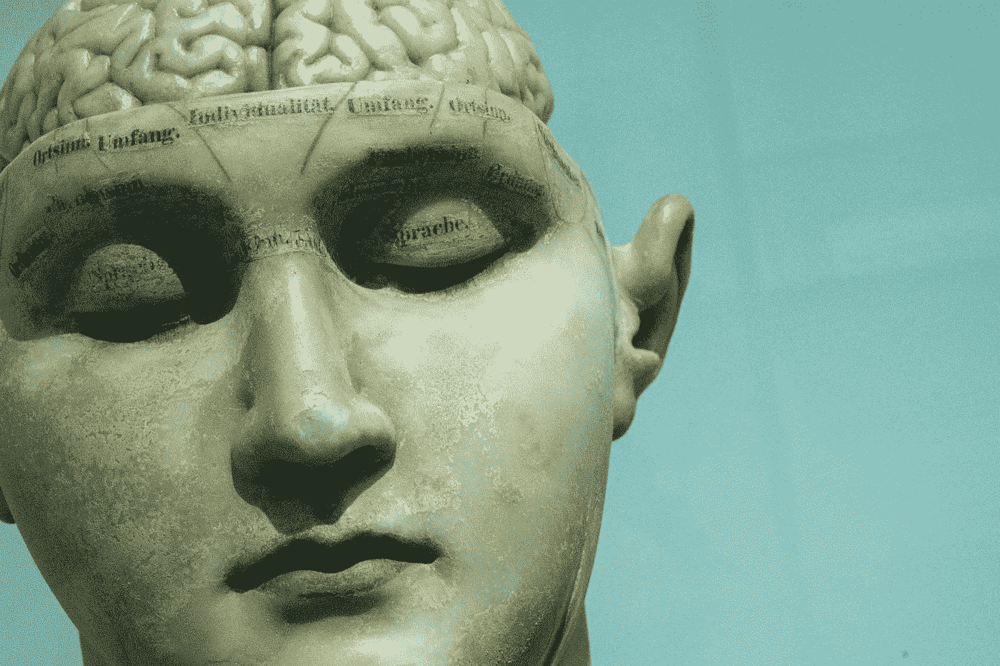

# 5 个人工智能误解被揭穿

> 原文：<https://towardsdatascience.com/5-ai-misconceptions-debunked-50487aa3bd28?source=collection_archive---------32----------------------->

戴维·马托斯的照片。

## 人工智能可能是一个非常令人困惑的话题

问一百个人他们认为人工智能是什么，你可能会得到一百个不同的答案。这是一个宽泛的术语，有几乎无限多的解释和同样多的误解。这正是为什么我的客户会议、研讨会和人工智能讲座不可避免地会有一个两分钟的环节，我会问观众他们如何看待人工智能。毫无疑问，在任何关于人工智能的讨论开始之前，总有一些误解必须得到澄清。

一些人通过反乌托邦的好莱坞电影接触到了人工智能，一些人通过哲学播客，一些人通过深度学习教程接触到了人工智能。事实上，人工智能世界有许多切入点。人们的观点有很大的不同，这取决于他们进入人工智能世界的入口是什么。

少数误解占据了主导地位。这是我最常遇到的关于人工智能的误解，甚至来自技术专家。

# 人工智能和机器学习是一回事

让我们从最基本的开始。人工智能和机器学习不是同义词。互换使用这两个术语会导致交流错误。

人工智能这个术语没有一致认可的定义，所以我们来分解一下。这个术语由两部分组成:人工和智能。

人造是一个你可能不熟悉的术语，但它非常简单。它是指由人类创造的物体，与自然界中自然生长的物体相对。因此，你穿的衣服，你睡的床，当然，你用来看迷因的手机都是人造的。

那么，智力是一个几乎每个人都熟悉的术语，然而矛盾的是没有人能真正定义它。智力到底是什么？许多比我聪明得多的哲学家和科学家都问过这个问题。本质上，你可以说智力是指感知和理解周围环境的能力。

那人工智能是什么呢？人工智能这一术语一定仅仅意味着某些人造物体具有某种形式的理解能力。

也就是说，你可以将人工智能称为一个巨大的技术集合，它为人工制品(实际上是计算机)提供了理解的能力。AI 是一个宽泛的术语，包含许多技术，其中之一是机器学习。

机器学习是一种用来让计算机自己学习东西的技术，有时在人类的监督下，有时自主学习。

当一个人工智能在 1997 年击败国际象棋世界冠军时，这个人工智能并不是用机器学习开发的。相反，它是根据人类定义的规则运行的:在任何情况下，如果你愿意，都可以列出最佳可能的行动。然而，我认为这是人工智能，因为击败人类玩家的智能是人工智能的一种形式。

> "人工智能是一个宽泛的术语，包含许多技术，其中之一是机器学习."

那么，按照这种逻辑，当打印机告诉它的主人它没有墨水了的时候，难道不能认为它在使用人工智能吗？是的，绝对的。不是机器学习，不是自学，也不是特别聪明。但是机器自己清楚地观察、理解和传达它没有墨水了。

# AI 和人工通用智能是一回事

这种误解在非技术观众中普遍存在，尤其是那些只通过小说作品接触过人工智能的人。

人工通用智能(AGI)也许是人工智能的终极水平。AGI 是一种人工智能，它可以完成人类可以完成的任何任务，至少和人类一样好。AGI 是小说作品中一个受欢迎的主题。在《终结者》(1984)、《我》、《机器人》(2004)、《她》(2013)等好莱坞电影中看到的人工智能都是 AGI 的例子。

需要澄清的是:AGI 并不存在。当今世界上存在的所有人工智能的例子都是被制造来执行一个特定任务的人工智能(这些人工智能有时被称为模块化人工智能或狭义人工智能)。当企业和政府实施人工智能解决方案时，他们并没有实施终结者式的超级智能生物。他们正在实施为执行一项特定任务而构建的模块化技术。

由[马库斯·斯皮斯克](https://unsplash.com/@markusspiske?utm_source=unsplash&utm_medium=referral&utm_content=creditCopyText)拍摄。

# **AI 仅用于自动化**

另一个常见的误解是，人工智能的唯一用例是自动化。事实上，人工智能可以用于两个主要目的:自动化和增强。

*   自动化是将人类从一项活动中移除。
*   增强是在一项活动中赋予人类权力。

自动化和增强是相反的极端，很少有人工智能解决方案是完全自动化或完全增强的。自动化和增强是一个包含[四种策略](/4-business-strategies-for-implementing-artificial-intelligence-24deff39158c)的规模。

1.  效率策略，通过自动化优化活动。
2.  有效性策略，在这种策略中，活动是无缝的，使得沟通更加容易。
3.  专家战略，人工智能赋予决策能力。
4.  创新战略，人工智能使创造力成为可能。

增强人工智能的例子包括帮助医生诊断病人、帮助财务顾问做出货币决策或帮助产品开发人员发明新产品的机器。

# 人工智能是最近发明的

信不信由你，给物体带来智能的想法，今天被称为人工智能，已经存在至少 2000 年了。很久以前，在古希腊，伟大的哲学家们就以文字的形式展示了自动推理。然而，尽管他们可以对这个主题进行几天的理论化，他们却没有办法实现它。

自从有了计算机，人工智能的实际应用就一直在发展。你知道吗，虽然自动驾驶汽车近年来已经成为热门话题，但它是从 20 世纪 20 年代开始研究的。

人工智能近年来成为热门话题有三个原因:

1.  用户生成的数据激增。
2.  计算机变得更加强大，价格也更加低廉。
3.  算法研究取得突破。

人工智能比以往任何时候都大，但这不是一个新话题。

# **人工通用智能遥遥无期(或者永远不会发生)**

正如我前面提到的，人工通用智能(AGI)是人工智能的一种理论形式，它可以做人类可以做的一切事情，或者一样好，甚至更好。当然，AGI 并不存在。

很多人很快就认为 AGI 是科幻小说中的胡说八道。一些人自信地认为 AGI 永远不会发生；其他人则认为 AGI 在几个世纪之外。事实很简单，没有人知道。有些人认为我们将在几十年内发现 AGI，有些人认为需要几个世纪，有些人认为我们永远不会。但是研究人员认真对待这个话题。

如果我们的星球是一年前创造出来的，人类在星球上已经存在了十分钟，工业时代也就两秒钟前才开始。互联网可能只存在了几毫秒。在这么短的时间内，我们所经历的技术进步是惊人的。我个人认为有一天我们可能会发明 AGI，当那一天到来时，我们需要做好准备。这也是[生命未来研究所](https://futureoflife.org/)的使命，它非常认真地对待 AGI 问题。

*感谢阅读！如果你喜欢这篇文章，你可能会喜欢我的关于人工智能的书:*

 [## 这是真正的人工智能:100 个人工智能的现实世界实现

### 你知道吗？最近，人工智能(AI)发现了世界上最好的流感疫苗。渐进…

thisisrealaibook.com](https://thisisrealaibook.com/)