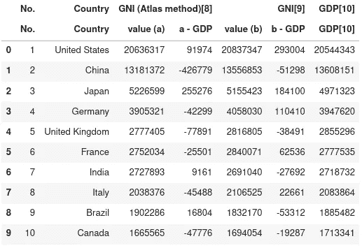

# 你可能不知道的 5 个令人惊奇的熊猫特征

> 原文：<https://towardsdatascience.com/5-amazing-pandas-features-you-probably-dont-know-about-5533498aac88?source=collection_archive---------16----------------------->

## 解释强大的熊猫功能，以提高您的数据分析工作流程。


照片由[锡德·巴拉钱德朗](https://unsplash.com/@itookthose?utm_source=medium&utm_medium=referral)在 [Unsplash](https://unsplash.com?utm_source=medium&utm_medium=referral) 拍摄

当在你的数据科学或数据分析项目中使用 pandas 时，你有时会发现你希望以前就知道的强大的新功能。以下是我个人的前 5 名。

# 1.网页抓取

熊猫有一个强大的方法`read_html()`从网页上抓取数据表。

假设我们需要国民总收入的数据。它可以在维基百科的数据表中找到。


来源:维基百科

使用 pandas 阅读来自维基百科的所有 HTML 表格非常简单。

```
import pandas as pd
url = '[https://en.wikipedia.org/wiki/Gross_national_income'](https://en.wikipedia.org/wiki/Gross_national_income')
tables = pd.read_html(url)
```

结果是一列`tables`(即数据帧)。在这个例子中，我们感兴趣的表是第四个表(注意:Python 确实使用从零开始的索引)。

```
tables[3]
```



作者图片

需要时，您可以做一些调整。

```
df = tables[3].droplevel(0, axis=1)\
.rename(columns={'No.':'No', 'GDP[10]':'GDP'})\
.set_index('No')
```


作者图片

# 2.激增

使用`explode`方法，您可以将列表中的每个元素转换为一行，复制索引值。

```
cars = pd.DataFrame({
    'country': ['Germany', 'Japan', 'USA'],
    'brand': [['Mercedes', 'BMW', 'Audi', 'Volkswagen'],
              ['Toyota', 'Nissan', 'Honda'],
              ['Ford', 'Chrysler', 'Jeep', 'Dodge', 'GMC']
             ]
})
```


作者图片

```
cars.explode('brand')
```


# 3.偏移、差异和百分比变化

这些功能最好用例子来解释。我们首先生成一个包含日期和值的数据帧。

```
import pandas as pd
import randomrandom.seed(1)n = 14 # two weeks
df = pd.DataFrame(
    {'value': random.sample(range(10, 30), n)},
    index = pd.date_range("2021-01-01", periods=n, freq='D')
)
```


作者图片

现在让我们添加一些列来显示`shift`、`diff`和`pct_change`方法的值。

```
df['shift()'] = df.value.shift() # value previous day
df['shift(7)'] = df.value.shift(7) # value 7 days ago
df['shift(-1)'] = df.value.shift(-1) # value next daydf['diff()'] = df.value.diff() # difference previous day
df['diff(7)'] = df.value.diff(7) # difference 7 days ago
df['diff(-1)'] = df.value.diff(-1) # difference next daydf['pct_change()'] = df.value.pct_change() # pct change previous day
df['pct_change(7)'] = df.value.pct_change(7) # pct change 7 days ago
df['pct_change(-1)'] = df.value.pct_change(-1) # pct change next day
```


作者图片

# 4.比较运算符的包装

Pandas 有一些超级方便的比较运算符的简短包装器，如`eq`(等于)`ne`(不等于)`le`(小于等于)`lt`(小于)、`ge`(大于等于)和`gt`(大于)。它们相当于`==`、`!=`、`<=`、`<`、`>=`和`>`。这里有一些例子。

```
import pandas as pd
import randomrandom.seed(102)df = pd.DataFrame(
    {'A': random.choices(range(25),  k=10),
     'B': random.choices(range(25),  k=10),
     'C': random.choices(range(25),  k=10),
     'D': random.choices(range(25),  k=10),
     'E': random.choices(range(25),  k=10)}
)
```


作者图片

```
df.eq(15)
```


作者图片

```
s = pd.Series([0, 5, 10, 15, 20], index=['A', 'B', 'C', 'D', 'E'])
df.ge(s)
```


作者图片

# 5.剪辑和评估

使用`clip()`,您可以调整输入阈值的值。它将边界外的值分配给边界值。方法`eval`用于评估描述 DataFrame 列操作的字符串。

```
df = pd.DataFrame({'A': range(1, 6), 'B': range(10, 60, 10)})
```


作者图片

```
df.clip(lower=2, upper = 40)
```


作者图片

```
df.clip(lower=2, upper=40).eval('C = A + B')
```


作者图片

# 最后的想法

Pandas 是一个非常棒的数据分析和数据科学图书馆。它有大量的功能。我强烈建议花些时间来研究一下[文档](https://pandas.pydata.org/pandas-docs/stable/user_guide/index.html)，这样你就不会错过任何一个强大的功能。

你最喜欢的熊猫功能是什么？让我知道你的想法。

[](https://brinkhuis.medium.com/find-the-topics-your-medium-story-was-curated-into-automagically-f9dbf297d029) [## 找到你的媒体故事自动策划的主题

### 在一个简单易用的 Python 脚本的帮助下…

brinkhuis.medium.com](https://brinkhuis.medium.com/find-the-topics-your-medium-story-was-curated-into-automagically-f9dbf297d029) [](/reactive-data-analysis-with-julia-in-pluto-notebooks-b4652defd03e) [## 在 Pluto 笔记本中使用 Julia 进行反应数据分析

### 当你喜欢朱庇特的时候，你就会爱上冥王星！

towardsdatascience.com](/reactive-data-analysis-with-julia-in-pluto-notebooks-b4652defd03e) [](/plotting-thematic-maps-using-shapefiles-in-julia-6a926ef77721) [## 在 Julia 中使用 Shapefiles 绘制专题地图

### 如何在 Julia 中使用 Plots 包绘制 choropleth 图？

towardsdatascience.com](/plotting-thematic-maps-using-shapefiles-in-julia-6a926ef77721) [](/getting-started-with-data-analysis-in-julia-421ce0032916) [## Julia 中的数据分析入门

### 关于 Julia 中数据分析入门的温和介绍性指南。

towardsdatascience.com](/getting-started-with-data-analysis-in-julia-421ce0032916) [](/how-to-setup-project-environments-in-julia-ec8ae73afe9c) [## 如何在 Julia 中设置项目环境

### 介绍 Julia 的内置包管理器，用于生成项目环境和管理包…

towardsdatascience.com](/how-to-setup-project-environments-in-julia-ec8ae73afe9c)