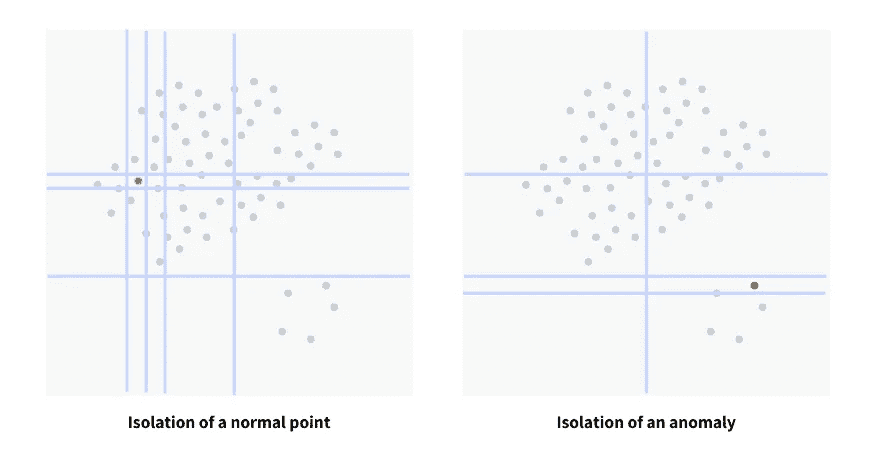
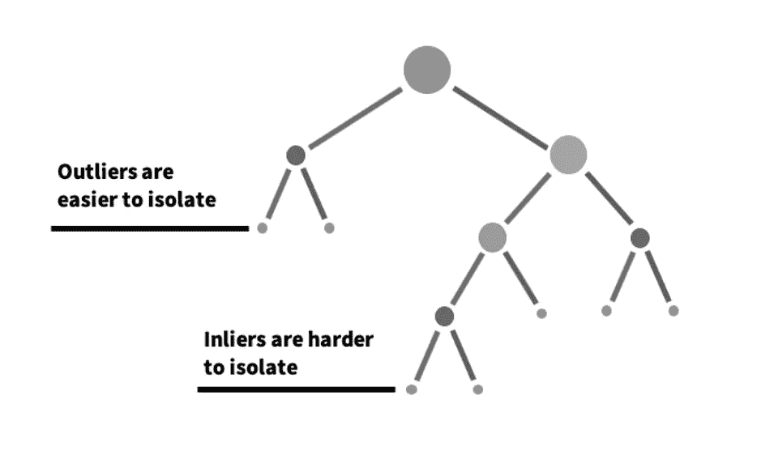
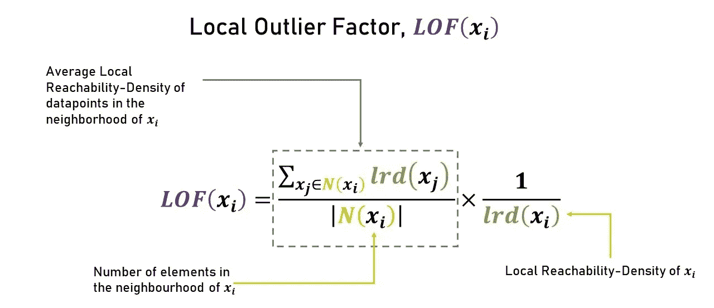
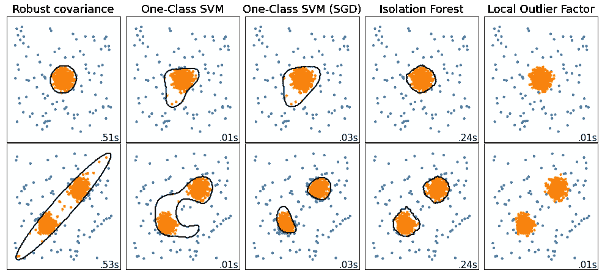

# 每个数据科学家都应该知道的 5 种异常检测算法

> 原文：<https://towardsdatascience.com/5-anomaly-detection-algorithms-every-data-scientist-should-know-b36c3605ea16?source=collection_archive---------0----------------------->

## 异常检测算法在异常检测中的比较


图片来自 [Pixabay](https://pixabay.com/?utm_source=link-attribution&amp;utm_medium=referral&amp;utm_campaign=image&amp;utm_content=163708)

真实世界的数据集通常包含异常或离群数据点。异常的原因可能是数据损坏、实验或人为错误。异常的存在可能会影响模型的性能，因此为了训练稳健的数据科学模型，数据集应该没有异常。

在本文中，我们将讨论 5 种这样的异常检测技术，并针对随机数据样本比较它们的性能。

# 什么是异常？

异常是数据集中突出于其他数据点的数据点，并且不确认数据中的正常行为。这些数据点或观察结果偏离了数据集的正常行为模式。

异常检测是一种无监督的数据处理技术，用于从数据集中检测异常。异常可以大致分为不同的类别:

*   **异常值:**在数据收集中以非系统方式出现的短/小异常模式。
*   **事件变化:**从之前的正常行为有系统的或突然的变化。
*   **漂移:**数据中缓慢、无方向性的长期变化。

异常检测对于检测欺诈交易、疾病检测或处理任何具有高级别不平衡的案例研究非常有用。异常检测技术可用于构建更强大的数据科学模型。

# 如何检测异常？

可以使用简单的统计技术(如平均值、中值、分位数)来检测数据集中的单变量异常特征值。各种数据可视化和探索性数据分析技术也可用于检测异常。

在本文中，我们将讨论一些无监督的机器学习算法来检测异常，并进一步比较它们在随机样本数据集上的性能。

```
**Checklist:
1\. Isolation Forest
2\. Local Outlier Factor
3\. Robust Covariance
4\. One-Class SVM
5\. One-Class SVM (SGD)**
```

# 隔离林:

隔离森林是一种无监督的异常检测算法，它使用随机森林算法(决策树)来检测数据集中的异常值。该算法试图分割或划分数据点，使每个观察结果与其他观察结果隔离开来。

通常，异常远离数据点的群集，因此与常规数据点相比，隔离异常更容易。



(图片由作者提供)，异常和常规数据点的划分

从上述图像中，可以观察到常规数据点比异常数据点需要相对更多的分区。

计算所有数据点的异常分数，并且异常分数>阈值的点可以被认为是异常。

> Scikit-learn 实现[隔离森林算法](https://scikit-learn.org/stable/modules/generated/sklearn.ensemble.IsolationForest.html)

# 局部异常因素:

局部异常因子是另一种异常检测技术，它考虑数据点的密度来决定一个点是否是异常。局部异常值因子计算一个称为异常值的异常值，用于测量该点相对于周围邻域的孤立程度。它考虑了局部和全局密度来计算异常分数。



([来源](https://medium.com/mlpoint/local-outlier-factor-a-way-to-detect-outliers-dde335d77e1a))，局部异常值因子公式

> Scikit-learn 实现[局部异常因子](https://scikit-learn.org/stable/modules/generated/sklearn.neighbors.LocalOutlierFactor.html#sklearn.neighbors.LocalOutlierFactor)

# 稳健协方差:

对于高斯无关特征，可以采用简单的统计技术来检测数据集中的异常。对于高斯/正态分布，远离第三偏差的数据点可视为异常。

对于本质上具有所有高斯特征的数据集，可以通过定义覆盖大部分规则数据点的椭圆超球来概括统计方法，并且远离超球的数据点可以被视为异常。

> Scikit-learn 使用椭圆包络实现[鲁棒协方差](https://scikit-learn.org/stable/modules/generated/sklearn.covariance.EllipticEnvelope.html#sklearn.covariance.EllipticEnvelope)

# 一类 SVM:

常规的 SVM 算法试图找到一个超平面，该超平面最好地分离这两类数据点。对于一类 SVM，我们有一类数据点，任务是预测一个将数据点簇从异常中分离出来的超球。

> Scikit-learn 实现[一类 SVM](https://scikit-learn.org/stable/modules/generated/sklearn.svm.OneClassSVM.html#sklearn.svm.OneClassSVM)

# 一级 SVM(新加坡元):

带有 SGD 的一类 SVM 使用随机梯度下降求解线性一类 SVM。该实现旨在与内核近似技术一起使用，以获得类似于默认使用高斯内核的`[**sklearn.svm.OneClassSVM**](https://scikit-learn.org/stable/modules/generated/sklearn.svm.OneClassSVM.html#sklearn.svm.OneClassSVM)`的结果。

> sci kit-学习用 SGD 实现[一级 SVM](https://scikit-learn.org/stable/modules/generated/sklearn.linear_model.SGDOneClassSVM.html#sklearn.linear_model.SGDOneClassSVM)

# 基准测试:

在两组样本数据集(行 1 和行 2)上训练 5 个异常检测。



(图片由作者提供)，玩具数据集上 5 种异常检测算法的性能

一类 SVM 往往有点过度拟合，而其他算法在样本数据集上表现良好。

# 结论:

异常检测算法对于欺诈检测或疾病检测案例研究非常有用，在这些案例研究中，目标类别的分布非常不平衡。异常检测算法还通过从训练样本中移除异常来进一步改善模型的性能。

除了上面讨论的机器学习算法，数据科学家总是可以采用先进的统计技术来处理异常。

# 参考资料:

[1] Scikit-learn 文档:[https://sci kit-learn . org/stable/auto _ examples/miscellaneous/plot _ anomaly _ comparison . html](https://scikit-learn.org/stable/auto_examples/miscellaneous/plot_anomaly_comparison.html)

*喜欢这篇文章吗？成为* [*中等会员*](https://satyam-kumar.medium.com/membership) *继续无限制学习。如果你使用下面的链接，我会收到你的一小部分会员费，不需要你额外付费。*

<https://satyam-kumar.medium.com/membership>  

> 感谢您的阅读