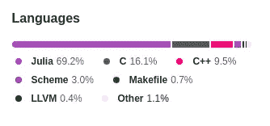

# 朱莉娅语言的 5 大优点

> 原文：<https://towardsdatascience.com/5-awesome-things-to-love-about-the-julia-language-688d7c403474?source=collection_archive---------1----------------------->

## 在我看来，Julia 编程语言的 5 大特点让它变得非常棒。


(图片由[200 度](https://pixabay.com/vectors/programmer-programming-code-work-1653351/)上的[像素点](http://pixabay.com)

# 介绍

我使用(并称赞)Julia 编程语言已经有**年**了。到今天为止，我已经在 Medium 上写了 346 篇文章，这些文章都是从一篇关于 Julia 语言的文章开始的。在那篇文章中，我谈到了数据科学家在学习 Julia 编程语言之前可能想知道的一些事情。如果你想读这篇文章，你可以在这里找到它:

[](/things-to-know-before-using-julia-for-machine-learning-487744c0b9b2) [## 使用 Julia 进行机器学习之前需要知道的事情

### Julia 是一种高级动态编程语言，它本身有一些有趣的特点和特性，这使得…

towardsdatascience.com](/things-to-know-before-using-julia-for-machine-learning-487744c0b9b2) 

在我使用 Julia 的经历中，我相信在我使用 Julia 编写的所有模块、项目和研究之后，有很多功能我都觉得非常方便。今天我想展示一些 Julia 语言的很酷的特性，为什么我认为这些特性很棒。在某些情况下，我甚至会提供一些这种语言派上用场的真实例子，然后将它与数据科学和软件工程领域的其他语言进行比较。这将有助于我们更好地理解为什么这是一个伟大的特性，如何使用它，以及与 Julia 相比，这个行业处于什么位置。

就我对这种语言的主观看法而言，我觉得它至少在数据科学领域有很大的发展潜力。让我们详细介绍一下朱莉娅的一些优秀之处，以及它们为什么如此优秀。

# №1:语言本身就是书写的。

如果我们参考 Julia Github 库，我们可以看到一个非常有趣的用于 Julia 核心的语言平衡。



(图片由作者提供)

Julia 编程语言是用 69%的 Julia 本身编写的！与大多数其他编程语言相比，这提供了许多优势，因为有些是用 C 或汇编语言编写的，而且通常语言的实际基础几乎不是用语言的实际语法编写的。这意味着像我这样的语言最终用户的一些不同的事情。

*   研究 Julia 中可能没有被很好地记录的部分的实际源代码是非常容易的。
*   如果有人提议对语言进行修改，但对 C、C++或 LLVM 编译器库一无所知，他们仍然可以对语言做出贡献。
*   更疯狂的是，人们甚至可以编写自己的语言版本，用它来代替核心语言。

对于第一点，我一直在开发一个叫做 Jockey.jl 的 Julia 包，Jockey.jl 是我正在开发的 Julia 编程语言的笔记本服务器会话。然而，我设计这个包的初衷是将笔记本放入终端。我只是想，考虑到朱莉娅·REPL 实际上是多么令人敬畏，也许可以在 REPL 的上半部分开一个笔记本会议，然后在它下面开一个常规的朱莉娅·REPL 会议。

当然，这种工作需要我们了解朱莉娅·REPL 的内部结构，以便改变终端的行为。然而，问题是这种语言在基础上没有任何明确的文档。终端模块。你可以在这里查看文档 markdown 文件，它确实很好地实现了 Github 风格的 markdown:

[](https://github.com/JuliaLang/julia/blob/master/stdlib/REPL/docs/src/index.md) [## 朱丽亚/朱莉亚朗/朱丽亚硕士

### julia 自带了一个全功能的交互式命令行 REPL(读取-评估-打印循环),内置于 Julia 可执行文件中…

github.com](https://github.com/JuliaLang/julia/blob/master/stdlib/REPL/docs/src/index.md) 

大部分文档是为最终用户准备的，我想这是很重要的，因为我认为人们通常会关心如何使用 REPL，改变按键绑定等，而不是使用软件包来改变终端的功能。幸运的是，因为我能够浏览 Terminals.jl、LineEdit.jl 和 REPL.jl 的源代码，所以我能够获得这个包的一个简单的、有很多错误的版本，并且发布了那个特性。虽然这种使用方式非常酷，但我最终还是放弃了笔记本电脑的这种方式，因为我发现使用起来很麻烦，因为终端和终端的光标以及底部的 REPL 实在是太难管理了。

很酷的是，即使我不知道这种语言的内部，也没有真正研究过这种语言，我仍然能够进入这个包并阅读所有的源代码。即使我除了朱莉娅之外不知道其他语言，情况也是如此。

# №2:构造函数中的多重分派

对于 Julia 编程语言来说，多重调度是一个非常明显的优点。Julia 的核心范式围绕着这个多态的概念。也就是说，虽然多重分派在其他编程语言中肯定是可用的，但我真的相信 Julia 编程语言已经完善了多重分派的概念。我在这篇旧文章中详细解释了我为什么这么想:

[](/how-julia-perfected-multiple-dispatch-16675db772c2) [## 朱莉娅如何完善多重派遣

### 让我们看看 Julia 语言是如何让多重调度变得完美的

towardsdatascience.com](/how-julia-perfected-multiple-dispatch-16675db772c2) 

话虽如此，我想我已经谈了很多关于多重分派的问题，尽管在我看来这是一种很好的编程方式，但我认为在它上面白费力气可能不是最佳的。然而，许多没有使用过 Julia 或者不熟悉 Julia 的人并没有意识到如何通过多重调度来使用构造函数，从而产生一些令人难以置信的结果。考虑以下构造函数:

```
struct NormalDist <: Distribution
           σ::Float64
           μ::Float64
           N::Int64
end
```

这是一个常规的构造函数，对注册到 Julia 中的该构造函数的实际调用如下所示:

```
NormalDist(::Float64, ::Float64, ::Int64)
```

如果我们用这些值调用分布，我们将得到一个新的 NormalDist 类型的返回。然而，让某人计算标准偏差、平均值，并将观察值的数量放入他们自己的计算机中，这似乎并不是最佳的选择，通常也不是像这样的正态分布类型的工作方式。也就是说，我们可以使用多重分派来编写这个调用的新版本，它将通过构建内部构造函数来调用一个函数:

```
struct NormalDist <: Distribution
           σ::Float64
           μ::Float64
           N::Int64 function NormalDist(x::Array) N = length(x)
               σ = std(x)
               μ = mean(x)
               new(σ, μ, N, cdf, apply)
        end
end
```

现在我们有两个注册的调用，一个是对构造函数的调用，一个是对内部构造函数的调用，这个函数将返回我们构造函数的新版本，我现在称之为外部构造函数。现在我们有两个调用，一个是之前的常规构造函数，

```
NormalDist(::Float64, ::Float64, ::Int64)
```

另一个是我们的新功能:

```
NormalDist(::Array)
```

无论何时使用这个函数，另一端的程序员打算调用什么都不重要。如果他们碰巧有标准差、均值和 N，并且提供了这些参数，那么我们将得到类型。如果它们不传递，而只传递数组，那么它们将获得构造函数。我们还可以构建无限个(除了硬件限制之外)内部构造函数，以使我们的构造函数拥有我们可能需要的所有调用。

说到 Julia，最明显的比较总是 Python。尽管在范例和语法上 Julia 略有不同，但这两种语言有相似的市场定位，也许还有相似的目标。在这个正态分布的 Python 版本中，我们改为定义类型，然后与之等价的是我们的 __init__()函数。

```
class NormalDist:
     def __init__(self, x):
               self.N = length(x)
               self.σ = std(x)
               self.μ = mean(x)
```

由于我们必须对提供给初始化的东西进行断言，我们会损失这个函数的性能。我们也无法针对最终用户可能想要使用的不同类型进行无限次数的调用。

我们也可以通过内部构造函数传递我们甚至不知道是什么类型的函数和类型。我有一个视频来自于[**Julia 综合教程**](https://www.youtube.com/playlist?list=PLCXbkShHt01seTlnlVg6O7f6jKGTguFi7) ，它详细介绍了构造函数[，你可以通过 ctrl+点击这个文本来观看。](https://www.youtube.com/watch?v=TF6qMFDEjPA&list=PLCXbkShHt01seTlnlVg6O7f6jKGTguFi7&index=9)这可能会提供更多关于 Julia 中构造函数的信息以及所有的细节，如果你有兴趣学习 Julia，这个系列教程可能是一个很好的起点！

# №3: JIT

现在让我们来谈谈真正的 Julia 编译器，以及它的速度。我必须承认——基准测试编程语言有很多细节，坦率地说，比较这些编程语言的基准存在一些根本性的问题。也就是说，我从来不认为基准测试是编程语言速度的终极目标，因为我确信在很多情况下，不同的语言在某些操作上可能会更快。尽管如此，我们仍然可以从基准测试中观察到，Julia 显然是一种相当快的语言。

我必须承认，不可能知道这个 JIT 负责多少。然而，我能说的是，朱丽亚很快。与具有相似语法的语言相比，情况尤其如此。这种语言的速度通常与 C 和 Rust 差不多。在某些情况下，这三者可以在谁最终更好的基准之间交换速度。有些人很惊讶，不相信 Julia 真的比 c 快，但是需要注意的是，这些基准测试不包括包的预编译。

也就是说，尽管如此，事实仍然是朱莉娅很快。这是一个优势，尤其是在数据科学应用程序中，有些应用程序可能会对数据进行大量的观察和操作。

# №4: PKG

Julia 还有一个牛逼的地方就是包管理器，Pkg。与我作为程序员使用过的许多其他包管理器相比，Pkg 即使不是最好的，也是其中之一。照这样下去，我希望我可以用 Pkg 作为我整个操作系统的包管理器。包管理器可以很容易地为我们处理所有的依赖关系，可以生成项目目录，并且做得很容易。我认为从包管理器内部处理虚拟环境环境在我看来更理想。

虽然我认为其他语言确实有一些非常棒的包管理器，但我认为 Julia 的包管理器更好。Julia 语言的包管理器和 TOML 设置工作得很好。包和它们各自的依赖项完全由 Pkg 管理，这使得方便成为这个包管理器及其功能的一个关键特性。

举例来说，将这个包管理器与 Node 相比，我认为添加包的方式要好得多。通常，在 node 中，您会在项目目录中调用 npm，这可能会与一些项目有些混淆，因为有时这不是主目录。与 Python 进行同样的比较，环境要难得多，而且远不如 Pkg 包那样容易管理。能够用 Pkg 管理包和环境，并把 Pkg 作为一个常规的 Julia 包使用，这意味着控制 Pkg 做不同的事情有很大的灵活性。

# 第五名:REPL

我想分享的最后一个朱莉娅的特点是朱莉娅的 REPL。谈到编程语言的 REPL，当然有一些可取的选择。Python 的 REPL 是一个体面的 REPL，尽管它有点极简主义。在我体验之前，我最喜欢的 REPL 可能是 Steel Bank comm Lisp(SBCL)REPL，因为我发现使用保存的状态保持数据完整的声明性和功能性是一个非常棒的特性。也就是说，朱莉娅凭借其互动和动态的 REPL 彻底颠覆了 REPL。

正如我在 1 中提到的，我已经处理了 REPL 的源代码和类型。REPL 非常灵活，有很多不同的功能。在一个正常的 REPL 工作场景中，搜索、列出目录，所有这些事情有时是不可能的，或者需要编程语言中的方法调用。对于浏览文件或查看环境来说，一遍又一遍地调用 cd("dir ")和一些 LS 方法是极其乏味的。Julia 通过提供一个 Bash REPL 来解决这个问题，可以使用；朱莉娅·REPL 的来信。

```
julia > ;
shell > ls
```

更重要的是，Pkg 也有自己的 REPL，它可以解析常规的 Pkg 命令和参数来添加和源包。考虑下面的 REPL 会话:

```
([@v1](http://twitter.com/v1).6) pkg> activate Jockey
([@v1](http://twitter.com/v1).6) pkg> activate Jockey
  Activating environment at `~/dev/Jockey/Project.toml`shell> cd Jockey
/home/emmac/dev/Jockeyshell> ls
bin       config      Project.toml  routes.jl  test
bootstrap.jl  Manifest.toml  public    src       usershell> cd src
/home/emmac/dev/Jockey/srcshell> ls
core  Jockey.jl  ServerControllershell> nano Jockey.jlshell>
```


(图片由作者提供)

能够以我习惯的传统方式处理目录，同时处理包和文件，这真是太棒了。感觉非常流畅，感觉这是在 REPL 工作的一种非常快捷的方式。每当我们将它与其他不包含这些特性和替代复制器的乏味复制器比较时，情况尤其如此。

# 结论

Julia 是我最喜欢的编程语言，对于任何开发人员来说都是一个极好的选择。如果你对科学计算感兴趣，我强烈建议你学习这门语言，因为它对这项任务特别有用。朱莉娅有很多优点，但这仅仅是我认为不可思议的五个。如果你想了解更多关于 Julia 的知识，你可以访问 Julia 语言网站:

[](http://julialang.org/) [## Julia 编程语言

### 丰富的科学计算生态系统 Julia 从一开始就被设计为非常擅长数字和…

julialang.org](http://julialang.org/) 

非常感谢您的阅读，我希望关于 Julia 语言的一些令人敬畏的事情可能足以激发一些新的学习。我认为 Julia 是一种非常棒的语言，这就是为什么我喜欢谈论和分享它的特点，因为这是这种奇妙的语言应该得到的欣赏。祝你有美好的一天！