# 2021 年使用的 5 个最佳云数据库

> 原文：<https://towardsdatascience.com/5-best-public-cloud-database-to-use-in-2021-5fca5780f4ef?source=collection_archive---------9----------------------->

## 亚马逊 DynamoDB，谷歌 BigQuery，Azure SQL Server，Azure Cosmos DB，亚马逊红移

来源: [Shutterstock](https://www.shutterstock.com/image-vector/distributed-database-cloud-vector-illustration-1101267680)

2012 年，亚马逊发布了第一个云数据库 DynamoDB，从此改变了数据库格局。从那以后，云数据库在采用和创新方面经历了飞速的增长。随着整个软件开发行业转向云原生开发，云数据库将在未来变得越来越重要。Gartner 预测，到 2022 年底，75%的数据库将迁移到云:

 [## Gartner 表示，数据库市场的未来是云

### 到 2022 年，75%的数据库将部署或迁移到云平台，只有 5%曾经考虑过…

www.gartner.com](https://www.gartner.com/en/newsroom/press-releases/2019-07-01-gartner-says-the-future-of-the-database-market-is-the) 

为什么云数据库越来越受欢迎？在数据库技术方面，公共云数据库与其他 SQL 或 NoSQL 数据库没有什么不同。然而，公共云数据库的关键卖点在于数据库管理和扩展。

在传统的 SQL 数据库和许多 NoSQL 数据库中，应用程序所有者管理数据库，包括复制、分片、备份、恢复和扩展。但是在云数据库中，云提供商管理数据库。

大多数云原生数据库除了基本的数据库管理系统之外，还提供以下特性:

*   通过托管分区/分片实现水平扩展。
*   自动备份和恢复。
*   保证 SLA 的高可用性。
*   跨数据中心复制。
*   支持不同的一致性级别(强一致性、最终一致性)。
*   云原生。
*   支持多模式。
*   通过全局分布将数据移动到边缘。
*   无服务器。
*   行星尺度。

尽管主流的 SQL 和 NoSQL 数据库现在正试图改进这些特性，但它们并不是为满足这些需求而从头开始构建的。

在本文中，我将根据以下标准对五个最受欢迎的云原生数据库进行排名:

*   关键特征
*   流行
*   趋势
*   主流用途
*   美好未来

# 1.亚马逊 DynamoDB

在 2004 年 12 月的圣诞节促销期间，Amazon 痛苦地认识到，集中、强大、一致的 RDBMS 无法处理 Web 级的应用程序负载。由于严格的一致性模型、关系结构和两阶段提交，传统的 SQL 数据库无法提供 Amazon 所寻求的高可用性和水平可伸缩性。亚马逊工程团队开发了一个新的 NoSQL 数据库 DynamoDB，并于 2007 年在他们的 [**Dynamo**](https://www.allthingsdistributed.com/files/amazon-dynamo-sosp2007.pdf) 论文中发布了他们的发现。亚马逊发电机纸在后来的 NoSQL 数据库如 Cassandra，Riak 的发展中起到了至关重要的作用。

虽然 DynamoDB 被用作亚马逊购物车应用的主要数据库，但它在 2012 年才公开。此后，DynmoDB 成为最受欢迎的公共云数据库和最受欢迎的 AWS 服务之一。

## 5 个关键特征

*   这是一个基于键值和文档的 NoSQL 数据库。
*   这是一个全面管理的、多区域、多主、高可用性的数据库。
*   它是为网络规模的应用而设计的。它每天可以处理超过 10 万亿个请求，并支持每秒超过 2000 万个请求的峰值。
*   DynamoDB 加速器(DAX)提供了一个完全托管的内存缓存。
*   凭借其多区域复制功能，它可以在任何规模下提供个位数毫秒级的响应时间。

## 何时使用 DynamoDB

*   当 AWS 是首选公共云提供商时。
*   当需要键值或文档数据库时。
*   当超大规模和高可用性优先于一致性时。
*   当首选完全托管的公共云数据库时。
*   何时需要地理空间数据类型。

## **何时不使用 DynamoDB**

*   当 AWS 不是首选公共云提供商时。
*   作为需要 ACID 事务保证的主数据库(OLTP)。
*   由于法规、数据保护或关键业务需求而首选本地数据库时。
*   当需要柱状数据库或图形数据库时。
*   当需要分布式 SQL (NewSQL)数据库时。

## 可供选择的事物

*   [MongoDB](https://riak.com/index.html)
*   [Riak](https://riak.com/index.html)
*   [蔚蓝宇宙数据库](https://docs.microsoft.com/en-us/azure/cosmos-db/)
*   [床座](https://www.couchbase.com/)
*   [CouchDB](https://couchdb.apache.org/)
*   卡桑德拉

## 人气:

亚马逊 DynamoDB 是使用最多的超大规模云数据库之一。也是最 AWS 的服务之一。

近年来，它正面临来自开源数据库(如 Cassandra、MongoDB)和其他公共云数据库(Azure Cosmos DB)的激烈竞争。

由于亚马逊是领先的公共云提供商，DynamoDB 仍然是公共云中最受欢迎的 NoSQL 数据库。

根据流行的数据库排名网站 DB-Engines，它是第二大流行的公共云数据库，仅次于 Azure SQL 数据库:

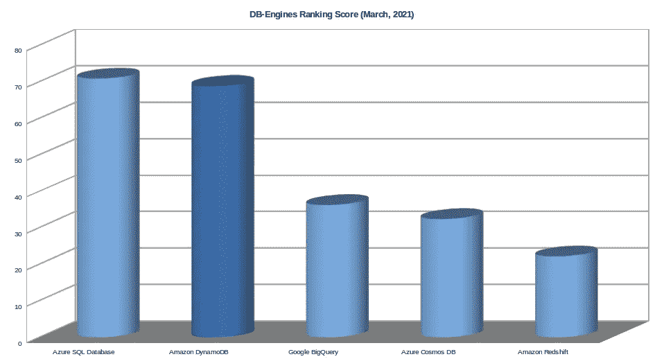

图片由作者提供(数据: [DB-Engines](https://db-engines.com/en/ranking)

《2020 年栈溢出开发者调查》将 DynamoDB 列为 2020 年第 11 大最受欢迎的数据库。考虑到 DynamoDB 是该列表中唯一的公共云数据库，这是一个壮举:

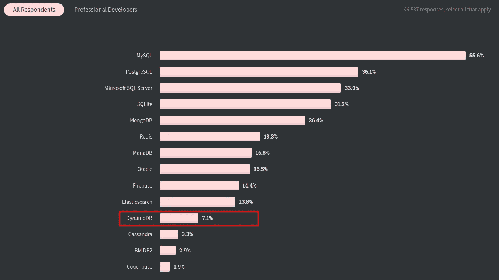

来源:[堆栈溢出开发者调查，2020 年](https://insights.stackoverflow.com/survey/2020#technology-databases-all-respondents4)

## 趋势

自 2012 年推出以来，DynamoDB 是业内最时尚的数据库之一。DB-Engines 显示了 DynamoDB 在其整个生命周期内的持续增长趋势:

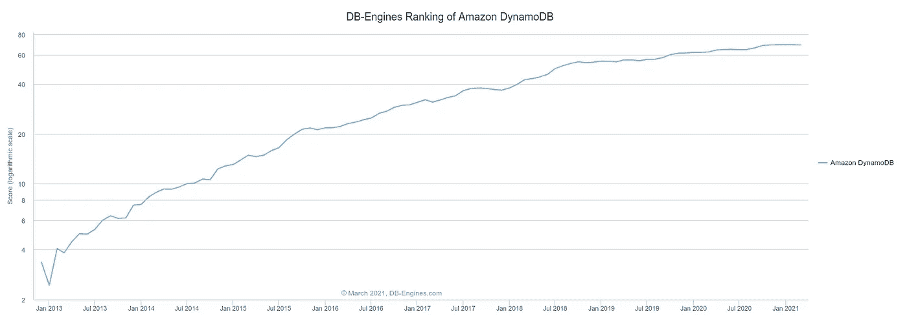

来源: [DB-Engines](https://db-engines.com/en/ranking_trend)

谷歌趋势还显示，在过去十年中，DynamoDB 的受欢迎程度呈线性增长:

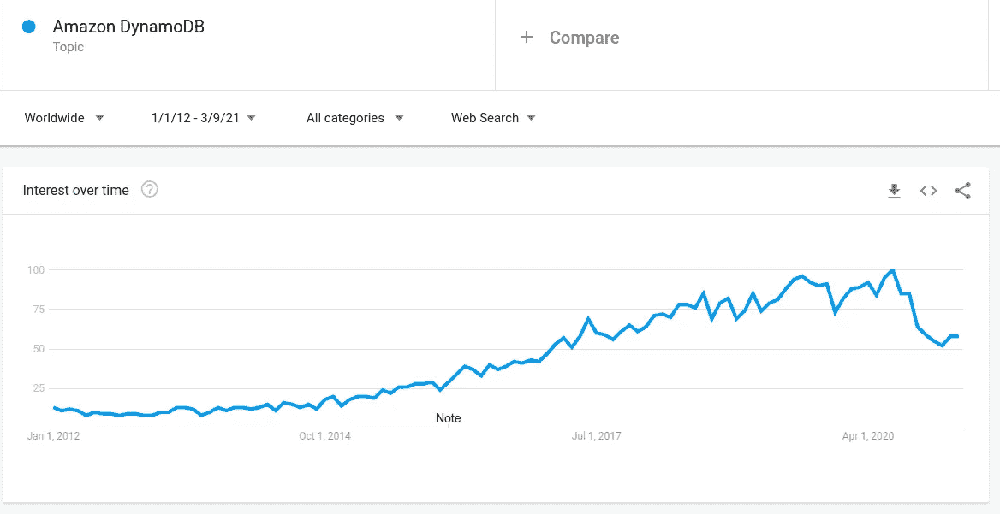

来源:[谷歌趋势](https://trends.google.com/trends)

# 2.谷歌大查询

很少有公司能像谷歌一样处理如此庞大的数据集。难怪谷歌凭借许多新颖的想法和创新引领着 21 世纪的大数据格局。在本世纪初，谷歌发现“一刀切”的 SQL 数据库对于分析工作负载来说不够好。他们开发了一个新的数据库“Dremel”，用于数据仓库，即处理大量的分析数据。谷歌在 2010 年发表了一篇论文，“ [**Dremel:网络规模数据集的交互分析**](https://static.googleusercontent.com/media/research.google.com/en//pubs/archive/36632.pdf) **，”**将他们的发现公之于众。

后来，谷歌在 2011 年将他们内部的 Dremel 数据库公开为 BigQuery 数据库。从那时起，它就是数据仓库和分析负载的领先和最具创新性的数据库。谷歌云(GCP)在数据存储领域有着强大的影响力，BigQuery 在其中发挥着举足轻重的作用。

## 5 个关键特征

*   高度可扩展的多云数据仓库解决方案，具有独立的存储、计算和处理能力。
*   它采用无服务器体系结构，具有受管配置、维护、安全性和可扩展性。它具有多位置复制存储的自动高可用性。
*   BigQuery ML 使用户能够使用标准的 SQL 查询在 BigQuery 中创建和执行机器学习模型。
*   其高速流插入 API 为实时分析提供了坚实的基础。
*   [BI 引擎](https://cloud.google.com/bi-engine/docs/sql-interface-overview)(内存分析服务)通过标准 ODBC/JDBC 为流行的 BI 工具提供亚秒级查询响应时间和高并发性。

## 何时使用大查询

*   对于大规模(Pb 级)数据仓库解决方案。
*   当需要内置 ML 和 AI 集成时，例如 TensorFlow。
*   当实时分析是一项重要要求时。
*   何时需要地理空间数据类型。
*   当首选无服务器数据库时。

## **何时不用大查询**

*   它的多云产品“BigCloud Omni”仍处于“私有 alpha”阶段。在多云场景中慎用。
*   作为需要 ACID 事务保证的主数据库(OLTP)。
*   由于法规、数据保护或重要的业务机密而首选本地数据库时。
*   当需要文档数据库或图形数据库时。
*   当数据集不大时。

## 可供选择的事物

*   [亚马逊红移](https://aws.amazon.com/redshift)
*   [雪花](https://www.snowflake.com)
*   [SAP 数据仓库云](https://www.sap.com/uk/products/data-warehouse-cloud.html)
*   [IBM Db2 仓库](https://www.ibm.com/products/db2-warehouse)
*   [Azure Synapse 分析](https://azure.microsoft.com/en-us/services/synapse-analytics)
*   [Oracle 自治数据仓库](https://www.oracle.com/autonomous-database/autonomous-data-warehouse/)
*   [Teradata](https://www.teradata.co.uk)

## 人气:

BigQuery 彻底改变了数据仓库。根据 DB-Engines 排名，它是第三大最受欢迎的云数据库:

作者图片(数据: [DB-Engines](https://db-engines.com/en/ranking) )

## 趋势

BigQuery 的受欢迎程度在过去几年里急剧上升，这一点已被 DB-Engines 趋势所证实:

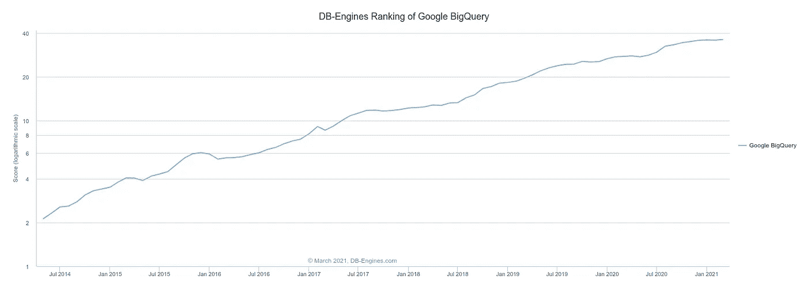

来源: [DB-Engines](https://db-engines.com/en/ranking_trend)

它是最时尚的数据仓库解决方案之一，近年来引起了广泛的关注，如下所示:

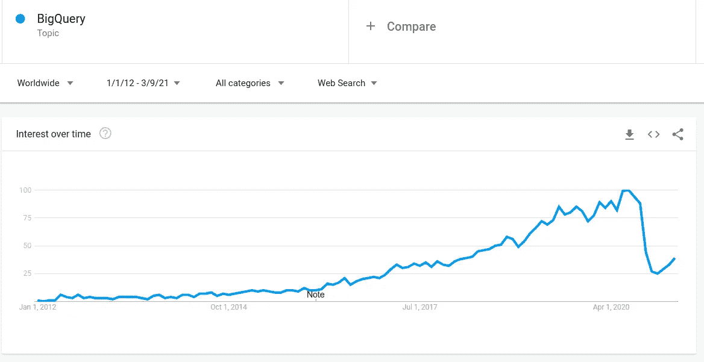

来源:[谷歌趋势](https://trends.google.com/trends)

# 3.Azure SQL 数据库

微软是数据库领域的另一个大玩家。凭借 Microsoft SQL Server，微软主导了中端 Windows 系统的商业数据库市场。当微软在 2010 年代采用云优先的方法时，它在微软 SQL Server 上提供了托管数据库服务。在接下来的几年中，Microsoft 托管的 SQL Server 经历了许多变化。

目前，Azure SQL 数据库不仅是微软 SQL Server 的托管数据库即服务，还提供了许多其他增值的额外功能。对于许多企业来说，尤其是那些已经在使用 Microsoft SQL Server 的企业，它是云中的首选数据库，因为他们可以轻松地将其本地 Microsoft SQL Server 迁移到云中。

## 5 个关键特征

*   Azure 云上的托管 SQL 数据库。
*   除了独立的数据库，它还提供灵活的弹性池，以经济高效的方式管理和扩展具有可变负载的多个数据库。
*   它提供无服务器计算层。
*   这是一个超大规模的 SQL 数据库，即使在基础架构出现故障的情况下也具有 99.99%的可用性，几乎可以即时备份，并且可以快速恢复数据库。
*   除了标准层，它还为超大规模 SQL 数据集提供超大规模服务层。
*   以轻松的方式将本地 Microsoft SQL 数据库提升并转移到 Azure SQL 数据库。

## 何时使用 Azure SQL 数据库

*   如果 Azure 是首选的公共云提供商。
*   如果一家公司已经拥有 Microsoft SQL 服务器，并希望将其迁移到云中。
*   出于各种原因(大型 SQL 数据库、快速备份/恢复、高吞吐量)，需要超大规模的 SQL 数据库。
*   如果企业级数据保护需要加密、身份验证，限制用户对数据的适当子集的访问。
*   如果出于成本目的需要数据库的弹性池。

## 何时不使用 Azure SQL 数据库

*   当 Azure 不是首选的公共云提供商时。
*   由于法规、数据保护或关键业务需求而首选本地数据库时。
*   当需要柱状数据库或图形数据库时。
*   当需要分布式 SQL (NewSQL)数据库时。
*   当数据是半结构化和非结构化时。

## 可供选择的事物

*   [MySQL](https://www.mysql.com/)
*   [神谕](https://www.oracle.com/database/)
*   [PostgreSQL](https://www.postgresql.org/)
*   [马里亚布](https://mariadb.org/)
*   [IBM Db2](https://www.ibm.com/analytics/db2)
*   [亚马逊极光](https://aws.amazon.com/rds/aurora)
*   [谷歌云扳手](https://cloud.google.com/spanner)

## 人气:

Azure SQL 数据库不像这个列表中的其他一些数据库那样具有破坏性或创新性。但是云中的托管 SQL 数据库有着巨大的市场。在这个领域，Azure SQL 数据库表现出色。

根据 DB-Engines 排名，它是最受欢迎的公共云数据库:

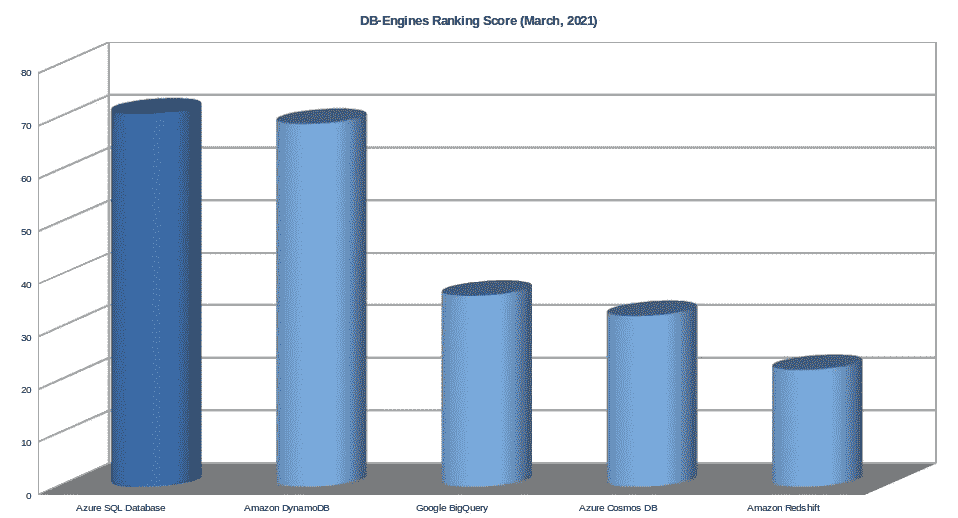

图片由作者提供(数据: [DB-Engines](https://db-engines.com/en/ranking)

## 趋势

Azure SQL 数据库不像该列表中的其他一些数据库那样具有趋势性。但在过去十年中，它仍然产生了积极的趋势，前一年出现了高峰:

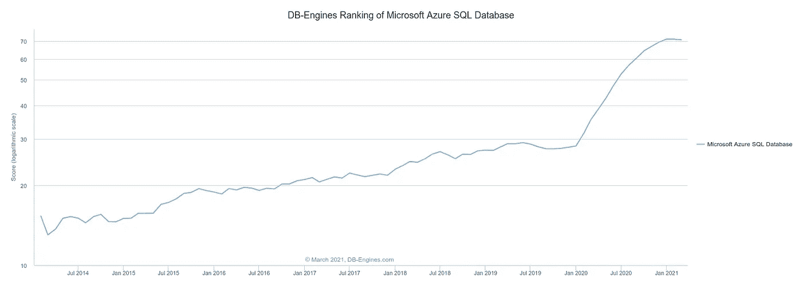

来源: [DB-Engines](https://db-engines.com/en/ranking_trend)

Google trends 也显示了 Azure SQL 数据库的稳定趋势。

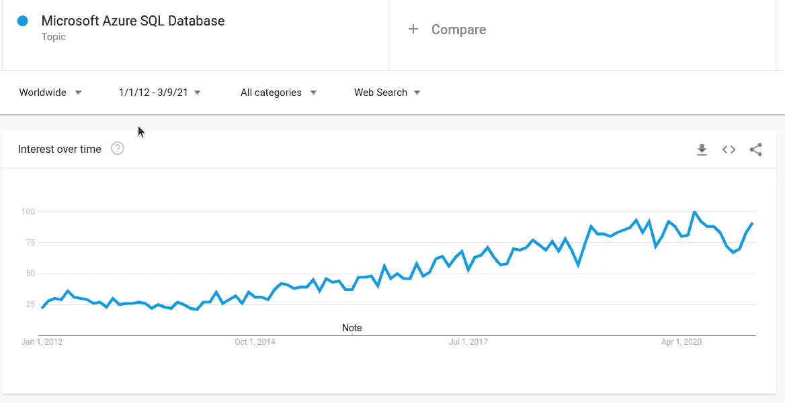

来源:[谷歌趋势](https://trends.google.com/trends)

# 4.天蓝色宇宙数据库

微软是传统的大型科技公司，业务遍及全球。当微软在 2010 年启动云优先政策时，他们希望开发自己的星球级 NoSQL 数据库，以关注最大的灵活性和开发者友好性。最后，经过七年的密集研发，他们在 2017 年发布了他们的多模型、多一致性、全球分布式数据库 Azure Cosmos DB。在许多方面，Azure Cosmos DB 引入了数据库技术中的几个新特性。虽然它不是第一个多模型数据库，但它是迄今为止最先进的多模型数据库。它还提供了额外的开发人员友好的特性。

如今，Azure Cosmos DB 是市场上增长最快的数据库之一。在现代，寻找“主数据库”，即“一个数据库来管理所有数据库”，是一个热门话题。在所有潜在的“主数据库”候选者中，Azure Cosmos DB 是目前最合适的候选者。

## 关键特征

*   面向云的多模型、全球规模的 NoSQL 数据库。
*   它支持几乎所有的主流数据模型:文档数据库(半结构化数据)，高度关系数据的图形数据库，高吞吐量数据的宽列存储。
*   它还提供了多种已知的访问模式和 API:SQL、MongoDB API(文档数据库)、Cassandra API(宽列数据库)和 Gremlin(图形数据库)。
*   它提供了最高级的一致性级别和有保证的 SLA:强的、有限的陈旧性、会话、一致的前缀、最终。
*   它是一个全球分布式数据库系统，允许以一位数毫秒延迟从数据库的本地副本中读取和写入数据。

## 何时使用 Azure Cosmos DB

*   当需要多模型 SQL 数据库时。
*   当需要具有行业标准 API 的 NoSQL 数据库时。
*   当需要具有灵活一致性级别的全局分布式数据库时。
*   当 Microsoft Azure 是首选公共云时。
*   当需要完全受管理的无服务器数据库时。

## **何时不用 Azure Cosmos DB**

*   当 Microsoft Azure 不是首选的公共云提供商时。
*   当由于法规、数据保护或关键业务机密而首选本地数据库时。
*   当需要数据仓库系统时。
*   当需要分布式 SQL (NewSQL)数据库时。
*   如果预算和成本是一个问题，相对昂贵的 Cosmos DB 不是一个好的选择。

## 可供选择的事物

*   [MongoDB](https://riak.com/index.html)
*   [里亚克](https://riak.com/index.html)
*   [蔚蓝宇宙 DB](https://docs.microsoft.com/en-us/azure/cosmos-db/)
*   [沙发底座](https://www.couchbase.com/)
*   [CouchDB](https://couchdb.apache.org/)
*   卡桑德拉
*   [亚马逊 DynamoDB](https://aws.amazon.com/dynamodb)
*   [Neo4j](https://neo4j.com)

## 人气:

Azure Cosmos DB 是这个列表中最年轻的数据库，也是最近四年才上市的。尽管如此，它在行业中的采用率非常高，在云数据库普及度方面排名第四:

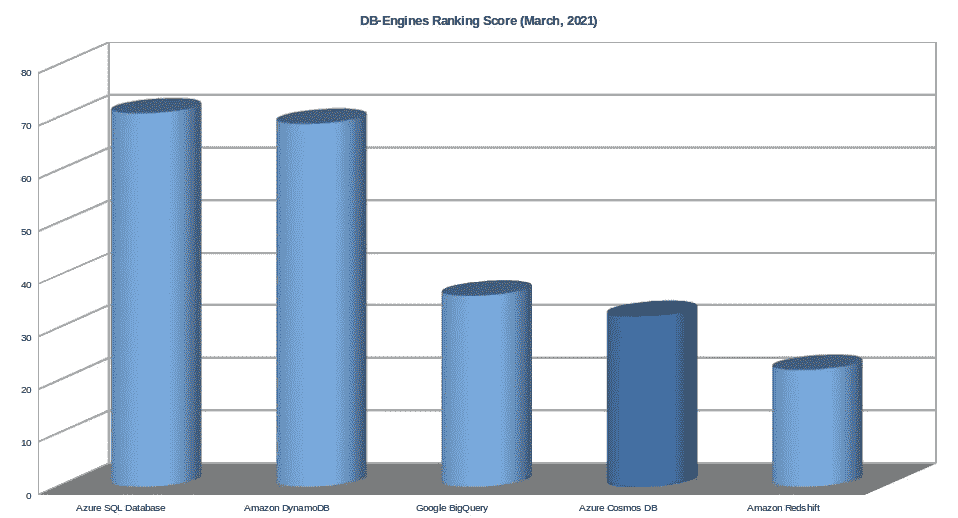

作者图片(数据: [DB-Engines](https://db-engines.com/en/ranking) )

## 趋势

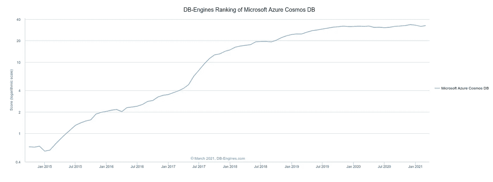

来源: [DB-Engines](https://db-engines.com/en/ranking_trend)

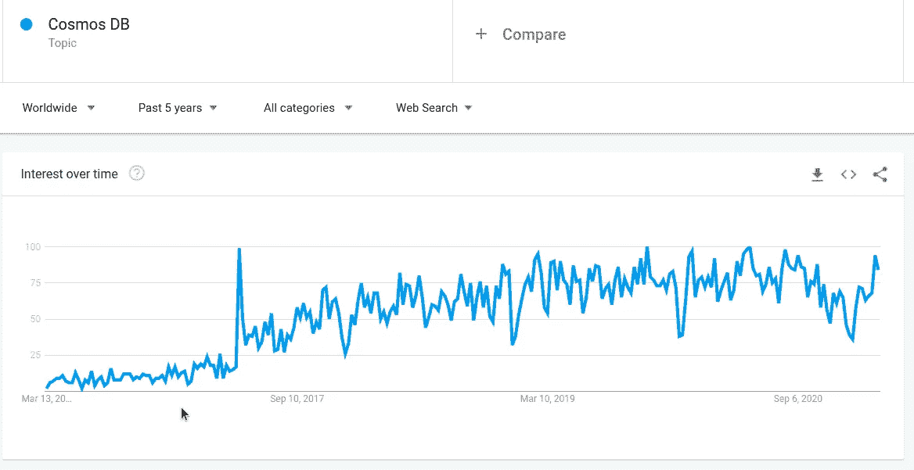

来源:[谷歌趋势](https://trends.google.com/trends)

# 5.亚马逊红移

作为领先的先锋云提供商，亚马逊希望快速发展。众所周知，亚马逊采用了许多开源数据存储，并在此基础上构建了自己的 AWS 服务。当谷歌在 2011 年用 Big Query 撼动数据仓库场景时，亚马逊采用了流行和创新的 SQL 数据库 PostgreSQL，并在此基础上构建了自己的数据仓库解决方案。2013 年，他们发布了亚马逊红移(Amazon Redshift)作为企业级云数据仓库解决方案。

由于 AWS 在公共云领域的主导地位，Amazon Redshift 是领先的数据仓库解决方案之一。另一方面，由于对 PostgreSQL 的强烈依赖，Amazon Redshift 的发展速度不如其竞争对手(如 BigQuery、Snowflake)。

## 5 个关键特征

*   完全托管、云就绪、Pb 级数据仓库解决方案。
*   与许多 AWS 云和数据服务无缝协作(S3、[亚马逊雅典娜](https://aws.amazon.com/athena/)、[亚马逊 EMR](https://aws.amazon.com/emr/) 、 [DynamoDB](https://aws.amazon.com/dynamodb/) 和[亚马逊 SageMaker](https://aws.amazon.com/sagemaker/) )。
*   与 AWS 分析生态系统的本机集成(ETL 的 [AWS Glue](https://aws.amazon.com/glue/) ，高级 BI 的 [Amazon QuickSight](https://aws.amazon.com/quicksight/) ，安全数据湖的 [AWS Lake Formation](https://aws.amazon.com/lake-formation/) )。
*   凭借其硬件加速的查询缓存 AQUA，它可以提供 10 倍的查询性能。
*   它的无共享大规模并行处理(MPP)带来了缓存、高效存储、闪电般的分析查询和并发分析。

## 何时使用亚马逊红移

*   对于大规模(Pb 级)数据仓库解决方案。
*   当亚马逊是你的公共云提供商时。
*   当各种亚马逊数据分析工具和数据平台已经在使用的时候。
*   当团队熟悉 PostgreSQL 语法和连接性时。
*   除了增强的数据库安全功能，Amazon 还有一个广泛的集成合规计划。

## 什么时候不用亚马逊红移

*   当亚马逊不是你的公共云提供商时。
*   当需要内置 ML 和 AI 集成时，例如 TensorFlow。
*   作为需要 ACID 事务保证的主数据库(OLTP)。
*   当由于法规、数据保护或关键业务机密而首选本地数据库时。
*   当具有即时水平扩展的无服务器数据仓库成为关键需求时。

## 可供选择的事物

*   [大查询](https://cloud.google.com/bigquery)
*   [雪花](https://www.snowflake.com)
*   [SAP 数据仓库云](https://www.sap.com/uk/products/data-warehouse-cloud.html)
*   [IBM Db2 仓库](https://www.ibm.com/products/db2-warehouse)
*   [Azure Synapse Analytics](https://azure.microsoft.com/en-us/services/synapse-analytics)
*   [甲骨文自主数据仓库](https://www.oracle.com/autonomous-database/autonomous-data-warehouse/)
*   [Teradata](https://www.teradata.co.uk)

## 人气:

从受欢迎程度来看，亚马逊红移在这个列表中落后于其他公共云数据库，如下图:

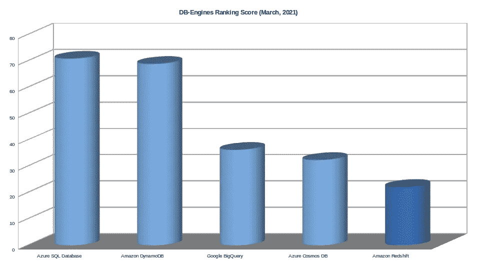

图片由作者提供(数据: [DB-Engines](https://db-engines.com/en/ranking)

## 趋势

亚马逊红移不是市场上最时尚的数据仓库解决方案，落后于 BigQuery 和雪花。近年来，它的牵引力变得平缓，如 DB-Engines 趋势所示:

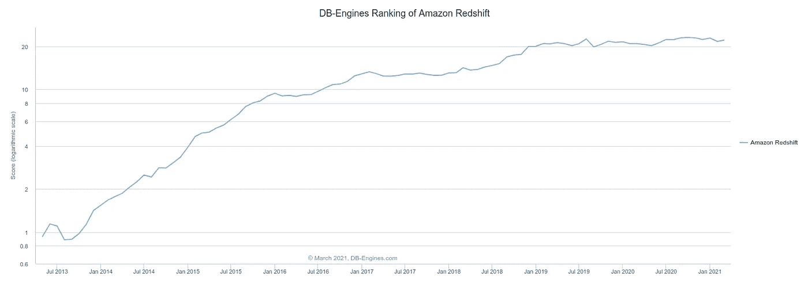

来源: [DB-Engines](https://db-engines.com/en/ranking_trend)

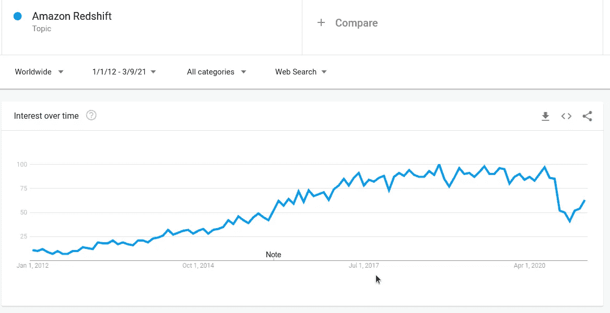

来源:[谷歌趋势](https://trends.google.com/trends)

# 结论

在这个列表中，Amazon SQL 数据库是唯一的公有云 SQL 数据库。

Amazon DynamoDB 是云数据库中使用最多的 NoSQL 数据库。

Google BigQuery 彻底改变了数据仓库的面貌，是最具创新性的数据仓库解决方案。Amazon Redshift 是构建在 PostgreSQL 服务器上的另一个流行的数据仓库解决方案。

尽管相对较新，Azure Cosmos DB 是一个非常有前途的数据库，是 master 数据库的主要候选数据库。

许多其他公共云数据库无法进入这一候选名单。其中，Google Spanner 和 Amazon Aurora 在分布式 SQL 数据库领域前景非常看好。

如果您已经在公共云中或者计划迁移到公共云中，您也应该考虑公共云数据库。公共云数据库将继续存在，并将在未来的不同场景中提供托管数据库。

# 类似文章

 [## 2021 年将使用的 10 大数据库

### MySQL，Oracle，PostgreSQL，微软 SQL Server，MongoDB，Redis，Elasticsearch，Cassandra，MariaDB，IBM Db2

towardsdatascience.com](/top-10-databases-to-use-in-2021-d7e6a85402ba)  [## 微服务架构及其 10 个最重要的设计模式

### 微服务架构、每个微服务的数据库、事件源、CQRS、Saga、BFF、API 网关、扼杀者、电路…

towardsdatascience.com](/microservice-architecture-and-its-10-most-important-design-patterns-824952d7fa41)  [## 关于 2021 年软件发展趋势的 21 个预测

### 云、边缘、容器、量子、区块链、AI、深度学习、批处理、流媒体、数据库、编程、软件……

towardsdatascience.com](/21-predictions-about-the-software-development-trends-in-2021-600bfa048be)