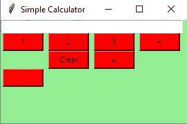
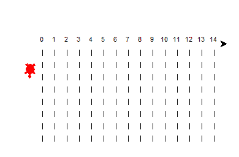

# 5 个最好的 Python 项目，代码可以在一小时内完成！

> 原文：<https://towardsdatascience.com/5-best-python-projects-with-codes-that-you-can-complete-within-an-hour-fb112e15ef44?source=collection_archive---------3----------------------->

## 用完整的代码构建五个很酷的 Python 项目，开发人员可以在一个小时内完成这些项目，并添加到您的简历中！


由 [Unsplash](https://unsplash.com?utm_source=medium&utm_medium=referral) 上的 [krakenimages](https://unsplash.com/@krakenimages?utm_source=medium&utm_medium=referral) 拍摄的照片

Python 对于任何开发人员来说都是一种非凡的编程语言，因为它简单、易用、功能多样。除了每个即将到来的版本所带来的持续发展、改进和进步之外，Python 拥有最具支持性和最成熟的社区，该社区拥有大量富有成效和有用的资源，可以以各种可能的方式帮助您。

在 Python 及其等效库的帮助下，我们可以通过构建不同类型的独特项目来实现巨大的成就。Python 的灵活性允许您探索任何您想探索的选项，并且大量精彩的资源将帮助您更轻松地完成您想要的任务。因此，开始从事大量的 Python 项目来添加到你的简历中是一个很棒的主意。

我试图涵盖大多数对初学数据科学的爱好者和程序员有用的主题。如果您有兴趣学习如何在 12 个月内掌握数据科学，您应该查看以下指南，其中建议了实现这一目标必须遵循的 12 个步骤。

[](/12-steps-for-beginner-to-pro-in-data-science-in-12-months-c6f6ba01f96e) [## 12 个月内数据科学从初学者到专业人士的 12 个步骤！

### 每月遵循一步，到第二年年底掌握数据科学！

towardsdatascience.com](/12-steps-for-beginner-to-pro-in-data-science-in-12-months-c6f6ba01f96e) 

在本文中，我们将看看五个不同的令人惊叹的项目，您可以使用 Python 及其库来构建它们。您可以在一个小时的时间范围内有效地计算在各自部分中提到的所有项目。我们将从四个简单的 Python 项目开始，以及一个涉及人工智能的稍微复杂一点的 Python 任务。让我们开始建设我们的项目吧！

# 1.提醒提醒:

在 Python 的帮助下，自动化大多数任务变得非常容易，否则这些任务对人类来说会被认为是棘手或复杂的。在适当的库和编码模式的帮助下，有可能在 Python 的帮助下自动化您的 PC 来实现合适的任务。在这一节中，我们将探索一个类似的项目，通过它我们可以执行这样一种类型的自动化，这将通过提醒我们要完成的任务的警报来提示我们。

在第一个项目中，我们将研究如何及时设置提醒警报，以便您能得到相应的通知。对于这个任务，我们将利用两个基本的库来完成这个项目。Python 中导入的时间模块和 plyer 库(可以用简单的 pip 命令安装)可以用来指定相应的通知请求。下面提供的代码块是实现该项目的预期结果的一个很好的起点。

```
import time
from plyer import notificationif __name__ == "__main__":
    while True:
        notification.notify(
            title = "ALERT!!!",
            message = "Take a break! It has been an hour!",
            timeout = 10
        )
        time.sleep(3600)
```

上述代码示例演示了此 Python 项目的过程性工作。然而，还可以实现许多进一步的改进和提高。有关使用以下项目和库可以完成的整个过程的完整说明，请访问下面提供的链接，因为与以下主题相关的每个概念和属性都有详细介绍。

[](/python-project-to-improve-your-productivity-for-the-new-year-1956824eddb1) [## Python 项目，提高您新一年的工作效率！

### 这是一个简单、有趣且有用的 Python 项目，旨在为即将到来的新年提高您的工作效率！

towardsdatascience.com](/python-project-to-improve-your-productivity-for-the-new-year-1956824eddb1) 

# 2.Python 计算器:

用 Python 创建计算器是一项有趣的任务。在我以前的文章中，我们已经探讨了计算器的几个概念，从执行简单计算的简单计算器到构建具有微分和积分的更复杂的计算器架构。虽然以下代码块利用了纯代码和即时响应，但在本项目中，我们将重点关注使用 Python 创建一个更具交互性的图形用户环境。

对于这个项目，在第一个代码块中，我们将声明声明表达式、创建按钮和等号按钮工作的所有基本要求和强制函数。下面是该项目的第一个示例代码块。该示例代码块的完整代码参考来自以下[网站](https://www.geeksforgeeks.org/python-simple-gui-calculator-using-tkinter/)。有关更多信息和整个编码过程，请参考它。

```
# Import Tkinter
from tkinter import *# globally declare the expression variable
expression = ""# Function to update expression in the text entry box
def press(num):
 global expression
 expression = expression + str(num)
 equation.set(expression)# Function to evaluate the final expression
def equalpress():
 try:
  global expression
  total = str(eval(expression))equation.set(total)
  expression = ""except:equation.set(" error ")
  expression = ""
```

在下一个示例代码块中，我们将查看基本 GUI 界面的构造，在该界面中，您可以显示大量按钮并构造整个项目。出于这个示例代码块的目的，我将只显示创建一些基本功能的一些基本元素。从 1 到 3 的数字可以如下创建，我们可以在单击 equals 按钮后测试加法运算。单击按钮元素以显示数字，并相应地执行所需的操作。计算完成后，您可以单击“等于”按钮来显示最终结果。

```
# Driver code
if __name__ == "__main__":
 # create a GUI window
 gui = Tk()# set the background colour of GUI window
 gui.configure(background="light green")# set the title of GUI window
 gui.title("Simple Calculator")# set the configuration of GUI window
 gui.geometry("270x150")# we create an instance of this class
 equation = StringVar()# create the text entry box for
 expression_field = Entry(gui, textvariable=equation)# grid method is used for placing
 expression_field.grid(columnspan=4, ipadx=70)# create a Buttons and place at a particular.
 button1 = Button(gui, text=' 1 ', fg='black', bg='red',
     command=lambda: press(1), height=1, width=7)
 button1.grid(row=2, column=0)button2 = Button(gui, text=' 2 ', fg='black', bg='red',
     command=lambda: press(2), height=1, width=7)
 button2.grid(row=2, column=1)button3 = Button(gui, text=' 3 ', fg='black', bg='red',
     command=lambda: press(3), height=1, width=7)
 button3.grid(row=2, column=2)plus = Button(gui, text=' + ', fg='black', bg='red',
    command=lambda: press("+"), height=1, width=7)
 plus.grid(row=2, column=3)equal = Button(gui, text=' = ', fg='black', bg='red',
    command=equalpress, height=1, width=7)
 equal.grid(row=5, column=2)clear = Button(gui, text='Clear', fg='black', bg='red',
    command=clear, height=1, width=7)
 clear.grid(row=5, column='1')Decimal= Button(gui, text='.', fg='black', bg='red',
     command=lambda: press('.'), height=1, width=7)
 Decimal.grid(row=6, column=0)
 # start the GUI
 gui.mainloop()
```



作者图片

要查看关于这个主题的更多信息，我建议查看来自 [Geek for Geeks](https://www.geeksforgeeks.org/python-simple-gui-calculator-using-tkinter/) 的参考资料。如果你有兴趣通过视频指南了解这个概念，我建议你在 [YouTube](https://www.youtube.com/watch?v=F5PfbC5ld-Q) 上跟随这个视频指南。如果您想了解更多关于图形用户界面和其他可用选项的信息，请查看我以前的一篇文章，其中介绍了七种这样的工具，以及一些用于项目开发的入门代码。

[](/7-best-ui-graphics-tools-for-python-developers-with-starter-codes-2e46c248b47c) [## 7 款面向 Python 开发人员的最佳 UI 图形工具，带入门代码

### Python 中用于开发酷用户界面技术的七个最佳 UI 图形工具

towardsdatascience.com](/7-best-ui-graphics-tools-for-python-developers-with-starter-codes-2e46c248b47c) 

# 3.构建您自己的有声读物画外音:

有声读物画外音项目，顾名思义，会涉及一些文字和语音需求。对于这个 Python 项目，我们将把信息转换成文本，并获得一个您可以自动收听的语音记录。该项目将包括两个主要阶段。

第一阶段是将文本数据转换成音频记录，第二步是将电子书翻译成可读格式。对于第一项任务，我们将使用 Python 来利用 Google 文本到语音转换，而在第二阶段，我们将利用光学字符识别(OCR)技术来实现可能的最佳结果。

从项目的第一阶段开始，我们可以开始探索谷歌文本到语音(GTTS)模块，以实现将文本信息转换为音频文件的任务。一旦我们获得了这个音频文件的可播放版本，我们可以选择保留或删除这个特定的文件。执行以下操作的代码如下。

```
from gtts import gTTS
import ostext = "Hello! My name is Bharath."tts = gTTS(text)
tts.save("hi.mp3")os.system("hi.mp3")
```

为了获得更多的信息和了解关于这个库工作的复杂细节，建议通过下面提供的链接查看我以前的一篇文章，这篇文章广泛地讨论了这个主题。

[](/how-to-get-started-with-google-text-to-speech-using-python-485e43d1d544) [## 如何使用 Python 开始使用 Google 文本到语音转换

### 从零开始的文本到语音转换简介

towardsdatascience.com](/how-to-get-started-with-google-text-to-speech-using-python-485e43d1d544) 

在这个项目的第二阶段，我们将专注于将通常为 PDF(或文本文件)格式的电子书阅读成文本描述，以便 GTTS 模块可以阅读。阅读 pdf 或图像中的信息需要使用光学字符识别(OCR)技术。我们将使用 Pytesseract 模块进行这些 OCR 转换。

Pytesseract OCR 模块是解释视觉信息并从特定图像或文档中提取文本描述的最佳选项之一。让我们用这两种技术计算构建有声读物阅读器项目的最终代码块。

```
#Importing the libraries
import cv2
import pytesseract
from PIL import Image
from gtts import gTTS
from playsound import playsound# Specifying the path
pytesseract.pytesseract.tesseract_cmd = r'C:/Program Files/Tesseract-OCR/tesseract.exe'

# Reading the image 
image = cv2.imread('1.png')

# Extraction of text from image
text = pytesseract.image_to_string(image)

# Printing the text
print(text)# Create the voice_text variable to store the data.

voice_text = ""

# Pre-processing the data

for i in text.split():
    voice_text += i + ' '

voice_text = voice_text[:-1]
voice_text

tts = gTTS(voice_text)
tts.save("test.mp3")
playsound("test.mp3")
```

要了解关于光学字符识别和这个库模块的完整工作过程的更多信息，我建议通过下面提供的链接查看我以前的一篇关于用 Python 进行 OCR 的文章，这篇文章广泛地讨论了这个主题。

[](/getting-started-with-optical-character-recognition-using-python-e4a9851ddfab) [## 使用 Python 开始光学字符识别

### 对光学字符识别从无到有的直观理解和简要介绍

towardsdatascience.com](/getting-started-with-optical-character-recognition-using-python-e4a9851ddfab) 

# 4.Python 游戏:



作者截图

在这一节中，我们将讨论几个游戏项目，您可以借助 Python 来构建它们。借助 Python 和它提供给用户的各种模块，你可以构建各种各样的游戏。您可以构建像 hangman、tic tac toe、石头剪刀布等更多游戏，包括更多面向图形的游戏，如借助 Pygame 的 flappy bird 或 Mario 副本。

在本文的第一部分，我们将更多地讨论如何使用 Python 中不同的库来创建自己独特的游戏。借助 Python 中预先构建的库模块(如 turtle 包和 random 库),您可以构建一个具有轻微图形化风格的独特项目。

在下面显示的代码块中，我们定义了一个绘制赛道的函数，一旦赛道完成，我们计划放置几只乌龟，这样它们可以互相比赛。比赛的动作可以用随机库来随机化，每次掷骰子的结果都不一样，因此哪只乌龟赢了比赛每次也不一样。

```
def treat():
    speed(0)
    penup()
    goto(-140, 140)

    for step in range(15):
        write(step, align='center')
        right(90)
        for num in range(8):
            penup()
            forward(10)
            pendown()
            forward(10)
        penup()
        backward(160)
        left(90)
        forward(20)

    turtle1 = Turtle()
    turtle1.color('red')
    turtle1.shape('turtle')
```

虽然上面的代码块是我们计划构建的项目的示例代码，但是您可以从这里继续自己的一些独特的想法，或者参考我为万圣节构建的一个有趣的 Python 项目。如果你有兴趣建立一个类似的海龟赛跑项目，请点击下面的链接。这是一个详细的指南，告诉你如何在不需要太多编程知识的情况下，用独特而有趣的想法创建任何类型的 Python 游戏。

[](/simple-fun-python-project-for-halloween-ff93bbd072ad) [## 简单有趣的万圣节 Python 项目！

### 这是一个有趣的“不给糖就捣蛋”的游戏，让你在万圣节愉快地学习 python 编程

towardsdatascience.com](/simple-fun-python-project-for-halloween-ff93bbd072ad) 

对于第二部分，您可以使用 Pygame 构建大量项目。它是 Python 中最好的库之一，允许你在许多不同的游戏项目上工作。你可以用这个游戏库建立更简单的项目想法，或者用深度学习和强化学习构建更复杂的项目。如果你有兴趣了解更多关于开发游戏的知识，以及为什么你应该用 Python 和人工智能自己开发一个游戏，那么请从下面提供的链接查看下面的文章。

[](/5-reasons-why-you-should-develop-a-game-with-python-and-ai-9f5f276e7637) [## 你应该用 Python 和 AI 开发游戏的 5 个理由！

### 学习创建一个游戏对提高你的 Python 工作效率大有裨益的 5 个原因…

towardsdatascience.com](/5-reasons-why-you-should-develop-a-game-with-python-and-ai-9f5f276e7637) 

# 5.情感分析:


[腾雅特](https://unsplash.com/@tengyart?utm_source=medium&utm_medium=referral)在 [Unsplash](https://unsplash.com?utm_source=medium&utm_medium=referral) 上拍摄的照片

与我们之前讨论的项目不同，情感分析项目将涉及更多与人工智能相关的其他等效主题，如机器学习和深度学习。然而，我发现可以在许多不同的层次上执行多种多样的情感分析，并且复杂性可以随着任何特定操作的每种变化而不断提高，类似于本文第二点中描述的计算器项目。

让我们首先了解什么是情感分析，以及如何用一个示例代码块在 Python 中执行以下操作。[情感分析](https://en.wikipedia.org/wiki/Sentiment_analysis)(也称为观点挖掘或情感 AI)是指利用自然语言处理、文本分析、计算语言学和生物识别技术，系统地识别、提取、量化和研究情感状态和主观信息。

为了执行情感分析的任务，我们可以借助多种方法来获得最成功的结果。通常，对于初学者来说，最好的方法是在清理可用的文本数据并执行标记化的所有基本操作后，从众多的机器学习算法开始。像逻辑回归和朴素贝叶斯这样的机器学习算法是解决这个问题的方法。

我们将在本文中构建的项目将使用自然语言处理工具包的一些元素和内置的朴素贝叶斯算法。我们正在尝试使用电影语料库数据集，并执行某种类型的情感分析。下面显示的完整代码块取自下面的[链接](https://www.datacamp.com/community/tutorials/simplifying-sentiment-analysis-python)。查看以下主题的更多信息和细节。

```
# Load and prepare the dataset
import nltk
from nltk.corpus import movie_reviews
import randomdocuments = [(list(movie_reviews.words(fileid)), category)
              for category in movie_reviews.categories()
              for fileid in movie_reviews.fileids(category)]random.shuffle(documents)# Define the feature extractorall_words = nltk.FreqDist(w.lower() for w in movie_reviews.words())
word_features = list(all_words)[:2000]def document_features(document):
    document_words = set(document)
    features = {}
    for word in word_features:
        features['contains({})'.format(word)] = (word in document_words)
    return features# Train Naive Bayes classifier
featuresets = [(document_features(d), c) for (d,c) in documents]
train_set, test_set = featuresets[100:], featuresets[:100]
classifier = nltk.NaiveBayesClassifier.train(train_set)# Test the classifier
print(nltk.classify.accuracy(classifier, test_set))
```

如果您有兴趣用更深入的学习方法来处理下面的问题陈述，那么您应该考虑使用 LSTMs 开始寻找解决方案。然后，你可以用一种更复杂的方法来处理下面的问题，这种方法是从序列到序列模型，或者使用一维卷积层等等。作为起点，我建议查看下面的[链接](https://techvidvan.com/tutorials/python-sentiment-analysis/)，开始使用情绪分析项目的深度学习方法。

如果您有兴趣了解更多关于自然语言处理和其他类似任务的信息，您可以使用 NLP 和深度学习来执行这些任务，请随时查看我以前的一个项目，该项目涵盖了下一个单词预测的主题。在这个项目中，我深入研究了如何在深度学习的帮助下构建下一个单词预测模型，并使用 LSTM 进行预测搜索。

[](/next-word-prediction-with-nlp-and-deep-learning-48b9fe0a17bf) [## 基于自然语言处理和深度学习的下一个单词预测

### 使用 LSTM 设计单词预测系统

towardsdatascience.com](/next-word-prediction-with-nlp-and-deep-learning-48b9fe0a17bf) 

# 结论:


照片由 [Aaron Burden](https://unsplash.com/@aaronburden?utm_source=medium&utm_medium=referral) 在 [Unsplash](https://unsplash.com?utm_source=medium&utm_medium=referral)

*“编写 Python 代码的乐趣应该在于看到短小、简洁、易读的类，这些类用少量清晰的代码表达了大量的动作，而不是让读者厌烦得要死的大量琐碎代码。”* **—吉多·范·罗苏姆**

Python 的简单性允许开发人员直接创建出色的项目。借助 Python 中可用的各种非凡工具，爱好者可以构建他们想要探索的几乎任何类型的项目。由于这种编程语言的多功能性，你可以构建任何类型的人工智能、数据科学、计算机视觉或自然语言项目。

在本文中，我们讨论了如何构建五个不同的 Python 项目，即自动化您的 PC、GUI 计算器、有声读物画外音、Python Hangman 游戏和情感分析。有了代码块、各种引用和其他资源，您应该能够轻松地构建这些项目，而不会有太大的困难。

完成这些项目后，采取一些你自己的选择，并开始探索和尝试这些其他的选择。不断建立越来越多的项目，直到你学到更多。如果你对这篇文章中提到的各点有任何疑问，请在下面的评论中告诉我。我会尽快给你回复。

看看我的其他一些文章，你可能会喜欢读！

[](/14-pandas-operations-that-every-data-scientist-must-know-cc326dc4e6ee) [## 每个数据科学家都必须知道的 14 个熊猫操作！

### 关于 14 种最基本的熊猫手术的完整指南

towardsdatascience.com](/14-pandas-operations-that-every-data-scientist-must-know-cc326dc4e6ee) [](/best-pc-builds-for-deep-learning-in-every-budget-ranges-3e83d1351a8) [## 在各种预算范围内，最适合深度学习的电脑

towardsdatascience.com](/best-pc-builds-for-deep-learning-in-every-budget-ranges-3e83d1351a8) [](/15-numpy-functionalities-that-every-data-scientist-must-know-f6d69072df68) [## 每个数据科学家都必须知道的 15 个数字功能

### 讨论开发人员必须学习的十五个最基本的数字函数

towardsdatascience.com](/15-numpy-functionalities-that-every-data-scientist-must-know-f6d69072df68) [](/17-must-know-code-blocks-for-every-data-scientist-c39a607a844d) [## 17 每个数据科学家都必须知道代码块

### 讨论将帮助您作为数据科学家有效处理大多数任务和项目的 17 个代码块

towardsdatascience.com](/17-must-know-code-blocks-for-every-data-scientist-c39a607a844d) [](/6-best-projects-for-image-processing-with-useful-resources-f860f3dfe977) [## 6 个最佳图像处理项目和有用的资源

towardsdatascience.com](/6-best-projects-for-image-processing-with-useful-resources-f860f3dfe977) 

谢谢你们坚持到最后。我希望你们都喜欢这篇文章。祝大家有美好的一天！