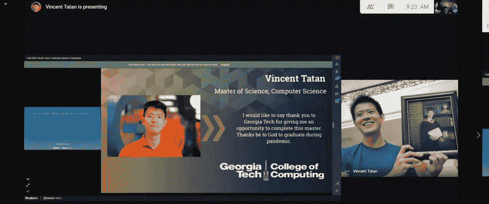
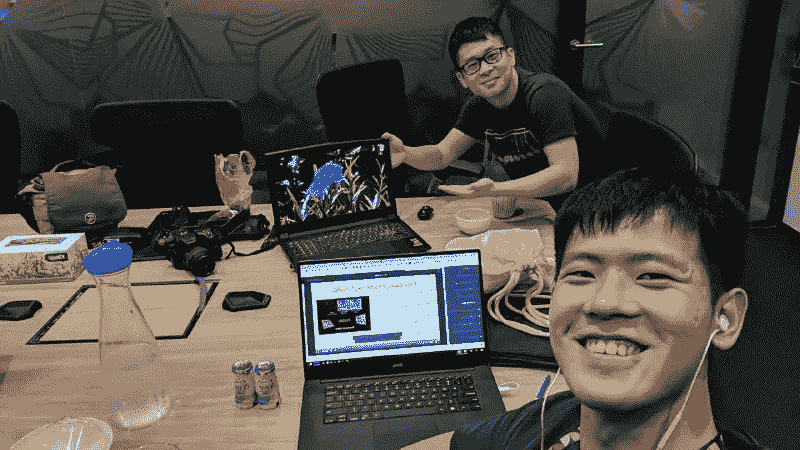

# 作为数据科学家兼顾工作和学习的 5 个最大技巧

> 原文：<https://towardsdatascience.com/5-biggest-tips-to-juggle-work-and-study-as-data-scientists-7cad143f10a?source=collection_archive---------15----------------------->

## 给有抱负的数据科学家的建议

## 我个人平衡学习、工作和生活的经验

来源( [unsplash](https://unsplash.com/photos/_wbNzlrrRK4) )

# 兼顾硕士学位和全职工作

上个月，我写了关于[我参加佐治亚理工学院 OMSCS 项目](https://medium.com/datadriveninvestor/5-reasons-why-i-enjoy-taking-online-masters-to-learn-data-science-bba05eb5641c)的兼职硕士学位的故事。从那以后，我收到了更详细地谈论斗争和艰辛的请求。

同时拥有硕士学位和全职工作是很可怕的。作业和截止日期已经占用了我周末的空闲时间。但是尽管我失去了所有的空闲时间，我相信我在生活中拥有更好的待遇。

## 在石头路的尽头寻找宝藏

我在学习和工作期间经历了改变生活的时刻:我在谷歌换了工作，我向我的女朋友(现在是未婚妻)求婚，由于疫情，我搬到雅加达和家人住在一起。

经过 10 个模块，无数艰难的项目，和 2.5 年的非全日制硕士学习，我终于毕业了。

我努力工作和努力学习的成果。感谢[阿尔伯特·宾格尔](https://medium.com/u/fcf6ad08f12d?source=post_page-----7cad143f10a--------------------------------)的图片。

# **为什么有效的学习和工作很重要？**

**作为一名数据科学家，这有三个重要原因:**

*   **首先**，您需要不断更新关于最佳实践的知识。你会发现新的 ML 和可视化技术每天都在更新，很容易迷失。
*   **第二个**，你需要刻意练习，找出知识的缺口。自满是敌人。作为一名数据专家，你需要管理好你的工作和学习。
*   **最后**，数据科学家是有竞争力和挑战性的。看看与 5 年前相比，LinkedIn 中有多少拥有*【数据科学家】*头衔的专业人士。更不用说需要不断发展的技能集——数据分析、机器学习和软件工程。

不断的创新、审慎实践的需求以及数据领域日益激烈的竞争意味着需要有效地学习和工作。

# 在学习和工作中保持领先的秘诀

在这篇文章中，我将与你分享五个提高效率的小技巧，告诉你如何在管理你的事业和人际关系的同时，在学习方面表现出色。

## 1.好好计划你的期望和时间

> 让期望与你的经理和同事保持一致。

我之所以可以一边工作一边攻读硕士学位，是因为我的经理、家人和女朋友对我的期望一致。

让我给你举个例子。光是拿大师，每周就要占用你至少 20 个小时的时间。这意味着，如果你是全职工作，它很容易占用你的周末和工作日的另一个半天。这不包括因疾病或家庭事件而导致的非生产期。

这就是为什么你应该告诉你的经理，希望偶尔在工作时间有更多的时间学习。这会让你灵活地抽出时间专注于作业或考试。

同样，你也应该安排好和家人及爱人在一起的时间。确保你得到他们的同意，优先考虑工作和学习。

## 2.稍后设计第一个代码。

> 创建设计文档将让您了解您的目标，从而消除时间沉淀并产生影响。

让我们假设你收到了一个新项目。理解了问题之后，您开始编写代码，希望能够快速解决您的项目。

但是后来你意识到你引入了很多 bugs 开源软件包被破坏，支持是可怕的。绝望中，你花了几个星期排除故障。

完成后，你意识到你的作业只分配了 20%的代码评分方案。心怀不满，你又花了一整夜写了一份草率的报告。

这个错误是不必要和昂贵的，但我发现这是常见的。

相反，您应该在构建项目时将目标以设计文档的形式表达出来:

1.  **目标:**你为什么要建这个？
2.  **最小可行产品:**对你的受众来说，什么是重要的？
3.  **研究和探索:**有什么时间和资源可以利用？
4.  **里程碑和成果:**能实现什么？
5.  **结论:**有什么总结？

作为一个例子，你可以查看这个设计文档 [**收集并分析 Yayasan Merajut Hati Instagram 数据**](https://docs.google.com/document/d/12ridJk1BtL-alomt3XXnLG_GZ68NzP6C82Ihy3M8fA8/edit#) **。**

[我为 Yayasan Merajut Hati 创建的设计文档样本](https://docs.google.com/document/d/12ridJk1BtL-alomt3XXnLG_GZ68NzP6C82Ihy3M8fA8/edit#)(来源于作者)

**3。批量你的对焦时间**

> 生产力=时间*专注

如果你是一个早起的人，不要在晚上进行高强度的编程。你会陷入时间陷阱，制造不必要的错误。

相反，把你的生产时间分配给密集的任务。你会做得更多。

就我而言，我通常早上 8 点来上班，下午 4 点下班。这是为了在早上我效率最高的时候专注于复杂的代码片段或设计文档。然后我用下午的时间放松、锻炼和管理电子邮件。

通过为工作、学习和人际关系分配时间，你会完成更多的事情。

***注:*** *有很多天你会觉得不管时间批次都不思进取。在这种情况下，休息，善待自己，必要时请几天假。*

## **4。投资更好的学习策略**。

> 对每一项都有一个好的技巧会让你养成习惯去改善和修剪低效的部分。你会学得更快，并在你的领域出类拔萃。

记笔记和最大限度地利用注意力是很重要的。您可以投资这些工具来管理您的任务和笔记:

1.  **日历应用(Google Calendar/Keep):** 花时间和自己安排会议为专注时间(通常我会放勿扰时间)。[为你的待办事项分配时间跨度，坚持你的时间表](https://www.youtube.com/watch?v=5PXw6OlYgKo)。
2.  **管理任务(看板/Trello)** : [在仪表板中组织您的每日/每周/每月任务。](https://blog.trello.com/kanban-data-nave)
3.  **记笔记(漫游/黑曜石)**:使用 [Zettelkasten](https://zettelkasten.de/) 方法记笔记。 [Zettelkasten 是一种使用链接笔记](https://en.wikipedia.org/wiki/Zettelkasten)的笔记方法，它建立了易于检索的知识存储(想象一下建立自己的图书馆语料库)。[建议你用黑曜石(免费)或者 Roam(付费)来实验](https://www.youtube.com/watch?v=lz0wZiuXCoQ)。

**5。让志同道合的朋友和同事参与进来**

艾伯特(我最好的朋友)和我在星期六早上一起学习 OMSCS

> 承认你的弱点，人无完人。找到能帮助你的人，并感谢他们。你的人际关系是你最大的资产，让你不断前进。

我和[艾伯特·宾格尔](https://medium.com/u/fcf6ad08f12d?source=post_page-----7cad143f10a--------------------------------)和[拉农·西姆](https://medium.com/u/3b62f7285717?source=post_page-----7cad143f10a--------------------------------)一起学习。他们是同样的朋友，在我因学习和工作而陷入深深孤独的时刻，他们一直陪伴着我。没有上帝的恩典和这些人际关系，我不可能超越今天的我。

同样，你应该向朋友寻求学习。目标越接近，越应该寻求帮助，一起坚持下去。一起坚持比独自奋斗更有力量。

# 总结:学习和工作就是持之以恒

周末用来学习和做项目。为了寻求新的知识和技能，牺牲了大量的闲暇时间。但是回顾奋斗的历程，我坚持了下来……我成长了。

## **通过这篇文章，我希望你学会:**

*   好好计划你的期望和时间:让你的期望与你的经理和同事保持一致。
*   **以后再设计第一个代码:**理解你的目标，避免时间下沉，交付影响。
*   **批量你的专注时间:**生产力=时间*专注
*   **投资于更好的学习策略:**培养习惯，改善和减少低效
*   让志同道合的朋友和同事参与进来:你的人际关系是你前进的最大财富。

感谢 [Albert Bingei](https://medium.com/u/fcf6ad08f12d?source=post_page-----7cad143f10a--------------------------------) 修改这篇帖子。

索利·德奥·格洛丽亚

# 来自作者的更多提示:

*   [我喜欢带在线硕士学习数据科学的 5 个原因](https://medium.com/datadriveninvestor/5-reasons-why-i-enjoy-taking-online-masters-to-learn-data-science-bba05eb5641c)
*   [如何构建你的终极数据科学投资组合](/how-to-build-your-ultimate-data-science-portfolios-ea0414d79a72)
*   [数据分析很难…以下是你如何超越的方法](/data-analytics-is-hard-here-how-you-can-excel-aa2a99d0fad0)
*   [写作分析学的隐藏宝石](/the-hidden-gems-of-writing-analytics-6db78fad5a51)

# 关于作者

我用 ML @ Google 对抗网络钓鱼。

我热爱我的工作，因为我使用先进的 ML 算法和 MLOps 来保护 Chrome、Gmail 和 Android 用户免受钓鱼攻击，窃取弱势群体的生活积蓄。

我也是一名面向数据科学媒体的作家，为全球 50 多万观众的有志 ML 和数据从业者提供指导。

在我的空闲时间，我写中型文章，在 Kaggle 上编码，为铁人三项/自行车旅行训练。

最后，请通过 [LinkedIn](http://www.linkedin.com/in/vincenttatan/?source=post_page---------------------------) 、 [Medium](https://medium.com/@vincentkernn?source=post_page---------------------------) 或 [Youtube 频道](https://www.youtube.com/user/vincelance1/videos?source=post_page---------------------------)联系文森特