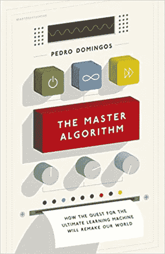
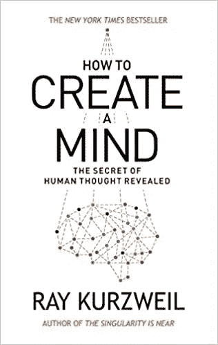
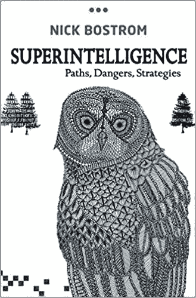
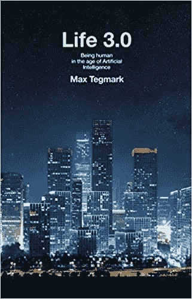
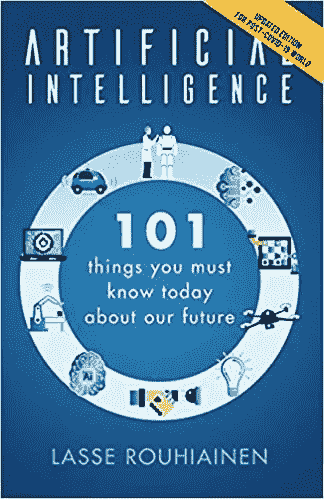

# 你可以阅读的关于人工智能的 5 本书

> 原文：<https://towardsdatascience.com/5-books-you-can-read-to-learn-about-artificial-intelligence-477b5a26277d?source=collection_archive---------9----------------------->

## 跟上时代

Pawel Czerwinski 在 [Unsplash](https://unsplash.com?utm_source=medium&utm_medium=referral) 上的照片

书，书，书！在我开始机器学习之旅之前，我从当地的 Waterstones 书店堆积了一堆关于人工智能的书籍。我的想法是尽可能多地收集关于人工智能潜力的知识，以及我是否认为这是我可以做的事情。

三年过去了，我成功地完成了从 post-man 到机器学习工程师的转变，现在我又回到了一些在我的旅程早期启发过我的书籍上。

这里有一些很棒的书，你可以拿起来学习人工智能。

## 主算法:对 Ulitmate 学习机的探索将如何重塑我们的世界

**作者**:佩德罗·多明戈斯

**来源** : [亚马逊](https://www.amazon.co.uk/Master-Algorithm-Ultimate-Learning-Machine/dp/0241004543)

对于那些害怕决策机器出现的人来说，佩德罗·多明戈斯非常清楚地表明，机器已经深深地融入我们的生活很长一段时间了。平心而论，这是有一定道理的。我们的生活是由算法运行的，当它消耗我们提供的数据时，这些算法正在学习更多关于我们的事情。一些很好的例子是 YouTube、网飞和谷歌。总的来说，这本书涵盖了对一种能够改变机器学习和我们生活的主算法的探索。

## 如何创造思维:揭示人类思维的秘密

**作者**:雷·库兹韦尔

**来源** : [亚马逊](https://www.amazon.co.uk/How-Create-Mind-Ray-Kurzweil/dp/0715647334/ref=sr_1_1?dchild=1&keywords=how+to+create+a+mind&qid=1627649833&s=books&sr=1-1)

关于计算机是否能与人类智力相匹敌的观点可能正在慢慢改变。计算机在许多任务上已经超过了人类——玩 Jeopardy 和象棋就是一个很好的例子。埃隆·马斯克关于人工智能将在 2025 年超越人类的评论进一步推动了这一论点。雷·库兹韦尔(Ray Kurzweil)是早期相信人工智能可以超越人类智力的人之一，仅仅是基于模仿负责高阶思维的基本原则和神经网络相对简单的想法。这本书分享了他的见解。

## 超级智能:路径、危险、策略

**作者**:尼克·博斯特罗姆

**来源** : [亚马逊](https://www.amazon.co.uk/Superintelligence-Dangers-Strategies-Nick-Bostrom/dp/0199678111/ref=tmm_hrd_swatch_0?_encoding=UTF8&qid=1627649868&sr=1-1)

超智能计算机通常被描绘成一台肩负接管世界使命的机器。这个想法已经存在多年，但随着我们进入人工智能时代，许多问题正在被提出。尼克·博斯特罗姆试图回答“*一旦我们设法制造出比我们更聪明的计算机，将会发生什么？*”。他分享了他的想法，关于我们可能需要采取什么行动，它将如何工作，以及为什么必须以正确的方式来保护人类。

## 生活 3.0:成为人工智能时代的人类

**作者**:马克斯·泰格马克

**来源** : [亚马逊](https://www.amazon.co.uk/Life-3-0-Being-Artificial-Intelligence/dp/024123719X/ref=tmm_hrd_swatch_0?_encoding=UTF8&qid=1627649916&sr=1-1)

这本书以一个虚构团队(Omega)的故事开始，讲述了他们如何能够使用普罗米修斯(Prometheus)接管世界——一种超级智能的人工智能，可以学习和设计任何东西。起初，你会认为这本书会像许多关于人工智能的传统电影一样，但马克斯·泰格马克做了很好的工作来引导它的方向。他强调了人工智能的粒度以及它发生的速度。泰格马克认为人工智能可能会改变人类的未来，因此人类理解硬币的两面(赞成和反对)并参与定义我们想要的未来是至关重要的——如果你没有目标，你肯定会错过。

## 人工智能:关于我们的未来，你今天必须知道的 101 件事

**作者** : Lasse Rouhiainen

**来源** : [亚马逊](https://www.amazon.co.uk/Artificial-Intelligence-Things-Today-Future/dp/1982048808)

在这份书单上的所有书中，这是我唯一还没读过的一本书。我看到它在 Goodreads 上有很好的评价，就想把它捡起来。从我对这本书的收集来看，它涵盖了人工智能如何改善和改变我们的生活。一些章节包括:人工智能如何改变许多行业，人工智能如何改变我们所知的就业市场，以及机器人&它们将如何改变我们的生活。

## 最后的想法

很多书的存在是为了帮助你学习人工智能。在每本书中，不同的作者对人工智能对未来的影响都有自己的倾向。我个人的建议是尽可能多的阅读那些详细描述争论双方的书籍，并从中得出你自己的结论。

感谢阅读！

如果你喜欢这篇文章，请通过订阅我的**[每周简讯](https://mailchi.mp/ef1f7700a873/sign-up)与我联系。不要错过我写的关于人工智能、数据科学和自由职业的帖子。**

## **相关文章**

** [## 5 本免费书籍，让您的数据科学技能更上一层楼

### 帮助您提高数据科学技能的书籍

towardsdatascience.com](/5-free-books-to-take-your-data-science-skills-to-the-next-level-a2026c8cad71)  [## 我将在四月份阅读的 4 本与数据相关的书

### 一定要看看这些书

towardsdatascience.com](/4-data-related-books-ill-be-reading-in-april-efd06b367e35)  [## 机器学习工程师必须阅读这 5 本书

### 打造机器学习工程师

medium.datadriveninvestor.com](https://medium.datadriveninvestor.com/machine-learning-engineers-must-read-these-5-books-583e81922b84)**