# 关于 Python Timedelta 的 5 个冷知识点

> 原文：<https://towardsdatascience.com/5-cold-knowledge-points-about-python-timedelta-a791bbe4ed80?source=collection_archive---------20----------------------->


由 [anncapictures](https://pixabay.com/users/anncapictures-1564471/) 在 [Pixabay](https://pixabay.com/photos/pocket-watch-sand-time-clock-dial-1637396/) 拍摄的照片

## 了解 datetime.timedelta 的功能范围

作为 Python 中最重要的内置库之一，“ **datetime** ”库是任何 Python 学习者的必学之作。在这个库中，表示时间间隔的“ **timedelta** ”是我最喜欢的模块。它提供了许多有用的功能，让我们能够实现开箱即用的特性，并实现使用模式的最大灵活性。毫无疑问，这个库可以成为任何开发者的“角色模块”,展示什么是“Pythonic”。

对于这样一个常见的库，我相信你一定用过或者已经掌握了。但是，仍然有一些关于“时间增量”模块的“冷知识”需要你去了解。它可能会帮助您在开发过程中节省大量时间。希望这篇文章能有所帮助。

```
from datetime import timedelta
```

导入此模块后，我们可以开始演示。

# 1.时间界限


照片由[阳光照片](https://pixabay.com/users/sunbeamphoto-16431709/)在 [Pixabay](https://pixabay.com/photos/indoor-time-waiting-classic-mood-5235953/) 拍摄

你应该知道使用 timedelta 定义时间间隔是非常容易的。例如，`timedelta(days=1)`表示正好是一天的时间间隔。

但是，你知道 timedelta 其实是有边界的吗？我们可以按如下方式检查边界。

```
timedelta.min
timedelta.max
```

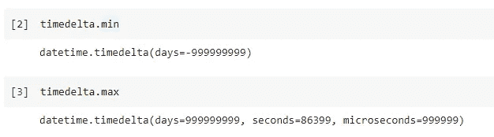

如果我们想定义一个超出界限的时间间隔呢？我们试试在上限上加一天。

```
timedelta(days=1) + timedelta.max
```

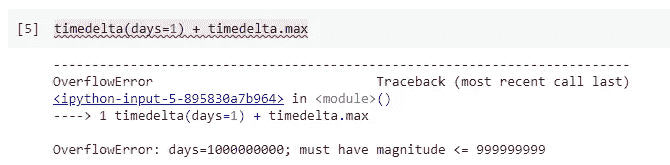

如图所示，Python 将抛出一个溢出异常，因为 timedelta 不是为处理那么长的时间间隔而设计的。它有多大？如果用 9999999999 天除以 365(粗略估计忽略闰年)，大约是 275 万年。

嗯，如果我们不使用时间增量来计算一些关于恐龙的历史，那就足够了:)

# 2.时间分辨率

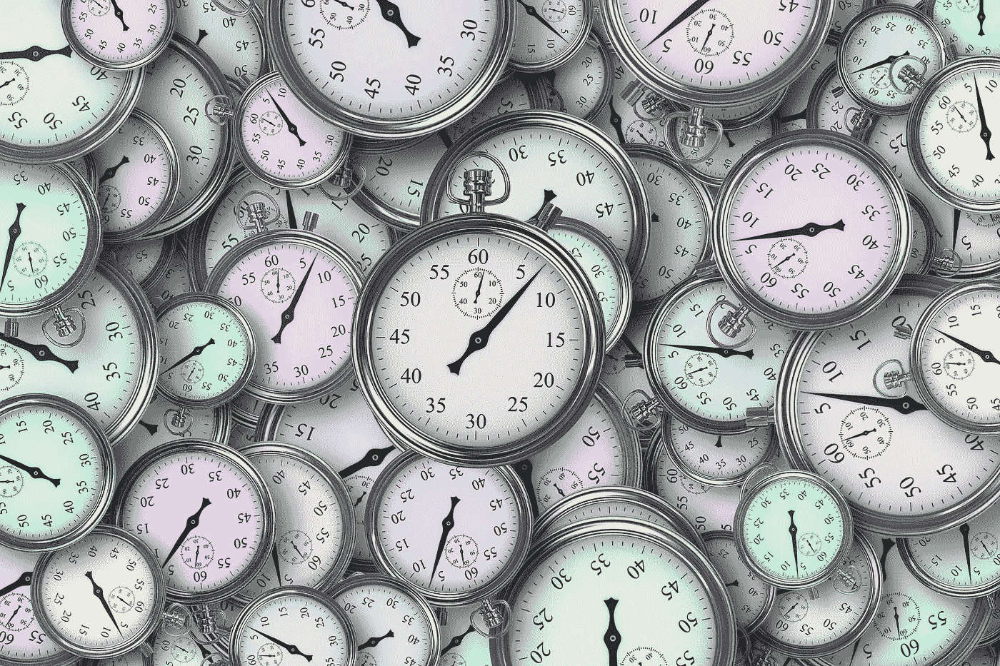

由 [geralt](https://pixabay.com/users/geralt-9301/) 在 [Pixabay](https://pixabay.com/illustrations/time-time-management-stopwatch-3222267/) 上拍摄的照片

众所周知，我们可以使用`days`、`hours`、`minutes`、`seconds`和`microseconds`来定义使用时间增量的时间间隔。顺便说一下，我们不能使用超过`days`的单位是有道理的，因为一个月可能有 28-31 天，而一年可能有 365 或 366 天。

但是，我们需要知道 timedelta 的分辨率是微秒。这意味着我们不能使用 timedelta 来处理纳秒。抱歉让物理学家和化学家失望了:)

事实上，我们可以通过调用 timedelta 模块的属性`resolution`来获得这个最小分辨率。

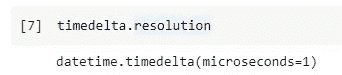

如果我们试图让时间间隔小于分辨率呢？这里有一个例子。我们可以试着得到半微秒。

```
timedelta.resolution / 2
```

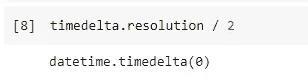

timedelta 对象将简单地变成零，这意味着在这个“间隔”中实际上没有时间跨度。这肯定是真的，因为我们可以通过在分裂后试图将其恢复到 1 微秒来证明这一点。

```
(timedelta(microseconds=1) / 2) * 2
```

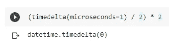

它仍然是零，因为当我们除以它时，我们失去了它。

# 3.属性范围


由 [Couleur](https://pixabay.com/users/couleur-1195798/) 在 [Pixabay](https://pixabay.com/photos/watches-old-antique-time-indicating-1204696/) 上拍摄的照片

在 timedelta 对象的实现中，`days`、`hours`、`minutes`、`seconds`、`microseconds`是类属性。这些属性将有自己的有效范围。

这绝对有意义，因为我们知道 1 天只有 24 小时，1 小时包含 60 分钟。然而，即使我们定义了超出范围的 timedelta 对象，我们也不会触发溢出异常，也不会丢失超出的部分。它会自动转换成更高或更低的单位。

例如，如果我们定义一个 1000000 微秒的间隔，正好是 1 秒，我们将简单地得到一个等于 1 秒的间隔。

```
one_second = timedelta(microseconds=999999 + 1)
```

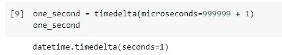

如果我们仅使用`seconds` 属性定义一个间隔，并使其超过 1 天，timedelta 将会很好地处理它。

```
one_day_and_one_second = timedelta(seconds=86401)
```

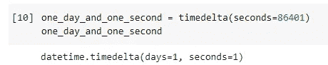

然而，属性`seconds`是在时间增量中具有更高优先级的主要属性。这意味着只要间隔少于一天，timedelta 将使用`seconds`来指示它，而不是使用`hours`或`minutes`。

```
three_thousands_six_hundred_seconds = timedelta(minutes=60)
```

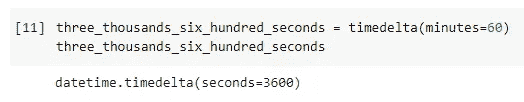

# 4.时间增量的操作


由 [StockSnap](https://pixabay.com/users/stocksnap-894430/) 在 [Pixabay](https://pixabay.com/photos/pocket-watch-locket-watch-timepiece-2569573/) 上拍摄的照片

在这一节中，我想展示 timedelta 模块是如何灵活的。您几乎可以对 timedelta 对象应用任何类型的数值运算。在上一节中，我们已经定义了一些对象，这样我们就可以在演示中重用它们。

首先，减法会起作用并不会让人感到意外。

```
one_day = one_day_and_one_second - one_second
```

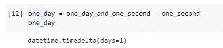

这也意味着我们可以像元素是数字一样转换方程。

```
assert one_day + one_second == one_day_and_one_second
assert one_day_and_one_second - one_day == one_second
```

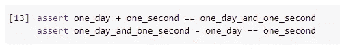

我们可以用数字来乘或除时间间隔。比如 1 天 10 次就是 10 天。

```
one_day * 10
```

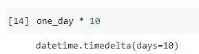

我们可以将时间间隔除以另一个。下面的例子显示了“一天有多少秒”。

```
one_day / one_second
```

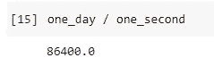

如果我们想要一个整数，双斜线也给我们一个结果的“底数”。

```
one_day // one_second
```

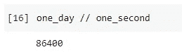

我们甚至可以在 timedelta 对象之间进行模运算。

```
timedelta(seconds=5) % timedelta(seconds=2)
```

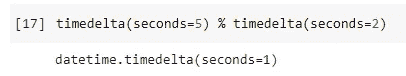

一些数字函数也可以应用于 timedelta 对象，比如获取绝对值。

```
abs(timedelta(days=-7))
```

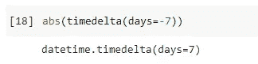

当您正在获取两个 datetime 对象之间的“差异”并且不在乎哪一个是先例时，这将非常有帮助。

## 除秒以外的展平时间间隔

有时，出于比较或存储的目的，我们可能需要将时间间隔转换成统一的时间单位。大多数时候我们可以调用`total_seconds()`函数将一个 timedelta 对象“展平”成秒。

```
one_day.total_seconds()
```

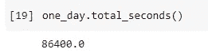

这其实相当于`one_day / timedelta(seconds=1)`。因此，我们可以轻松地将 timedelta 对象展平为其他时间单位。例如:

```
one_day / timedelta(hours=1)
one_day / timedelta(microseconds=1)
```

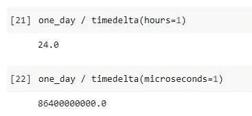

# 5.字符串的时间增量


照片由 [nattanan23](https://pixabay.com/users/nattanan23-6312362/) 在 [Pixabay](https://pixabay.com/photos/clock-money-growth-grow-time-2696234/) 上拍摄

最后，不仅 datetime 对象可以方便地转换为字符串以供输出，timedelta 对象也可以。

```
str(timedelta(days=7, hours=10, seconds=30, microseconds=300000))
```

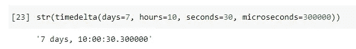

它可能不完全是您所期望的，因为我们每次开发的应用程序都有不同的需求。然而，这绝对是一种输出时间间隔的有效方法。

同样，我们可以使用类函数`repr()`将对象输出为字符串。

```
repr(timedelta(days=7, hours=10, seconds=30, microseconds=300000))
```

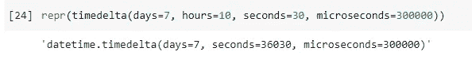

# 摘要


由[自由照片](https://pixabay.com/users/free-photos-242387/)在 [Pixabay](https://pixabay.com/photos/beer-cheers-sunset-sunlight-839865/) 上拍摄的照片

在本文中，我假设您已经知道 Python 内置的 datetime 库中的 timedelta 模块。我试图组织一些知识点，这些知识点不太可能被每个开发人员，尤其是学习者所了解，并且在本文中有所解释，比如对象之间的边界和稀有操作。希望它能满足你的一些好奇心。

[](https://medium.com/@qiuyujx/membership) [## 通过我的推荐链接加入 Medium 克里斯托弗·陶

### 作为一个媒体会员，你的会员费的一部分会给你阅读的作家，你可以完全接触到每一个故事…

medium.com](https://medium.com/@qiuyujx/membership) 

如果你觉得我的文章有帮助，请考虑加入 Medium 会员来支持我和成千上万的其他作者！(点击上面的链接)