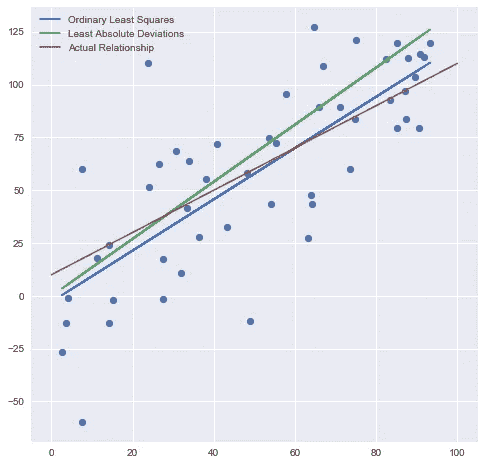
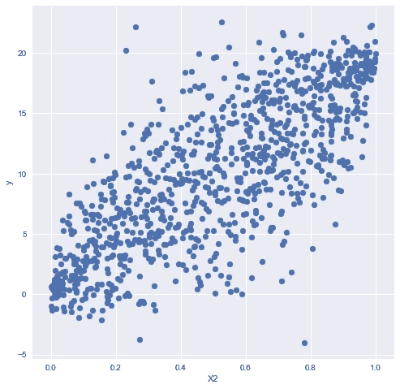
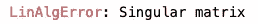
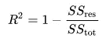
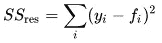
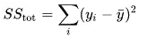
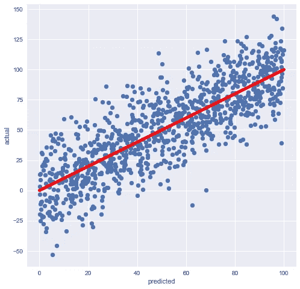

# 关于线性回归的 5 个常见误解

> 原文：<https://towardsdatascience.com/5-common-misconceptions-about-linear-regressions-7fe5b64ecedf?source=collection_archive---------13----------------------->

## Python 中的示例


艾米丽·莫特在 [Unsplash](https://unsplash.com/s/photos/question?utm_source=unsplash&utm_medium=referral&utm_content=creditCopyText) 上的照片

只要问题允许，我非常支持使用简单的模型。这一切都是有趣的，是与花哨的神经网络的游戏，但是如果古老的[线性回归](https://en.wikipedia.org/wiki/Linear_regression)能够完成工作，为什么不使用它呢？

然而，线性回归是一个看似简单的概念，它有两个问题:

*   这个理论是**经常低估**——你认为你知道事情是如何运作的，因为你已经使用它们几百次了；
*   模型很容易上手，所以题目素材很多，每个人都有自己的看法，虚假信息传播超级**。**

在这篇文章中，我将谈论 5 个我“最喜欢的”关于线性回归的误解。希望你能找到以前没有考虑过的东西。

下面是 Python 中的一些例子，如果你想了解代码，这些是你需要的唯一的库:

```
**import** numpy **as** np
**from** sklearn.linear_model **import** LinearRegression
**from** sklearn.metrics **import** r2_score
**from** scipy **import** stats
```

# 误解 1:线性回归=普通最小二乘法

我们的第一个误解是关于术语:人们倾向于将线性回归和 OLS 方法作为同义词。线性回归就是问题本身，当我们假设一个因变量和一个或多个自变量之间存在线性关系，而 OLS 就是众多可用估计方法中的一种。估计参数的其他方法有[最小绝对偏差](https://en.wikipedia.org/wiki/Least_absolute_deviations)、[套索](https://en.wikipedia.org/wiki/Lasso_(statistics))和[岭回归](https://en.wikipedia.org/wiki/Ridge_regression)。



OLS vs LAD 估计

请看左边的图表。两者之间的线性关系以红色显示。蓝色和绿色分别是 OLS 和拉德估计的关系，你不能肯定地宣布他们中的任何一个更好。(Lasso 和 ridge 将给出与单因素回归中的 OLS 相同的结果。)

我不得不承认，草率地使用这些术语是我对自己的愧疚:我最近发表了一篇关于套索和岭回归的文章，我一直在区分它们和“线性回归”，而事实上它们都是线性回归。(在我的辩护中，sklearn 称相应的模型为[线性回归](https://scikit-learn.org/stable/modules/generated/sklearn.linear_model.LinearRegression.html)、[套索](https://scikit-learn.org/stable/modules/generated/sklearn.linear_model.Lasso.html)和[山脊](https://scikit-learn.org/stable/modules/generated/sklearn.linear_model.Ridge.html)。)

顺便说一下，在这篇文章的其余部分，我们将重点关注 OLS 方法，尤其是它的假设。

> **总结**:线性回归可以用多种方法和假设来求解，其中之一就是普通最小二乘法。它们不是同义词。

# 误解 2:多重共线性是世界末日

[多重共线性](https://en.wikipedia.org/wiki/Multicollinearity)指线性回归中独立变量之间的高度相关性。它有时被认为是一个严重的问题，是一个必须解决的问题，这样模型才能发挥作用。但是，多重共线性只会导致单个系数估计值的可靠性和可解释性降低，模型的预测力不会受到影响。

**缺乏多重共线性不是 OLS 的假设。**事实上，它没有对自变量之间的关系做任何假设，除了一点:变量必须是独立的。换句话说，它们之间不可能存在完美的多重共线性。

我们来看两个例子，首先高相关性会发生什么，然后我们会看到为什么变量之间不能有一个完美的线性关系。

## 示例 1:高相关性

我们需要生成两个相关的独立变量。我不想使用正态变量，借用了[的代码，从两个相关的均匀分布中生成样本。我们需要一个相对较高的相关度来进行演示，让我们将它设置为 0.9。](https://twiecki.io/blog/2018/05/03/copulas/)

```
number_of_obs = 1000
np.random.seed(my_seed)mvnorm = stats.multivariate_normal(mean=[0, 0], cov=[[1., 0.9], 
                                                     [0.9, 1.]])
X_norm = mvnorm.rvs(number_of_obs)
X = stats.norm().cdf(X_norm)
X1 = X[:,0]
X2 = X[:,1]
```

我们可以检查这些是否确实相关:

```
np.corrcoef(X1,X2)
```

将返回:

```
array([[1\.        , 0.89713787],
       [0.89713787, 1\.        ]])
```

这一点得到了证实。

接下来，我们需要通过添加模拟残差来生成因变量，并构造一些系数:

```
residuals = stats.norm(loc = 0, scale = 1).rvs(number_of_obs)
y = 30 * X1 - 10 * X2 + residuals
```

接下来，让我们看看 sklearn 的线性回归模型如何处理高相关性:

```
lr = LinearRegression()
lr.fit(X,y)
lr.coef_
```

将返回:

```
array([ 30.36959656, -10.55232467])
```

估计的系数非常接近实际系数。如果重新运行残差和 y 代，会看到结果会在`[30, -10]`附近震荡。



我觉得一部分困惑来自于`X2`的系数为负的部分。现在，我们知道那是正确的，因为那就是我们最初如何产生`y`的！

但是，如果只看数据本身，可能会产生误导。在左边的图表中，你可以观察到`X2`和`y`之间非常明显的正相关关系。但那种效果只是通过`X1`，与`X2`高度相关。如果`X1`也在图片中，那么`X2`本身对`y`有负面影响，我们再一次在生成数据时看到了这一点。

在继续之前，让我们考虑一个现实生活中的例子。假设 X1 是房产的总面积，X2 是卫生间的数量，y 是价格。在这样的例子中，您通常会得到浴室的负系数，然后您通常会听到有人说*“难怪，总面积和卧室之间存在多重共线性，它必须从模型中清除，我们必须忽略浴室变量”*。

但实际上，这个结果难道没有某种意义吗？我们必须记住，系数影响是*其他条件不变的*影响，所以其他一切都假设保持稳定。如果我们假设房子的总面积不变，并不断增加越来越多的浴室，这将很快成为一个非常怪异的房子，成本会更低，对不对？因此，如果整体尺寸也存在于模型中，浴室系数为负可能并不是世界上最愚蠢的事情。

## 示例 2:完美多重共线性

剩下的第二个问题是:如果变量之间确实存在完美的多重共线性，会发生什么？

让我们用两个完全相关的变量生成一个简单的例子:

```
obs_no = 100
np.random.seed(my_seed)
X1 = np.random.uniform(0,100,obs_no)
X2 = 2 * X1
residuals = np.random.normal(0,1,obs_no)
y =  X1 + X2 + residuals
```

很容易看出这里的问题是什么:有无限可能的解决方案。我们将`X1`和`X2`的系数分别定义为 1 和 1，但是例如，3 和 0 也可以。OLS 实际上有一个封闭的解决方案，这涉及到一个矩阵求逆，如果矩阵的列秩不是满的，就不能这样做。

继续上面的例子，这就是在 numpy 中从头开始求解 OLS 的方法:

```
intercept = np.ones(obs_no)
X = np.vstack((X1, X2, intercept)).T
Xt = X.T
XtX = Xt.dot(X)
XtX_inv = np.linalg.inv(XtX)
Xty = Xt.dot(y)
coeff = XtX_inv.dot(Xty)
y_pred = X.dot(coeff)
```

这在常规情况下是可行的，请注意，您必须手动添加截距，并且需要相应地解释系数。然而，现在，你会得到一个错误:



所以再一次，你不能有完美多重共线性的原因是你不能对自变量的矩阵求逆。

## Sklearn 与完美多重共线性

如果你和我一样，你可能会想:好吧，你不应该这样做，但是如果我们把这样的数据放入 sklearn 会发生什么？

继续上面的例子，没有 numpy 部分:

```
X = np.vstack((X1, X2)).T
lr = LinearRegression()
lr.fit(X, y)
lr.coef_
```

将返回:

```
array([0.60023761, 1.20047523])
```

看起来是随机的。但这实际上是可能的解决方案之一:

```
lr.coef_[1] * 2 + lr.coef_[0]
```

将返回 3。当您重新运行`lr.fit()`行时，您将得到不同的系数，但是它们的加权和将接近于 3。

那么是什么原因呢？我以为矩阵是不能求逆的！

事实证明，矩阵求逆是一项非常昂贵的操作，sklearn 中的线性回归模型使用了一种近似估计(梯度下降)。这种方法足以找到正确的解决方案。(还是不应该做，结果真的很不稳定很诡异，再加上你应该注意到你的变量之间有这样的关系。)

> **总结** : OLS 不假设自变量之间低相关，但它们不可能有完美的多重共线性。

# 误解 3:你的变量必须正态分布

我认为这里混乱的来源是你可以阅读像*“y 被假定为正常”*这样的东西，在某种程度上，这是真的，但很容易对术语感到草率。

简单的回答是，我们假设唯一正常的是残差，X 和 y 的分布可以是任意的。然而，y 取的单个值也被假定为正态分布的随机变量。

让我们考虑一个例子。我们想用房子的大小来解释它的价格。这恰好是“真正的”模型，所以其他任何东西对价格都没有影响。如果我们随后看到两栋同样大小的不同房子，模型会预测出同样的价格。但是，它们的观察价格可能不同。再说一次，这不是因为我们在这个简单的例子中遗漏了任何其他因素，我们确实知道“真实”的模型。价格不同的原因是残差，它被添加到线性回归的另一个因子中。因此，具有一定大小的房子的价格也将是一个正态变量，期望值将来自大小和可能的截距，方差将由残差决定。这并不意味着如果我们把观察到的价格放在一起，它们应该是正常的。

另一个混淆的来源可能是看到像取对数正态、平方根等东西。任何变量。这与正态假设无关，它只是一种使自变量和因变量之间的关系“更加线性”的方法。这是一个尝试和观察什么有效的问题。

> **总结**:残差假设为正态，因变量或自变量不为正态。

***旁注*** *:其实连残差正态性都不是 OLS 方法的固定假设，详情查看其* [*维基百科页面*](https://en.wikipedia.org/wiki/Ordinary_least_squares#Assuming_normality) *。如果残差是正态的，OLS 是最大似然估计量，但是技术上你可以不用这个假设做 OLS。唯一发生的事情是，估计量会得到不同的统计性质。我认为很容易把线性回归想成一套记住的 4-5 条规则，但它比那要复杂得多。*

# 误解 4:你必须标准化

你不必为了 OLS 估计而标准化/规范化你的变量。线性函数对模型的预测力没有影响。系数和截距会相应改变，但仅此而已。

如果你的变量在很大程度上不同，你可能想要标准化，并且你想要容易地比较系数。

然而，我发现有一点被忽略了，那就是**对于任何正则化技术(套索、脊、弹性网)，你绝对必须标准化** **独立变量**，否则正则化将毫无意义。因变量仍然不需要任何调整。

应用标准化的一个快速方法是 sklearn 的[标准定标器](https://scikit-learn.org/stable/modules/generated/sklearn.preprocessing.StandardScaler.html)。

> **总结**:OLS 方法没有必要标准化。然而，当使用任何正则化方法时，你必须标准化独立变量。

# 误解 5:你的模型应该渴望达到 R = 1

你可能有过这样的经历，当你满怀希望地开始一个线性回归问题时，却发现你的 R 离 1 非常远。但这真的是一个大问题吗？

和大多数事情一样，答案是:视情况而定。有些人甚至说 R 高达 0.9 是非常可疑的，很可能意味着你使用了一个不应该使用的变量。要记住的主要一点是，R 给你一个粗略的概念，告诉你你的预测有多精确，但是不告诉你你是否找到了正确的模型。所以，是的，低 R 可能意味着你应该小心处理模型的预测，但不一定意味着你必须寻找一个更好的模型。

让我们考虑一下这个值的实际变化。r 定义为:



其中 *SSres* ，残差平方和来自实际值和预测值:



和 *SStot* ，总平方和来自实际值和实际值的平均值:



很容易看出，为了使 R 为 1，你的 *SSres* 必须为 0，这意味着所有的残差必须为零。所以你必须找到一个完美的线性关系才能得到 R = 1。不用说，这种情况几乎不会发生，线性回归也不应该这样。

让我们生成一个示例，以便能够更好地掌握分数的大小。为了简单起见，y 等于 1 * X 加上一个剩余因子:

```
number_of_obs = 1000
np.random.seed(my_seed)
X = np.random.uniform(0, 100, number_of_obs)
residuals = np.random.normal(0, 20, number_of_obs)
y = X + residuals
```

我们将跳过拟合模型的部分，假设我们找到了可能的最佳估计值，因此 y 被预测为 x。让我们计算 R:

```
y_avg = np.mean(y)
SStot = sum((y - y_avg)**2)
SSres = sum((y - X)**2)
print("SStot: %i" % SStot)
print("SSres: %i" % SSres)
print("R2: %.5f" % (1-SSres/SStot))
```

结果是:

```
SStot: 1249503
SSres: 407976
R2: 0.67349
```

(我们可以用`r2_score(y, X)`复核公式，结果是一样的。)



在左边的图表中，你可以看到 0.67 的 R 是什么样子的。X 轴有预测的 y 值(或实际的 X 值，在我们的例子中它们是相同的)，y 轴是实际的 y 值。

我们必须记住，这是我们能为这个例子建立的最好的模型！没有更好的线性回归了。

这个例子也很方便地展示了不同参数对 R:

*   增加样本量(在我们的例子中是 1000)将产生最小的影响，R 收敛到一个稳定的值；
*   增加残差的方差(20)将通过增加 *SSres* 来减少 R；
*   通过增加 *SStot* 来增加均匀自变量的取值范围(100)将会增加 R。

还有一点:OLS 将最小化 *SSres* (即最小二乘法中的“平方”)，并且 *SStot* 对于给定的一组观测值是恒定的。因此，OLS 适合将最大化 R 的训练集。

> **总结** : R 要小心处理。该指标可让您大致了解模型的预测力度，但不会告诉您离理想模型有多近。R = 1 实际上不应该发生，高 R 应该引起怀疑。

# 摘要

现在你知道了，我看到的 5 个错误观念被抛向四周，我希望你能发现一些新的东西。我认为主要的收获是知道线性回归和普通最小二乘法比很多人想象的要复杂。

如果你仍然认为你对所有事情都完全清楚的话，看看 OLS 的维基百科页面。

最后一件事:如果你认为我对自己的误解有任何误解，请告诉我。