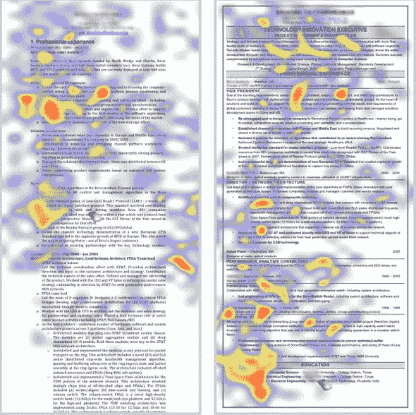

# 5 个常见的简历错误

> 原文：<https://towardsdatascience.com/5-common-resume-mistakes-831e8b3e360d?source=collection_archive---------19----------------------->

## 通过查看数百份数据科学简历

由 [Unsplash](https://unsplash.com?utm_source=medium&utm_medium=referral) 上的 [krakenimages](https://unsplash.com/@krakenimages?utm_source=medium&utm_medium=referral) 拍摄的照片

记得从学校毕业，整理了一份简历，不断在想自己的简历是不是“好”。想知道什么能让一份简历变得优秀是很难的，但是在阅读了数百份数据科学简历后，我想指出我经常看到的 5 个错误。如果你能避免这些错误，你将会在简历中取得巨大的进步。

所以，这里有 5 个常见的简历错误:

# 1.使用非标准简历模板

我发现越来越多的人试图让自己的简历与众不同。技能图表或个人风格之类的东西虽然看起来很酷，但往往会分散注意力。[商业内幕](https://www.businessinsider.com/heres-what-recruiters-look-at-during-the-6-seconds-they-spend-on-your-resume-2012-4)对两种简历格式进行了比较，并追踪了招聘人员的眼球运动。结果如下:

右边的简历，格式更规范清晰，观察得更透彻。招聘人员要分析数百份简历。你希望你的简历尽可能让人感觉熟悉，这样招聘人员就可以快速有效地找到他们想要的信息。

# 2.添加过多的绒毛

当我毕业的时候，我的经验很少，我记得我觉得我必须尽我所能让我的简历看起来“充实”我想我的希望是，如果我的简历更密集，我会看起来更有经验。我现在意识到那是个错误。

再说一遍——招聘人员和招聘经理没有太多时间。他们不想阅读不相关的工作或者不太鼓舞人心的工作经历。你应该确保你的简历尽可能清晰地聚焦在你最引以为傲的事情上——你认为是什么让你非常适合这份工作。

很多时候，我看完简历，没有什么特别的东西真正吸引我。确保你把简历上的绒毛去掉，这样即使快速阅读，招聘经理也能清楚地看到是什么让你非常适合这个职位。在我看来，这意味着你永远不应该有一份超过 1 页的简历。即使有几十年的经验，我认为人们可以在一页中总结出真正需要知道的内容。

# 3.在不应该的时候列举技能

我明白了——你为了一个项目上了一门课，学了一些 C++。这份工作提到 C++是一项有益的技能，那么为什么不把它加入你的简历呢？为什么不把你曾经编写过“Hello World”的所有编程语言都加进去呢？

虽然通常没有那么极端，但是要小心地列出一个你已经有非常基本知识的技能清单。简历上列出的任何东西都是自由提问的游戏，当你的 C++知识被证明只限于几行代码时，这看起来很糟糕。所以，试着对自己诚实，只添加你觉得相当熟练的技能。这并不是说你必须成为你所列举的所有领域的专家，但是你应该能够自如地回答与你的技能相关的面试问题。

费利克斯·林在 [Unsplash](https://unsplash.com?utm_source=medium&utm_medium=referral) 上拍摄的照片

# 4.不给非标准体验留出空间

有时候在面试候选人的时候，他们的经历会变得非常相关，但是却不在他们的简历上。通常，这是因为这段经历与之前的工作经历或教育背景不太相符。

例如，可能是一个附带项目或开源贡献。确保你为那些让你觉得自己非常适合这份工作的经历腾出空间。如第二点所述，去掉绒毛，为你的这些非标准体验腾出空间。它们有望让你在所有简历中脱颖而出。

# 5.过于依赖学校项目

学校项目很棒，可以帮你学到很多东西。不幸的是，他们倾向于漂亮的锅炉板，真正的缺点是，许多其他人也这样做了。如果你的简历上列出了一大堆你知道其他人也做过的学校项目，很可能招聘人员以前见过它们，并且在阅读你的简历时基本上只是敷衍了事。

照片由[乔纳斯·雅各布森](https://unsplash.com/@jonasjacobsson?utm_source=medium&utm_medium=referral)在 [Unsplash](https://unsplash.com?utm_source=medium&utm_medium=referral) 上拍摄

# 6.额外收获:基本上是空的 GitHub

一个强大的 GitHub 帐户是一件令人惊讶的事情，可以列在你的简历上。我喜欢看候选人的 GitHub 简介，因为我可以立即看到他们做过的代码和项目的例子。我强烈建议人们找时间在 GitHub 上做几个他们引以为豪的项目——这对帮助你脱颖而出大有帮助。

也就是说，列出一个基本上是空的 GitHub 账户并不是一个好主意。如果你有一个推动你的一个学校项目，这实际上不是很多代码，可能不是你引以为豪的代码，也许不要把你的 GitHub 放在你的简历上。如果你的 GitHub 是空的，一定要跳过它(你会惊讶我经常看到这个)。

我希望这有助于你完善你的简历！

获取您的[免费指南](https://learn.learningwithdata.com/free-data-science-guide)来创建一个令人惊叹的数据科学项目。