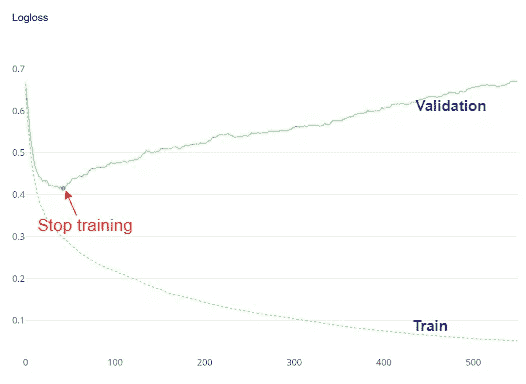

# CatBoost 的 5 个可爱特性

> 原文：<https://towardsdatascience.com/5-cute-features-of-catboost-61532c260f69?source=collection_archive---------8----------------------->

## 其他升压算法没有这些功能


[耶尔林·马图](https://unsplash.com/@yerlinmatu?utm_source=unsplash&utm_medium=referral&utm_content=creditCopyText)在 [Unsplash](https://unsplash.com/?utm_source=unsplash&utm_medium=referral&utm_content=creditCopyText) 上的照片

我们已经讨论过 5 种 boosting 算法: [**AdaBoost**](/how-do-you-implement-adaboost-with-python-a76427b0fa7a) ， [**梯度 Boosting**](/under-the-hood-of-gradient-boosting-and-its-python-implementation-99cc63efd24d) ， [**XGBoost**](https://rukshanpramoditha.medium.com/unlock-the-power-of-xgboost-738536b9f36f) ，[**light GBM**](/can-lightgbm-outperform-xgboost-d05a94102a55)**和 [**CatBoost**](/how-do-you-use-categorical-features-directly-with-catboost-947b211c2923) 。**

**其中， **CatBoost** 之所以如此特别，是因为它有其他 boosting 算法所没有的特殊之处。**

**通常，升压算法有两个主要缺点:**

*   **在 boosting 算法中很容易发生过拟合，因为它们是基于树的算法。**
*   **将 boosting 算法的训练过程并行化并不容易，因为新的树是按顺序一个接一个地创建的。**

**考虑到这些缺点，CatBoost 旨在以闪电般的速度为大型数据集构建更一般化的模型。它有内置参数，以减少过度拟合和并行学习，加上一些其他独特的功能！让我们来探索它们。**

# **CatBoost 同时支持 CPU 和 GPU，开箱即用**

**CatBoost 的`pip`和`conda`安装都为 CatBoost 提供 GPU 支持。**

```
pip install catboost
#OR
conda install -c conda-forge catboost
```

****CatBoostClassifier()** 和 **CatBoostRegressor()** 类中的以下参数设置可用于在训练时获得 GPU 支持。**

*   ****task_type:** 可能值为“CPU”和“GPU”。值类型是字符串。默认值为“CPU”。要在培训期间获得 GPU 支持，只需使用“GPU”作为 *task_type* 的值。**
*   ****设备:**该参数定义了计算机中 GPU 设备的 id。值类型是字符串。您可以使用“0”或“1”等数字来定义单个 GPU 设备。要一次定义多个 GPU 设备，您可以使用一系列数字，如“0:1:2”。**

**要查找您有多少个 GPU 和正确的 GPU ID，请在 Windows 中转到任务管理器，然后单击性能选项卡。**

****

**(图片由作者提供)**

**为了允许 CatBoost 使用我的 NVIDIA GPU，我应该设置 **task_type="GPU"** 和 **devices='1'** 。下面是一个关于 **CatBoostClassifier()** 类的例子。**

```
from catboost import CatBoostClassifiermodel = CatBoostClassifier(iterations=100,
                           **task_type="GPU"**,
                           **devices='1'**)
```

**使用 GPU 实现 CatBoost 对于包含数百万个对象和数百个要素的大型数据集来说非常有效！根据官方文档，对于这样的大型数据集，使用强大的 GPU 可以获得高达 40 倍的速度提升。如果你的数据集不够大，你不会看到 CPU 和 GPU 的训练时间有太大的差别。**

# **我们可以在 CatBoost 中直接使用分类特征**

**通常，在算法中使用分类特征之前，我们必须对数据集中的分类特征(如果有的话)进行编码。但是使用 CatBoost，您不需要进行编码，因为算法会使用一次性编码自动将这些分类特征编码为数值。**

**因此，如果您的数据具有分类特征，您需要使用 [**Pool()**](https://catboost.ai/en/docs/concepts/python-reference_pool) 类将整个数据集转换为 CatBoost 的特殊 ***Pool*** 数据类型。如果您的数据只有数字特征，我建议您不要将数据转换为 ***池*** 数据类型，因为这可能会减慢训练过程。因此，只转换分类数据。**

****Pool()** 类中的以下参数设置可用于通过 CatBoost 直接包含分类特征。**

*   ****数据:**由 **X** 定义的特征矩阵。可能的类型有熊猫数据帧或 2D 数字阵列。**
*   ****标签:**由 **y** 定义的目标或标签列。可能的型号有熊猫系列或 1D Numpy 阵列。**
*   ****cat_features:** 数据集中分类特征名称的列表。**

**这里有一个例子:**

```
from catboost import CatBoostRegressor, Poolmodel = CatBoostRegressor()pool_data = Pool(X_train,
                 y_train,                  
                 cat_features=['F1', 'F2', ...])model.fit(pool_data)
```

**我写的更详细的指南可以在[这里](/how-do-you-use-categorical-features-directly-with-catboost-947b211c2923)找到。**

# **CatBoost 具有内置参数来减少过度拟合**

****CatBoostClassifier()** 和 **CatBoostRegressor()** 类及其 **fit()** 方法中的以下参数可用于减少模型的过拟合。**

*   ****early_stopping_rounds:** 这在 **CatBoostClassifier()** 和 **CatBoostRegressor()** 类的 **fit()** 方法中都有。默认值为`False`，不激活提前停止。我们可以使用一个整数来提前停止学习过程，以减少过拟合。我写的详细指南可以在这里找到[。](/activate-early-stopping-in-boosting-algorithms-to-mitigate-overfitting-9c1b12cc6729)**
*   ****l2_leaf_reg** 或 **reg_lambda:** 这在 **CatBoostClassifier()** 和 **CatBoostRegressor()** 类中都可用。这将 L2 正则化项的系数添加到成本函数中。默认值为 3。类型是 float。增加该值可以防止过度拟合。**
*   ****深度:**该参数定义了树的深度。这类似于决策树中的 **max_depth** 参数。默认值为 6。类型是整数。减小该值可以防止过度拟合。好的值是 2 和 3。**

# **CatBoost 有一个内置参数来生成学习曲线**

**学习曲线对于监控模型的学习过程极其重要。根据由 **n_estimators** 或**迭代**定义的提升回合数绘制训练和验证分数。**

**在 CatBoost 中，我们可以通过在两个 **CatBoostClassifier()** 和 **CatBoostRegressor()** 类的 **fit()** 方法中将 ***plot*** 参数设置为`True`来轻松生成学习曲线。下图显示了由 CatBoost 创建的学习曲线。**

****

**(图片由作者提供)**

**这条学习曲线有两个用例:**

*   **寻找是否有机会提前停止**
*   **为 ***早 _ 停 _ 轮*** 自变量寻找最优值**

**关于这个的详细指南可以通过阅读我写的[这篇文章](/activate-early-stopping-in-boosting-algorithms-to-mitigate-overfitting-9c1b12cc6729)找到。**

# **CatBoost 通过其默认参数值提供了很好的结果**

**这是 CatBoost 的另一大特色。您不需要在 CatBoost 中进行参数调整来获得很好的结果。所以，你可以节省时间！根据官方文档，调整后的参数值和默认参数值提供了几乎相同的性能分数！**

# **结论**

****你最喜欢的 CatBoost 功能是什么？**请在评论区提及。**

****综上:** CatBoost 提供了一种在决策树上实现梯度提升的特殊方法。凭借其特殊功能，很容易提高具有数百万个数据点的大型数据集的学习速度。它还提供了减少过度拟合的有用功能。最后，您可以节省参数调整的时间，因为在 CatBoost 中不需要调整。**

****你应该考虑安装 CatBoost 吗？**是的，肯定！CatBoost 是一个开源库，每个人都可以使用！除此之外，在它的官方[网站](https://catboost.ai/)上有很棒的文档。看一看吧！**

## **阅读下一条(推荐):**

**探索 ML 中的 boosting 算法及其 Python 实现！**

**[](https://rukshanpramoditha.medium.com/list/boosting-techniques-2b61b7fab9ec)

助推技术(作者截图)** 

## **阅读下一条(可选):**

**找到大多数数据科学家面临的最糟糕问题的解决方案:过度拟合问题！**

**[](https://rukshanpramoditha.medium.com/list/addressing-overfitting-868959382d1d)

解决过度拟合问题(作者截图)** 

**今天的帖子到此结束。我总是尽我所能以一种你能从中获得最大收益的方式来写和组织我的内容。应该有很多方法来进一步改善我的内容，你可能有很好的想法。所以，**

**如果您有任何反馈，请告诉我。**

**与此同时，你可以 [**注册成为会员**](https://rukshanpramoditha.medium.com/membership) 来获得我写的每一个故事的全部信息，我将会收到你的一部分会员费。**

**非常感谢你一直以来的支持！下一个故事再见。祝大家学习愉快！**

**特别感谢 Unsplash 上的 **Yerlin Matu** ，为我提供了这篇文章的封面图片。**

**[鲁克山普拉莫迪塔](https://medium.com/u/f90a3bb1d400?source=post_page-----61532c260f69--------------------------------)
**2021–11–13****