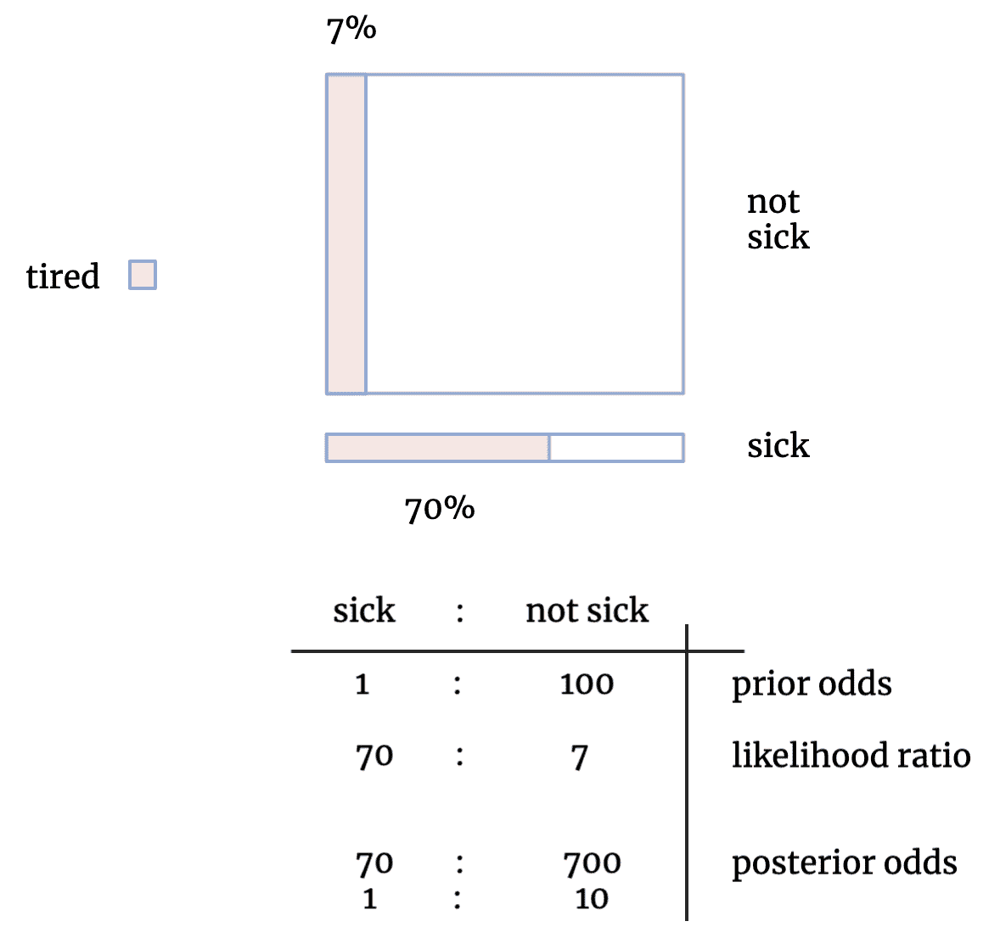
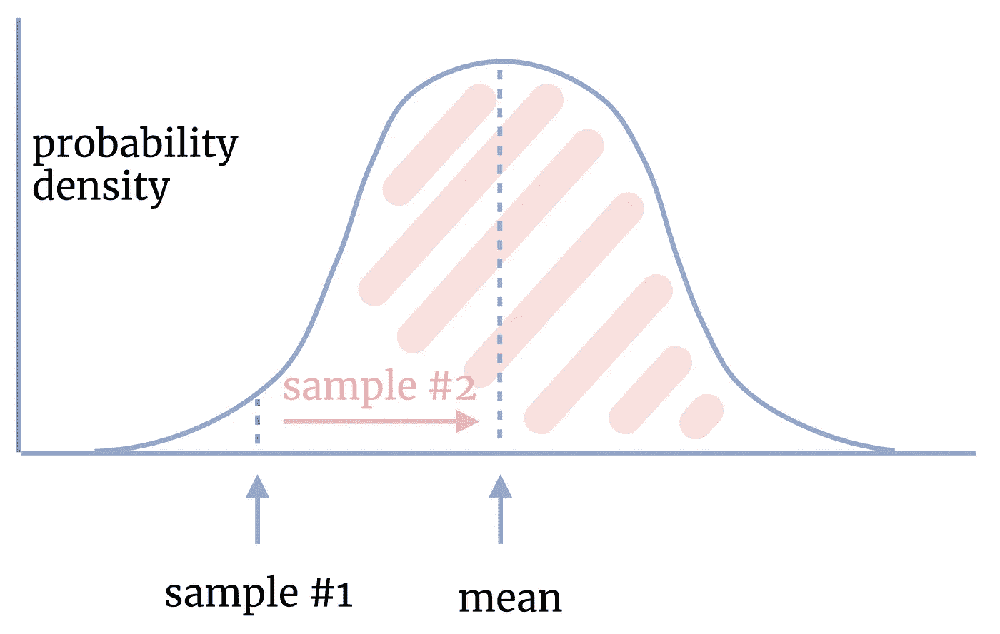
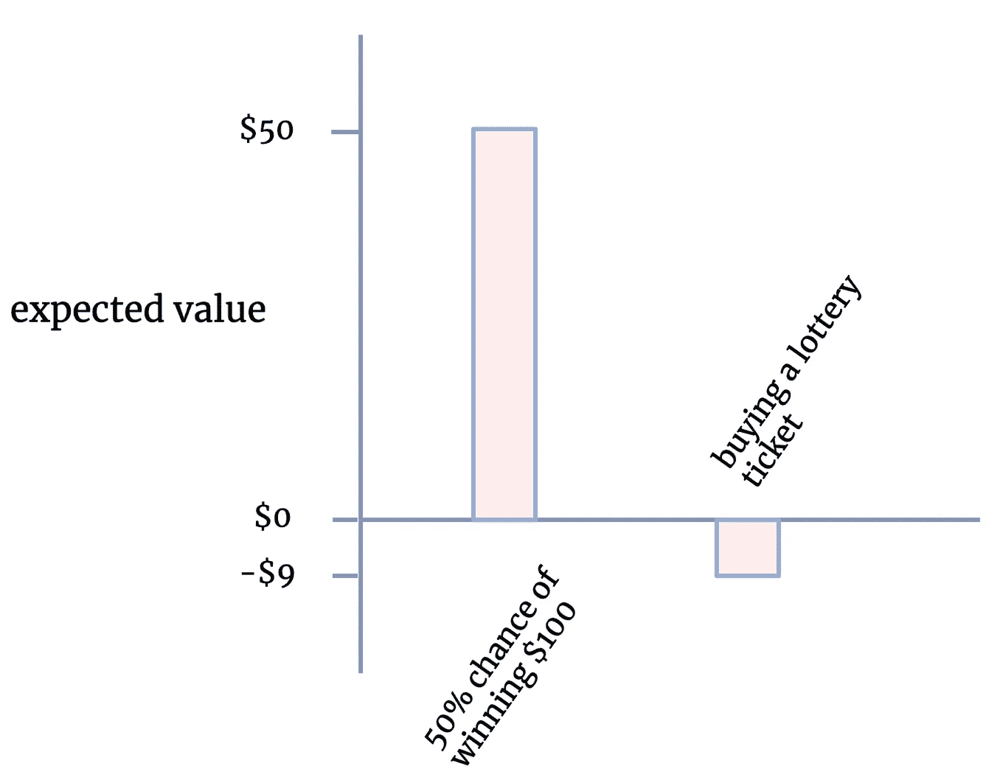

# 改善生活的 5 个数据科学概念

> 原文：<https://towardsdatascience.com/5-data-science-concepts-to-improve-your-life-80183e04544e?source=collection_archive---------11----------------------->

## 如何使用经济学、统计学和数据科学的概念来更清晰地思考和做出更好的决策

[粘土银行](https://unsplash.com/@claybanks?utm_source=unsplash&utm_medium=referral&utm_content=creditCopyText)在 [Unsplash](https://unsplash.com/s/photos/exploration?utm_source=unsplash&utm_medium=referral&utm_content=creditCopyText) 拍摄的照片

概念帮助你理解世界。数据科学的概念可以应用于整个生活，从金融到医疗保健到职业选择，形成了理解世界如何运作的重要学科。在本文中，您将了解到:

*   为什么冠军队不能赢得下一个赛季，为什么早期的科学结果经常是错误的
*   如何处理不同强度的冲突信息
*   什么时候你应该尝试新的东西，而不是坚持你已经知道和喜欢的东西

现在，让我们来探索如何利用 5 个基础数据科学概念来改善生活。

# 贝叶斯法则

[贝叶斯法则](https://conceptually.org/concepts/bayes-rule)是一种评估事件发生概率的方法。你从一个事件前的概率开始，接收证据，并更新你最初分配的概率。贝叶斯法则迫使我们进行概率性思考，并让我们注意到我们观点中的不确定性程度。

例子

贝叶斯法则最有用的一点是，明确考虑一个事件的先验概率会抵消我们忽略基本概率的倾向。让我们看一个例子来说明。

认识 Ruby:

亚历克斯·诺曼摄影

假设有一天你注意到 Ruby 能量很低。根据这种观察，她生病的可能性有多大？对于大多数人来说，Ruby 有点不舒服可能会出现在他们对 Ruby 疲劳的首要解释中。

但是让我们用贝叶斯方法来计算 Ruby 生病的概率:

后验优势=先验优势比 x 似然比

或者在图表中:

亚历克斯·诺曼的图解贝叶斯法则

大正方形的面积表示 Ruby 一年中没有生病的天数比例(即大部分时间)，而小矩形的面积表示她生病的天数。这是表中的优先赔率——Ruby 大约每 100 天生病一次。图形中的粉红色表示 Ruby 在非病假和病假中表现出疲劳的天数比例。我们可以看到，Ruby 在 7%的非病假时间和 70%的病假时间里似乎明显感到疲劳(表中的可能性比率)。最后，考虑到 Ruby 看起来很累，我们必须计算出她生病的后验概率，这是先验概率和似然比的乘积，两者的比值降为 1/10。因此，尽管 Ruby 看起来很累——而且累很可能是生病的迹象——但她仍然有十倍的可能没事。

# 回归平均值

如果你最喜欢的球队去年赢得了冠军，这对他们下赛季赢得冠军的机会意味着什么？在某种程度上，这是由于技能(球队状态良好，顶级教练等)。)，他们的胜利表明他们明年更有可能获胜。但这在更大程度上是由于运气(其他球队卷入了药物丑闻，有利的抽签，选秀结果良好等)。)，他们明年赢的可能性就越小。

这是因为统计概念上的[回归到平均值](https://conceptually.org/concepts/regression-to-the-mean)。

从正态分布回归抽样均值，亚历克斯·诺曼

例子

如果一项试验表明，保健化学品 YK7483 优于淋巴丝虫病的所有其他治疗方法(胆小的人不应该查阅这个资料)，你不应该完全相信这个结果。当你对 YK7483 进行第二次测试时，第二次测试更有可能接近平均值。如果你只看表面价值，而没有预测到它可能会回归到均值，那你就把钱放错了地方。在[的一项关于这种影响的系统研究](https://www.ncbi.nlm.nih.gov/pubmed/16014596)中，John Ioannidis 分析了“过去 13 年中最受重视的 49 项医学研究发现”,发现 16%的研究存在矛盾，16%的研究在第二次研究中产生的影响比第一次小，24%的研究基本上没有受到质疑，而**只有 44%的研究得到了重复**。回想一下，这些是最受重视的研究发现，你会认为它们更可靠，而不仅仅是旧样本。

# 探索-利用

[探索、开发和权衡](https://conceptually.org/concepts/explore-or-exploit)是我们在选择时经常面临的两难境地。你应该选择你所知道的并得到你所期望的东西(“利用”)还是选择你不确定的东西并可能学到更多(“探索”)？这在日常生活中经常发生——最喜欢的餐馆，还是新开的餐馆？目前的工作，还是四处寻找？正常的回家路线，还是试试另一条？。你牺牲一个来得到另一个，所以这是一个交换。你应该选择哪一个取决于获取后果信息的代价，你能利用它多长时间，以及对你的好处有多大。

例子

你的小型电影制作业务在过去几年里取得了一些成功，你正试图找出你的下一个项目应该是什么。你知道，如果你拍一部老经典的续集，回报会很一般。或者，你可以尝试一个高度不可预测的热门新创意:它可能会暴跌，意味着你无法收回制作它的成本，或者它可能是下一个哈利波特系列。

# 预期值

[期望值](https://conceptually.org/concepts/expected-value)是事件发生的概率，乘以该事件发生的价值。例如，有 50%的机会赢得 100 美元，你的预期价值是 50 美元(如果你不介意风险的话)。

我们可以用这个框架来计算你是否应该买彩票。假设一张彩票价值 10 美元，你有 0.0000001 的机会赢得 1000 万美元——你应该买一张吗？不使用期望值，这是一个几乎不可能评估的问题。乘出来，拥有其中一张票的预期价值是 1 美元(0.0000001 x 10，000，000 美元= 1 美元)。但是你买票要花 10 美元(1x 10 美元)。所以购买的总期望值是负的:1-$10 = -$9。现实生活中的大多数彩票都是如此，因此买彩票只是我们[偏向过度乐观](https://en.wikipedia.org/wiki/Optimism_bias)的一个例子。

亚历克斯·诺曼的《两种选择的期望值》

例子

事实证明，所有事件都有一定的风险和价值。保险公司用这个来决定向你收取多少保费。他们将你的[参考类](https://conceptually.org/concepts/reference-class-forecasting)中的每个人加起来，并确定他们的平均支出。然后，他们在顶部增加一点利润，这使得购买保险的净预期为负(收益减去成本)，就像购买彩票一样。然而，这并不意味着买保险是个坏主意！很多人不喜欢承担过多的风险(一个小的破产机会比支付你可能永远不需要的保险更糟糕)，所以购买保险是理性的。另一种说法是，额外收入的边际收益递减(或者凹效用函数，对于数学倾向的人来说)。

[帕斯卡的赌注](https://en.wikipedia.org/wiki/Pascal%27s_Wager)也是用期望值思考世界的例子。人类都用他们的生命打赌，要么上帝存在，要么他不存在。帕斯卡认为，一个理性的人应该像上帝一样生活，并寻求相信上帝。如果上帝确实存在，这样的人只会有有限的损失(一些快乐，奢侈，等等。)，而他们将获得无限的收益(以天堂中的永恒为代表)并避免无限的损失(地狱中的永恒)。

# 抽象

[抽象](https://conceptually.org/concepts/abstraction)是将复杂的事件概括为其背后的概念的过程，消除了情况的复杂性。抽象过程可以通过隐藏令人困惑的细节来帮助我们理解现实世界，给我们留下跨领域适用的通用概念，并可以应用于不同的情况。

例子

抽象的概念是让计算机工作的关键。计算机只理解 1 和 0，也就是二进制或机器代码。如果一个程序员想编写一个玩俄罗斯方块的程序，他必须一个个地写出所有的 1 和 0，这将是非常耗时的。

为了避免这些工作，程序员开发更高级的语言来控制机器代码。这些 1 和 0 被绑定在一种更高级的编程语言的语法中，这种语言是建立在机器代码之上的。人类程序员可以用这些更容易使用的语言编写他们的软件，然后计算机通过解释器或编译器将脚本转换成它能够理解的东西——机器代码。每个人都赢了。

## Conceptually.org 是一个免费的经济学、数据科学、哲学和其他概念的集合，帮助你更好地理解世界。[报名](https://conceptually.org/)每周学习 1 个概念。