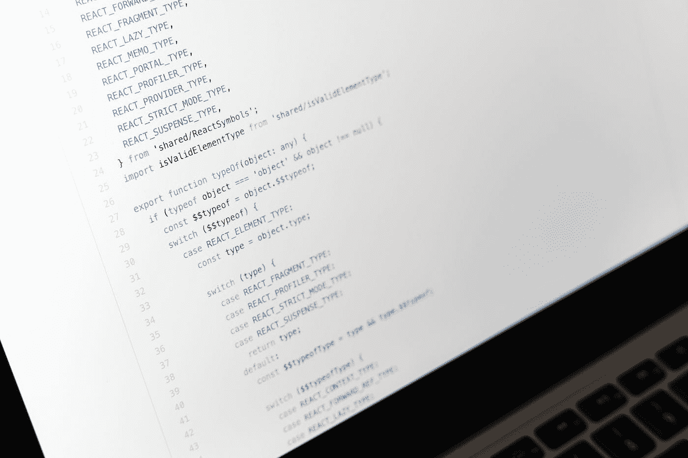

# 你应该考虑参与的 5 个数据科学开源项目

> 原文：<https://towardsdatascience.com/5-data-science-open-source-projects-you-to-contribute-to-boost-your-resume-d757697fb1e3?source=collection_archive---------11----------------------->

## 通过这些项目，提高你的技能，充实你的简历

马库斯·温克勒在 [Unsplash](https://unsplash.com?utm_source=medium&utm_medium=referral) 上的照片

在数据科学领域获得理想职位的最重要的一个方面是建立一个强大、有力、引人注目的投资组合，证明你的技能，并表明你可以处理大规模项目并在团队中发挥出色。您的投资组合需要证明您花费了时间、精力和资源来磨练您作为数据科学家的技能。

向不了解你的人证明你的技能，尤其是在短时间内——招聘人员在简历或投资组合上花费的平均时间是 7~10 秒——并不容易。不过，也不是不可能。

一个好的投资组合应该包括各种类型的项目，关于数据收集、分析和可视化的项目。它还应该包含不同规模的项目。处理小项目和处理大规模项目是非常不同的。如果您的投资组合具有两种规模，那么这意味着您可以阅读、处理和调试所有规模的软件，这是任何数据科学家都需要的技能。

</6-data-science-certificates-to-level-up-your-career-275daed7e5df>  

这可能会让你想知道如何找到好的开源数据科学项目，这些项目容易进入并且在你的投资组合中看起来很棒。这是一个很好的问题，但随着数据科学项目数量的激增，找到好的项目并不是一件容易的事情。

当你试图查找数据科学项目时，你会经常遇到大项目，如 Pandas、Numpy 和 Matplotlib。这些巨大的项目很棒，但还有一些不太为人所知的项目仍然被许多数据科学家使用，并且会在你的简历上看起来很好。

# №1: [谷歌机器学习的卡利班](https://github.com/google/caliban)

让我们从科技巨头谷歌的一个项目开始这个列表。通常，在构建和开发数据科学项目时，您可能会发现很难构建一个测试环境来展示您在现实生活中的项目。你不能预测所有的场景，并确保涵盖所有的边缘情况。

谷歌将卡利班作为解决这个问题的潜在方案。卡利班是一个测试工具，它在执行过程中跟踪您的环境属性，并允许您重现特定的运行环境。研究人员和数据工程师在谷歌开发了这个工具，每天执行这项任务。

</5-types-of-machine-learning-algorithms-you-need-to-know-5ac7fce8920d>  

# №2: [PalmerPenguins](https://github.com/allisonhorst/palmerpenguins)

我们名单上的下一个是 PalmerPenguins，一个最近才开源的数据集。该数据集的构建和开发旨在取代广为人知的 Iris 数据集。Iris 之所以出名，是因为它对初学者来说使用简单，而且应用范围广泛。

PalmerPenguins 提供了一个惊人的数据集，您可以像使用 Iris 一样轻松地将它用于数据可视化和分类应用程序，但有更多的选项。该数据集的另一个重要方面是，它提供了教授数据科学概念的艺术。

# №3: [咖啡馆](https://github.com/BVLC/caffe)

接下来我们有一个很有前途的深度学习框架，Caffe。Caffe 是一个深度学习框架，其设计和构建以速度、模块化和表达为重点。Caffe 最初是由加州大学伯克利分校人工智能实验室和视觉与学习社区的一组研究人员开发的。

Caffe 作为开源项目发布仅一年后，就被全世界 1000 多名研究人员和开发人员分了手。它有助于转变研究主题，建立新的创业公司和产业力量。Caffe 社区是欢迎和支持开源社区加入的社区之一。

</4-types-of-projects-you-must-have-in-your-data-science-portfolio-4b67cc25ed3e>  

# №4: [NeoML](https://github.com/neoml-lib/neoml)

机器学习可能是数据科学应用的核心，所以我必须至少有一个专门用于机器学习的开源项目。NeoML 是一个机器学习框架，允许用户使用 20 多种传统机器学习算法轻松设计、构建、测试和部署机器学习模型。

它包括支持自然语言处理、计算机视觉、神经网络和图像分类和处理的材料。这个框架是用 C++、Java 和 Objective-C 编写的，可以在任何基于 Unix 的平台、macOS 和 Windows 上运行。

# №5: [科尔尼亚](https://github.com/kornia/kornia)

我们将以科妮雅来结束我们的列表。Kornia 是 PyTorch 的支持计算机视觉库。它包括各种例程和微分，可用于解决一些通用的计算机视觉问题。Kornia 构建于 PyTorch 之上，非常依赖其效率和 CPU 能力来计算复杂的函数。

Korina 不仅仅是一个包；它是一组库，可以一起用于训练模型和神经网络，以及执行图像转换、图像过滤和边缘检测。

# 最后的想法

因此，你成功地通过了数据科学求职的迷宫，你成功地破译了工作角色的名称，并找出了哪个角色更适合你的技能和你想做的事情，现在是时候考虑如何让你的投资组合毫不拖延地为你找到工作了。

在您学习数据科学的过程中，您可能经历过许多项目，从只有几行代码的较小项目到有数百行代码的相对较大的项目。但是，要真正证明你的技能和知识水平，你需要有一些贡献，让你在申请人中脱颖而出。

</6-machine-learning-certificates-to-pursue-in-2021-2070e024ae9d>  

吸引招聘者眼球的一个方法是参与世界各地许多数据科学家使用的大型项目。在这篇文章中，我给了你一些项目的建议，你可以为之做出贡献，并帮助建立一些令人敬畏的东西。所以，你现在需要做的就是选择一个项目，然后马上着手去做。