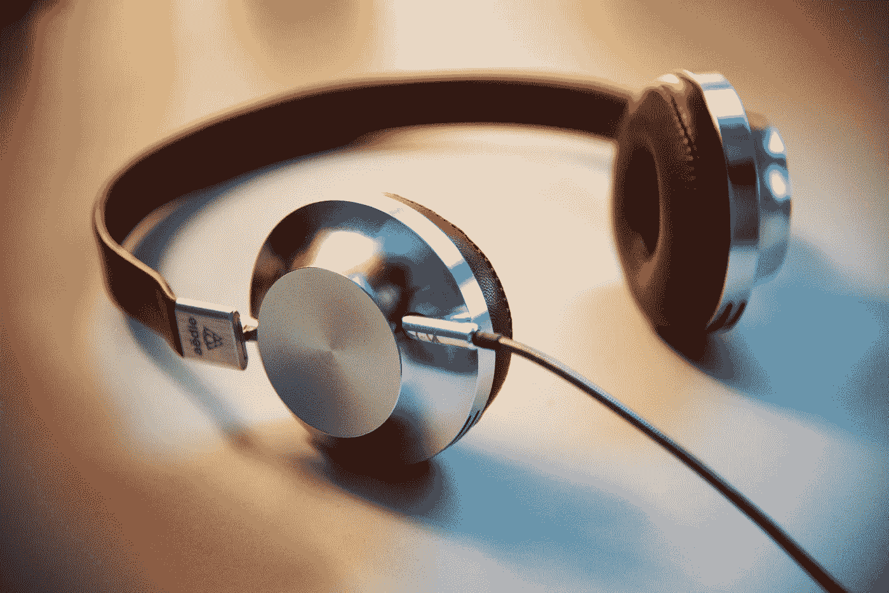

# 2022 年将推出 5 个数据科学播客

> 原文：<https://towardsdatascience.com/5-data-science-podcasts-to-follow-in-2022-4c9dcce19db5?source=collection_archive---------11----------------------->

## 倾听来自数据科学世界的声音。

李·坎贝尔在 [Unsplash](https://unsplash.com/s/photos/listen?utm_source=unsplash&utm_medium=referral&utm_content=creditCopyText) 上的照片

数据科学不是听播客就能学会的。然而，播客所提供的是你无法从其他资源中学到的东西:真实的生活体验。

我们生活在一个获取信息极其容易和廉价的时代。数据科学也是如此。个人博客、MOOC 课程和 Youtube 只是可用于学习数据科学的一些资源。

这些资源通常缺少完成拼图的一个基本部分:真实的生活经历。填补这一空白的最佳人选是播客。它们不仅涵盖了数据科学相关主题，还邀请了业内人士分享他们的经验。

正是因为这个原因，我认为播客是学习数据科学的非常有价值的资源。他们让你热身，为你在数据科学生态系统中的第一份工作做准备。

听播客的另一个好处是，你可以了解数据科学家在特定领域的工作。因此，它可以帮助你决定你的数据科学之路。由于数据科学是一个应用广泛的广阔领域，因此专注于特定领域并相应地提高技能非常重要。

最后但并非最不重要的一点是，播客有助于您跟上数据科学生态系统的最新发展。他们几乎总是分享最新的更新和新闻。

在本文中，我将列出我强烈建议您关注的 5 个数据科学播客。

## [数据怀疑论者](https://dataskeptic.com/)

Kyle Polich 的数据怀疑论播客涵盖了与数据科学、机器学习、统计学和数据科学相关的主题。嘉宾既有学术界的，也有产业界的。因此，你可以了解数据科学的研究领域以及公司如何应用数据科学。

截止到写这篇文章，差不多有 400 集了。每周都会有新的。

## [家中的数据科学](https://datascienceathome.com/)

家庭数据科学由 Francesco Gadaleta 主持，每两周更新一次。我真的很喜欢弗朗西斯科在有客人时解释事情和引导播客的方式。我觉得他问了我会问嘉宾的问题。

《数据科学之家》有几集涵盖了数据科学中使用的软件工具和软件包。还有几集解释了一些关键术语和概念，如强化学习、不平衡数据、MLOps 等。

## [Python 字节](https://pythonbytes.fm/)

Python 是迄今为止数据科学中最常用的编程语言。它易于学习，具有直观的语法，这使得 Python 成为有抱负的数据科学家的首选。

Python Bytes 是由迈克尔·肯尼迪和布莱恩·奥肯主持的每周播客。这是了解最新 Python 知识和提高 Python 技能的绝佳资源。

## [不那么标准差](https://nssdeviations.com/)

《不那么标准差》由罗杰·彭和希拉里·帕克主持。他们谈论学术界和工业界数据科学的最新发展。

他们不时招待客人。例如，朱莉娅·西尔格是 2021 年 6 月一集的嘉宾。她用 R 编程语言开发了工具和软件包。

## [艾今日](https://www.cognilytica.com/aitoday/)

《今日人工智能》由 Kathleen Watch 和 Ron Schmelzer 主持。它可能是了解人工智能世界中发生的事情的首选资源。凯思琳和罗恩还采访了一些专家，他们分享了自己在特定话题上的经验和想法。

我最喜欢播客的一点是，它引领我们超越传统资源。书籍、博客和在线课程是学习数据科学的绝佳资源。为了完成这幅图，我们还需要了解该行业的最新发展，以及数据科学在企业中的应用。

本文中提到的播客让我们从已经在数据科学领域工作的人的经验中学习。

感谢您的阅读。如果您有任何反馈，请告诉我。