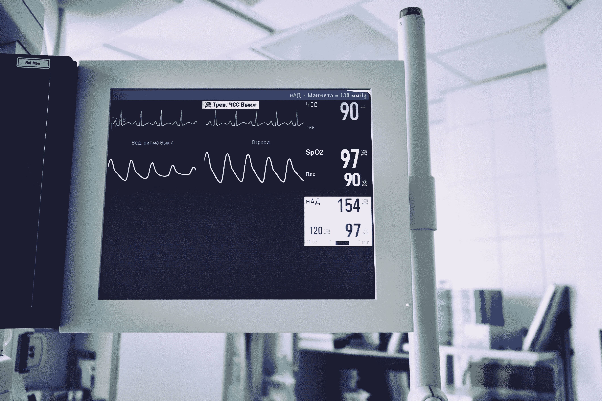
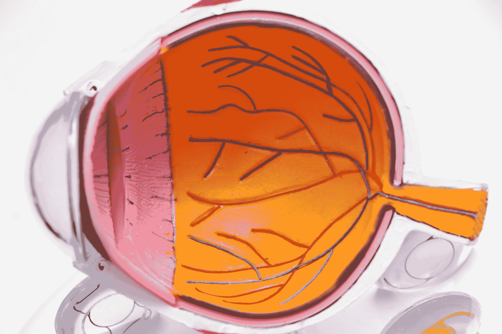
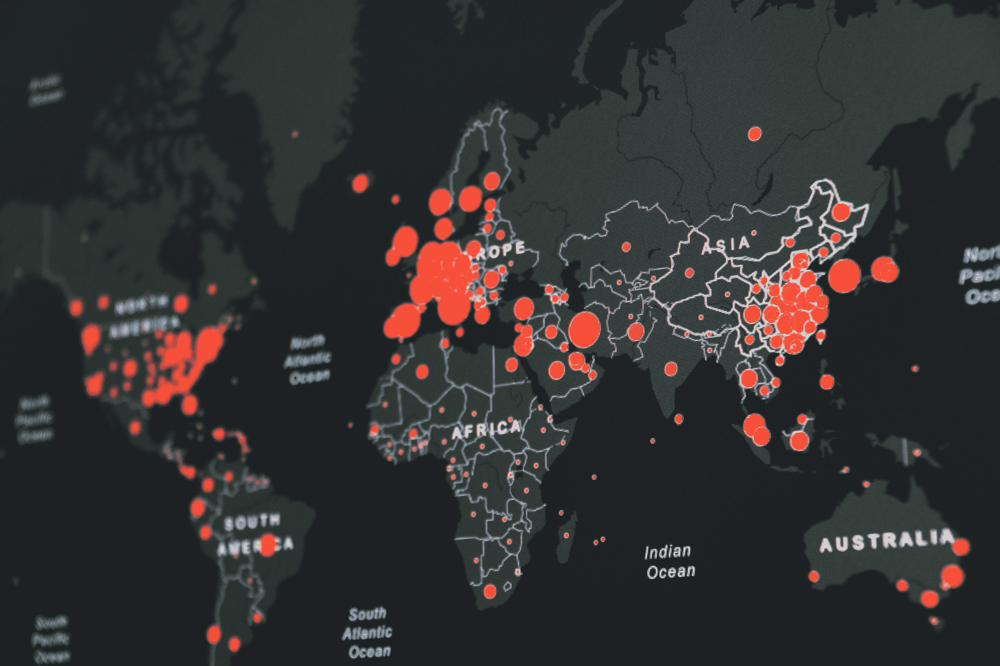

# 医疗保健领域的 5 个数据科学项目会让你被录用

> 原文：<https://towardsdatascience.com/5-data-science-projects-in-healthcare-that-will-get-you-hired-81003cadf2f3?source=collection_archive---------4----------------------->

## 想在医疗保健领域应用人工智能？做这些项目来磨练你的技能。

[斯科特·格雷厄姆](https://unsplash.com/@homajob?utm_source=medium&utm_medium=referral)在 [Unsplash](https://unsplash.com?utm_source=medium&utm_medium=referral) 上拍照

亚里士多德曾经说过，“对于我们在做之前必须学习的事情，我们通过做来学习。”我们的人脑从观察、经验和这两者的反馈回路中学习得最好。亲自动手，尤其是在学习数据科学时，可以积累丰富的经验，并在观察中形成持久的学习体验。

学习数据科学的主要部分来自于“做”数据科学项目，它有助于建立更深层次的知识、更好的记忆、理解数据科学家面临的“实际”问题，并将磨练您的整体技术技能。此外，这些数据科学项目将增加你的投资组合或简历，这将有助于你获得更好的工作机会。

我列出了以下项目，每个项目都专注于某种类型的机器学习挑战和算法，以更新您的整体机器学习和数据科学技能。

> **中风预测**
> 
> **肝硬化预测**
> 
> **糖尿病视网膜病变**
> 
> **新冠肺炎病例和死亡率的时间序列预测**
> 
> **乳腺癌检测**

# 你将在每个项目的帮助下学到的技能:

克拉克·蒂布斯在 [Unsplash](https://unsplash.com?utm_source=medium&utm_medium=referral) 上拍摄的照片

1.  ***中风预测:*** 我们将应用支持向量机来解决这个问题。SVM 是医疗保健领域中使用最广泛的算法，因为它提供了一些优势。因此，有必要掌握这种算法，它在医疗保健行业的应用中最终会非常有用。我们还将为这个项目进行一些广泛的探索性数据分析，并磨练你的 EDA 技能。
2.  ***肝硬化预测:*** 在这个项目中，我们将使用 xgboost，它是一个基于决策树的分类器。这个项目将磨练我们最常用的集成学习方法 xgboost 的技能。此外，我们也将通过这个项目刷新我们的 EDA 技能。
3.  ***糖尿病视网膜病变:*** 这是一个计算机视觉问题。计算机视觉广泛应用于医疗保健领域，是任何希望将人工智能应用于医疗保健的人的必备技能，这主要是因为许多医疗保健数据是以诊断图像的形式存在的，例如 MRI 等。
4.  ***新冠肺炎病例和死亡率的时间序列预测:*** 本项目涉及新冠肺炎相关数据的时间序列分析。时间序列分析是你机器学习工具箱中的一项重要技能。这个项目的主要目标是了解新冠肺炎病例在每个区域内的个别进展情况，然后在全球范围内的整体进展情况。在招聘过程中，在你的投资组合中有时间序列模型会给你额外的优势，并展示你在数据科学方面的知识多样性。此外，在仔细分析数据后从数据中得出关键见解是数据科学家必须具备的最被低估的技能之一。这个项目还将帮助你建立解决复杂问题和数据分析所需的批判性思维技能。
5.  ***乳腺癌检测:*** 在这个项目中，我们将使用一种深度学习技术。一般来说，这是机器学习中最重要和最先进的部分之一。磨练你的深度学习技巧是必须的，这个项目将帮助你做到这一点。

由于数据稀缺、质量差和不一致，在医疗保健领域应用机器学习是一项挑战。总的来说，每个项目都将帮助你为这个挑战做好准备，因为每个数据集都有一个或多个这样的问题。通过应用下面提到的技巧，你可以学习如何更好地处理数据问题，这将帮助你在面试中胜出并获得一份好工作。

在每个项目中，我将提供问题的目标，数据集链接，要使用的算法和实施程序。重要的是要自己做这些项目，因此我不会提供完整的代码。但是，嘿，别担心！我将提供实现过程的一步一步的路线图，还将列出每个项目中使用的一些重要的库和函数。所以跟着我。

现在让我们更深入地研究这些项目！

# 1.中风预测:

马克西姆·托尔钦斯基在 [Unsplash](https://unsplash.com?utm_source=medium&utm_medium=referral) 上拍摄的照片

在这个项目中，我们将根据患者的合并症、工作和生活方式来预测他/她是否会患心脏病。像这样的项目广泛应用于医疗保健领域，做这个项目将传授你更好地理解数据分析，数据清洗，数据可视化和算法。

数据集——冲程数据可在 [Kaggle](https://www.kaggle.com/fedesoriano/stroke-prediction-dataset) 上获得。

该数据集列出了多个特征，如性别、年龄、血糖水平、身体质量指数、吸烟状况、其他共病等。，以及目标变量:stroke。每行指定一个患者的相关信息。以下是数据集中列出的要素:

1) id:唯一标识符

2)性别:“男性”、“女性”或“其他”

3)年龄:患者的年龄

4)高血压:如果患者没有高血压，为 0；如果患者有高血压，为 1

5) heart_disease: 0 表示患者没有任何心脏病，1 表示患者有心脏病

6)是否结过婚:“否”或“是”

7)工作类型:"儿童"、"政府官员"、"从未工作过"、"私营"或"自营职业者"

8)住所 _ 类型:“农村”或“城市”

9)平均葡萄糖水平:血液中的平均葡萄糖水平

10)身体质量指数:体重指数

11)吸烟 _ 状态:“以前吸烟”、“从未吸烟”、“吸烟”或“未知”*

12)中风:如果患者有中风，则为 1；如果没有中风，则为 0

该数据集列出了预测中风几率所需的所有相关信息，这些标识符也经常被医疗从业者使用。这些输入参数可用于预测患者中风的几率。

**算法:**

这可以使用支持向量机来实现。这对小样本的应用是有利的。SVM 在解决生物信息学中的分类问题上表现出了很高的性能。这就是为什么它被广泛应用于医疗保健领域的原因。

用线性 SVM 拟合数据。将库导入为:

*从 sklearn.svm 导入 SVC*

现在，。拟合高斯核 SVC，看看决策边界如何变化。使用“rbf”内核。使用此函数应用它:

*SVC _ Gaussian = SVC(kernel = ' RBF ')*

您也可以使用 Nystroem 方法。将库导入为:

*从 sklearn.kernel_approximation 导入 nystrom*

**实施:**

首先做一些数据清理。使用这个数据集的一个警告是，它有某些空值和异常值，您可以删除它们或者用中间值替换它们。之后，执行数据可视化，以了解数据中的底层关系和依赖关系。为数据集的不同特征创建猫图、热图、配对图和箱线图，以寻找特征和目标变量之间的任何关系。

之后，将数据分成训练集和测试集。在数据集上训练并预测随机森林模型。最后得到查准率、查全率和查准率的分数来检验模型的性能。从 *sklearn.metrics* 中，可以导入*分类 _ 报告、准确度 _ 得分、精确度 _ 得分、召回 _ 得分*来查看性能指标。

# 2.肝硬化预测:

照片由[国立癌症研究所](https://unsplash.com/@nci?utm_source=medium&utm_medium=referral)在 [Unsplash](https://unsplash.com?utm_source=medium&utm_medium=referral) 上拍摄

肝硬化是一个普遍的问题，尤其是在北美，这是由于酒精的大量摄入。在这个项目中，我们将根据患者的某些生活方式和健康状况来预测患者的肝硬化。

数据集:该数据集可在 [Kaggle](https://www.kaggle.com/fedesoriano/cirrhosis-prediction-dataset) 上获得，它是从梅奥诊所试验中收集的。

这个数据集大约有 20 个特征。这些特征与患者的详细信息有关，如年龄、性别等。以及患者的血液测试，如凝血酶原、甘油三酯、血小板水平等。所有这些因素都有助于了解患者患肝硬化的几率。

同样，该数据集面临的挑战是需要替换或删除的空值。此外，该数据集具有不平衡的类，因此可能需要对数据集进行上采样。

**算法:**

我们可以为此使用随机森林分类器，也可以为此模型使用 XGBoost 分类器。一个好的做法是对这两个模型的数据进行训练，并选择得分最高的模型。从 *xgboost* 中，我们可以导入 *XGBClassifier。*

**实施:**

首先，执行一些数据清理，检查异常值和空值。可以通过计算数据集的 z 得分并保持一个阈值来检查异常值，超过该阈值的数据值将被视为异常值。然后做一些探索性的数据分析和可视化，更好地理解数据。当将数据拆分为训练集和测试集时，使用分层 K-fold 来确保目标变量在所有测试和训练拆分中均衡。可以通过从 *sklearn.model_selection 导入 *StratifiedKFold* 来完成。*然后在两个模型上训练数据，根据精度、召回率、准确度等性能指标选择模型。从 *sklearn.metrics* 中，您可以导入*分类 _ 报告、准确度 _ 得分、精确度 _ 得分、召回 _ 得分*来检查性能指标。

# 3.糖尿病视网膜病变:

照片由 [Harpreet Singh](https://unsplash.com/@harpreetkaka?utm_source=medium&utm_medium=referral) 在 [Unsplash](https://unsplash.com?utm_source=medium&utm_medium=referral) 上拍摄

该项目的目的是识别和预测糖尿病患者眼睛后部组织(视网膜)中血管受损的机会，这种情况称为糖尿病视网膜病变。

数据集——这个数据集可以在 [Kaggle](https://www.kaggle.com/c/diabetic-retinopathy-detection/data) 上找到

**算法:**

这是一个计算机视觉问题，我们将对它应用深度学习技术。我们将使用 U-Net 架构来训练数据。为了实现 U-Net，我们将使用 keras，这是一个运行在 TensorFlow 之上的强大的深度学习库。将库导入为:

*从 keras.models 导入顺序
从 keras.layers 导入密集、Conv2D、MaxPooling2D、Dropout、Flatten*

在 U-Net 架构中有不同的阶段和层次。主要有三个阶段:扩张、连接和收缩阶段。

**实施:**

首先，数据(图像)被加载、预处理并转换成数组格式。数组值代表像素强度。

数据预处理后，将数据拆分为训练和测试拆分。这种划分必须分层，以确保两种标记的比例相称，并衡量视网膜病患者与健康患者的真实分布。分层 k 倍分裂在医疗保健应用中尤其重要，因为否则它会导致疾病预测和检测中的偏差。可以通过导入此库来完成:

*从 sklearn.model_selection 导入 StratifiedKFold】*

通过查看训练集和测试集的损失来检查模型的表现。绘制两组的图表并比较结果。

# 4.新冠肺炎病例和死亡率的时间序列预测

马丁·桑切斯在 [Unsplash](https://unsplash.com?utm_source=medium&utm_medium=referral) 上拍摄的照片

在这个项目中，目标是确定疫情的性质并预测其发展。

数据集——该数据集可在此[链接](https://github.com/CSSEGISandData/COVID-19/tree/master/csse_covid_19_data/csse_covid_19_time_series)上获得，但最初来自约翰·霍普斯金大学。

该数据集包含关于新冠肺炎级数的信息，它有 6 个参数:

*id，省州，国家，确诊病例，死亡病例*

**目标及实施:**

您可以首先可视化数据，在数据中寻找可能的趋势。分析时间序列，特别是不同地区的死亡人数和确诊病例，以及它们如何随地区而变化。

这个项目的主要目标是了解新冠肺炎病例在每个区域内的个别进展情况，然后在全球范围内的整体进展情况。在仔细分析数据后，从数据中草拟关键见解。除了编写代码和机器学习之外，数据科学家的一项重要技能是从数据中获取洞察力的能力，这是由批判性思维驱动的。

在数据集中查找“在特定时间框架内，特定地区的病例增长如何超过其他地区”、“单位时间内病例斜率较高的地区”、“每个地区死亡人数发展的最大增长窗口”。

所有这些信息对于监测疾病的传播、制定大流行相关策略(如封锁计划等)至关重要。

**算法:**

用 ARIMA 模型来解决这个问题。要实现这种库导入:

*从 statsmodels.tsa.arima_model 导入 ARIMA*

你也可以使用一个简单的 RNN 模型。

用滚动平均值和标准偏差图检查案例的分布。您还可以使用 Dickey fuller 测试来检查时间序列的平稳性。

将数据分成训练集和测试集。计算平均绝对百分比误差和置信区间。

# 5.乳腺癌预测:

照片由[安格拉·哈里](https://unsplash.com/@ang10ze?utm_source=medium&utm_medium=referral)在 [Unsplash](https://unsplash.com?utm_source=medium&utm_medium=referral) 上拍摄

在这个项目中，我们将预测患者是否患有乳腺癌。

数据集——乳腺癌数据集可以在 [UCI ML 知识库](https://archive.ics.uci.edu/ml/datasets/breast+cancer)和 Kaggle 上找到。

**算法及实现:**

在这个项目中，我们将根据取自乳腺实性肿块患者的体液样本来预测乳腺癌。基于细胞核的某些特征，如“周长”、“面积”、“纹理”、“凹度”等。我们可以预测乳腺癌是恶性还是良性。

数据包括很少的分类特征，它们需要被转换成数字特征，以便任何机器学习模型可以处理它们。我们可以使用 sklearn 库的“ *get_dummies* ”或“ *one_hot_encoder* ”函数来实现。

在一些数据处理之后，应用机器学习算法。针对这个问题应用深度神经网络。要实现它，请导入这些库:

*从 tensorflow.keras.models 导入顺序
从 tensorflow.keras.layers 导入密集，激活*

我们可以通过改变“优化器”、“损失函数”等超参数来找到最佳模型。你可以尝试用不同的损失函数和优化器做两个模型——loss = ' binary _ cross entropy '和' mean_squared_error '，optimizer= "rmsprop "和" adam "。根据性能指标检查模型类型中的最佳模型。

从 *sklearn.metrics* 中，您可以导入*分类 _ 报告、准确度 _ 得分、精确度 _ 得分、召回 _ 得分*来检查性能指标。