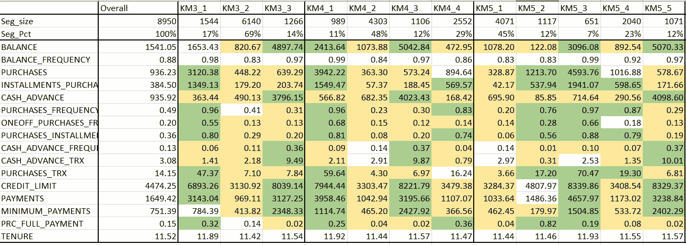

# 你可以在周末完成的 5 个数据科学项目

> 原文：<https://towardsdatascience.com/5-data-science-projects-that-you-can-complete-over-the-weekend-34445b14707d?source=collection_archive---------9----------------------->

## 所有新来者都受到高度欢迎

照片由[弗拉达·卡尔波维奇 发自](https://www.pexels.com/@vlada-karpovich?utm_content=attributionCopyText&utm_medium=referral&utm_source=pexels)[佩克斯 ](https://www.pexels.com/photo/content-young-woman-using-laptop-in-modern-living-room-4050334/?utm_content=attributionCopyText&utm_medium=referral&utm_source=pexels)

当我们开始在数据科学领域工作时，我们通常会发现为我们的实践找到正确的学习途径很有挑战性。我们在 Kaggle 上有可用的开源数据科学项目。但是，那些可用的开源项目要么太难理解，要么太容易以至于没有遵循正确的实践。

2016 年，当我开始我的数据科学之旅时，我从“房价预测”和“泰坦尼克号灾难预测”这样非常基础的项目开始。但是，在从事实时工业项目后，我发现这些基础项目不足以在数据上练习你的 EDA 技能。

我收集了一些基于行业的机器学习项目的开源数据及其解决方案，你可以在周末尝试在各个领域实践不同的机器学习模型。我还将与所有解决方案和数据集共享 GitHub 链接。

# 1.预测信用卡消费

这个项目是基于一个回归问题。任务是训练一个机器学习模型，可以根据历史数据预测信用卡支出。该模型可以帮助银行业根据用户过去的经验来决定信用卡额度。

这个项目有 15 个以上的专栏，从中找出最好的特性。通过这种方式，您还将学习不同的特征消除和选择技术。

最后，我们将使用 bagging 和 boosting 机制为我们的数据找到一个更好的模型。

资料截图

**项目来源**:你可以在我的 GitHub 页面[这里](https://github.com/pranjalAI/Predicting-Credit-Card-Spend-Identifying-Key-Drivers)找到解决的 Jupyter 笔记本。
**项目数据**:项目的数据集可以在[这里](https://www.kaggle.com/ankurv343/predict-credit-card-spent)找到。

# 2.沃尔玛销售预测

这个项目是另一个实时工业任务。主要目标是预测不同项目的未来销售。这个项目可以帮助公司维持他们依赖于未来销售的供应。

这里，我们有销售的区间水平数据。我们可以尝试 ARIMA、萨里玛、霍尔特和其他预测模型来预测未来几个月的销售。

资料截图

**项目来源**:你可以在我的 GitHub 页面[这里](https://github.com/pranjalAI/Walmart-Store-Sales-Forecasting)找到解决的 Jupyter 笔记本。
**项目数据**:项目的数据集可以在[这里](https://www.kaggle.com/c/walmart-sales-forecasting)找到。

# 3.网络入侵检测

这个项目是另一个令人兴奋的分类任务，有 100 多个特征来训练一个分类模型来对网络入侵类型进行分类。

这里的主要任务是尝试不同的特征消除和特征选择技术来减少特征的数量。最后，我们必须想出一些影响目标变量的重要特征。

最后，我们可以尝试一组分类模型，以找到最适合我们数据的模型。

资料截图

**项目来源**:你可以在我的 GitHub 页面[这里](https://github.com/pranjalAI/Network-Intrusion-Detection-System)找到解决的 Jupyter 笔记本。
**项目数据**:项目的数据集可以在这里[找到。](https://www.kaggle.com/sampadab17/network-intrusion-detection)

# 4.细分信用卡用户

该项目来自细分领域。任务是对具有相同特征的不同用户进行细分。行业利用这些细分市场，通过一系列活动来锁定用户。

该项目将使用 KMeans 聚类来根据不同聚类的轮廓分数定义不同的聚类。

资料截图

最后，我们将得到一个包含不同用户群的 excel 文件，以此作为我们营销策略的目标。

演示输出

**项目来源**:这里你可以在我的 GitHub 页面[找到已经解决的 Jupyter 笔记本。
**项目数据**:项目的数据集可以在](https://github.com/pranjalAI/Segmentation-of-Credit-Card-Customers)这里[找到。](https://www.kaggle.com/vandan2223/credit-card-users-segmentation-using-k-means)

# 5.分析在线职位发布

这个项目是另一个令人兴奋的文本分析任务。在这里，您将学习处理数据清理步骤的不同方法。您将了解将文本数据转换为数字向量的不同方法，这有助于我们的机器理解文本数据。

我们还将使用文本分类模型，后面是文本数据的词云表示，用于摘要。

资料截图

**项目来源**:你可以在我的 GitHub 页面[这里](https://github.com/pranjalAI/Analyzing-online-Job-Postings)找到解决的 Jupyter 笔记本。
**项目数据**:项目的数据集可以在[这里](https://www.kaggle.com/madhab/jobposts)找到。

# 结论

好了，这篇文章就到这里。我们已经讨论了这个周末你可以练习的五个项目。这些是不同行业的实时项目场景。

这些项目包括回归、分类、分割、预测和文本分析领域的问题。

我希望你喜欢这篇文章。谢谢你的阅读！

以下是我的一些最佳选择:

<https://betterprogramming.pub/how-a-single-mistake-wasted-3-years-of-my-data-science-journey-b7ca1e962085>  <https://betterprogramming.pub/10-python-tricks-that-will-wow-you-de450921d96a>  

> *走之前……*

如果你喜欢这篇文章，并且想继续关注更多关于 **Python &数据科学**的**精彩文章**——请点击这里[https://pranjalai.medium.com/membership](https://pranjalai.medium.com/membership)考虑成为一名中级会员。

请考虑使用[我的推荐链接](https://pranjalai.medium.com/membership)注册。通过这种方式，会员费的一部分归我，这激励我写更多关于 Python 和数据科学的令人兴奋的东西。

还有，可以随时订阅我的免费简讯: [**普朗加尔的简讯**](https://pranjalai.medium.com/subscribe) 。