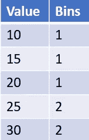
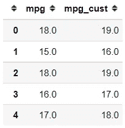

# 从 Scikit 了解 5 种数据转换器-了解

> 原文：<https://towardsdatascience.com/5-data-transformers-to-know-from-scikit-learn-612bc48b8c89?source=collection_archive---------19----------------------->

## 您可能不知道存在数据转换技术。


图片来自作者

> 如果您喜欢我的内容，并希望获得更多关于数据或数据科学家日常生活的深入知识，请考虑在此订阅我的[简讯。](https://cornellius.substack.com/welcome)

作为数据科学家，我们经常面临许多在探索数据和开发机器学习时遇到困难的情况。斗争可能来自于统计假设，谁不适合你的数据或数据中有太多的噪音。在这种情况下，您可能需要转换数据以获得更好的清晰度或满足统计方法的假设。

之前，我读过一篇适合初学者的关于数据转换的文章，你可以在这里阅读。

[](/beginner-explanation-for-data-transformation-9add3102f3bf) [## 数据转换的初级解释

towardsdatascience.com](/beginner-explanation-for-data-transformation-9add3102f3bf) 

如果您不了解什么是数据转换以及转换数据的好处(或坏处),我建议您阅读上面的文章。如果你觉得已经理解了这些概念，那么我们可以进行更深入的讨论。

我要说的一个免责声明是，在进行数据转换时，您需要非常小心，因为您最终会得到一个转换后的数据，它不再是您的原始数据。你需要理解为什么你需要转换你的数据和转换后的数据输出，这就是我写这篇文章的原因。

在本文中，我想从 Scikit-Learn 中概述一个更高级的数据转换，我们可以在特定的情况下使用它。它们是什么？让我们开始吧。

# 1.分位数变压器

分位数转换是一种非参数数据转换技术，用于将数字数据分布转换为遵循特定的数据分布(通常为**高斯分布**(正态分布))。在 Scikit-Learn 中，[分位数转换器](https://scikit-learn.org/stable/modules/generated/sklearn.preprocessing.QuantileTransformer.html#sklearn.preprocessing.QuantileTransformer)可以将数据转换成正态分布或均匀分布；这取决于您的发行参考。

分位数变换是如何工作的？从概念上讲，分位数转换器将[分位数函数](https://en.wikipedia.org/wiki/Quantile_function)应用到要转换的数据中。分位数函数本身是累积分布函数(CDF) 的**反函数，你可以在这里查看正态分布的[。如果使用均匀分布，转换后的数据将是数据的分位数位置。让我们使用示例数据来更好地理解转换。](https://en.wikipedia.org/wiki/Normal_distribution#Quantile_function)**

```
import seaborn as sns
import numpy as np
from sklearn.preprocessing import QuantileTransformer#Using mpg data
mpg = sns.load_dataset('mpg')#Quantile Transformation (by default it is Uniform)
quantile_transformer = QuantileTransformer(random_state=0,  output_distribution='uniform')
mpg['mpg_trans'] = pd.Series(quantile_transformer.fit_transform(np.array(mpg['mpg']).reshape(-1, 1))[:,0])mpg[['mpg', 'mpg_trans']].head()
```


作者图片

上图可以看到，索引 0 中的真实数据是 18，转换后的数据是 0.28；为什么是 0，28？让我们试着取 mpg 列的分位数 0.28。

```
np.quantile(mpg['mpg'], 0.28)
```


作者图片

结果是 18；这意味着转换后的数据是实际数据的分位数位置的近似值。请注意，当您应用分位数转换时，您会丢失转换变量之间的线性相关性，因为分位数转换器是一个非线性转换器。然而，由于数据已经改变，因此不期望测量转换变量之间的线性相关性。

分位数转换通常用于移除异常值或拟合正态分布，尽管有许多类似的数据转换可供比较。

# 2.电力变压器

分位数变压器是应用分位数函数的非参数变压器， **Power Transformer 是通过**[**Power Function**](https://en.wikipedia.org/wiki/Exponentiation#Power_functions)实现的参数变压器。与分位数转换器一样，Power Transformer 通常用于转换遵循正态分布的数据。

从 Scikit-Learn 中，电源变压器类中给出了两种方法: [Yeo-Johnson 变换](https://en.wikipedia.org/wiki/Power_transform#Yeo%E2%80%93Johnson_transformation)和 [Box-Cox 变换](https://www.statisticshowto.com/box-cox-transformation/)。这两种方法的基本区别在于它们允许转换的数据— **Box-Cox 要求数据为正，而 Yeo-Johnson 允许数据同时为负和正**。让我们使用示例数据来使用 Scikit-Learn 中的电源转换。我想使用以前的数据集，因为有些要素不是正态分布的，例如，权重要素。

```
sns.distplot(mpg['weight'])
```


作者图片

正如我们在上面的图像中所看到的，分布明显偏右或正偏，这意味着它没有遵循正态分布。让我们使用电力变压器来转换数据，以密切遵循正态分布。

```
from sklearn.preprocessing import PowerTransformer
pt = PowerTransformer(method = 'box-cox')
mpg['weight_trans'] = pt.fit_transform(np.array(mpg['weight']).reshape(-1,1))[:,0]sns.distplot(mpg['weight_trans'])
```


作者图片

使用 Power Transformer(本例中的 Box-Cox)会使数据更接近正态分布。由于数据非常倾斜，转换后的数据并不完全遵循正态分布，但它比未转换的数据更接近正态分布。

虽然 Quantile Transformer 和 Power Transformer 都可以通过保留等级将您的数据转换为另一种数据分布，但其用途可能仍取决于您的数据和您对转换的预期比例。没有确定的方式说一个变压器比另一个好；要知道哪种转换器适合您的数据，您可以做的就是应用它并衡量您使用的指标。

# 3.k-bin 离散化

离散化是一个**将连续特征转化为分类特征的过程，方法是将其划分为期望值范围(区间)**内的几个区间。我将向您展示下表中的示例数据和离散化转换。



作者图片

在上表中，我有五个数据点(10，15，20，25，30)，我将连续值离散化为一个分类特征，称为 Bins，其中包含值 1 和 2。在 bin 特性中，我将 10–20 之间的值输入到类别 1 中，其余的输入到类别 2 中——这就是离散化的基本工作方式。

在 Scikit-Learn 中，使用具有设定间隔(通常为分位数)的宁滨进行离散化的过程在 KBinsDiscretization 类中编译。让我们用数据集的例子来更好地理解这个函数。

```
from sklearn.preprocessing import KBinsDiscretizer#Setting the divided bins into 5 bins with quantile interval and transformation into ordinal categoryest = KBinsDiscretizer(n_bins = 5, encode = 'ordinal', strategy='quantile')mpg['mpg_discrete'] = est.fit_transform(np.array(mpg['mpg']).reshape(-1,1))mpg[['mpg', 'mpg_discrete']].sample(5)
```


作者图片

从上表可以看出，连续特征 mpg 被离散化为有序分类特征。您通常会从离散化特性的一键编码中受益；这就是为什么 KBinsDiscretizer 还为您提供了 One-Hot 功能(事实上，默认的编码参数是‘One Hot’)。然而，我经常在 OHE 过程中使用 Pandas get_dummies 特性，因为它比直接从 KBinsDiscretizer 中处理更容易。

# 4.特征二值化

特征二值化是一个**简单的离散化过程，使用一定的阈值将连续特征转换成分类特征**。要素二值化的结果是布尔值-真或假(0 或 1)。让我们尝试使用 Scikit 中的二进制化类——学习理解概念。

```
from sklearn.preprocessing import Binarizer#Setting the threshold to 20
transformer = Binarizer( threshold = 20)mpg['mpg_binary'] = transformer.fit_transform(np.array(mpg['mpg']).reshape(-1,1))mpg[['mpg', 'mpg_binary']].sample(5)
```


作者图片

从上表可以看出，小于 20 的值将返回 False (0)，其余的值将返回 True (1)。门槛是我们经常设定的；您可能想知道为什么设置当前阈值。请注意，如果您将 KBinsDiscretizer n_bins 使用为 2，那么如果阈值与 bin 边缘值相似，它将与二进制化器相似。

# 5.功能变压器

Scikit-Learn 为我们提供了许多可以用于数据预处理管道的转换方法。然而，我们想应用我们自己的函数进行数据转换，但是 Scikit-Learn 没有提供它。这就是为什么 Scikit-Learn 也提供了 Function Transformers 类来开发他们自己的数据转换函数。

为什么我们要用 Scikit-Learn 开发自己的自定义函数？您的模型只需要有一个 Scikit-Learn 管道，并且需要在您的数据管道中有一个自定义转换。使用模型和数据越多，您就会意识到自定义转换器的使用频率比您想象的要高。

让我们试着用函数变形金刚创造我们自己的变形金刚。我想在我的数据管道中将我的数据转换成日志值，但是 Scikit-Learn 没有提供该功能；这就是为什么我需要自己开发它。

```
from sklearn.preprocessing import FunctionTransformer#Passing the log function from numpy which would be applied to every data in the columntransformer = FunctionTransformer(np.log, validate=True)mpg['mpg_log'] = transformer.fit_transform(np.array(mpg['mpg']).reshape(-1,1))
mpg[['mpg', 'mpg_log']].head(5)
```


作者图片

使用函数转换器，您可以像上面的结果一样控制自己的转换结果。数据被转换成日志数据，您可以使用它进行进一步的处理。

你不一定需要依赖 Numpy 包；你总是可以创建你自己的函数——重要的是函数产生一个输出。例如，我在下面的代码中创建了自己的函数。

```
def cust_func(x):
    return x + 1
```

该函数将通过加法过程返回一个数值(加 1)。让我们将它传递到我们的自定义变压器中。

```
transformer = FunctionTransformer(cust_func, validate=True)
mpg['mpg_cust'] = transformer.fit_transform(np.array(mpg['mpg']).reshape(-1,1))
mpg[['mpg', 'mpg_cust']].head(5)
```



作者图片

从上表中可以看出，我们的值结果遵循我们之前开发的函数。Function Transformer 听起来很简单，但从长远来看，它将有助于您的管道过程。

# 结论

数据转换是数据工作中的一个典型过程，如果您知道数据转换过程的结果，通常会对您的工作有所帮助。Scikit-Learn 为我们提供了一些数据转换方法，包括:

1.  **分位数转换器**
2.  **电力变压器**
3.  **K-Bins 离散化器**
4.  **特征二值化**
5.  **功能变压器**

希望有帮助！

在我的[**LinkedIn**](https://www.linkedin.com/in/cornellius-yudha-wijaya/)**或 [**Twitter**](https://twitter.com/CornelliusYW) **上访问我。****

> **如果您没有订阅为中等会员，请考虑通过[我的推荐](https://cornelliusyudhawijaya.medium.com/membership)订阅。**