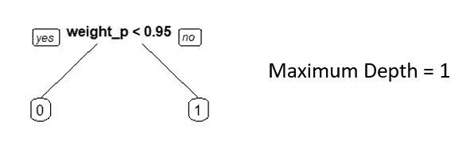

# 5 个决策树超参数来增强您的树算法

> 原文：<https://towardsdatascience.com/5-decision-tree-hyperparameters-to-enhance-your-tree-algorithms-aee2cebe92c8?source=collection_archive---------14----------------------->

## 了解一些最常见的超参数，您可以调整这些参数来提高基于树的算法的性能

图片由[Alperen yazgá](https://unsplash.com/@armato)@ unsplash . com 提供

D 决策树是非常酷的算法，为随机森林、LightGBM 或 XGBoost 等更高级的算法奠定了基础。在您的数据科学之旅中，决策树可能是您将学习的第一个非线性算法，因为它们非常易于解释和理解。如果你还在纠结基于树的算法，看看[我写的关于分类树的文章](/classification-decision-trees-easily-explained-f1064dde175e?sk=ccd305c31950f2e8c843377186e5e75f)。希望，这可能是一个有趣的阅读，以帮助你

在研究数据科学和机器学习的背景下，决策树可能是您将学习的第一个算法，当涉及到它们的性能时，超参数是必不可少的。可以说，超参数对于基于树的算法来说比其他模型更重要，比如基于回归的模型。至少，人们可以在决策树中调整的超参数的数量比大多数算法更加庞大和多样化。

随着权力越来越大，责任也越来越大，决策树可以发现特征和目标之间非常有趣的非线性关系，但它们也非常容易出现高方差，通常称为过度拟合。

你如何控制过度拟合的趋势？用超参数！

**超参数是模型在训练期间无法推断的参数，数据科学家必须自行校准。**正如我们已经讨论过的，学习该算法还会让您很好地理解超参数在训练过程中的重要性，以及更改它们如何影响您的机器学习解决方案的性能和稳定性。

在本帖中，我们将检查一些在拟合决策树时可以调整的常见超参数，以及它们对模型性能的影响。开始吧！

# **最大深度**

我们要研究的第一个超参数是“最大深度”参数。这个超参数设置了一棵树在训练过程中可以“下降”的最高级别。例如，在分类树的 [sklearn](https://scikit-learn.org/stable/modules/generated/sklearn.tree.DecisionTreeClassifier.html) 实现中，默认情况下，最大深度设置为 none。

**在训练过程中没有最大深度会有什么影响？假设你的树不受任何其他超参数控制，你的树可以“理论上”向下直到所有节点都是纯的。这种方法的一个主要问题是，你可能最终只对训练表中的一个例子做出决定。想想看，如果你让你的树降得太多，你就会递归地分割你的空间，直到你“潜在地”隔离了每个例子——这将导致过度拟合，因为你的算法在训练样本中会非常好，但无法推广到现实世界——这是机器学习算法的最终目标。**

**通过尝试你的树的不同深度级别，你将在你的算法的泛化能力和拟合能力之间取得平衡**——下面是一个图形示例，说明当你尝试不同的最大深度参数时会发生什么:

最大深度演示—图片由作者提供

概括一下:

*   一些过高的最大深度可能会导致过度拟合或高方差。
*   太低的最大深度数可能导致欠拟合或高偏差。

# 最小样本分割

正如我们已经看到的，如果我们不在我们的树中设置最大深度，我们最终会鼓励我们的树寻找纯节点——只包含一个单一类(分类树)或一个连续值(回归树)的节点。这自然会使我们的树基于更少的例子做出决定，因为纯节点可能基于大量的分裂，并且容易遭受[维数灾难](https://en.wikipedia.org/wiki/Curse_of_dimensionality)。

**有没有其他超参数可以帮助我们避免使用稀疏数据来做决策？有啊！**其中之一是“最小样本分割”超参数，它允许您控制一个节点必须包含多少样本才能进行分割。

在这个超参数上设置一个大的数字将会导致你的树用更多的例子进行概括**，因为你只在一个树节点包含的数目超过你设置的数目时才分割它。这将避免创建两个潜在的“低样本”子节点，这些子节点将从节点中产生。**

一个极端的例子(在这个超参数中的一个高值)是:如果你使用训练规模作为“最小样本分割”，你的结果只是目标变量的平均值，因为你是在整个群体上做出推断的——当然，这种方法会有点无意义。

**较小数量的最小样本分割会导致决策树过拟合，因为它会对较少的样本做出决策，这与选择较高的决策树最大深度具有相同的效果。**

概括一下:

*   太低的“最小样本分割”数可能会导致过度拟合或高方差。
*   过高的“最小样本分割”数可能会导致欠拟合或高偏差。

# 最小样本叶

与我们上面看到的超参数类似，最小样本叶是一个超参数，它控制末端叶节点可以拥有的样本数量。叶子节点是你的树的任何终端节点，将被用于分类新点。

这与我之前介绍过的超参数非常相似，唯一的区别是您试图控制的样本大小的阶段。在上面的超参数中，在分割节点之前，您控制节点**中的实例数量。使用最小样本叶，您可以控制节点**中的样本数量，在**之后，拆分“可能”发生。**

通过增加最小样本数，你也可以防止过度拟合，试图避免维数灾难。

概括一下:

*   太低的“最小样本叶”数可能会导致过度拟合或高方差。
*   太高的“最小样本叶”数可能导致欠拟合或高偏差。

# 最大功能

不作用于样本大小而作用于特征的超参数是“最大特征”超参数。默认情况下，每次决策树对候选项执行搜索以执行下一次分割时，它都会广泛地查看每个特征。

这主要有两个缺点:

*   您可以阻止您的树以任何方式处理随机性-例如，如果您的树每次执行分割时只能使用随机选择的一些要素，您将在训练过程中引入一个随机过程，这将有利于您的性能。
*   如果你的维数很高，你的树将需要很长时间来训练。

使用 max features，您可以通过为每次分割随机选择一组功能来增加训练过程的趣味。当你有很多特性时，这是非常实用的。

在 [sklearn 实现](https://scikit-learn.org/stable/modules/generated/sklearn.tree.DecisionTreeClassifier.html#sklearn.tree.DecisionTreeClassifier)中，您将找到不同的方法来选择每次分割时您想要考虑的最大特性数量——您可以将其定义为一个整数或特性总数的一部分(例如，所有特性的 50%)。

概括一下:

*   “最大特征”的数量很高，近似于在没有参数集的情况下对决策树的大范围搜索。
*   当选择树的下一个分割时，较低的最大深度值会选择较少的随机特征来考虑。

# 最小杂质减少

另一种调整你的树并更严格地确定哪些分裂对你的树来说是“可接受的”的方法是控制杂质的数量(你想要在每个分裂中最小化的值)。

默认情况下，在每一次分裂中，你接受你整个树中杂质的减少。使用该超参数设置，仅当分割将杂质减少了 *x* 量时，才应用分割。

这个超参数直接作用于决策树的成本函数——即使分割减少了杂质并“理论上”改善了分类或回归，它也不能用于前进，因为它不符合您定义的阈值。在 [sklearn 实现](https://scikit-learn.org/stable/modules/generated/sklearn.tree.DecisionTreeClassifier.html#sklearn.tree.DecisionTreeClassifier)中，该值默认设置为 0——这意味着只要减少杂质，任何分割都是有效的，即使它将该值减少 0.00001。

概括一下:

*   低数值的“最小杂质减少”将使你的树在“理论上”有效的分裂上分裂你的数据，但是那可能是没有意义的；
*   高数值的“最小杂质减少”会使你的训练过程在选择下一次分裂时过于严格，导致高偏差。

感谢您的阅读！这是我在开发决策树时通常会调整的 5 个超参数。学习决策树在我对 DS 和 ML 的研究中是必不可少的——正是算法帮助我理解了超参数对算法性能的巨大影响，以及它们如何成为项目成败的关键。

***我在***[***Udemy***](https://www.udemy.com/course/r-for-data-science-first-step-data-scientist/?referralCode=6D1757B5E619B89FA064)***开设了一门关于从零开始学习数据科学的课程——这门课程是为初学者设计的，包含 100 多个练习，我希望您能在身边！***

 [## 通过我的推荐链接加入 Medium-Ivo Bernardo

### 作为一个媒体会员，你的会员费的一部分会给你阅读的作家，你可以完全接触到每一个故事…

ivopbernardo.medium.com](https://ivopbernardo.medium.com/membership)