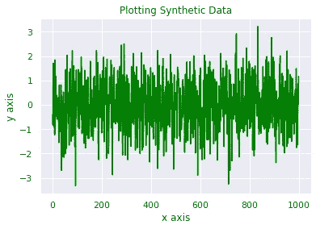
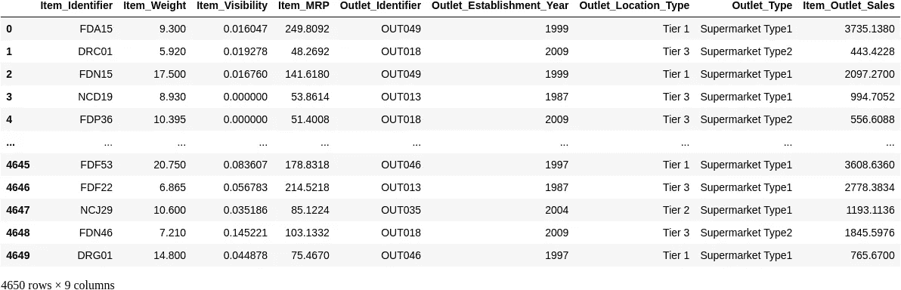
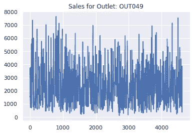

# 提高数据科学项目的 5 个开发规则

> 原文：<https://towardsdatascience.com/5-development-rules-to-improve-your-data-science-projects-f3392b8243cd?source=collection_archive---------14----------------------->


卡尔·帕夫洛维奇在 [Unsplash](https://unsplash.com?utm_source=medium&utm_medium=referral) 的照片

## 指导您的数据科学工作流程的简单技巧

在从事数据科学项目时，我喜欢为如何为项目编写代码制定一些基本规则。有了一些简单的原则，我总是确信我将要写的代码能够经受住最低的质量门槛。

***在这篇文章中，我将向你展示 5 个简单的开发规则来指导你的数据科学工作流程。***

# 规则

简而言之，规则是:

1.  **将脚本抽象成函数和类**
2.  **确保函数是原子的**
3.  **编写单元测试**
4.  **结合 Jupyter 笔记本使用您最喜欢的文本编辑器**
5.  **进行小规模频繁提交**

现在，让我们一个一个地看一遍。

## 1.将脚本抽象成函数和类

假设你正在用 Jupyter 笔记本计算如何最好地可视化一些数据。一旦代码工作了，并且您认为它不需要更多的调试，就该对它进行抽象了！让我们看一个例子，

```
import matplotlib.pyplot as plt
import seaborn as sns
sns.set()
import numpy as np
import pandas as pd

synthetic_data = np.random.normal(0,1,1000)

plt.plot(synthetic_data, color="green")
plt.title("Plotting Synthetic Data")
plt.xlabel("x axis")
plt.ylabel("y axis")
plt.show()
```



在这里，我们绘制了一些合成数据。假设我们对我们的绘图满意，我们现在要做的是将它抽象成一个函数，并将其添加到我们项目的代码库中:

```
def plotSyntheticDataTimeSeries(data):
    plt.plot(data, color="green")
    plt.title("Plotting Synthetic Data")
    plt.xlabel("x axis")
    plt.ylabel("y axis")
    plt.show()
```

太好了！现在，我们可以将它放在我们的代码库中，并在每次需要使用这个绘图函数时调用它，如下所示:

```
plotSyntheticDataTimeSeries(synthetic_data)
```


简单，也是很好的练习。

如果出于某种原因，我们希望加载数据并对其执行一些简单的转换，我们可能希望有一个类来为我们处理这些。

让我们看一个使用[大商场销售数据集](https://www.kaggle.com/brijbhushannanda1979/bigmart-sales-data)的简单例子:

```
import matplotlib.pyplot as plt
import seaborn as sns
sns.set()
import numpy as np
import pandas as pd

class DataPrep:
    def __init__(self,data_path,cols_to_remove=["Item_Fat_Content", "Item_Type", "Outlet_Size"]):
        self.data = pd.read_csv(data_path)
        self.cols_to_remove = cols_to_remove
        self.removeNans()
        self.removeCols()

    def removeNans(self):
        self.data = self.data.dropna()

    def removeCols(self):
        self.data = self.data.drop(self.cols_to_remove, axis=1)
        self.data = self.data.reset_index(drop=True)

data_path = "./BigMartSales.csv"
dp = DataPrep(data_path)
dp.data
```



现在我们有了它，DataPrep 类可以被系统地用来执行我们想要的转换。这显然是一个玩具示例，并没有涵盖清理和预处理数据集的整个过程。

在这里，我们只是举例说明如何将代码抽象成函数和类，这些函数和类以后可以发展并集成到我们的生产流水线中。

## 2.**确保函数是原子的**

结合将你的管道抽象成函数和类的想法，我们也应该总是寻找原子性，也就是说，每个函数应该做一件事。这条规则源于面向对象编程的良好实践，是避免不必要的复杂性的良好指南，这种复杂性可能会在将来耗费大量时间。

因此，如果我们有一个情况，我们加载数据集，转换它，然后绘制它，我们应该为这个过程的每个原子写一个函数。

让我们将一个绘图函数添加到上一个示例的代码库中，看看它会是什么样子:

```
import matplotlib.pyplot as plt
import seaborn as sns
sns.set()
import numpy as np
import pandas as pd

def badExampleofNonAtomicFunction():
    data_path = "./BigMartSales.csv"
    cols_to_remove = ["Item_Fat_Content", "Item_Type", "Outlet_Size"]
    data = pd.read_csv(data_path)
    data = data.dropna()
    data = data.drop(cols_to_remove, axis=1)
    data = data.reset_index(drop=True)
    data[data["Outlet_Identifier"]=="OUT049"]["Item_Outlet_Sales"].plot()
    plt.title("Sales for Outlet: OUT049")
    plt.show()

badExampleofNonAtomicFunction()
```



尽管如此，这里我们并没有构建一个合理的跟踪记录来记录我们对数据集应用了什么，所以调试这个将是一场噩梦。

现在让我们看一个例子，看看如何使这段代码更容易调试。我们可以从使用之前构建的类开始，在该类之外编写一个简单的绘图函数:

```
import matplotlib.pyplot as plt
import seaborn as sns
sns.set()
import numpy as np
import pandas as pd

class DataPrep:
    def __init__(self,data_path,cols_to_remove=["Item_Fat_Content", "Item_Type", "Outlet_Size"]):
        self.data = pd.read_csv(data_path)
        self.cols_to_remove = cols_to_remove
        self.removeNans()
        self.removeCols()

    def removeNans(self):
        self.data = self.data.dropna()

    def removeCols(self):
        self.data = self.data.drop(self.cols_to_remove, axis=1)
        self.data = self.data.reset_index(drop=True)

def plotOutletSales(data, outlet_id):
    data[data["Outlet_Identifier"]==outlet_id]["Item_Outlet_Sales"].plot()
    plt.title(f"Sales for Outlet: {outlet_id}")
    plt.show()

data_path = "./BigMartSales.csv"
dp = DataPrep(data_path)
plotOutletSales(dp.data, outlet_id="OUT049")
```


现在，我们有了稍微好一点的东西，因为我们让每一步都成为一个构建模块，为我们的管道添加单独的功能。

## 3.编写单元测试

编写单元测试肯定是一个有点烦人的步骤，但对于生产代码来说，确保我们的代码对于真实环境足够健壮，以及在部署管道时帮助防止不必要的错误和问题是非常重要的。

让我们编写一些代码来测试我们为`DataPrep`类编写的各个方法:

```
import unittest
import pandas as pd
import numpy as np

def removeNans(data):
    data = data.dropna()
    return data

def removeCols():
    data = data.drop(cols_to_remove, axis=1)
    data = data.reset_index(drop=True)

class TestDataPrep:
    def __init__(self):
        data_path = "./BigMartSales.csv"
        self.data = pd.read_csv(data_path)
        super().__init__(unittest.TestCase)

    def test_removeNans(self):
        data = removeNans(self.data)
        result = []

        for col in data.columns:
            result.append(data[col].isnull().sum())

        result = np.sum(result)
        print(result)
        self.assertEqual(result,0)

    def test_removeCols():
        data = removeCols(self.data)
        cols_to_check = ["Item_Fat_Content", "Item_Type", "Outlet_Size"]
        self.assertEqual(any(element in cols_to_check 
                        for element in data.columns)==False)

data_path = "./BigMartSales.csv"
data = pd.read_csv(data_path)

if __name__ == "__main__":
    unittest.main()# Output
Ran 0 tests in 0.000sOK
```

**在这个例子中，我们通过编写一个名为** `**TestDataPrep**` **的类来测试这两个函数，这个类对它们的预期结果进行检查。**

## 4.将您最喜爱的文本编辑器与 Jupyter 笔记本结合使用

我是杰瑞米·霍华德的超级粉丝，我强烈推荐他的视频:

浅谈使用 Jupyter 笔记本进行软件开发。

如果我们将我们最喜欢的文本编辑器与 jupyter 笔记本结合使用，通过以下简单的笔记本命令让它们自动同步，那么数据科学项目的开发可以得到极大的改进:

```
%load_ext autoreload
%autoloread 2
```

现在，每次我们在我们选择的文本编辑器上编辑内容时，我们都会在 jupyter 笔记本中自动更新该函数或类。

通过这样做，人们可以利用 jupyter 笔记本令人惊叹的交互功能，以及我们最喜欢的文本编辑器 (我使用 Visual Studio 代码，但这只是一种偏好)的强大文本编辑功能。

## 5.小而频繁地提交

就像一般的功能和开发一样，我们的目标是构建一个易于调试的管道。

为此，还应该使用小而频繁的提交，而不是大的提交，因为大的提交会使得在出错时更难返回并进行调查。

我的建议是为提交设置一个规则，一旦达到这个阈值，我们就提交并继续开发。

为了有助于此，我们可以提前计划我们的项目，并预见我们需要执行来完成它的步骤，试图找到进度的清晰定义，当达到该定义时，将触发提交。

通过这样做，我们得到了一种在数据科学项目中计算和正确跟踪进度的方法。

# 良好做法的重要性

所有从事严肃的数据科学项目的人都需要一种随着时间推移而改进的方法。

根据项目的类型和个人的目标，可以添加或更改许多关于个人良好实践的流程，但如果我想留给您一件事，那就是， ***定义您的一套良好实践，遵循它，并随着时间的推移改进它！***

如果您对数据科学感兴趣，并且正在寻找一个起点，请查看 udemy 课程:

*   [数据科学课程 2021:完整的数据科学训练营](http://seekoapp.io/614807cde82c850008014aec)

> *这是一个附属链接，如果你使用这个课程我会得到一点佣金，干杯！:)*

如果你喜欢这篇文章，在[媒体](https://lucas-soares.medium.com/)、[上关注我，订阅我的简讯](https://lucas-soares.medium.com/subscribe)，在[推特](https://twitter.com/LucasEnkrateia)、 [LinkedIn](https://www.linkedin.com/in/lucas-soares-969044167/) 、 [Instagram](https://www.instagram.com/theaugmentedself/) 和[加入媒体](https://lucas-soares.medium.com/membership)与我联系！谢谢，下次再见！:)