# 你必须知道的 5 个 Dplyr 函数

> 原文：<https://towardsdatascience.com/5-dplyr-functions-that-you-must-know-1a9ca17e50e2?source=collection_archive---------21----------------------->

## 有了 dplyr，R 中的数据操作很容易，相信我！


由[谷仓图片](https://unsplash.com/@barnimages?utm_source=unsplash&utm_medium=referral&utm_content=creditCopyText)在 [Unsplash](https://unsplash.com/s/photos/tools?utm_source=unsplash&utm_medium=referral&utm_content=creditCopyText) 上拍摄

# 介绍

Dplyr 是一个用于操作表格数据的库。它是使用 R 编程语言构建的。

数据操作是一个过程，我们将准备数据集，并以探索的方式分析数据。

我们在这里有几个过程。我们将过滤数据，汇总数据，生成新的列，等等。

本文将向您介绍数据操作必须了解的 5 个 dplyr 函数。

通过理解这些函数，您可以更容易地进行数据操作。

没有进一步，让我们开始吧！

# 安装并加载库

在我们动手之前，首先确保您已经安装了 dplyr 库。为此，您可以像这样使用 install.packages 函数:

```
**install.packages('tidyverse')**
```

在我们安装了这个库之后，现在您可以用下面的代码加载这个库了:

```
**library(dplyr)**
```

# 数据

为了展示这个库的能力，我们将使用一个名为 **mtcars** 的数据集。该数据集包含有关汽车特征的信息，如重量、油耗、变速器类型等。

让我们使用 **head** 函数来看看数据集中的前五个观察值。下面是实现这一点的代码:

```
**head(mtcars)**
```

这是结果的预览:

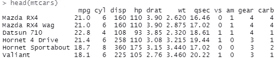

作者捕捉到的。

现在让我们进入 dplyr 函数！

# “选择”功能

我要展示的第一个功能是**选择**功能。该函数将根据您的需要选择列。要运行这个函数，您必须给它一些参数，比如数据集和列名。

例如，让我们从 mtcars 数据集中取出 cyl、hp 和 wt 列。下面是实现这一点的代码:

```
**select(mtcars, cyl, hp, wt)**
```

这是结果的预览:

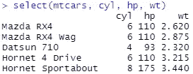

作者捕捉到的。

# “过滤”功能

我要展示的第二个功能是**过滤器**功能。该函数将根据一个或多个条件过滤您的数据。

例如，让我们通过只选择有自动变速器的汽车来过滤数据。我们将用值 1 过滤 am 列。

下面是实现这一点的代码:

```
**filter(mtcars, am == 1)**
```

这是结果的预览:

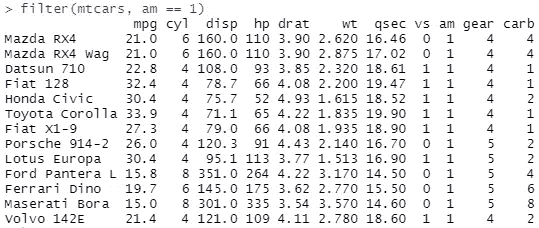

作者捕捉到的。

正如我之前提到的，你也可以在函数中添加另一个条件。为了组合这些条件，我们可以使用像 AND ( &)和 OR ( |)这样的比较运算符。

现在让我们添加另一个条件来过滤我们的数据集，我们希望检索马力大于 150 的汽车。

下面是实现这一点的代码:

```
**filter(mtcars, am == 1 & hp > 150)**
```

这是这样做的预览:

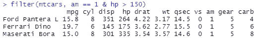

作者捕捉到的。

# “变异”功能

我要展示的第三个函数是 **mutate** 函数。该函数将通过使用数学或比较运算符操作现有列来创建一个新列。

让我们以创建一个新列为例。如你所知，wt 栏代表汽车的重量，该栏使用 lbs 作为测量系统。

我们将把这个值转换成千克作为计量单位。我们将 wt 列上的值乘以 0.453592 和 1000。我们将此列命名为 **wt_kg** 。

下面是实现这一点的代码:

```
**mutate(mtcars, wt_kg = wt * 1000 * 0.453592)**
```

这是这样做的预览:

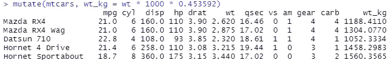

作者捕捉到的。

正如我之前提到的，我们也可以使用比较操作符，比如 **if-else** 操作符来创建一个新列。

让我们举一个例子，我们想根据柱面编号来划分列。条件是这样的。如果汽车的汽缸少于五个，我们将把这个值设置为 FALSE。相反的会得到真实值。我们将这个列命名为 **cyl_below_five** 。

下面是实现这一点的代码:

```
**mutate(mtcars, cyl_below_five=if_else(cyl < 5, FALSE, TRUE))**
```

这是这样做的预览:

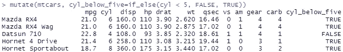

作者捕捉到的。

# “总结”功能

我要展示的第四个函数是**总结**函数。这个函数将汇总一个列上的值，并提供一个统计摘要。

为了演示这一点，让我们举一个例子，我们将通过使用 mean 函数对 mpg 列进行平均来对其进行汇总。

下面是实现这一点的代码:

```
**summarise(mtcars, mean(mpg))**
```

这是这样做的结果:

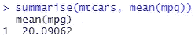

作者捕捉到的。

这里额外的一课。如果您想用一个函数汇总您的数据集，您可以使用**汇总**函数来完成。下面是实现这一点的代码:

```
**summary(mtcars)**
```

这是结果的预览:

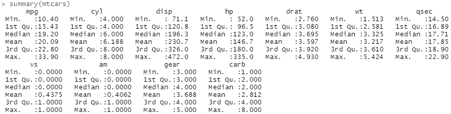

作者捕捉到的。

# “排列”功能

我要展示的第五个也是最后一个功能是“排列”功能。该函数将以升序或降序方式对数据集进行排序。将需要一个或多个列来对数据集进行排序。

让我们举一个例子，我们将根据 mpg 列对数据集进行排序。

下面是实现这一点的代码:

```
**arrange(mtcars, mpg)**
```

这是结果:

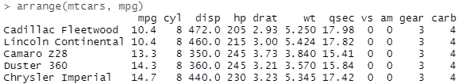

作者捕捉到的。

从上面可以看到，这个表是升序排列的。我们可以通过用 **desc** 函数包装列名来对数据集进行降序排序。

让我们修改代码并再次运行它。下面是实现这一点的代码:

```
**arrange(mtcars, desc(mpg))**
```

这是结果:

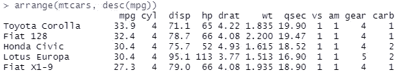

作者捕捉到的。

现在你已经学会了五个必须知道的 dplyr 函数！

# 额外奖励:管道操作员

但是等等，这篇文章还没有结束。我还有一样东西给你看。在 R 语言中，可以一次运行所有的函数。

我们可以使用一个叫做**管道**的操作符。下面是它的图解:

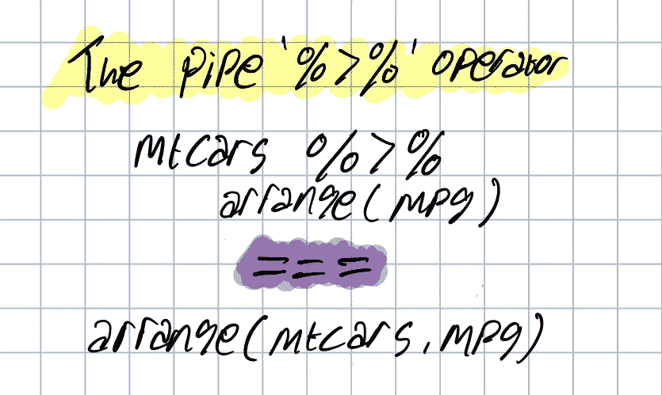

由作者创作。

基本上，管道操作符将从左侧捕捉输入，并将其放在右侧的函数上。

回想一下 summarise 函数，我们将再次尝试对 mpg 列进行平均。但这一次，我们将根据气缸数量对数据进行分组。

为此，我们可以使用 group_by 函数对数据进行分组。然后，我们用管道操作符将该函数与摘要函数连接起来。

下面是实现这一点的代码:

```
**mtcars %>%
  group_by(cyl) %>%
  summarise(mean(mpg))**
```

这是结果的预览:

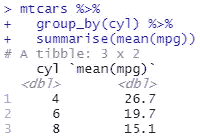

作者捕捉到的。

您注意到管道操作符对代码的可读性了吗？使用管道，您可以使您的代码可读。此外，您可以组合这么多的功能，只运行一次。

# 结束语

干得好！现在，您已经学习了使用 dplyr 库操作数据的必备函数。您还了解了管道操作符，它使您的数据操作管道更加强大。

我希望这篇文章能够帮助您开始将 dplyr 用于数据操作管道。

如果你对我的文章感兴趣，可以关注我的**媒介**获取更多这样的文章。还有，如果你想提问或者想打个招呼，可以在 [**LinkedIn**](https://www.linkedin.com/in/alghaniirfan/) 上联系我。

谢谢你看我的文章！