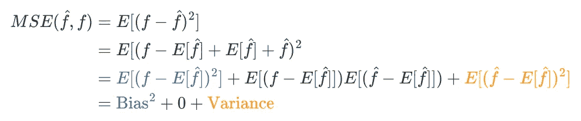
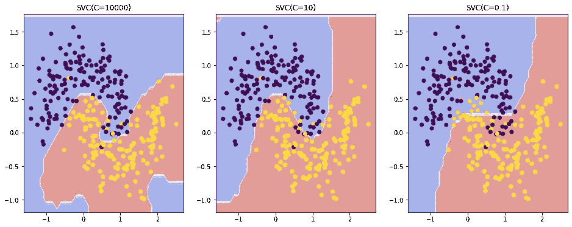
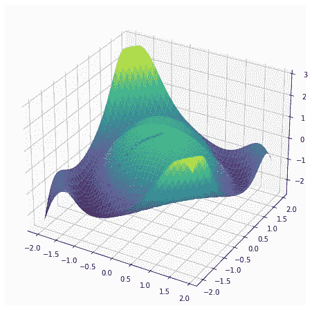
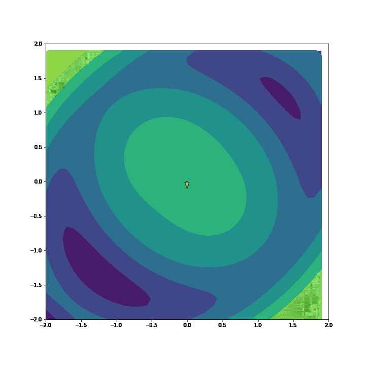
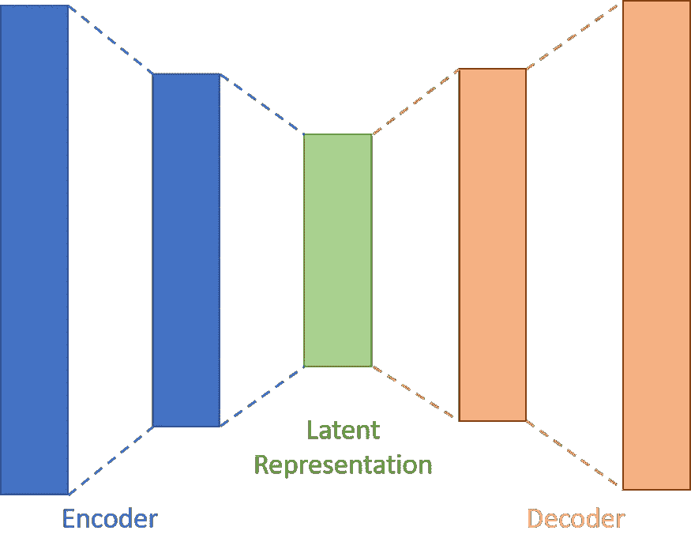

# 新数据科学家的 5 个基本概念

> 原文：<https://towardsdatascience.com/5-essential-concepts-for-new-data-scientists-d72e2960bb73?source=collection_archive---------28----------------------->

游里·罗默在 [Unsplash](https://unsplash.com?utm_source=medium&utm_medium=referral) 上的照片

数据科学可能非常令人生畏，尤其是在刚刚起步的时候。虽然使用即插即用的代码片段实现流行的机器学习算法可能很容易，但它不能取代数学直觉。以下是我发现对我的数据科学之旅相当重要的一些概念。

# 1.偏差方差权衡

调整模型时，偏差-方差权衡是一个非常重要的概念。本质上，它所陈述的是，当调整任何 ML 模型时，我们必须平衡高偏差(欠拟合)和高方差(过拟合)。为了说明这一点，让我们看看基本原则，并观察这种权衡如何出现在所有机器学习模型中。

我们可以这样做的一个方法是查看均方差。为此，我们将查看统计解释，其中均方误差(MSE)定义如下:

MSE 的数学公式——作者的图像

> 这种 MSE 损失和我们习惯的 MSE 损失之间的主要区别是期望运算符，而不是对样本求平均值。但是，这种差异并不影响分析。

我们在这里看到的是，损失可以分为两部分:**偏差**和**方差**。偏差指的是预测和真实结果之间的**差异，而方差指的是**预测将变化多少**。**

数学上，**偏差**的平方用蓝色项表示，这是预测 **f^** 和实际 **f** 值之间的预期差值。对于**方差**，这是橙色项，表示 **f^** 和**f^.**预期值之间的预期平方距离

直观上，这可以在分割数据集后观察到。假设我们有一个包含 1000 个数据点的分类数据集，我们将该数据集分成 5 组，每组 200 个数据点，并对每组 200 个数据点进行逻辑回归训练。如果我们的模型有很高的方差，那么每个模型的**参数将会有很大的差异。**

一般来说，参数(神经网络)多**的模型会比参数少(SVM)的模型有**更多的方差**和**更少的偏差**。更多的参数意味着需要更多的内存来学习复杂的数据，但这也带来了负面影响，即它可能适合噪声而不是信号。**

在尽量减少损失的同时，有两种主要方法。

1.  收集更多数据。随着数据量的增加，预测的方差会减小。这是大多数最先进模型的基础，在这些模型中，庞大的十亿参数神经网络是在极其庞大的数据集上训练的。这允许非常低的偏差和方差，但是训练成本非常高。
2.  **增加模型的偏差**。有几种方法可以做到这一点。像决策树这样的一些模型允许通过调整超参数来简化模型，以减少方差(树的最大深度等。).或者，你也可以使用正则化

# **2。正规化**

Christophe Hautier 在 [Unsplash](https://unsplash.com?utm_source=medium&utm_medium=referral) 上拍摄的照片

正则化是一种非常强大的技术，可以防止模型过度适应训练集。直觉上，规范化是为了惩罚复杂性。具体来说，这是通过添加额外的损失惩罚来引导模型更好地拟合数据来实现的。

在大多数情况下，正则化损失函数减少了模型中的参数数量，或者减少了参数值的大小。这些技术旨在减少过度拟合，其中模型从与目标变量不相关但稍微相关的数据模式中“学习”。这可防止拟合不太有用的特征，并可提高模型的整体质量。

让我们看看最常见的正规化形式，L2 正规化。L2 正则化在概念上非常简单，可以应用于各种不同的模型。本质上，L2 正则化增加了与参数权重的**平方成比例的惩罚。较大的参数权重意味着模型的较高复杂性，正则化试图实现的是简化所产生的模型。**

让我们看看正则化对玩具数据集的影响！

作者改变正则化参数 C-Image 的效果

上图显示了用于分类两个数据点簇的支持向量机(SVM)算法。除了(逆)正则化参数 C，所有其他超参数保持不变。在左侧，我们看到了明显的过度拟合，模型试图学习一个非常复杂的函数来更好地分类这些点。通过正则化，中间模型做得更好，决策函数更平滑。然而，过多的正则化导致拟合不足，如右图所示。这里，模型学习不适合数据的决策边界。

如果你热衷于学习更多关于这个主题的知识，请查看这篇文章，在这篇文章中，我探讨了正规化的其他实例和应用:

</understanding-regularisation-7576f36942f5>  

# 3.梯度下降

照片由[约瑟夫刘](https://unsplash.com/@josephljy?utm_source=medium&utm_medium=referral)在 [Unsplash](https://unsplash.com?utm_source=medium&utm_medium=referral)

梯度下降是让我们有效优化大多数机器学习模型的神奇钥匙。当根据数据拟合我们的模型时，我们总是在优化，以最小化给定数据的特定损失函数**。对于线性回归，我们最小化残差平方和。对于分类，我们最小化负对数似然。梯度下降是一种简单的通用技术，允许我们半有效地完成所有这些工作。**

梯度下降背后的想法很简单。在每次迭代中，我们取损失函数的梯度。这个梯度告诉我们函数增加的方向。我们在梯度的负方向迈出一步，这应该是函数递减的方向！如果我们采取一个足够小的步骤，损失函数将会更小，这是反复进行的，直到损失函数没有太大变化，并且模型已经收敛。

损失函数表面图和迭代猜测-图片由作者提供

我们可以使用如上所示的简单测试函数看到这一点。从“山”的顶部开始，这些点使用梯度下降慢慢地向山下移动，并收敛到局部最小值。下面的动画显示了每次迭代的运动。请注意，随着梯度(陡度)的增加，箭头变得更大，算法的步长也更大。

使用等高线图的渐变下降动画—作者 GIF

这个简单的想法为数据科学中使用的许多机器学习模型提供了动力，并对其进行了优化和训练。

有趣的是，对于一些机器学习模型(如逻辑回归)，像 [L-BFGS](https://en.wikipedia.org/wiki/Limited-memory_BFGS) 这样的二阶优化算法可能更有效。

一旦转向神经网络，梯度下降变得更加重要，因为大多数优化方法仍然使用某种梯度下降的味道。对于神经网络来说，这个过程被称为反向传播，可以帮助我们训练庞大的十亿参数模型。本质上，反向传播可以被视为以系统的逐步方式的梯度下降。多亏了反向传播，我们能够以相对高效的方式训练庞大的模型。在深度学习库中，大多数梯度下降实现都被抽象掉了，但知道这些仍然很重要。

如果你想对这个话题有更深层次的数学理解，可以看看这个由 3 Blue 1 Brown 制作的视频，里面有关于这个话题的精彩视频解释

梯度下降-视频由 3 蓝色 1 棕色

# 4.维度的诅咒

[蒂姆·约翰逊](https://unsplash.com/@mangofantasy?utm_source=medium&utm_medium=referral)在 [Unsplash](https://unsplash.com?utm_source=medium&utm_medium=referral) 上拍照

维数灾难是一个术语，用来描述包含大量特征/变量的数据集如何难以处理。更多的信息通常是有用的，但使用包含许多变量的数据集存在隐性成本。

最明显的问题是计算时间。机器学习算法需要时间和内存来处理数据，数据集越大，所需的内存和计算资源就越多。在某些情况下，由于数据集包含大量的要素，甚至不可能将整个数据集放入内存中。

即使我们能够训练一个模型，尽管有计算的限制，训练出来的模型甚至可能没有用。从某种意义上来说，**机器学习就是大海捞针**。我们希望在数据中找出可以帮助我们做出更好预测的模式。当维度的数量增加时，需要考虑的交互**成倍增加**，这个空间慢慢变得无法有效搜索。与此同时，距离在高维空间中开始失去意义。所有的点都变得同样远，使用距离的算法，如 KNN 和 K-Means，开始彻底失去它们的有效性。

随着数据集维度的增加，实际数据点的空间迅速缩小。与针相比，干草堆的大小呈指数增长，从数据中提取模式或有用的见解变得越来越难。

因为这个问题，我们使用像**特征选择**和**维数减少**这样的技术来使我们的生活更容易。要素选择包括从数据集中删除要素(变量)以提高模型的性能。这可以基于领域知识、相关性之类的度量或者简单地使用验证数据集上的损失来完成。

自动编码器架构—作者图片

**降维**另一方面使用线性方法，如**主成分分析** (PCA)或神经网络，如**自动编码器**到**将变量**转换成全新的变量。新的变量集将比原始集少，但理想情况下包含足够的信息，以便模型生成有用的结果。降维可以提高模型性能，但代价是模型的可解释性。通过降维生成的新变量集将与原始变量集非常不同，并且可能难以识别决定模型行为的原始变量。

# 5.表征学习

照片由[斯蒂夫·约翰森](https://unsplash.com/@steve_j?utm_source=medium&utm_medium=referral)在 [Unsplash](https://unsplash.com?utm_source=medium&utm_medium=referral) 上拍摄

最后一个概念稍微高级一点，但在深入研究图像或文本等非结构化数据之前至关重要。

> 简而言之，一个表示是一组我们可以附加到特定数据点的数字。

表征学习的美妙之处在于，这个数据点可以是任何东西——结构化的或非结构化的。这些数据可以是文本、图像甚至是网络图，但在运行表示学习算法后，我们可以将所有这些复杂的关系分解为一组看似随机的数字。

对于文本，我们用不同的表示法来表示不同的单词。单词“apple”和“fruit”将有一组相似的数字与之相关联，并且很可能与单词“code”有很大不同。对于图像，我们将每个图像转换成特定的表示。该模型学习表示，使得具有相同信息的图像(背景中的猫)应该具有相似的表示，即使背景或照明不同。

本质上，这些表征学习模型是模式识别的一种形式。这些模型被输入数百万和数十亿个数据点，学习这些数据点之间的相似性，并给它们分配相似的表示。

对于文本，这就是通常所说的语言建模。在最基本的场景中，该模型旨在**预测序列**中的下一个单词**，给出在它之前的单词**。这有助于模型学习数据中的模式，这些模式将塑造不同单词的表示。

表征学习的进步为迁移学习铺平了道路，使我们能够以很小的成本训练最先进的模型。迁移学习的主要思想是，我们可以通过使用容易获得的数据进行训练来学习一个**“通用”表示模型**，然后对其进行微调，以进一步提高性能。

如果你想了解更多，这里有一些表示学习算法。理解一些关于旧模型如何执行表征学习的想法无疑帮助我理解和欣赏了当今最先进的模型所使用的表征学习方法。

NLP — [word2vec](https://jalammar.github.io/illustrated-word2vec/) ， [BERT](/bert-explained-state-of-the-art-language-model-for-nlp-f8b21a9b6270)

计算机视觉— [ResNet](https://arxiv.org/abs/1512.03385)

如果你喜欢这篇文章，请在 Medium 上关注我！
查看代码:[https://github . com/reoneo 97/medium-data-science/blob/master/ds-essential-concepts . ipynb](https://github.com/reoneo97/medium-data-science/blob/master/ds-essential-concepts.ipynb)
在 LinkedIn 上连接:[https://www.linkedin.com/in/reo-neo/](https://www.linkedin.com/in/reo-neo/)