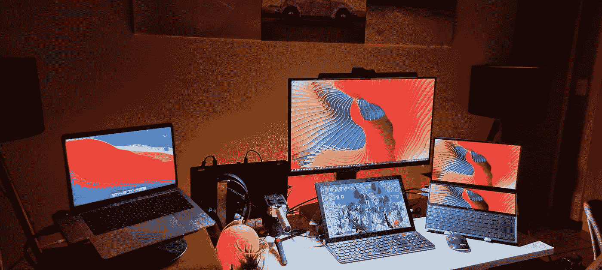

# 成为数据科学家的 5 项必备技能！

> 原文：<https://towardsdatascience.com/5-essential-skills-to-develop-as-a-data-scientist-16442f094c09?source=collection_archive---------14----------------------->

## 探索每个成功的数据科学家必须具备的五项重要软技能！

萨姆·麦克格在 [Unsplash](https://unsplash.com?utm_source=medium&utm_medium=referral) 上拍摄的照片

> *“世界是一个大数据问题。”——作者安德鲁·迈克菲*

数据科学正处于其受欢迎的顶峰。数据科学的快速发展必将为数据科学的追求者和爱好者创造更多的工作机会和职位空缺。只要有机会，每个感兴趣的人都应该设法利用这些黄金机会。

虽然从个人的角度来看，拥有数据科学各种概念的实践知识和理论理解对于取得成功至关重要，但所有数据科学家都必须考虑到软技能对于更上一层楼同样至关重要。只有具备适当的、富有表现力的软技能，你才能发展成为一名更加出色的数据科学家。

在我们开始探讨关于成长为数据科学家的五项最基本技能的文章之前，我强烈建议通过掌握基本概念来精通数据科学。为此，您可以查看我以前的一篇文章和简明指南，其中涵盖了初学者在 12 个月内成为专业数据科学家需要遵循的 12 个步骤。一旦你掌握了足够的数据科学知识，让我们继续学习成为一名数据科学家的五项必备软技能。

 [## 12 个月内数据科学从初学者到专业人士的 12 个步骤！

### 每月遵循一步，到第二年年底掌握数据科学！

towardsdatascience.com](/12-steps-for-beginner-to-pro-in-data-science-in-12-months-c6f6ba01f96e) 

# 1.通讯技能

对于数据科学家来说，一个更被低估但极其重要的特性和特征是熟练地交流和表达他们的想法。沟通是生活中每一步的关键。尤其是对于一个数据科学家来说，把自己的想法传达给别人，并清楚地解释自己当前的思维过程是什么，这一点至关重要。无论您是在面对面的环境中工作，还是通过在线会议交流(由于正在进行的全球疫情)，您都需要确保您的信息以富有表现力的方式有效地传达给其他人。

沟通的关键是努力提高你的语言，发展你与人交谈的整体方法。确保你的想法令人信服，不要犹豫澄清任何误解。理解你同时代人的感受并相应地传达你的想法和想法是至关重要的。作为一名数据科学家，有效的沟通对成功有很大帮助。

# 2.乐观的方法

清晰的思路和积极的数据科学方法对于在该领域取得长期成功至关重要。虽然其他学科可能有类似的要求，但不可否认的是，数据科学是一个如此突出的学科，需要批判性思维和充满希望的叙述。在为某些复杂的数据科学问题寻找解决方案的过程中，整体的复杂性可能会成为一些人的主要障碍。

然而，重要的是保持冷静，并制定一个完美的计划来解决这个问题。在这方面，乐观的心态将大有帮助，因为它包含了数据科学家搜索和找到许多方法来解决现有问题。重要的是不要因为不能解决问题而失去动力，而是重新确定你的道路，找到更多的方法来解决手头的任务。

# 3.协作团队

作为一名数据科学家，在任何公司、创业公司或与一群人一起工作时，最有益的素质和技能之一是团队合作的能力。大多数复杂的数据科学项目需要作为产品进行部署，以达到工业目的，这些项目需要数据科学家团队的高效运作。协调你和其他成员的努力对于打造一个成功的产品，使公司从中受益并产生收入是至关重要的。

一个人不可能独自完成大型项目。但数据科学最棒的部分是美妙的社区和出色的队友，在成功完成任务的过程中，你将与他们一起工作。对于每一位数据科学家来说，学习与团队成员沟通、互动和合作的技能是至关重要的，这样才能创造出众多能够改变当前世界人口结构的精彩项目！

# 4.毅力

数据科学有时会很粗糙。以你所有的技术力量和技巧，你可能无法解决一个特定的任务。这种可能性可能发生在数据科学家的最高层。对于每一位成功的数据科学家来说，克服这些情况并坚持不懈地茁壮成长至关重要。数据科学并不总是一门简单的学科，因为即使是最优秀的数据科学家也会遇到挑战和障碍。

然而，只要有足够的耐心、奉献和毅力，你就能克服所有这些挑战。无论你面临的特定任务有多艰难，你都需要有清晰的洞察力、思维过程和分析思维，以确定找到问题适当解决方案的正确路径。因此，每一位数据科学家都必须坚持不懈，用纯粹的意志和激情摧毁他们遇到的所有障碍！

# 5.愿意学习和提高

技术和实践知识在数据科学领域具有重要意义。数据科学的一个突出方面是，作为一名数据科学家或数据科学爱好者，你可以通过过去的日子学到大量的内容和质量。要考虑的一个更重要的方面是你想学习更多东西和每天不断学习新东西的意愿。

我们都知道数据科学发展迅速。每天，我们都有新的创新、技术和发现。你需要对这门学科真正充满热情，才能每天坚持学习。学习和掌握数据科学的热情和意愿将成为推动您成为成功的数据科学家的动力。因此，每个对这个领域充满热情的人都应该继续学习更多的概念，深入研究数据科学的复杂细节。

# 结论:

在 [Unsplash](https://unsplash.com?utm_source=medium&utm_medium=referral) 上由 [Boitumelo Phetla](https://unsplash.com/@writecodenow?utm_source=medium&utm_medium=referral) 拍摄的照片

> 如果你真的想做什么，你会找到方法的。如果你没有，你会找到一个借口。

每个数据科学家都必须探索自己的内在品质，才能在数据科学领域取得成功。虽然在数据科学的技术方面非常精通可以为您带来几个机会，让您从中受益并获得金钱利益，但软技能在提高您作为数据科学家的长期成功方面发挥着同等重要的作用。

因此，不仅要不断积累数据科学方面的知识，同样重要的是要不断发展自己的个性，学习与同事和团队成员互动的艺术。一旦你提高和完善了你的软技能和数据科学技能，你将达到新的高度！

如果你对这篇文章中提到的各点有任何疑问，请在下面的评论中告诉我。我会尽快给你回复。

看看我的其他一些文章，你可能会喜欢读！

 [## 你应该知道的 5 个 NLP 主题和项目！

### 应该添加到简历中的五个高级自然语言处理主题和项目想法

towardsdatascience.com](/5-nlp-topics-and-projects-you-should-know-about-65bc675337a0)  [## 国际象棋中的人工智能:国际象棋引擎中人工智能的进化

### 揭示人工智能，神经网络和深度学习的进步导致快速…

towardsdatascience.com](/ai-in-chess-the-evolution-of-artificial-intelligence-in-chess-engines-a3a9e230ed50)  [## 破解数据科学和机器学习面试的 7 个技巧！

### 帮助你在数据科学和机器学习面试中表现更好的 7 个详细技巧

towardsdatascience.com](/7-tips-to-crack-data-science-and-machine-learning-interviews-38b0b0d4a2d3)  [## 为您的数据科学项目考虑的 8 个最佳可视化！

### 分析数据科学项目探索性数据分析中的 8 种最佳可视化技术。

towardsdatascience.com](/8-best-visualizations-to-consider-for-your-data-science-projects-b9ace21564a)  [## 在数据科学领域取得更大成功的 15 个技巧！

### 作为数据科学家，每个数据科学爱好者都必须努力提高的 15 个因素

towardsdatascience.com](/15-tips-to-be-more-successful-in-data-science-c58aa1eb4cae) 

谢谢你们坚持到最后。我希望你们都喜欢这篇文章。祝大家有美好的一天！