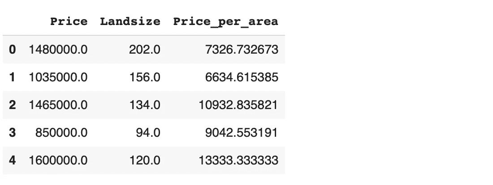
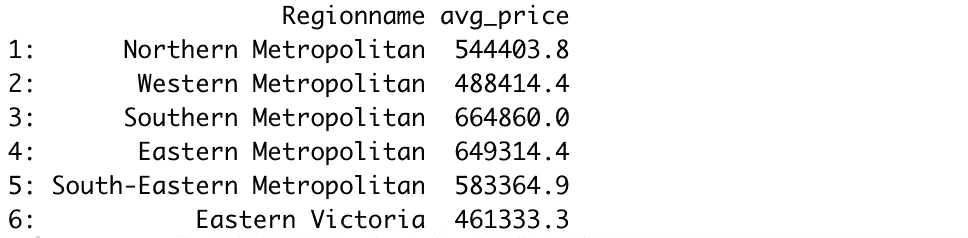
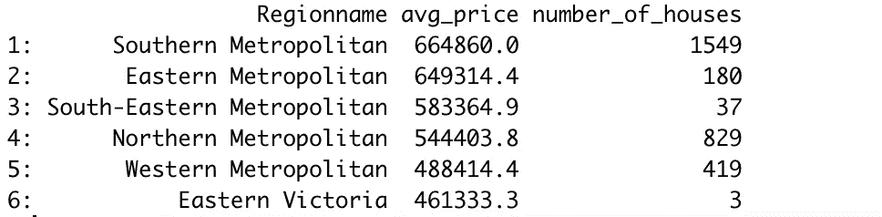

# 比较 Python Pandas 和 R data 的 5 个示例。表

> 原文：<https://towardsdatascience.com/5-examples-to-compare-python-pandas-and-r-data-table-27b43402ae6a?source=collection_archive---------32----------------------->

## 两者的实用指南


Katka Pavlickova 在 [Unsplash](https://unsplash.com/s/photos/two?utm_source=unsplash&utm_medium=referral&utm_content=creditCopyText) 上拍摄的照片

Python 和 R 是数据科学生态系统中的两种主要语言。它们都提供了丰富的库选择，可以加速和改进数据科学工作流。

在本文中，我们将比较 pandas 和 data.table，这两个流行的数据分析和操作库分别用于 Python 和 R。我们不会试图宣布一个优于另一个。相反，重点是展示这两个库如何为数据争论提供高效灵活的方法。

我们将讨论的例子是常见的数据分析和操作。因此，你可能会经常使用它们。

我们将使用 Kaggle 上的墨尔本房产[数据集](https://www.kaggle.com/anthonypino/melbourne-housing-market)作为例子。我将使用 Google Colab(熊猫)和 r studio(data . table)作为 IDE。让我们首先导入库并读取数据集。

```
# pandas
import pandas as pd
melb = pd.read_csv("/content/melb_data.csv")# data.table
library(data.table)
melb <- fread("datasets/melb_data.csv")
```

## 示例 1

第一个示例是基于数据集中的现有列创建一个新列。这是特征工程过程中的常见操作。pandas 和 data.table 都提供了完成这项任务的简单方法。

```
# pandas
melb["Price_per_area"] = melb["Price"] / melb["Landsize"]# data.table
melb[, Price_per_area := Price / Landsize]
```



Price、Landsize 和 Price_per_area 列的前 5 行(图片由作者提供)

## 示例 2

对于第二个示例，我们通过应用几个过滤器来创建原始数据集的子集。该子集包括价格超过 100 万英镑的 h 类房屋。

```
# pandas
subset = melb[(melb.Price > 1000000) & (melb.Type == "h")]# data.table
subset <- melb[Price > 1000000 & Type == "h"]
```

对于 pandas，我们提供数据框的名称来选择用于过滤的列。另一方面，data.table 只使用列名就足够了。

## 示例 3

数据分析中非常常用的函数是 groupby 函数。它允许根据一些数值度量来比较分类变量中的不同值。

例如，我们可以计算不同地区的平均房价。为了让这个例子更复杂一点，让我们也对房子类型应用一个过滤器。

```
# pandas
melb[melb.Type == "u"].groupby("Regionname").agg(
   avg_price = ("Price", "mean")
)# data.table
melb[Type == "u", .(avg_price = mean(Price)), by="Regionname"]
```



(图片由作者提供)

Pandas 使用 groupby 函数执行这样的操作。对于 data.table，这个操作相对简单一些，因为我们只需要使用 by 参数。

## 实例 4

让我们进一步看前面的例子。我们找到了房屋的平均价格，但不知道每个地区的房屋数量。

这两个库都允许在一个操作中应用多个聚合。我们还可以按升序或降序对结果进行排序。

```
# pandas
melb[melb.Type == "u"].groupby("Regionname").agg(
   avg_price = ("Price", "mean"),
   number_of_houses = ("Price", "count")
).sort_values(by="avg_price", ascending=False) # data.table
> melb[
      Type == "u", 
      .(avg_price = mean(Price), number_of_houses=.N), 
      by="Regionname"
  ][order(-avg_price)]
```



(图片由作者提供)

我们使用 count 函数来获得每组中房屋的数量。的”。n”可以用作 data.table 中的计数函数。

默认情况下，两个库都按升序对结果进行排序。在 pandas 中，此行为由升序参数控制。我们只是用一个减号在 data.table 中以降序得到结果。

## 实例 5

在最后一个例子中，我们将看到如何更改列名。例如，我们可以更改类型和距离列的名称。

*   类型:房屋类型
*   距离:距离

数据集中的距离列表示到中央商务区(CBD)的距离，因此最好在列名中提供此信息。

```
# pandas
melb.rename(columns={"Type": "HouseType",
                     "Distance": "DistanceCBD"},
            inplace=True)# data.table
setnames(melb, 
         c("Type", "Distance"),
         c("HouseType", "DistanceCBD"))
```

对于 pandas，我们传递一个字典，它将更改映射到 rename 函数。inplace 参数用于将结果保存在原始数据框中。

对于 data.table，我们使用 setnames 函数。它有三个参数，分别是表名、要更改的列名和新列名。

## 结论

我们基于数据分析和操作过程中常见操作的 5 个示例对 pandas 和 data.table 进行了比较。这两个库都提供了简单有效的方法来完成这些任务。

在我看来，data.table 的语法比熊猫简单一点。Data.table 在某些情况下更切题。

值得一提的是，我们在本文中所做的例子仅仅代表了这些库的一小部分功能。它们提供了许多功能和方法来执行复杂得多的操作。

感谢您的阅读。如果您有任何反馈，请告诉我。