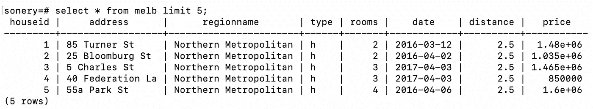
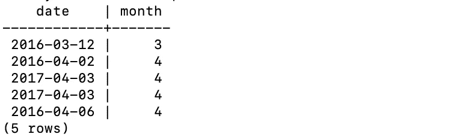
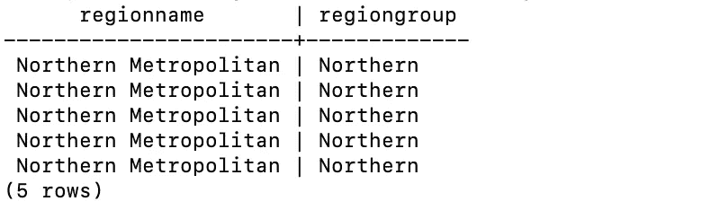
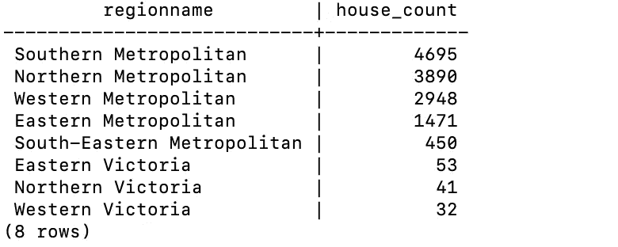
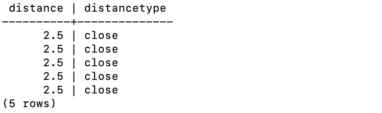
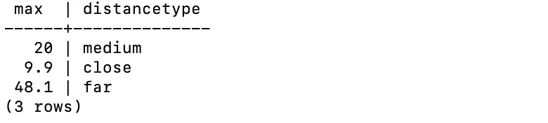
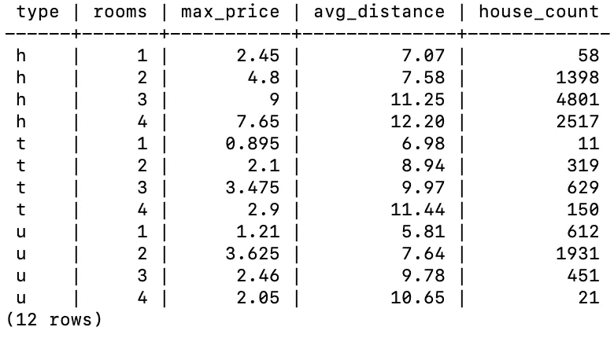

# 5 个例子来解释 Pandas 操作的 SQL 版本

> 原文：<https://towardsdatascience.com/5-examples-to-explain-sql-versions-of-pandas-operations-113f7afde249?source=collection_archive---------35----------------------->

## SQL 不仅仅是一种查询语言


照片由 [Unsplash](https://unsplash.com/s/photos/similar?utm_source=unsplash&utm_medium=referral&utm_content=creditCopyText) 上的[尼克·费因斯](https://unsplash.com/@jannerboy62?utm_source=unsplash&utm_medium=referral&utm_content=creditCopyText)拍摄

SQL 代表结构化查询语言。然而，它提供的不仅仅是从关系数据库中检索数据的查询。我认为 SQL 是一个完整的数据分析和操作工具。

数据科学生态系统中最受欢迎的数据分析工具之一是 Pandas Python 库。SQL 可以执行几乎任何你可以用 Pandas 做的操作。

在本文中，我们将通过 5 个例子来演示 Pandas 操作的 SQL 版本。示例将包括数据操作和分析任务。

我将做一些超越非常简单的任务的例子，因为我想强调 SQL 是如何被用作数据分析工具的。

我们将使用 Kaggle 上的墨尔本房产[数据集](https://www.kaggle.com/anthonypino/melbourne-housing-market)。我之前已经下载了数据集，并创建了一个包含其中一些列的 SQL 表。

让我们先来看看这张表。



(图片由作者提供)

**注**:关系数据库管理系统有 MySQL、SQL Server、PostgreSQL 等几种。尽管它们大多采用相同的 SQL 语法，但可能会有一些细微的差别。在本文中，我们将使用 PostgreSQL。

## 示例 1

第一个例子是关于日期操作的。在某些情况下，我们需要从某个日期提取特定的信息，比如月份和年份。

在 Pandas 中，可以使用 dt 访问器下的 month 方法从日期中提取月份信息。

我们可以对 SQL 进行同样的操作，如下所示:

```
SELECT date, EXTRACT(month from date) AS month FROM melb LIMIT 5;
```



(图片由作者提供)

我们使用 extract 函数，该函数可用于从一个日期获取多条信息。例如，可以通过将提取函数中的“月”参数替换为“年”来提取年。

## 示例 2

第二个例子是关于字符串操作的。在数据分析中，这是一项非常常见的任务，因为大量数据都是文本形式的。

典型的操作是拆分字符串。Pandas 在 str 访问器下为这个任务提供了 split 函数。在 PostgreSQL 中，split_part 函数可以用来拆分字符串。

让我们创建一个新列，它包含 region name 列中的第一个单词。它可以用作区域组。

```
SELECT 
 regionname, 
 SPLIT_PART(regionname,' ', 1) AS regiongroup 
FROM  melb LIMIT 5;
```



(图片由作者提供)

limit 关键字仅用于限制要显示的行数。

## 示例 3

在这个例子中，我们将复制熊猫的 value_counts 函数。它用于计算一列中不同值的出现次数。在我们的例子中，我们可以找到每个地区的房屋数量。

```
SELECT regionname, count(1) AS house_count
FROM melb
GROUP BY regionname
ORDER BY house_count desc;
```



(图片由作者提供)

我们使用 group by 函数根据 region name 列中的不同值对观察值(即行)进行分组。然后，count 函数用于计算每个区域的行数。

## 实例 4

在这个例子中，我们将在查询中实现一个 if-else 语句。假设我们想根据房屋到中心商业区的距离对它们进行分类。我们可以使用 case when 函数来完成这项任务。

从该表中检索数据时，我们将创建一个名为“距离类型”的新列。它所取的值将基于距离列。

```
SELECT 
   distance,                                                                                                                    
   CASE WHEN distance > 20 THEN 'far'                                                                                                             
        WHEN distance <= 20 and distance > 10 THEN 'medium'                                                                                          
        ELSE 'close'                                                                                                                                
        END AS distancetype                                                                                                                         FROM melb                                                                                                                                   LIMIT 5;
```



(图片由作者提供)

前 5 行具有相同的距离。为了确认功能按预期工作的情况，我们可以检查每种距离类型的最大距离。

```
SELECT 
   MAX(distance),                                                                                                                    
   CASE WHEN distance > 20 THEN 'far'                                                                                                             
        WHEN distance <= 20 and distance > 10 THEN 'medium'                                                                                          
        ELSE 'close'                                                                                                                                
        END AS distancetype                                                                                                                         FROM melb                                                                                                                                   GROUP BY distancetype;
```



(图片由作者提供)

我们可以使用 Pandas 中的剪切功能来完成这项任务。

## 实例 5

最后一个例子是关于一个最常用的 Pandas 函数，groupby。我们使用它来根据不同列中的值比较一列中的不同值或类别。

SQL 为此任务提供了 group by 语句。就像熊猫一样，我们可以用 SQL 创建嵌套组。我们只需要传递用于分组的列名。

一旦创建了组，我们就可以对感兴趣的列应用聚合函数。

让我们根据“类型”和“房间”栏中的类别对房屋进行分组。然后，我们可以为每个类别计算以下值:

*   最高价
*   平均距离
*   该组中的房屋数量

```
SELECT 
   type, 
   rooms,                                                                                                                 
   max(price/1000000) as max_price,                                                                                                            
   cast(avg(distance) as decimal(5,2)) as avg_distance,                                                                                        
   count(1) as house_count                                                                                                                     FROM melb                                                                                                                                   WHERE rooms <= 4                                                                                                                            GROUP BY type, rooms
ORDER BY type, rooms;
```



(图片由作者提供)

为了简化结果集，我只包含了拥有 4 个或更少房间的房屋。结果按“类型”和“房间”列排序。

执行此任务的 Pandas 代码如下:

```
melb[melb.Rooms <= 4]\
   .groupby(["Type", "Rooms"], as_index=False).agg(
      max_price = ("Price", "max"),
      avg_distance = ("Distance", "mean"),
      house_count = ("Distance", "count")
   ).sort_values(by=["Type","Rooms"])
```

## 结论

SQL 是数据科学家的必备技能。虽然它被称为查询语言，但它提供的不仅仅是检索数据。使用 SQL 可以完成几乎所有典型的数据分析和操作任务。

感谢您的阅读。如果您有任何反馈，请告诉我。