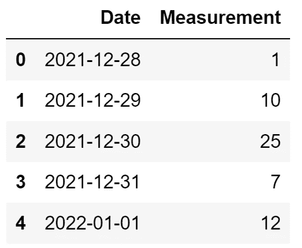
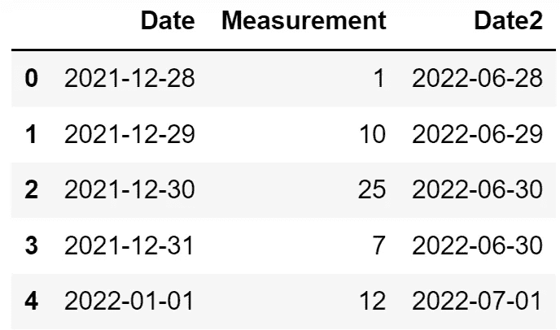
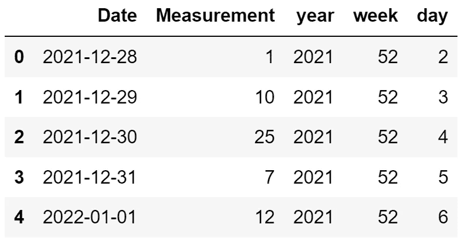

# 用 Python 熊猫学习日期和时间操作的 5 个例子

> 原文：<https://towardsdatascience.com/5-examples-to-learn-date-and-time-manipulation-with-python-pandas-9ab9cdeb032e?source=collection_archive---------10----------------------->

## 实用指南


(图片由作者提供)

我们经常在数据科学中处理日期和时间。如果您正在处理时间序列数据，它们总是您工作的一部分。

Pandas 在处理日期和时间方面非常高效和实用。在本文中，我们将通过 5 个例子来解决一些常见的日期和时间操作。

> 如果你想在我发表新文章时收到电子邮件，别忘了订阅。

让我们首先创建一个包含日期的示例数据框架。

```
import pandas as pddf = pd.DataFrame({
    "Date": pd.date_range(start="2021-12-28", periods=5, freq="D"),
    "Measurement": [1, 10, 25, 7, 12]
})
```



(图片由作者提供)

## 1.使用 DateOffset 的日期时间操作

`DateOffset`功能可用于为日期添加特定长度的持续时间。

让我们通过向现有的日期列添加 6 个月来创建一个新列。

```
df["Date2"] = df["Date"] + pd.DateOffset(months=6)
```



(图片由作者提供)

以下代码行将 1 年添加到现有的日期列中。

```
df["Date2"] = df["Date"] + pd.DateOffset(years=1)
```

需要注意的是，日期列中值的数据类型是`datetime`。因此，我们也可以添加时间间隔。

```
df["Date"] + pd.DateOffset(hours=2)# output
0   2021-12-28 02:00:00
1   2021-12-29 02:00:00
2   2021-12-30 02:00:00
3   2021-12-31 02:00:00
4   2022-01-01 02:00:00
Name: Date, dtype: datetime64[ns]
```

如果需要做减法，只需将“+”号改为“-”号，或者在函数内部使用负值。

## 2.使用 Timedelta 的日期时间操作

我们也可以使用`Timedelta`功能来添加日期和时间。它的语法与`DateOffset`函数的语法略有不同。

```
df["Date"] + pd.Timedelta(3, unit="day")# output
0   2021-12-31
1   2022-01-01
2   2022-01-02
3   2022-01-03
4   2022-01-04
Name: Date, dtype: datetime64[ns]
```

`Timedelta`函数也接受字符串来指定要添加的持续时间。下面的代码行执行与上面相同的操作。

```
df["Date"] + pd.Timedelta("3 days")
```

## 3.从日期时间对象中提取信息

一个`datetime`对象包含几条信息，比如年、月、日、周、小时、微秒等等。

我们有时需要一条特定的信息。例如，我们可以从日期中提取月份，如下所示:

```
df["Date"].dt.month# output
0    12
1    12
2    12
3    12
4     1
Name: Date, dtype: int64
```

`year`和`day`方法分别返回日期的年和日部分。

在零售分析中，星期几是用于分析和建模的重要信息。`dayofweek`方法可以用来从一个日期中获取这个信息。

```
df["Date"].dt.dayofweek# output
0    1
1    2
2    3
3    4
4    5
Name: Date, dtype: int64
```

所有这些方法都可以在`dt`访问器下使用，所以一定要在方法名前写“dt”。

## 4.异日历

`isocalendar`函数返回带有年、周和星期几的数据帧。因此，这是一种在单次操作中提取多条信息的快速方法。

例如，我们可以将年、周和星期几列添加到初始数据框架中，如下所示:

```
df = pd.concat([df, df["Date"].dt.isocalendar()], axis=1)
```



(图片由作者提供)

创建附加列的部分是:

```
df["Date"].dt.isocalendar()
```

我们使用`concat`函数将这些列与原始数据帧结合起来。

## 5.差异

在某些任务中，两个日期或时间之间的差异可能非常重要。例如，我们可能需要计算流程中连续测量之间的时间。

两个`datetime`对象的减法运算给出了天数的差异。

```
df["Diff"] = df["Date2"] - df["Date"]
```


(图片由作者提供)

diff 列的数据类型是`timedelta`，所以我们可以使用`days`方法得到天数。

```
df["Diff"].dt.days# output
0    365
1    365
2    365
3    365
4    365
Name: Diff, dtype: int64
```

我们也可以用 1 天除以一个`timedelta`对象来得到天数。

```
df["Diff"] / pd.Timedelta(days=1)# output
0    365.0
1    365.0
2    365.0
3    365.0
4    365.0
Name: Diff, dtype: float64
```

如果您想要将差异转换为月或年，请使用 NumPy 的`timedelta`,因为熊猫无法从月或年构造`Timedelta`。

```
import numpy as npdf["Diff"] / np.timedelta64(1, 'M')# output
0    11.992033
1    11.992033
2    11.992033
3    11.992033
4    11.992033
Name: Diff, dtype: float64
```

我们已经学习了熊猫的功能和方法来解决日期和时间操作中的一些常见任务。

*别忘了* [*订阅*](https://sonery.medium.com/subscribe) *如果你想在我发表新文章时收到邮件。*

*你可以成为* [*媒介会员*](https://sonery.medium.com/membership) *解锁我的全部写作权限，外加其余媒介。如果您使用以下链接，我将收取您的一部分会员费，无需您支付额外费用。*

<https://sonery.medium.com/membership>  

感谢您的阅读。如果您有任何反馈，请告诉我。