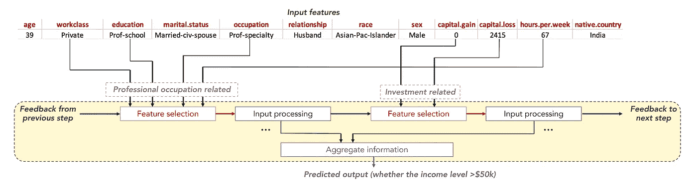

# 2021 年值得关注的 5 项激动人心的深度学习进展

> 原文：<https://towardsdatascience.com/5-exciting-deep-learning-advancements-to-keep-your-eye-on-in-2021-6f6a9b6d2406?source=collection_archive---------4----------------------->


来源: [Pixabay](https://pixabay.com/photos/eye-iris-look-focus-green-1132531/) 。

## 正在进行的研究的暗流

2021 年到了，深度学习一如既往的活跃；这一领域的研究正以指数速度增长。显然还有更多令人着迷和兴奋的深度学习进步。然而，对我来说，这五个展示了正在进行的深度学习研究中的一个核心潜流:*深度学习模型的规模有多必要？*

# 1.GrowNet

**TL；GrowNet 将梯度推进应用于浅层神经网络。它越来越受欢迎，在分类、回归和排序方面产生了卓越的结果。它可能表明研究支持非专业数据(非图像或序列)上的较大集合和较浅网络。**

事实证明，梯度推进在最近几年变得非常流行，可以与神经网络相媲美。这个想法是有一个弱(简单)学习者的集合，每个人纠正前一个人的错误。例如，一个理想的 3 模型梯度增强集成可能看起来像这样，其中示例的实际标签是`1`。

1.  模型 1 预测`0.734`。目前的预测是`**0.734**`。
2.  模型 2 预测`0.464`。目前的预测是`0.734+0.464=**1.198**`。
3.  模型 3 预测`-0.199`。目前预测是`1.198-0.199=**0.999**`。

每个模型都在前一个模型的残差上进行训练。尽管每一个模型可能单独都很弱，但作为一个整体，整体可以发展出难以置信的复杂性。像 XGBoost 这样的梯度推进框架在决策树上使用梯度推进，这是最简单的机器学习算法之一。

已经有一些关于神经网络对于梯度增强不够弱的讨论；因为梯度推进有如此多的过拟合能力，所以集合中的每个学习者都是弱学习者是至关重要的。

然而，最近的工作表明，非常深的神经网络可以分解成许多更小的子网的集合。因此，大规模神经网络可能只是小型神经网络的复杂集合。这挑战了神经网络在梯度提升中太强而不是弱学习者的想法。

这个小团体由 k 个模特组成。每个模型都有原始特征和前一个模型的预测。将所有模型的预测相加以产生最终输出。每个模型都可以简单到只有一个隐藏层。


来源:[小网论文](https://arxiv.org/pdf/2002.07971.pdf)。

GrowNet 易于调整，需要较少的计算成本和训练时间，但它在多个数据集上的回归、分类和排序方面优于深度神经网络。数据科学家发现了这些好处，并且越来越受欢迎。

[论文](https://arxiv.org/pdf/2002.07971.pdf)， [Pytorch 实现](https://www.kaggle.com/tmhrkt/grownet-gradient-boosting-neural-networks)

# 2.TabNet

**TL；TabNet 是一个用于表格数据的深度学习模型，被设计成能够表示层次关系，并从决策树模型中获得灵感。它在许多真实世界的表格数据集上产生了卓越的结果。**

众所周知，神经网络不擅长建模表格数据，公认的解释是因为它们的结构——非常容易过度拟合——反而成功地识别了图像或文本等特定数据的复杂关系。

像 XGBoost 或 Adaboost 这样的决策树模型反而更受现实世界表格数据的欢迎，因为它们将特征空间分割在简单的垂直平面中。这种程度的分离对于大多数真实世界的数据集来说通常是好的；即使这些模型，不管有多复杂，对决策边界做出假设，过度拟合是一个更糟糕的问题。

然而，对于许多真实世界的数据集，决策树模型是不够的，神经网络太多了。TabNet 是由两名谷歌研究人员创建的，目的是解决这个问题。该模型依赖于一个基本的神经网络设计，它像一个更复杂的决策树一样做出决策。


左图:一个简单的类似决策树的神经网络。真正的 TabNet 架构更深入。右:左模型对特征空间的划分，这很像决策树分割特征空间的方式。来源: [TabNet 论文](https://arxiv.org/pdf/1908.07442.pdf)。

此外，TabNet 分两个阶段进行训练。在无监督的预训练阶段，模型被训练来预测数据中的屏蔽值。然后将决策层附加到预训练的编码器上，并进行监督微调。这是对表格数据进行令人难以置信的成功的无监督预训练的第一个例子。


来源: [TabNet 论文](https://arxiv.org/pdf/1908.07442.pdf)。

至关重要的是，该模型使用注意力，因此它可以选择从哪些特征做出决定。这使得它能够开发现实世界数据中经常出现的层次结构的强大表示。



来源: [TabNet 论文](https://arxiv.org/pdf/1908.07442.pdf)。

这些机制意味着 TabNet 的输入数据不需要任何处理。TabNet 在数据科学家中迅速崛起；例如，几乎所有在[行动机制卡格尔竞赛](https://www.kaggle.com/c/lish-moa/)中得分最高的竞争者都将 TabNet 整合到他们的解决方案中。由于它的流行，它已经在一个非常简单和可用的 API 中实现。

这代表着深度学习超越了极其专业的数据类型，并揭示了神经网络可以有多普遍。[链接]

[论文](https://arxiv.org/pdf/1908.07442.pdf)、[简单 Pytorch API 实现](https://pypi.org/project/pytorch-tabnet/)、[简单 TensorFlow API 实现](https://pypi.org/project/tabnet/)

# 3.效率网

**TL；dr:** 改善深度 CNN 的模型缩放可以是无组织的。复合缩放是一种简单有效的方法，可统一缩放网络的宽度、深度和分辨率。EfficientNet 是一个应用了复合缩放的简单网络，可以产生最先进的结果。该模型在图像识别工作中非常受欢迎。

深度卷积神经网络已经变得越来越大，试图使它们更加强大。然而，它们究竟是如何变大的，实际上是很随意的。有时，图像的分辨率会增加(更多像素)。其他时候，可能是深度(层数)或宽度(每层中神经元的数量)增加。


来源:[效率网论文](https://arxiv.org/pdf/1905.11946.pdf)。

复合缩放是一个简单的想法:不是任意缩放它们，而是平均缩放网络的分辨率、深度和宽度。

例如，如果想要使用两倍多的计算资源；

*   将网络深度增加α倍
*   将网络宽度增加β倍
*   将图像尺寸增加γ倍

α、β和γ的值可以通过简单的网格搜索得到。复合缩放可以应用于任何网络，像 ResNet 这样的复合缩放版本的模型一直比任意缩放的模型表现得更好。

该论文的作者开发了一个基线模型 EfficientNetB0，它由非常标准的卷积组成。然后，使用复合缩放，创建了七个缩放模型——efficient net 1 至 EfficientNetB7。

结果是惊人的——与需要 4 到 7 倍的参数和 6 到 19 倍的计算资源的模型相比，EfficientNets 能够执行得更好。似乎复合缩放是利用神经网络空间的最有效的方式之一。

EfficientNet 是最近最重要的贡献之一。它标志着研究转向更强大但也更有效和实用的神经网络。

[论文](https://arxiv.org/pdf/1905.11946.pdf)，[简单 Pytorch API 实现](https://pypi.org/project/efficientnet-pytorch/)，[简单 TensorFlow 实现](https://www.tensorflow.org/api_docs/python/tf/keras/applications/EfficientNetB0)

# 4.彩票假说

**TL；博士:**神经网络本质上是巨型彩票；通过随机初始化，某些子网在数学上是幸运的，并且被优化器识别出它们的潜力。这些子网(“中奖票”)承担了大部分重任，而网络的其余部分没有做太多。这个假设在理解神经网络如何工作方面是开创性的。

为什么神经网络不会过度拟合？这么多参数他们怎么概括？为什么大型神经网络比小型神经网络工作得更好，而这是一个常见的统计学原理，即更多的参数=过度拟合？

“呸！走开，闭嘴！”抱怨深度学习社区。“我们不关心神经网络如何工作，只要它能工作。”长期以来，这些大问题都没有得到充分的研究。

一个常见的答案是正规化。然而，事实似乎并非如此——在张等人进行的一项研究中，没有各种正则化方法的初始架构的性能并不比有正则化方法的初始架构差多少。因此，人们不能争辩说正则化是一般化的基础。


来源:[张等](https://arxiv.org/abs/1611.03530)

神经网络修剪提供了一个令人信服的答案。

使用神经网络修剪，超过 90%的神经网络权重和神经元(在某些情况下为 95%甚至 99%)可以被消除，而性能几乎没有损失。怎么会这样呢？

假设你想在亚马逊上订购一支笔。当快递包裹到达时，你会发现它装在一个大纸箱里，里面有很多填充物。经过几分钟的寻找，你终于找到了那支笔。

找到笔之后，馅料就不重要了。但在你找到它之前，馅料是送货的一部分。有填充物的纸箱是神经网络，笔是做所有实际工作的子网。找到那个子网后，你就可以抛弃其余的神经网络了。但是，首先需要有一个网络来找到子网。

> *彩票假说*:在每一个足够深度的神经网络中，都有一个更小的子网，它的表现和整个神经网络一样好。

神经网络中的权重开始随机初始化。在这一点上，网络中有大量的随机子网，但有些更有数学潜力。也就是说，优化器认为更新这组权重在数学上更好，以降低损失。最终，优化器开发了一个子网来完成所有的工作；网络的其他部分没有多大用处。

每个子网都是一张随机初始化的“彩票”。有利的初始化是优化器识别的“中奖票”。您拥有的随机彩票越多，其中一张彩票中奖的概率就越高。这就是为什么大型网络通常表现更好的原因。

这个假设对于提出对*深度双重下降*的解释尤为重要，其中在某个阈值之后，*更多的参数*产生了更好的泛化而不是更少。


来源: [OpenAI](https://openai.com/blog/deep-double-descent/) 。

彩票假说朝着真正理解深度神经网络如何工作迈出了一大步。虽然这仍然是一个假设，但有令人信服的证据，这样的发现将改变我们在深度学习中的创新方式。

[论文](https://arxiv.org/pdf/1803.03635.pdf)

# 5.零培训的顶级模特

**TL；dr:** 研究人员开发了一种方法来修剪完全*随机初始化的*网络，以实现训练模型的最佳性能。

与彩票假说密切相关，这项研究探索了在神经网络中究竟可以存在多少信息。数据科学家看到“6000 万个参数”而低估 6000 万个参数真正能储存多大的力量是很常见的。

为了支持彩票假说，该论文的作者开发了边弹出算法，该算法评估边或连接对预测的“帮助”程度。仅保留另外的 *k* %的“有用”边缘；剩下的被修剪(去除)。

在一个足够大的随机神经网络上使用边缘弹出算法产生的结果非常接近，有时甚至优于所有权值保持不变的已训练神经网络的性能。


权重百分比指的是 *k* ，修剪后模型保留的百分比。来源:[论文](https://arxiv.org/pdf/1911.13299.pdf)。

这太不可思议了——在一个完全未经训练、随机初始化的神经网络中，已经存在一个表现最佳的子网。这就像有人告诉我，你的名字可以在一个非常短的随机字母序列中找到。

```
uqhoquiwhrpugtdfdsnaoidpufehiobnfjdopafwuhibdsofpabievniawo;jkjndjkn
ajsodijaiufhuiduisafid**johndoe**ojahsiudhuidbviubdiaiupdphquiwhpeuhqiuhdpueohdpqiuwhdpiashiudhjashdiuhasiuhdibcisviywqrpiuhopfdbscjasnkuipi
```

这项研究更多的是一个问题，而不是一个答案。它为我们指出了一个新的研究领域:弄清神经网络到底是如何工作的。如果这些发现是普遍的，那么肯定会有更好的训练方法，可以利用这个等待被发现的深度学习的基本公理。

[论文](https://arxiv.org/pdf/1911.13299.pdf)

# 总结和结论

*   小大人。集成方法在深度学习中的应用是将简单子网结构转化为复杂、复杂和成功模型的一个例子。
*   *TabNet* 。神经网络结构非常灵活，TabNet 标志着神经网络真正扩展到了各种数据类型。这是适配不足和适配过度之间的完美平衡。
*   *高效网*。EfficientNet 是将更多预测能力装入更小空间的增长趋势的一部分，它极其简单而有效。它表明，确实有一个结构向缩放模型发展。随着模型不断变得越来越大，这一点非常重要。
*   *彩票假说*。对神经网络如何一般化的迷人视角，彩票假说是一把金钥匙，将帮助我们解锁更大的深度学习成就。确定大型网络的力量不是来自于其规模本身，而是来自于“彩票”数量的增加，这是一种突破。
*   *零培训的顶级车型*。这生动地证明了我们低估了随机初始化的神经网络的预测能力。

毫无疑问，2021 年将在深度学习方面带来更多令人着迷的进步。